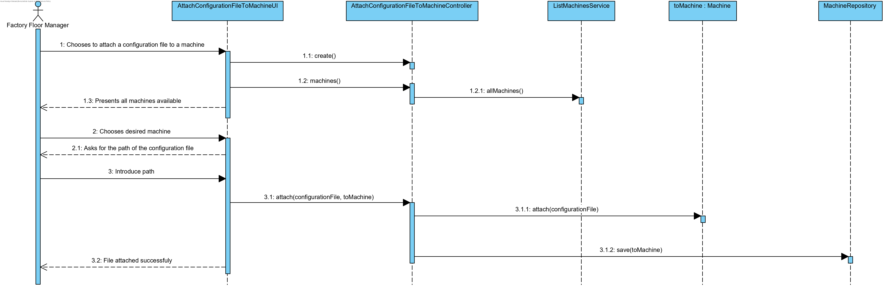
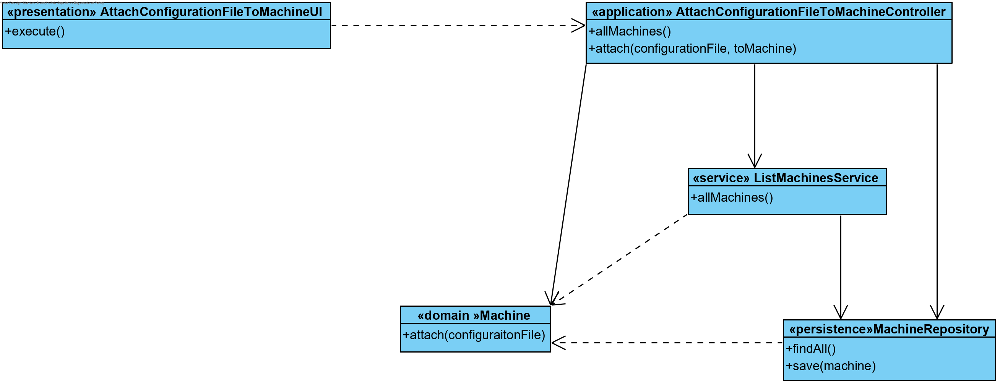

# [#37: [1-2-3004] Associate a configuration file to a machine](https://bitbucket.org/pjoliveira/lei_isep_2019_20_sem4_2db_1180573_1180715_1180723_1180712/issues/37/1-2-3004-associate-a-configuration-file-to)

# 1. Requirements

As a **Factory Floor Manager**, I intend to associate a configuration file with a machine.

In this case of use, the objective is to be able to configure the machines through a configuration file. This will have a brief description about it. The main actor in this use case is the Factory Floor Manager.
In addition, this use case is related to the Machine Domain.

# 2. Analysis

In this use case, it will not be relevant to make any changes to the domain model, and this use case only consists of providing the machine with a configuration file (*Value Object*).

# 3. Design

## 3.1. Functionality Realization



## 3.2. Class Diagram



## 3.3. Patterns Applied

In this functionality, several design standards were applied, namely:

- Information Expert: in assigning responsibilities
- Use Case Controller: used to controll the flow of the Use Case
- Tell, don’t ask: assigning business logic to each class what it is responsible for
- Single Responsibility Principle: by making the classes have only one responsibility
- Repository: to save the data from the aggregates

## 3.4. Tests 
**Test 1:** Check that it is not possible to attach null configuration files.

```java
@Test(expected = IllegalArgumentException.class)
    public void ensureConfigurationFileIsNotNull(){
        machineTest.attach(null);
    }
```

**Functional Test 1**: Check that use case is working with valid input

1. Run pipeline-backoffice.bat
2. Login as Factory Floor Manager (factory_floor_manager : Password1)
3. Enter the menu "*Attach Configuration File to Machine*"
4. Choose a available machine 
5. Specify a valid path to the configuration file
6. Operation Succeeded
7. Exit

**Functional Test 2**: Check that use case is working even when it has invalid input

1. Run pipeline-backoffice.bat
2. Login as Factory Floor Manager (factory_floor_manager : Password1)
3. Enter the menu "*Attach Configuration File to Machine*"
4. Choose a available machine 
5. Specify a **invalid** path to the configuration file
6. "*File does not exist. Choose a valid path.*"
7. Specify a valid path to the configuration file
8. Operation Succeeded
9. Exit

**SmokeTest 1:** Check if the files are persisted in the Database

1. Creates new machine ("machineTest")
2. Attach file ("configurationFileTest")
3. Saves in DB 
4. Find by ID the machine created earlier ("machineTest")
5. Check if the returned object is the same as the machine created earlier
6. Erease machine


# 4. Implementation


**Class Machine:**

```java
public void attach(final ConfigurationFile configurationFile){
        Preconditions.nonNull(configurationFile);
        this.configList.add(configurationFile);
    }
```

**Controller:**

```java
public class AttachConfigurationFileToMachineController implements Controller {
    
    private final AuthorizationService authz = AuthzRegistry.authorizationService();
    private final MachineRepository machineRepository = PersistenceContext.repositories().machine();
    
    public Iterable<Machine> allMachines(){
        authz.ensureAuthenticatedUserHasAnyOf(BaseRoles.POWER_USER, BaseRoles.FACTORY_FLOOR_MANAGER);
        return machineRepository.findAll();
    }
    
    public void attach(ConfigurationFile configurationFile, Machine toMachine){
        authz.ensureAuthenticatedUserHasAnyOf(BaseRoles.POWER_USER, BaseRoles.FACTORY_FLOOR_MANAGER);
        toMachine.attach(configurationFile);
        machineRepository.save(toMachine);
    }
    
}
```

**Smoke Test 1:**

```java
private void testAttachConfigurationFileToMachine(){
        try {
            final InternalCode id = new InternalCode("10000");
            
            final ConfigurationFile configurationFile = new ConfigurationFile(Description.valueOf("Sou fixe"), new File("files/teste.pdf"));
            LOGGER.info("»»» creates configuration file");
            
            final Machine toMachine = specifyMachineController.specifyMachine(id, new SerialNumber("1AAAA"), Description.valueOf("smokeTest"), new InstallationDate(Calendars.now()), new Brand("Pops"), new Model("Manus"), new MachineState("active"));
            LOGGER.info("»»» creates machine");
            
            attachFileToMachie.attach(configurationFile, toMachine);
            LOGGER.info("»»» attach file to machine and saves in repository");
            
            final Machine m1 = repo.ofIdentity(id).orElseThrow(IllegalStateException::new);
            LOGGER.info("»»» found machines of identity");
            
            m1.sameAs(toMachine);
            LOGGER.info("»»» machines match");
            
            repo.deleteOfIdentity(m1.identity());
        } catch (IOException ex) {
            java.util.logging.Logger.getLogger(MachineManagementSmokeTester.class.getName()).log(Level.SEVERE, null, ex);
        }
    }
```


# 5. Integration/Demonstration

In the implementation of the configuration file in the Machine class it is not done in the expected way due to a problem with the JPA framework that creates conflicts when there is an Embeddable class inside another Embeddable.

# 6. Observations

None.


