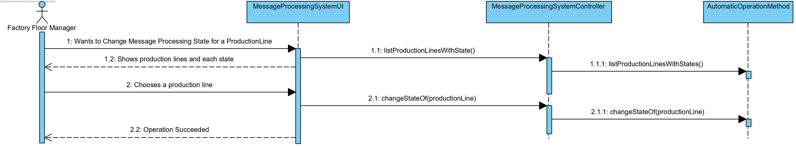
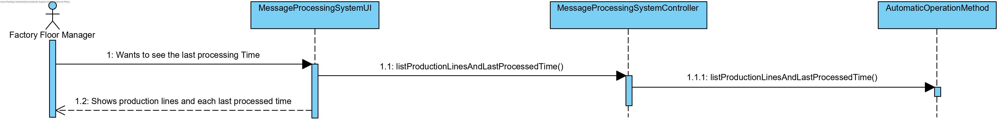
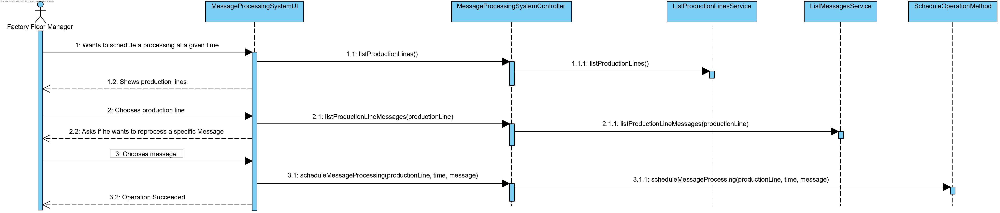
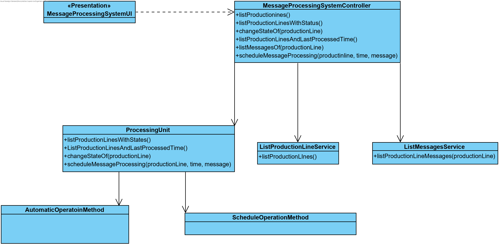

# [#68: [4-2-3009] Change status of the Message Processing System (MPS)](https://bitbucket.org/pjoliveira/lei_isep_2019_20_sem4_2db_1180573_1180715_1180723_1180712/issues/68/4-2-3009-change-status-of-the-message)

# 1. Requisits

As a **Shop Floor Manager**:

- I intend to know and change the status (active / deactivated) of the message processing of each production line as well as knowing the last time it was done.
- The change of state is made per line and includes: (i) enabling / disabling recurrent message processing; or (ii) request the (re) processing of messages for a given time interval.

# 2. Analysis

Regarding the domain model, there are no changes to be made. Since this use case was directly related to the 5001 use case, I will use what was done to integrate the two Use Cases.

# 3. Design

## 3.1. Realization of Functionality

#### Change message processing state of the production line



#### See Production Lines last processing time



#### Schedule message re/processing to a specific time and production line



## 3.2. Class Diagram



## 3.3. Applied Patterns

- Information Expert: in assigning responsibilities
- Use Case Controller: used to controll the flow of the Use Case
- Tell, don’t ask: assigning business logic to each class what it is responsible for
- Single Responsibility Principle: by making the classes have only one responsibility
- Repository: to look up the data from the aggregates
- Singleton: It was necessary to have an instance that controlled the processing in order to be called anywhere

## 3.4. Tests 
**Functional Test 1:** 

- Run Bootstrap
- Run SCM to import Machine.T3 file
- Run MPS
- Login as Factory Floor Manager
- See Active Production Lines
- None is Active
- Activate Production Line 1 and 2
- Set start time and period
- See Activate Production Lines
- Production Line 1 and 2 are active
- Change State of production line
- Choose Production Line 1
- See Activate Production Lines
- Production Line 2 is active
- Schedule Message Processing
- Choose Production Line 1
- Choose start time and period
- Wait for the messages to process
- Log out
- Server still running
- Operations Successful

# 4. Implementation

#### **ProcessingUnit**

```java
public class ProcessingUnit {

    private static ProcessingUnit instance;
    private final List<ProductionLine> activeProductionLines;
    private final Map<ProductionLine, Date> registry;
    private AutomaticOperationMethod automaticMethod;
    private boolean automaticProcessingIsActive;

    private static ProcessingUnit instance() {
        if (instance == null) {
            instance = new ProcessingUnit();
        }
        return instance;
    }

    public static void configureAutomatic(Time startTime, int interval) {
        ProcessingUnit instance = instance();
        if (instance.automaticProcessingIsActive == true) {
            instance.automaticMethod.cease();
            instance.automaticProcessingIsActive = false;
        }
        instance.automaticMethod = new AutomaticOperationMethod(startTime, interval);
    }

    private ProcessingUnit() {
        activeProductionLines = new LinkedList<>();
        registry = new HashMap<>();
        automaticProcessingIsActive = false;
    }

    public static void activate(final ProductionLine pl) {
        instance().activeProductionLines.add(pl);
    }

    public static void activate(final List<ProductionLine> pl) {
        instance().activeProductionLines.addAll(pl);
    }

    public static void activateAutomaticProcessing() {
        ProcessingUnit instance = instance();
        instance.automaticProcessingIsActive = true;
        instance.automaticMethod.operate();
    }

    public static List<ProductionLine> activeProductionLines() {
        return new LinkedList<>(instance().activeProductionLines);
    }

    public static void deactivate(final ProductionLine pl) {
        instance().activeProductionLines.remove(pl);
    }

    public static void changeProductionLineStatus(final ProductionLine productionLine) {
        if (instance().activeProductionLines.contains(productionLine)) {
            deactivate(productionLine);
        }
        activate(productionLine);
    }

    public static void scheduleMessageProcessing(final Time startTime, final int interval, final ProductionLine line, final ProductionOrder order) {
        final ScheduleOperationMethod method = new ScheduleOperationMethod(line, startTime, interval, order);
        method.operate();
    }

    static void register(ProductionLine productionLine) {
        instance().registry.put(productionLine, new Date());
    }

    public static Map<ProductionLine, Date> registryOfActiveProductionLines() {
        Map<ProductionLine, Date> map = new HashMap<>();
        for (ProductionLine productionLine : instance().activeProductionLines) {
            if (instance().registry.containsKey(productionLine))
                map.put(productionLine, instance().registry.get(productionLine));
            else
                map.put(productionLine, null);
        }
        return map;
    }

    public static Map<ProductionLine, Date> registryOfDeactiveProductionLines(
            Iterable<ProductionLine> allProdcutionLines) {
        Map<ProductionLine, Date> map = new HashMap<>();
        ProcessingUnit instance = instance();
        for (ProductionLine productionLine : allProdcutionLines) {
            if (!activeProductionLines().contains(productionLine))
                if (!instance.registry.containsKey(productionLine))
                    map.put(productionLine, null);
                else
                    map.put(productionLine, instance.registry.get(productionLine));
        }
        return map;
    }

    public static boolean automaticProcessingIsActive() {
        return false;
    }

}
```

#### **MessageProcessingSystemController**


```java
public class MessageProcessingServiceController implements Controller {
    
    private final ListProductionLineService listService = new ListProductionLineService();
    private final ProductionOrderRepository productionOrderRepository = PersistenceContext.repositories().productionOrder();
    
    public Iterable<ProductionLine> listProductionLines(){
        return listService.allProductionLines();
    }

    public void changeMessageProcessingStateOf(final ProductionLine productionLine) {
        ProcessingUnit.changeProductionLineStatus(productionLine);
	}

	public Iterable<ProductionOrder> listProductionOrders() {
		return productionOrderRepository.findAll();
	}

	public void reprocessMessagesAtGivenTime(final Time startTime, final int interval, final ProductionOrder order) {
        final ProductionLine line = order.productionLine();
        ProcessingUnit.scheduleMessageProcessing(startTime, interval, line, order);
	}

	public Map<ProductionLine, Date> listActiveProductionLinesWithProcessedTimes() {
		return ProcessingUnit.registryOfActiveProductionLines();
	}

	public Map<ProductionLine, Date> listDeactiveProductionLinesWithProcessedTimes() {
		return ProcessingUnit.registryOfDeactiveProductionLines(listProductionLines());
	}

	public List<ProductionLine> listActiveProductionLines() {
		return ProcessingUnit.activeProductionLines();
	}

	public boolean automaticProcessingIsActive() {
		return ProcessingUnit.automaticProcessingIsActive();
	}

	public void configureNewAutomaticProcess(final Time startTime, final int interval) {
		ProcessingUnit.configureAutomatic(startTime, interval);
		ProcessingUnit.activateAutomaticProcessing();
	}
}

```

#### **ScheduleOperationMethod**

```java
class ScheduleOperationMethod extends OperationMethod implements OperationMethodStrategy {

    private final ProductionLine line;
    private final Time startTime;
    private final long interval;
    private final ProductionOrder order;

    ScheduleOperationMethod(final ProductionLine line, final Time startTime, final int interval, final ProductionOrder order) {
        this.line = line;
        this.startTime = startTime == null ? Time.now() : startTime;
        this.interval = interval == 0 ? Time.minutesToMilli(15) : Time.minutesToMilli(interval);
        this.order = order;
    }

    @Override
    public void operate() {
        final OperationTask task = new OperationTask(line, interval, order);
        final long delay = calculateDelay(startTime);
        final OperationTimer timer = new OperationTimer();
        timer.schedule(task, delay);
    }    
    
}
```

#### **AutomaticOperationMethod**

```java
class AutomaticOperationMethod extends OperationMethod implements OperationMethodStrategy {

    private final List<ProductionLine> list;
    private final Time startTime;
    private final long interval;
    private final OperationTimer timer;

    AutomaticOperationMethod(Time startTime, int interval){
        this.list = ProcessingUnit.activeProductionLines();
        this.startTime = startTime == null ? Time.now() : startTime;
        this.interval = interval == 0 ? Time.minutesToMilli(15) : Time.minutesToMilli(interval);
        this.timer = new OperationTimer();
    }

    AutomaticOperationMethod(){
        this.list = ProcessingUnit.activeProductionLines();
        this.startTime = Time.now();
        this.interval = Time.minutesToMilli(15);
        this.timer = new OperationTimer();
    }

    @Override
    public void operate() {
        final OperationTask task = new OperationTask(list, interval);
        final long delay = calculateDelay(startTime);
        final long period = Time.hoursToMilli((int)interval);
        timer.scheduleAtFixedRate(task, delay, period);
    }

    void cease(){
        timer.cancel();
    }

}

```

#### **BaseMPS**

```java
public final class BaseMPS extends BaseApplication {

    private BaseMPS() {

    }

    /**
     * @param args the command line arguments
     */
    public static void main(final String[] args) {
        AuthzRegistry.configure(PersistenceContext.repositories().users(), new BasePasswordPolicy(),
                new PlainTextEncoder());
        new BaseMPS().run(args);
    }

    @Override
    protected void doMain(final String[] args) {
        final MainMenu menu = new MainMenu();
        menu.mainLoop();
    }

    @Override
    protected String appTitle() {
        return "Message Processing Service";
    }

    @Override
    protected String appGoodbye() {
        return "Turning off server...";
    }

    @Override
    protected void doSetupEventHandlers(final EventDispatcher dispatcher) {
        // do nothing
    }

}
```

#### **MainMenu**

```java
public class MainMenu extends AbstractUI {

    // Main Menu
    private static final int LOGIN = 1;
    private static final int EXIT_OPTION = 0;

    @Override
    public boolean show() {
        drawFormTitle();
        return doShow();
    }

    /**
     * @return true if the user selected the exit option
     */
    @Override
    public boolean doShow() {
        final Menu menu = buildMainMenu();
        final MenuRenderer renderer;
        renderer = new VerticalMenuRenderer(menu, MenuItemRenderer.DEFAULT);
        return renderer.render();
    }

    private Menu buildMainMenu() {
        
        final Menu mainMenu = new Menu();

        mainMenu.addItem(LOGIN, "Login", new LoginAction());
        mainMenu.addItem(EXIT_OPTION, "Shut Down", new Exit());
        
        return mainMenu;
    }

    @Override
    public String headline() {
        return "Message Processing System";
    }

}
```

#### **MessageProcessingMenu**

```java
public class MessageProcessingServiceMenu extends AbstractUI {

    private static final int EXIT_OPTION = 0;

    // MESSAGE_PROCESSING_SYSTEM
    private static final int SCHEDULE_MESSAGE_PROCESSING = 1;
    private static final int SEE_MESSAGE_PROCESSING_STATE = 2;
    private static final int CHANGE_MESSAGE_PROCESSING_STATE = 3;
    private static final int ACTIVATE_AUTOMATIC_PROCESSING = 4;

    private final AuthorizationService authz = AuthzRegistry.authorizationService();

    @Override
    protected boolean doShow() {
        final Menu menu = buildMainMenu();
        final MenuRenderer renderer = new VerticalMenuRenderer(menu, MenuItemRenderer.DEFAULT);

        return renderer.render();
    }

    private Menu buildMainMenu() {
        final Menu mainMenu = new Menu();

        mainMenu.addItem(SCHEDULE_MESSAGE_PROCESSING, "Schedule Message Processing", new ScheduleMessageProcessingAction());
        mainMenu.addItem(SEE_MESSAGE_PROCESSING_STATE, "See Production Line states", new SeeMessageProcessingStateAction());
        mainMenu.addItem(CHANGE_MESSAGE_PROCESSING_STATE, "Change Production Lines' state", new ChangeMessageProcessingStateAction());
        mainMenu.addItem(ACTIVATE_AUTOMATIC_PROCESSING, "Activate or change automatic messages processing", new ActivateMessageProcessingAction());

        mainMenu.addItem(EXIT_OPTION, "Log out", new ExitWithMessageAction());
        return mainMenu;
    }

    @Override
    public String headline() {
        return authz.session().map(s -> "Message Processing System [ @" + s.authenticatedUser().identity() + " ]")
                .orElse("Message Processing System [ ==Anonymous== ]");
    }

}
```

#### **ActivateMessageProcessingUI**

```java
public class ActivateMessageProcessingUI extends AbstractUI{

    private final MessageProcessingServiceController controller = new MessageProcessingServiceController();

    @Override
    protected boolean doShow() {
        if (controller.automaticProcessingIsActive()){
            final boolean wantsToChange = Console.readBoolean(
                    "Automatic processing is already active. Do you want to change the occurence period? (y/n)");
            if (wantsToChange){
                return changeOrActiveAutomaticProcessing();
            }
        } else {
            return changeOrActiveAutomaticProcessing();
        }   
        return true;     
    }

    private boolean changeOrActiveAutomaticProcessing(){
        final Time startTime = ConsoleUtility.readHourOfDay("When do you want it to start? [hh:mm] (empty for now) ");
        final int interval = ConsoleUtility.readMinutes("How often? (in minutes, leave empty for 15 mins) ");

        try {
            controller.configureNewAutomaticProcess(startTime, interval);
        } catch (final Exception e) {
            System.out.println("Could not set up a new process.");
            return true;
        }
        
        return false;
    }

    

    @Override
    public String headline() {
        return "Activate or change automatic message processing";
    }

}
```

#### **ChangeMessageProcessingStateUI**

```java
public class ChangeMessageProcessingStateUI extends AbstractUI {

    private final MessageProcessingServiceController controller = new MessageProcessingServiceController();

    @Override
    protected boolean doShow() {
        List<ProductionLine> productionLines;

        System.out.println("Do you want to activate or deactive?");
        System.out.println("1. Activate");
        System.out.println("2. Deactivate");
        final int option = Console.readOption(1, 2, 0);
        if (option != 0) {
            if (option == 1) {
                productionLines = (List<ProductionLine>) controller.listProductionLines();
                productionLines.removeAll((List<ProductionLine>) controller.listActiveProductionLines());
            } else {
                productionLines = (List<ProductionLine>) controller.listActiveProductionLines();
            }
            final SelectWidget<ProductionLine> selector = new SelectWidget<>("Select the Production Line:",
                    productionLines, new ProductionLinePrinter());
            selector.show();
            final ProductionLine productionLine = selector.selectedElement();
            try {
                controller.changeMessageProcessingStateOf(productionLine);
                if (!controller.automaticProcessingIsActive()){
                    System.out.println("WARNING: You need to activate the automatic processing.");
                }
            } catch (final Exception e) {
                System.out.println("Couldn't change processing state.");
                return true;
            }
        }
        return false;
    }

    @Override
    public String headline() {
        return "Change Production Line State";
    }
    
}
```

#### **ScheduleMessageProcessingUI**

```java
public class ScheduleMessageProcessingUI extends AbstractUI {

    private final MessageProcessingServiceController controller = new MessageProcessingServiceController();

    @Override
    protected boolean doShow() {

        final SelectWidget<ProductionOrder> selector = new SelectWidget<>(
                "Wich production order do you want to (re)process?", controller.listProductionOrders(), new ProductionOrderPrinter());
        selector.show();
        final ProductionOrder order = selector.selectedElement();
        if (order != null) {
            final Time startTime = ConsoleUtility.readHourOfDay("What time do you want to schedule? [hh:mm] (empty for now) ");
            final int interval = ConsoleUtility.readMinutes("For how long? (in minutes, empty for 15 mins) ");

            try {
                controller.reprocessMessagesAtGivenTime(startTime, interval, order);
                System.out.println("Operation scheduled successfully.");
            } catch (final Exception e) {
                System.out.println("An unexpected error ocured.");
                return true;
            }
        }

        return false;
    }

    @Override
    public String headline() {
        return "(Re)Process messages at a given time";
    }

}
```

#### **SeeMessageProcessingUI**

```java
public class SeeMessageProcessingStateUI extends AbstractUI {

    private final MessageProcessingServiceController controller = new MessageProcessingServiceController();
    private final String tab = "    ";

    @Override
    protected boolean doShow() {


        final Map<ProductionLine, Date> activeProductionLines = controller
                .listActiveProductionLinesWithProcessedTimes();
        System.out.println("Active:");
        for (final ProductionLine line : activeProductionLines.keySet()) {
            final Date date = activeProductionLines.get(line);
            System.out.println(tab + "-> " + line.toStringSimple() + " : " + (date == null ? "None." : date));
        }

        final Map<ProductionLine, Date> deactiveProductionLines = controller
                .listDeactiveProductionLinesWithProcessedTimes();
        System.out.println("Deactive:");
        for (final ProductionLine line : deactiveProductionLines.keySet()) {
            final Date date = deactiveProductionLines.get(line);
            System.out.println(tab + "-> " + line.toStringSimple() + " : " + (date == null ? "None." : date));
        }

        System.out.println("");

        Console.readLine("Press Enter to continue.");
        return false;
    }

    @Override
    public String headline() {
        return "State of Production Lines and the last time it was processed";
    }
    
}
```


# 5. Integration/Demonstration

This UC had to be integrated with the UC 5001 as this was the core of this use case.
In this sense, not much was changed, just an UI was created that could go to what was requested and created the respective functions of ProcessingUnit.

# 6. Observations

None.


