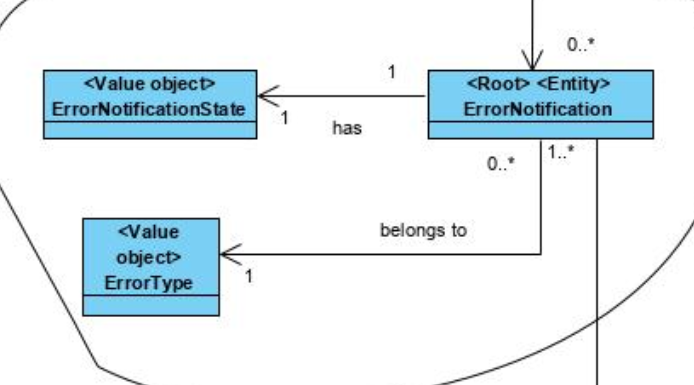

# [#38: [6-2-3005] Check notification processing errors to treat](https://bitbucket.org/pjoliveira/lei_isep_2019_20_sem4_2db_1180573_1180715_1180723_1180712/issues/38/6-2-3005-check-notification-processing)

# 1. Requisits

As a **Shop Floor Manager:**

-  I intend to consult notifications of processing errors to be handled.
- The system should allow filtering by **type of error** and **production line**.

# 2. Analysis



This use case will focus on this aggregate. There is no need to change the Business Domain

# 3. Design

## 3.1. Realization of Functionality


## 3.2. Class Diagram


## 3.3. Applied Patterns

- Information Expert: in assigning responsibilities
- Use Case Controller: used to controll the flow of the Use Case
- Tell, don’t ask: assigning business logic to each class what it is responsible for
- Single Responsibility Principle: by making the classes have only one responsibility
- Repository: to save the data from the aggregates

## 3.4. Tests 
**Functional Test 1:** 

- Run bootstrap
- Run Backoffice
- Login as Factory Floor Manager
- Check Notification Errors

# 4. Implementation

#### **CheckNotificationErrorsUI**

```java
public class CheckErrorNotificationUI extends AbstractUI {

    private final CheckErrorNotificationsController controller = new CheckErrorNotificationsController();
    private final String tab = "    ";
    @Override
    protected boolean doShow() {
        Iterable<ProductionLine> productionLines = null;
        Iterable<ErrorNotificationType> types = null;
        try {
            final boolean wantsToFilterByProductoinLine = Console.readBoolean("Do you to filter by Production Line?");
            if (wantsToFilterByProductoinLine) {
                productionLines = showProductionLines();
            }
            final boolean wantsToFilterByErrorType = Console.readBoolean("Do you to filter by Type of Error?");
            if (wantsToFilterByErrorType) {
                types = showErrorNotificationTypes();
            }
            showErrorNotificationsFiltered(productionLines, types);
        } catch (final Exception e) {
            System.out.println("Occured an error.");
            return false;
        }
        return true;
    }

    private void showErrorNotificationsFiltered(final Iterable<ProductionLine> productionLines,
            final Iterable<ErrorNotificationType> types) {
        Iterable<ErrorNotification> list = controller.listErrorNotificatoinByFilter(productionLines, types);
        System.out.println("Error Notifications:");
        for (final ErrorNotification error : list) {
            System.out.println(tab + "-> " + error.toStringHorizontal());
        }
        Console.readLine("Press Enter to exit.");
    }

    private Iterable<ErrorNotificationType> showErrorNotificationTypes() {
        final List<ErrorNotificationType> filterList = new LinkedList<>();
        final Iterable<ErrorNotificationType> list = controller.listErrorNotificationTypes();
        final SelectWidget<ErrorNotificationType> selector = new SelectWidget<>(
                "Which error types do you want to filter?", list);
        do {
            selector.show();
        } while (add(selector.selectedElement(), filterList));
        return filterList;
    }

    private Iterable<ProductionLine> showProductionLines() {
        final List<ProductionLine> filterList = new LinkedList<>();
        final Iterable<ProductionLine> list = controller.listProductionLines();
        final SelectWidget<ProductionLine> selector = new SelectWidget<>("Which error types do you want to filter?",
                list);
        do {
            selector.show();
        } while (add(selector.selectedElement(), filterList));
        return filterList;
    }

    private <T> boolean add(T item, List<T> toList) {
        if (item != null) {
            return toList.add(item);
        }
        return false;
    }

    @Override
    public String headline() {
        return "Check Errors Notificatoins";
    }

}
```

#### **CheckErrorNotificationsController**

```java
public class CheckErrorNotificationsController implements Controller {

    private final ProductionLineRepository productionLineRepository = PersistenceContext.repositories().productionLine();
    private final ErrorNotificationRepository errorReporitory = PersistenceContext.repositories().errornotification(); 

    public Iterable<ProductionLine> listProductionLines(){
        return productionLineRepository.findAll();
    }

    public Iterable<ErrorNotificationType> listErrorNotificationTypes(){
        return errorReporitory.getErrorNotificationTypes();
    }

    public Iterable<ErrorNotification> listErrorNotificatoinByFilter(Iterable<ProductionLine> productionLines, Iterable<ErrorNotificationType> types){
        return errorReporitory.getErrorNotificationByFilter(productionLines, types);
    }
    
}
```


# 5. Integration/Demonstration

It was used what was done in the ErrorNotifications Use case. Didn't have to change nothing.

# 6. Observations

None.


