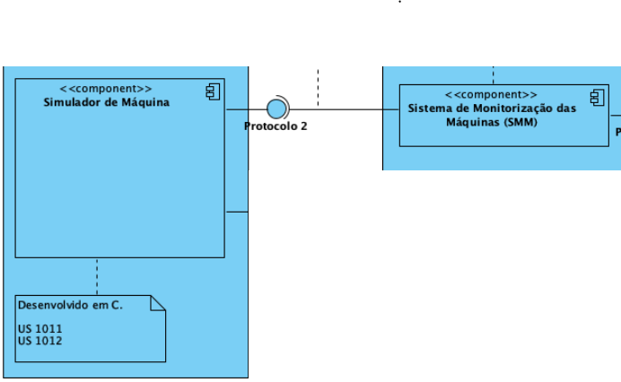
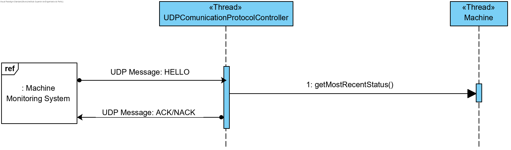
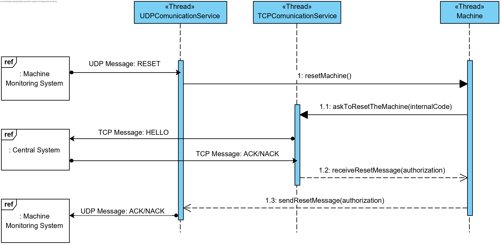
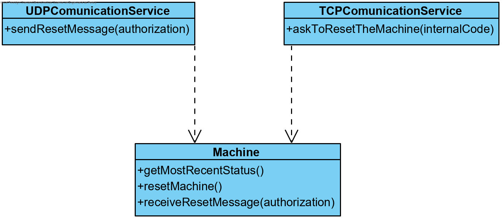

# [#32: [2-3-1012] Development of the Industrial Machines application regarding communications with the Monitoring System](https://bitbucket.org/pjoliveira/lei_isep_2019_20_sem4_2db_1180573_1180715_1180723_1180712/issues/32/2-3-1012-development-of-the-industrial)

# 1. Requirements

As a **Project Manager**, I want the machine simulator to support requests for monitoring its status.

It must be concurrent (in C) with the rest of the machine simulation and the status must be shared between threads.

The interpretation made of this requirement was in the sense of **Computer Networks(RCOMP)** and ***Computer Systems*(SCOMP)** and aims to allow communication between two systems: the *Machines' Monitoring System* **(MSM)** and the *Industrial Machine Agent Emulator* **(IMAE)**. This user storie is only responsible for communication by the **IMAE**.

# 2. Analysis



In this use case, the code provided in the use case **[1-3-1011] Develop an app that simulates a machine** will be used. The functionality of the communication machines will be implemented and, in terms of Business concepts, there is nothing to be changed. 

The concept of **Machine** will be used and the appropriate *communication protocol* (**UDP**) will be applied.

# 3. Design

## 3.1. Realization of Functionality

So, for theses use case the thread **Machine** can receive two types of messages from the **Machine Monitoring System**:

1. A *HELLO* message;
2. And a *RESET* message;

For both cases the behavior will be different.

### 1. HELLO message



### 2. RESET message



## 3.2. Class Diagram



## 3.3. Applied Patterns

- Information Expert: in assigning responsibilities
- Tell, don’t ask: assigning business logic to each class what it is responsible for
- Single Responsibility Principle: by making the classes have only one responsibility

## 3.4. Testes 
**SmokeTest 1:** Check if communications are working fine(HELLO message).

1. Initiate Client UDP  test program 
2. Initiate MachineSimulator
3. Client send HELLO message and waits for response in less than one minute (configurable)
4. MachineSimulator responds ACK/NACK
5. Client receives message
6. Exits both programs

**SmokeTest 2:** Check if communications are working fine(RESET message).

1. Initiate Client UDP  test program 
2. Initiate MachineSimulator
3. Client send RESET message and waits for response in less than one minute (configurable)
4. MachineSimulator process the response and sends it to the Client
5. Client receives message
6. Exits both programs

# 4. Implementation

#### UDPCommunication

```c
void *establishConnectionToTheMonitoringSystem(void *mach)
{
    struct sockaddr_storage client;
    int sock, res;
    unsigned int adl;
    char receivedLine[UDP_BUF_SIZE], responseLine[UDP_BUF_SIZE];
    char cliIPtext[UDP_BUF_SIZE], cliPortText[UDP_BUF_SIZE];
    Message receivedMessage, responseMessage;
    struct addrinfo req, *list;

    bzero((char *)&req, sizeof(req));
    // request a IPv6 local address will allow both IPv4 and IPv6 clients to use it
    req.ai_family = AF_INET6;
    req.ai_socktype = SOCK_DGRAM;
    req.ai_flags = AI_PASSIVE; // local address

    getaddrinfo_(NULL, MACHINE_SERVER_PORT, &req, &list); //machien id dangerous

    sock = sock_(list);

    bind_(sock, list);

    freeaddrinfo(list);

    adl = sizeof(client);
    while (1)
    {
        res = recvfrom(sock, receivedLine, UDP_BUF_SIZE, 0, (struct sockaddr *)&client, &adl);
        packetToMessage(receivedLine, &receivedMessage);
        printf("[MACHINE:%s] Received: id-%hu; code-%hhu; data_length-%hu; received bytes:%d; \n", m->internal_code, receivedMessage.id, receivedMessage.code, receivedMessage.data_length, res);
        switch (receivedMessage.code)
        {
        case HELLO: 
        	if(pthread_mutex_lock(&mux)!=0) {perror("Error locking mutex udp\n");exit(1);}
            newMessageWithMachine(&responseMessage, m, 0, NULL);
            messageToPacket(&responseMessage, responseLine);
            printf("[MACHINE:%s] Sent: id-%hu; code-%hhu; data_length-%hu; \n", m->internal_code, responseMessage.id, responseMessage.code, responseMessage.data_length);
            sendto(sock, responseLine, UDP_BUF_SIZE, 0, (struct sockaddr *)&client, adl);
            if(pthread_mutex_unlock(&mux)!=0) {perror("Error unlocking mutex udp\n");exit(1);}
            break;

        case RESET:
        	if(pthread_mutex_lock(&mux_reset)!=0) {perror("Error locking mutex reset\n");exit(1);}
		    m->reset=1;
        	if(pthread_mutex_unlock(&mux_reset)!=0) {perror("Error unlocking mutex reset\n");exit(1);}
            sleep(10); /* Machine is restarting */
            if(pthread_mutex_lock(&mux_reset)!=0) {perror("Error locking mutex reset\n");exit(1);}
            m->reset=0;
            askToResetTheMachine(m, &responseMessage);
            if(pthread_cond_broadcast(&cond_reset)!=0){perror("Error in signal for reset\n");exit(1);}
            if(pthread_mutex_unlock(&mux_reset)!=0) {perror("Error unlocking mutex reset\n");exit(1);}
            messageToPacket(&responseMessage, responseLine);
            printf("[MACHINE:%s] Sent: id-%hu; code-%hhu; data_length-%hu; \n", m->internal_code, responseMessage.id, responseMessage.code, responseMessage.data_length);
            sendto(sock, responseLine, UDP_BUF_SIZE, 0, (struct sockaddr *)&client, adl);
            break;
        
        default:
            printf("[ERROR] Machine %s received a unknown message.\n", m->internal_code);
            break;
        }

    }
    close(sock);
    pthread_exit((void*)NULL);
}

```

#### TCPCommunication

```c
void askToResetTheMachine(Machine *machine, Message *message) {
	int sock;
	char line[BUF_SIZE];
	int valid=helloMessage(machine->id, machine->sslConn,BUF_SIZE);
	if(valid) {
		if (SSL_read(machine->sslConn, line, 2) == -1) {
			perror("Error obtaining a response\n");
			exit(1);
		}
		packetToMessage(line, message);
	}
}
```


# 5. Integration/Demonstration

It was integrated with the SimulationMachine Use Cases.

# 6. Observation

None.


