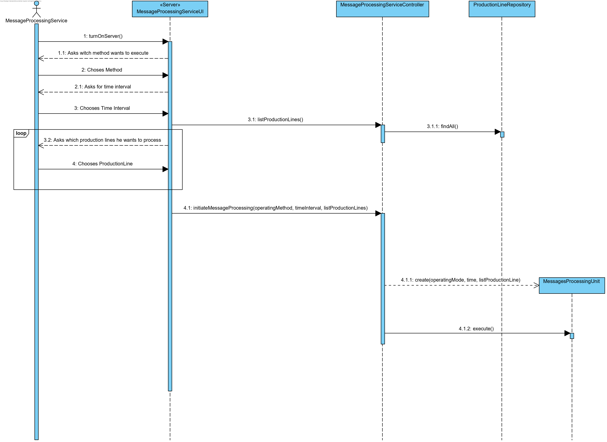
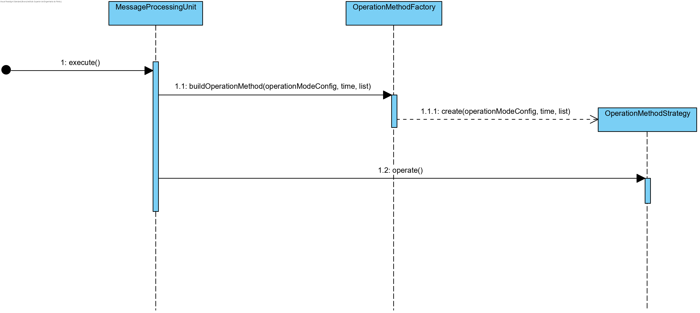
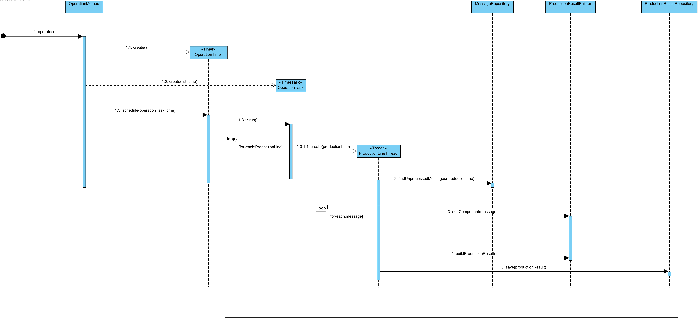
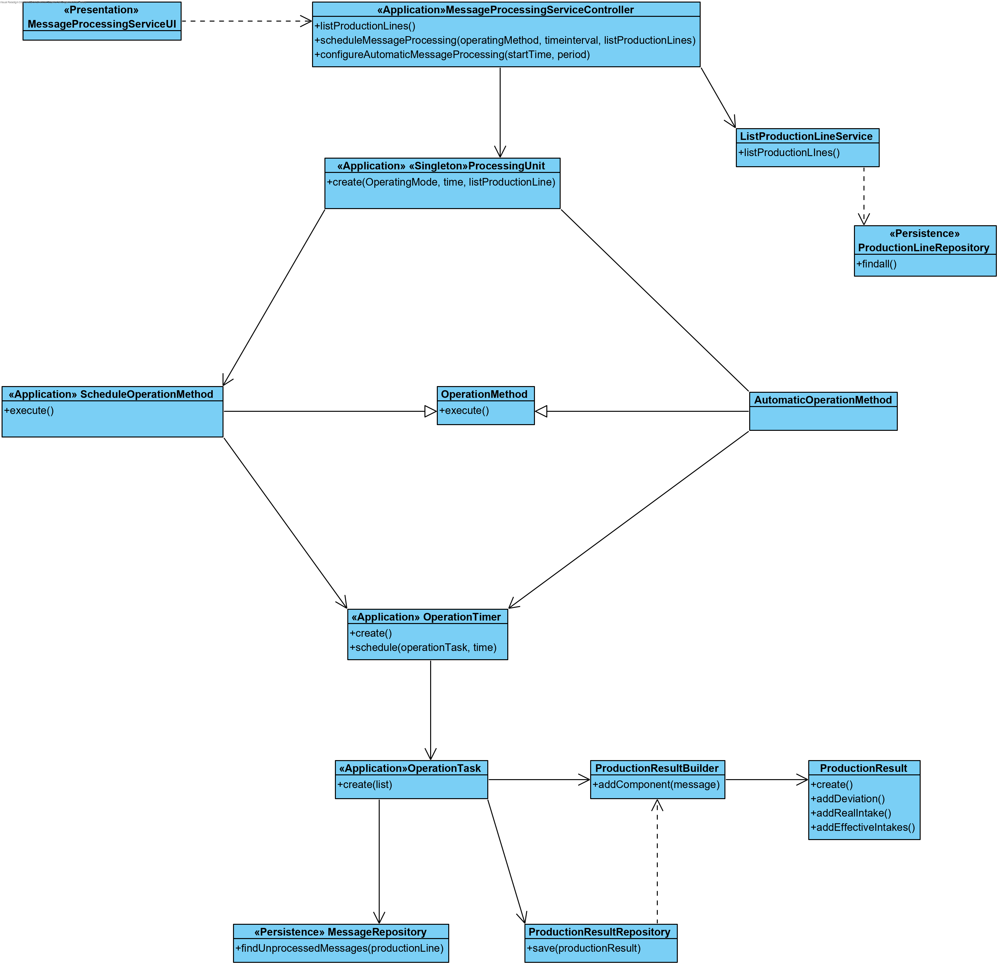

# [#36: [1-4-5001] Message Processing Service (MPS)](https://bitbucket.org/pjoliveira/lei_isep_2019_20_sem4_2db_1180573_1180715_1180723_1180712/issues/36/1-4-5001-message-processing-service-mps)

# 1. Requisits

This service must correspond to a server application using threads in Java. In this sprint, it is only necessary to support the first mode of operation described below. The processing of the messages must be done by the production line independently and in parallel. The processing can be active and / or suspended for one or more lines. It must support two different operating modes:

- Messages are processed in bulk for a specified time interval (e.g. from 11:45 am to 12:00 am). Process the block and finish.
- The messages are processed in block on a recurring basis at intervals of time (e.g. 15m) from a given time (e.g. 11.00 am). After processing a block, wait until it is opportune to process the next block. Recurrence must be implemented through the frequency of a thread.

‌

# 2. Analysis


As stated in the statement, it will be necessary to register the stock movements (input / output) of products and raw materials that occurred in the deposits, the period during which it took place, the machines used and for how long
time each one was in activity and / or stopped, the products and quantities obtained as well as the
respective batches and the deviations.

To make this possible, value objects were created to suppress this need. Some of the requested values are easily calculated so there is no representative value object.

# 3. Design

## 3.1. Realization of Functionality

 





## 3.2. Diagrams



## 3.3. Applied Patterns

- Information Expert: in assigning responsibilities
- Use Case Controller: used to controll the flow of the Use Case
- Tell, don’t ask: assigning business logic to each class what it is responsible for
- Single Responsibility Principle: by making the classes have only one responsibility
- Repository: to save the data from the aggregates
- Strategy: As a requisit of the use case there will be two diferent ways of processing the messages
- Builder: It is needed for the PruductionResult as it can't be created without having all the message info needed in the specified production order
- Factory: for creating a diferente strategy 

## 3.4. Tests 
**Functional Test 1:** 

1. Run Bootstrap
2. Initiate SCM server
3. Initiate MPS server
4. Verify that the production results were created to the respected ProductionOrder

# 4. Implementation


### **4.1 Presentation**

```java
public class MessageProcessingServiceUI extends AbstractUI {

    private final MessageProcessingServiceController controller = new MessageProcessingServiceController();

    @Override
    protected boolean doShow() {
        final EnumSelectWidget<OperationMethodEnum> widget = new EnumSelectWidget("Which method do you like to choose?",
                OperationMethodEnum.class);
        widget.show();
        final OperationMethodEnum method = widget.selectedElement();

        System.out.println("What interval of time do you like the operation to proceed? (empty for now)");
        final Time startTime = ConsoleUtility.readHourOfDay("Start time: ");
        final int interval = ConsoleUtility.readMinutes("Time intervale (in minutes): ");

        final Iterable<ProductionLine> productionLines = controller.listProductionLines();
        int option;
        final List<ProductionLine> list = new LinkedList<>();
        do {
            final SelectWidget<ProductionLine> productionLineSelector = new SelectWidget<>(
                    "Choose wich production lines do you like to process(leave empty to choose all):", productionLines,
                    new ProductionLinePrinter());
            productionLineSelector.show();
            option = productionLineSelector.selectedOption();
            if (option != 0) {
                list.add(productionLineSelector.selectedElement());
                ((List<ProductionLine>) productionLines).remove(productionLineSelector.selectedElement());
            }
        } while (option != 0);

        if (list.isEmpty()) {
            list.addAll((List<ProductionLine>) productionLines);
        }

        try {
            controller.initiateOperationProcess(method, startTime, interval, list);
            Console.waitForKey("Click enter to exit.");
        } catch (final Exception e) {
            System.out.println("An unexpected error ocured.");
            return false;
        }

        return true;
    }

    @Override
    public String headline() {
        return "Main Menu";
    }

}
```

### **4.2 Application**

```java
public class MessageProcessingServiceController implements Controller {
    
    private final ListProductionLineService listService = new ListProductionLineService();
    
    public Iterable<ProductionLine> listProductionLines(){
        return listService.allProductionLines();
    }

    public void initiateOperationProcess(OperationMethodEnum method, Time startTime, int interval, List<ProductionLine> list) {
        OperationMethodStrategy strategy = OperationMethodFactory.build(method, list, startTime, interval);
        strategy.operate();
    }
}
```

```java
@Utility
public class OperationMethodFactory {

    private OperationMethodFactory() {
    }

    public static OperationMethodStrategy build(OperationMethodEnum method, List<ProductionLine> list, Time startTime,
            int interval) {
        switch (method) {
            case TIME_INTERVAL_METHOD:
                return new TimeIntervalOperationMethod(list, startTime, interval);
            case DAILY_METHOD:
            default:
                return new DailyOperationMethod(list, startTime, interval);
        }
    }
}
```

```java
public interface OperationMethodStrategy {
    
    void operate();
}
```

```java
public abstract class OperationMethod {

    long calculateDelay(Time startTime) {
        Time now = Time.now();
        if (now.isAfter(startTime)){
            startTime.addHours(24);
            return Time.timeToMilli(startTime) - Time.timeToMilli(now);
        }
        return Time.timeToMilli(startTime) - Time.timeToMilli(now);
    }
    
}
```

```java
class DailyOperationMethod extends OperationMethod implements OperationMethodStrategy {

    private final List<ProductionLine> list;
    private final Time startTime;
    private final long interval;

    DailyOperationMethod(final List<ProductionLine> list, final Time startTime, final int interval) {
        this.list = list;
        this.startTime = startTime == null ? Time.now() : startTime;
        this.interval = interval == 0 ? Time.minutesToMilli(15) : Time.minutesToMilli(interval);
    }

    @Override
    public void operate() {
        final OperationTask task = new OperationTask(list, interval);
        final long delay = calculateDelay(startTime);
        final long period = Time.hoursToMilli(24);
        final OperationTimer timer = new OperationTimer();
        timer.scheduleAtFixedRate(task, delay, period);
    }    
    
}
```

```java
class TimeIntervalOperationMethod extends OperationMethod implements OperationMethodStrategy {

    private final List<ProductionLine> list;
    private final Time startTime;
    private final long interval;

    TimeIntervalOperationMethod(List<ProductionLine> list, Time startTime, int interval){
        this.list = list;
        this.startTime = startTime == null ? Time.now() : startTime;
        this.interval = interval == 0 ? Time.minutesToMilli(15) : Time.minutesToMilli(interval);
    }

    @Override
    public void operate() {
        final OperationTask task = new OperationTask(list, interval);
        final long delay = calculateDelay(startTime);
        final long period = Time.hoursToMilli((int)interval);
        final OperationTimer timer = new OperationTimer();
        timer.scheduleAtFixedRate(task, delay, period);
    }

}
```

```java
public class ProductionLineThread extends Thread {

    private static final Logger LOGGER = LogManager.getLogger(ProductionLineThread.class);
    private final ProductionLine productionLine;
    private final ProductionResultRepository producitonResultRepository;
    private final ProductionOrderRepository productionOrderRepository;
    private final ProductionResultBuilder productionResultBuilder;

    public ProductionLineThread(final ProductionLine productionLine) {
        this.productionLine = productionLine;
        productionResultBuilder = new ProductionResultBuilder();
        productionOrderRepository = PersistenceContext.repositories().productionOrder();
        producitonResultRepository = PersistenceContext.repositories().productionResult();
    }

    @Override
    public void run() {
        ProductionResult productionResult;
        MessageProcessorService mps = new MessageProcessorService();

        for (final ProductionOrder order : productionOrderRepository.getUnprocessedProductionOrdersBy(productionLine)) {
            productionResultBuilder.newProductionResult();
            productionResultBuilder.addProductionOrder(order);
            for (final Machine machine : productionLine.machines()) {
                try {
                    mps = new MessageProcessorService(machine, order);
                    mps.processProductionTimes();
                    productionResultBuilder.addDownTime(mps.downTimes())
                            .addEffectiveTime(mps.effectiveTimes())
                            .addFinalProduct(mps.processFinalProduct())
                            .addStockIn(mps.processStockIn())
                            .addStockOut(mps.processStockOut());
                } catch (NoResultException e) {
                    LOGGER.trace("Messages not found for " + machine + ": ", e);
                }
            }
            productionResult = productionResultBuilder.build();
            producitonResultRepository.save(productionResult);
            mps.updateMessagesProcessingState();
            order.processed();
            productionOrderRepository.save(order);
        }
    }
}
```

```java
public class OperationTask extends TimerTask{
    
    private final List<ProductionLine> list;
    private final long timeInMilliseconds;
    
    public OperationTask(List<ProductionLine> productionLineList, long timeIntervalMilli){
        super();
        this.list = productionLineList;
        timeInMilliseconds = timeIntervalMilli;
    }

    @Override
    public void run() {
        try {
            Thread[] productionLineThreads = new Thread[list.size()];
            for (int i = 0; i < list.size(); i++) {
                productionLineThreads[i] = new ProductionLineThread(list.get(i));
                productionLineThreads[i].start();
            }
            
            Thread.sleep(timeInMilliseconds);
            
            for (int i = 0; i < list.size(); i++) {
                productionLineThreads[i].interrupt();
                productionLineThreads[i].join();
            }

        } catch (InterruptedException ex) {
            Logger.getLogger(OperationTask.class.getName()).log(Level.INFO, "The thread was interrupted", ex);
        }
    }
    
}

```

```java
public class MessageProcessorService {

    private final MessageRepository messageRepository;
    private final Machine fromMachine;
    private LocalDateTime startOfActivity;
    private LocalDateTime endOfActivity;
    private final List<ProductionTime> effectiveTimeList, downTimeList;
    private final List<Message> allMessages;

    public MessageProcessorService() {
        this.messageRepository = null;
        this.fromMachine = null;
        this.effectiveTimeList = null;
        this.downTimeList = null;
        this.allMessages = null;
        this.startOfActivity = null;
        this.endOfActivity = null;
    }

    public MessageProcessorService(final Machine fromMachine, final ProductionOrder order) {
        this.messageRepository = PersistenceContext.repositories().messages();
        this.fromMachine = fromMachine;
        processProductionOrder(order);
        this.downTimeList = new ArrayList<>();
        this.effectiveTimeList = new ArrayList<>();
        this.allMessages = new ArrayList<>();
    }

    private void processProductionOrder(final ProductionOrder order) {
        final Message startOfActivityMessage = messageRepository.getStartOfActivityOf(order, fromMachine);
        final Message endOfActivityMessage = messageRepository.getEndOfActivityOf(order, fromMachine,
                startOfActivityMessage.dateHour());
        endOfActivity = endOfActivityMessage.dateHour();
        startOfActivity = startOfActivityMessage.dateHour();
    }

    public List<StockMovement> processStockIn() {
        final ArrayList<StockMovement> stockInList = new ArrayList<>();
        final List<StockMovement> stockInList1 = processOutputDeliveryMessages();
        final List<StockMovement> stockInList2 = processReversalMessages();
        if (stockInList1 != null) {
            stockInList.addAll(stockInList1);
        }
        if (stockInList2 != null) {
            stockInList.addAll(stockInList2);
        }
        return stockInList;
    }

    public List<StockMovement> processStockOut() {
        final ArrayList<StockMovement> stockOutList = new ArrayList<>();
        final List<StockMovement> stockOutList1 = processConsumptionMessages();
        if (stockOutList1 != null) {
            stockOutList.addAll(stockOutList1);
        }
        return stockOutList;
    }

    public void processProductionTimes() {
        processProductionTimeMessages();
    }

    public List<ProductionTime> downTimes() {
        return downTimeList;
    }

    public List<ProductionTime> effectiveTimes() {
        return effectiveTimeList;
    }

    public List<FinalProduct> processFinalProduct() {
        final ArrayList<FinalProduct> finalProductList = new ArrayList<>();
        final List<FinalProduct> finalProductList1 = processOutputMessages();
        if (finalProductList1 != null) {
            finalProductList.addAll(finalProductList1);
        }
        return finalProductList;
    }

    public void updateMessagesProcessingState() {
        if (!allMessages.isEmpty()) {
            allMessages.stream().map((m) -> {
                m.processed();
                return m;
            }).forEachOrdered((m) -> {
                messageRepository.save(m);
            });
        }
    }

    private List<StockMovement> processOutputDeliveryMessages() {
        final Iterable<Message> messages = messageRepository.getOutputDeliveryMessagesBetween(startOfActivity,
                endOfActivity, fromMachine);
        if (messages != null) {
            final ArrayList<StockMovement> stockInList = new ArrayList<>();
            allMessages.addAll((List<Message>) messages);
            for (final Message m : messages) {
                final OutputDeliveryMessage message = (OutputDeliveryMessage) m;
                stockInList
                        .add(new StockMovement(message.quatity(), fromMachine, message.deposit(), message.product()));
            }
            return stockInList;
        } else {
            return null;
        }
    }

    private List<StockMovement> processReversalMessages() {
        final Iterable<Message> messages = messageRepository.getReversalMessagesBetween(startOfActivity, endOfActivity,
                fromMachine);
        if (messages != null) {
            final ArrayList<StockMovement> stockInList = new ArrayList<>();
            allMessages.addAll((List<Message>) messages);
            for (final Message m : messages) {
                final ReversalMessage message = (ReversalMessage) m;
                stockInList.add(new StockMovement(message.quantity(), fromMachine, message.deposit(),
                        message.rawMaterial(), message.product()));
            }
            return stockInList;
        } else {
            return null;
        }
    }

    private List<StockMovement> processConsumptionMessages() {
        final Iterable<Message> messages = messageRepository.getConsumptionMessagesBetween(startOfActivity,
                endOfActivity, fromMachine);
        if (messages != null) {
            final ArrayList<StockMovement> stockOutList = new ArrayList<>();
            allMessages.addAll((List<Message>) messages);
            for (final Message m : messages) {
                final ConsumptionMessage message = (ConsumptionMessage) m;
                stockOutList.add(new StockMovement(message.quantity(), fromMachine, message.deposit(),
                        message.rawMaterial(), message.product()));
            }
            return stockOutList;
        } else {
            return null;
        }
    }

    private List<FinalProduct> processOutputMessages() {
        final Iterable<Message> messages = messageRepository.getOutputMessagesBetween(startOfActivity, endOfActivity,
                fromMachine);
        if (messages != null) {
            final ArrayList<FinalProduct> finalProductList = new ArrayList<>();
            allMessages.addAll((List<Message>) messages);
            for (final Message m : messages) {
                final OutputMessage message = (OutputMessage) m;
                finalProductList.add(new FinalProduct(message.quantity(), message.lot(), message.product()));
            }
            return finalProductList;
        } else {
            return null;
        }
    }

    private void processProductionTimeMessages() {
        final Iterable<Message> messages = messageRepository.getTimeMessagesOrderedByTimeBetween(startOfActivity,
                endOfActivity, fromMachine);
        allMessages.addAll((List<Message>) messages);
        processTimeMessagesAlgorithm(messages, effectiveTimeList, downTimeList);
    }

    private void processTimeMessagesAlgorithm(final Iterable<Message> messages,
            final List<ProductionTime> effectiveTimeList, final List<ProductionTime> downTimeList) {
        int countTimeIntervals = 0, countEffectiveDownTimes = 0;
        Date startDate = null, endDate;

        for (final Message m : messages) {
            if (countTimeIntervals % 2 == 0) {
                startDate = m.date();
            } else {
                endDate = m.date();
                if (countEffectiveDownTimes % 2 == 0) {
                    effectiveTimeList.add(new ProductionTime(fromMachine, startDate, endDate));
                } else {
                    downTimeList.add(new ProductionTime(fromMachine, startDate, endDate));
                }
                countEffectiveDownTimes++;
            }
            countTimeIntervals++;
        }
    }

}

```

### **4.3 Domain**

```java
@Entity
public class ProductionResult implements AggregateRoot<Long>{

    private static final long serialVersionUID = 1L;

    @Version
    private Long version;

    //Primary key
    @Id
    @GeneratedValue
    private Long internalCode;
    @OneToOne
    private ProductionOrder productionOrder;
    @OneToMany(cascade = CascadeType.ALL, fetch = FetchType.LAZY)
    @JoinTable(name = "PRODUCTION_RESULT_STOCK_IN")
    private final Set<StockMovement> stockIn;
    @OneToMany(cascade = CascadeType.ALL, fetch = FetchType.LAZY)
    @JoinTable(name = "PRODUCTION_RESULT_STOCK_OUT")
    private final Set<StockMovement> stockOut;
    @OneToMany(cascade = CascadeType.ALL, fetch = FetchType.LAZY)
    @JoinTable(name = "PRODUCTION_RESULT_EFFECTIVE_TIMES")
    private final Set<ProductionTime> effectiveTimes;
    @OneToMany(cascade = CascadeType.ALL, fetch = FetchType.LAZY)
    @JoinTable(name = "PRODUCTION_RESULT_DOWN_TIMES")
    private final Set<ProductionTime> downTimes;
    @OneToMany(cascade = CascadeType.ALL, fetch = FetchType.LAZY)
    private final Set<FinalProduct> products;

    public ProductionResult() {
        productionOrder = null;
        this.stockIn = new HashSet<>();
        this.stockOut = new HashSet<>();
        this.effectiveTimes = new HashSet<>();
        this.downTimes = new HashSet<>();
        this.products = new HashSet<>();
    }

    void setProductionOrder(final ProductionOrder order) {
        this.productionOrder = order;
    }

    void addStockIn(final Iterable<StockMovement> stock) {
        Preconditions.nonNull(stock);
        stockIn.addAll(Converter.iterableToSet(stock));
    }

    void addStockOut(final Iterable<StockMovement> stock) {
        Preconditions.nonNull(stock);
        stockOut.addAll(Converter.iterableToSet(stock));
    }

    void addEffectiveTime(final Iterable<ProductionTime> time) {
        Preconditions.nonNull(time);
        effectiveTimes.addAll(Converter.iterableToSet(time));
    }

    void addDownTime(final Iterable<ProductionTime> time) {
        Preconditions.nonNull(time);
        downTimes.addAll(Converter.iterableToSet(time));
    }

    void addFinalProduct(final Iterable<FinalProduct> product) {
        Preconditions.nonNull(product);
        products.addAll(Converter.iterableToSet(product));
    }

    public Iterable<StockMovement> consumptions() {
        return this.stockOut;
    }

    public ProductionOrder order() {
        return productionOrder;
    }

    /**
     * Checks if two objects are the same
     *
     * @param other: the other object
     * @return True if they're the same object, false otherwise
     */
    @Override
    public boolean sameAs(final Object other) {
        return DomainEntities.areEqual(this, other);
    }

    /**
     * Returns the identity of this object
     *
     * @return the deposit's code
     */
    @Override
    public Long identity() {
        return this.internalCode;
    }

    /**
     * HashCode
     *
     * @return hashCode
     */
    @Override
    public int hashCode() {
        return DomainEntities.hashCode(this);
    }

    /**
     * Checks if two objects have the same ID
     *
     * @param o: other object
     * @return True if they have the same ID
     */
    @Override
    public boolean equals(final Object o) {
        return DomainEntities.areEqual(this, o);
    }

    @Override
    public String toString() {
        return "ProductionResult{" + "deviation=" + '}';
    }

    boolean isValid() {
        return true;
        // !stockOut.isEmpty() &&
        // !effectiveTimes.isEmpty() &&
        // productionOrder != null;
    }

    public Iterable<StockMovement> getWastes() {
        return stockIn;
    }

    public Iterable<ProductionTime> getEffectiveTimes() {
        return effectiveTimes;
    }

    public Iterable<ProductionTime> getBruteTimes() {
        final List<ProductionTime> list = new LinkedList<>();
        Date earlier = null, later = null;
        for (final ProductionTime et : effectiveTimes) {
            if (earlier == null || earlier.after(et.startTime())) {
                earlier = et.startTime();
            }
            if (later == null || later.before(et.endTime())) {
                later = et.endTime();
            }
            for (final ProductionTime dt : downTimes) {
                if (et.machine().equals(dt.machine())) {
                    if (earlier.after(dt.startTime())) {
                        earlier = dt.startTime();
                    }
                    if (later.before(dt.endTime())) {
                        later = dt.endTime();
                    }
                }
            }
            list.add(new ProductionTime(et.machine(), earlier, later));
        }
        return list;
    }

}

```

```java
@Entity
public class FinalProduct implements ValueObject {
    private static final long serialVersionUID = 1L;
    @Version
    private Long version;

    //Primary key
    @Id
    @GeneratedValue
    private int id;
    
    private final int quantity;
    private final Lot lot;
    @OneToOne
    private final Product product;

    protected FinalProduct() {
        this.quantity = 0;
        this.lot = null;
        this.product = null;
    }

    public FinalProduct(final int quantity, final Lot lot, final Product product) {
        this.quantity = quantity;
        this.lot = lot;
        this.product = product;
    }

    @Override
    public int hashCode() {
        int hash = 7;
        hash = 11 * hash + this.quantity;
        hash = 11 * hash + Objects.hashCode(this.lot);
        hash = 11 * hash + Objects.hashCode(this.product);
        return hash;
    }

    @Override
    public boolean equals(final Object obj) {
        if (this == obj) {
            return true;
        }
        if (obj == null) {
            return false;
        }
        if (getClass() != obj.getClass()) {
            return false;
        }
        final FinalProduct other = (FinalProduct) obj;
        if (this.quantity != other.quantity) {
            return false;
        }
        if (!Objects.equals(this.lot, other.lot)) {
            return false;
        }
        if (!Objects.equals(this.product, other.product)) {
            return false;
        }
        return true;
    }

    @Override
    public String toString() {
        return "FinalProduct{" + "quantity=" + quantity + ", lot=" + lot + ", product=" + product + '}';
    }
    
    
    
}

```

```java
public class ProductionResultBuilder implements DomainFactory<ProductionResult> {

    private ProductionResult productionResult;

    public ProductionResultBuilder() {
    }

    public ProductionResultBuilder newProductionResult() {
        productionResult = new ProductionResult();
        return this;
    }

    public ProductionResultBuilder addProductionOrder(ProductionOrder order) {
        productionResult.setProductionOrder(order);
        return this;
    }

    public ProductionResultBuilder addEffectiveTime(Iterable<ProductionTime> time) {
        productionResult.addEffectiveTime(time);
        return this;
    }

    public ProductionResultBuilder addDownTime(Iterable<ProductionTime> time) {
        productionResult.addDownTime(time);
        return this;
    }

    public ProductionResultBuilder addStockIn(Iterable<StockMovement> stock) {
        productionResult.addStockIn(stock);
        return this;
    }

    public ProductionResultBuilder addStockOut(Iterable<StockMovement> stock) {
        productionResult.addStockOut(stock);
        return this;
    }

    public ProductionResultBuilder addFinalProduct(Iterable<FinalProduct> product) {
        productionResult.addFinalProduct(product);
        return this;
    }

    @Override
    public ProductionResult build() {
        if (productionResult.isValid()) {
            return productionResult;
        }
        throw new IllegalStateException("Production Result is not in a consistent state.");
    }

}
```

```java
@Entity
public class ProductionTime implements ValueObject {

    private static final long serialVersionUID = 1L;
    @Version
    private Long version;

    //Primary key
    @Id
    @GeneratedValue
    private int id;
    
    @OneToOne(fetch=FetchType.LAZY)
    private final Machine machine;
    @Temporal(TemporalType.DATE)
    private final Date startTime;
    @Temporal(TemporalType.DATE)
    private final Date endTime;

    protected ProductionTime() {
        this.machine = null;
        this.startTime = null;
        this.endTime = null;
    }

    public ProductionTime(Machine machine, Date startTime, Date endTime) {
        this.machine = machine;
        this.startTime = startTime;
        this.endTime = endTime;
    }

    @Override
    public String toString() {
        return String.valueOf(duration());
    }
    
    
    public long duration(){
        return endTime.getTime() - startTime.getTime();
    }
    
    public long minutes(){
        return TimeUnit.MINUTES.convert(duration(), TimeUnit.MILLISECONDS);
    }
    
    public long seconds(){
        return TimeUnit.SECONDS.convert(duration() - TimeUnit.MINUTES.convert(minutes(), TimeUnit.MILLISECONDS), TimeUnit.MILLISECONDS);
    }
    
    public Date startTime(){
        return startTime;
    }
    
    public Date endTime(){
        return endTime;
    }

    @Override
    public int hashCode() {
        int hash = 7;
        hash = 11 * hash + Objects.hashCode(this.machine);
        hash = 11 * hash + Objects.hashCode(this.startTime);
        hash = 11 * hash + Objects.hashCode(this.endTime);
        return hash;
    }

    @Override
    public boolean equals(Object obj) {
        if (this == obj) {
            return true;
        }
        if (obj == null) {
            return false;
        }
        if (getClass() != obj.getClass()) {
            return false;
        }
        final ProductionTime other = (ProductionTime) obj;
        if (!Objects.equals(this.machine, other.machine)) {
            return false;
        }
        if (!Objects.equals(this.startTime, other.startTime)) {
            return false;
        }
        if (!Objects.equals(this.endTime, other.endTime)) {
            return false;
        }
        return true;
    }

    public Machine machine() {
        return machine;
    }
    
}

```

```java
@Entity
public class StockMovement implements ValueObject {
    
    /**
     *
     */
    private static final long serialVersionUID = 1L;

    @Version
    private long version;

    //Primary key
    @Id
    @GeneratedValue
    private int id;
    
    private int quantity;
    @OneToOne
    private final Machine machine;
    @ManyToOne
    @JoinColumn(nullable=true)
    private final Deposit deposit;
    @ManyToOne
    @JoinColumn(nullable=true)
    private RawMaterial rawMaterial;
    @ManyToOne
    @JoinColumn(nullable=true)
    private Product product;    

    protected StockMovement() {
        this.machine = null;
        this.deposit = null;
        this.rawMaterial = null;
        this.product = null;
    }

    public StockMovement(final int quantity, final Machine machine, final Deposit deposit,
            final RawMaterial rawMaterial) {
        Preconditions.noneNull(quantity, machine, deposit, rawMaterial);
        setQuantity(quantity);
        this.machine = machine;
        this.deposit = deposit;
        this.rawMaterial = rawMaterial;
    }

    public StockMovement(final int quantity, final Machine machine, final Deposit deposit, final Product product) {
        Preconditions.noneNull(quantity, machine, deposit, product);
        setQuantity(quantity);
        this.machine = machine;
        this.deposit = deposit;
        this.product = product;
    }

    public StockMovement(final int quantity, final Machine machine, final Deposit deposit,
            final RawMaterial rawMaterial, final Product product) {
        Preconditions.noneNull(quantity, machine);
        setQuantity(quantity);
        this.machine = machine;
        this.deposit = deposit;
        this.rawMaterial = rawMaterial;
        this.product = product;
    }

    public Machine machine() {
        return this.machine;
    }

    public Deposit deposit() {
        return this.deposit;
    }

    public int getQuantaty() {
        return quantity;
    }

    public RawMaterial rawMaterial() {
        return this.rawMaterial;
    }

    public Product product() {
        return this.product;
    }

    private void setQuantity(final int quantity) {
        if (quantity < 0) {
            throw new IllegalArgumentException("Quantity can't have negative values.");
        }
        this.quantity = quantity;
    }

    @Override
    public String toString() {
        return "StockIn{" + "quantity=" + quantity + ", machine=" + machine + ", deposit=" + deposit + ", rawMaterial="
                + rawMaterial + ", product=" + product + '}';
    }

    @Override
    public int hashCode() {
        int hash = 7;
        hash = 23 * hash + this.quantity;
        hash = 23 * hash + Objects.hashCode(this.machine);
        hash = 23 * hash + Objects.hashCode(this.deposit);
        hash = 23 * hash + Objects.hashCode(this.rawMaterial);
        hash = 23 * hash + Objects.hashCode(this.product);
        return hash;
    }

    @Override
    public boolean equals(final Object obj) {
        if (this == obj) {
            return true;
        }
        if (obj == null) {
            return false;
        }
        if (getClass() != obj.getClass()) {
            return false;
        }
        final StockMovement other = (StockMovement) obj;
        if (this.quantity != other.quantity) {
            return false;
        }
        if (!Objects.equals(this.machine, other.machine)) {
            return false;
        }
        if (!Objects.equals(this.deposit, other.deposit)) {
            return false;
        }
        if (!Objects.equals(this.rawMaterial, other.rawMaterial)) {
            return false;
        }
        if (!Objects.equals(this.product, other.product)) {
            return false;
        }
        return true;
    }

    
}
```

### **4.4 Persistence**


```
public interface ProductionResultRepository extends DomainRepository<Long, ProductionResult> {
}
```

```java
public class InMemoryMessageRepository extends InMemoryDomainRepository<Long,Message> implements MessageRepository {
    
    static{
        InMemoryInitializer.init();
    }

    @Override
    public Message getStartOfActivityOf(ProductionOrder order, Machine machine) {
        Iterable<Message> m = match(e -> e.machine().equals(machine) && e.type().toString().equals(MessageType.START_OF_ACTIVITY));
        for (Message message : m) {
            StartOfActivityMessage startMessage = (StartOfActivityMessage)message;
            if (startMessage.order().equals(order))
                return startMessage;
        }
        return null;
    }

    @Override
    public Message getEndOfActivityOf(ProductionOrder order, Machine machine, LocalDateTime time) {
        Iterable<Message> m = match(e -> e.machine().equals(machine) && e.type().toString().equals(MessageType.END_OF_ACTIVITY));
        for (Message message : m) {
            EndOfActivityMessage startMessage = (EndOfActivityMessage)message;
            if (startMessage.order().equals(order))
                return startMessage;
        }
        return null;
    }

    @Override
    public Iterable<Message> getOutputDeliveryMessagesBetween(LocalDateTime startOfActivity, LocalDateTime endOfActivity, Machine fromMachine) {
        Iterable<Message> m = match(e -> e.machine().equals(fromMachine) && e.type().toString().equals(MessageType.OUTPUT_DELIVERY));
        List<Message> list = new LinkedList<>();
        for (Message message : m) {
            if (message.dateHour().isBefore(endOfActivity) &&
                    message.dateHour().isAfter(startOfActivity))
                list.add(message);
        }
        return list;
    }

    @Override
    public Iterable<Message> getReversalMessagesBetween(LocalDateTime startOfActivity, LocalDateTime endOfActivity, Machine fromMachine) {
        Iterable<Message> m = match(e -> e.machine().equals(fromMachine) && e.type().toString().equals(MessageType.REVERSAL));
        List<Message> list = new LinkedList<>();
        for (Message message : m) {
            if (message.dateHour().isBefore(endOfActivity) &&
                    message.dateHour().isAfter(startOfActivity))
                list.add(message);
        }
        return list;
    }

    @Override
    public Iterable<Message> getConsumptionMessagesBetween(LocalDateTime startOfActivity, LocalDateTime endOfActivity, Machine fromMachine) {
        Iterable<Message> m = match(e -> e.machine().equals(fromMachine) && e.type().toString().equals(MessageType.CONSUMPTION));
        List<Message> list = new LinkedList<>();
        for (Message message : m) {
            if (message.dateHour().isBefore(endOfActivity) &&
                    message.dateHour().isAfter(startOfActivity))
                list.add(message);
        }
        return list;
    }

    @Override
    public Iterable<Message> getOutputMessagesBetween(LocalDateTime startOfActivity, LocalDateTime endOfActivity, Machine fromMachine) {
        Iterable<Message> m = match(e -> e.machine().equals(fromMachine) && e.type().toString().equals(MessageType.OUTPUT_DELIVERY));
        List<Message> list = new LinkedList<>();
        for (Message message : m) {
            if (message.dateHour().isBefore(endOfActivity) &&
                    message.dateHour().isAfter(startOfActivity))
                list.add(message);
        }
        return list;
    }

    @Override
    public Iterable<Message> getTimeMessagesOrderedByTimeBetween(LocalDateTime startOfActivity, LocalDateTime endOfActivity, Machine fromMachine) {
        Iterable<Message> m = match(e -> e.machine().equals(fromMachine) && e.type().toString().equals(MessageType.OUTPUT_DELIVERY));
        List<Message> list = new LinkedList<>();
        for (Message message : m) {
            if (message.dateHour().isBefore(endOfActivity) &&
                    message.dateHour().isAfter(startOfActivity))
                list.add(message);
        }
        Collections.sort(list, new MessageComparator());
        return list;
    }
    
}

```

```java
public class JpaMessageRepository extends BasepaRepositoryBase<Message, Long, Long> implements MessageRepository {

    public JpaMessageRepository() {
        super("id");
    }

    @Override
    public Message getStartOfActivityOf(ProductionOrder order, Machine machine) {
        final TypedQuery<Message> query = entityManager().createQuery(
                "SELECT m FROM Message m where m.id IN (SELECT s.id FROM StartOfActivityMessage s WHERE s.productionOrder=:po AND s.machine=:ma)",
                Message.class);
        query.setParameter("po", order);
        query.setParameter("ma", machine);

        return query.getSingleResult();
    }

    @Override
    public Message getEndOfActivityOf(ProductionOrder order, Machine machine, LocalDateTime time) {
        final TypedQuery<Message> query = entityManager().createQuery(
                "SELECT m FROM Message m where m.id IN (SELECT s.id FROM EndOfActivityMessage s WHERE s.productionOrder.internalCode=:po OR s.dateHour>:t AND s.machine.internalCode=:ma ORDER BY s.dateHour ASC)",
                Message.class);
        query.setParameter("po", order.getInternalCode());
        query.setParameter("ma", machine.identity());
        query.setParameter("t", time);
        return query.getSingleResult();
    }

    @Override
    public Iterable<Message> getOutputDeliveryMessagesBetween(LocalDateTime startOfActivity, LocalDateTime endOfActivity,
            Machine fromMachine) {
        final TypedQuery<Message> query = entityManager().createQuery(
                "SELECT m FROM Message m where m.id IN (SELECT m1.id FROM OutputDeliveryMessage m1 WHERE m1.machine.internalCode=:ma AND m1.dateHour BETWEEN :sa AND :ea)",
                Message.class);
        query.setParameter("ma", fromMachine.identity());
        query.setParameter("sa", startOfActivity);
        query.setParameter("ea", endOfActivity);
        return query.getResultList();
    }

    @Override
    public Iterable<Message> getReversalMessagesBetween(LocalDateTime startOfActivity, LocalDateTime endOfActivity,
            Machine fromMachine) {
        final TypedQuery<Message> query = entityManager().createQuery(
                "SELECT m FROM Message m where m.id IN (SELECT m1.id FROM ReversalMessage m1 WHERE m1.machine.internalCode=:ma AND m1.dateHour BETWEEN :sa AND :ea)",
                Message.class);
        query.setParameter("ma", fromMachine.identity());
        query.setParameter("sa", startOfActivity);
        query.setParameter("ea", endOfActivity);
        return query.getResultList();
    }

    @Override
    public Iterable<Message> getConsumptionMessagesBetween(LocalDateTime startOfActivity, LocalDateTime endOfActivity,
            Machine fromMachine) {
        final TypedQuery<Message> query = entityManager().createQuery(
                "SELECT m FROM Message m where m.id IN (SELECT m1.id FROM ConsumptionMessage m1 WHERE m1.machine.internalCode=:ma AND m1.dateHour BETWEEN :sa AND :ea)",
                Message.class);
        query.setParameter("ma", fromMachine.identity());
        query.setParameter("sa", startOfActivity);
        query.setParameter("ea", endOfActivity);
        return query.getResultList();
    }

    @Override
    public Iterable<Message> getOutputMessagesBetween(LocalDateTime startOfActivity, LocalDateTime endOfActivity,
            Machine fromMachine) {
        final TypedQuery<Message> query = entityManager().createQuery(
                "SELECT m FROM Message m WHERE m.id IN (SELECT m1.id FROM OutputMessage m1 WHERE m1.machine.internalCode=:ma AND m1.dateHour BETWEEN :sa AND :ea)",
                Message.class);
        query.setParameter("ma", fromMachine.identity());
        query.setParameter("sa", startOfActivity);
        query.setParameter("ea", endOfActivity);
        return query.getResultList();
    }

    @Override
    public Iterable<Message> getTimeMessagesOrderedByTimeBetween(LocalDateTime startOfActivity, LocalDateTime endOfActivity,
            Machine fromMachine) {
            final TypedQuery<Message> query = entityManager()
                    .createQuery("SELECT m FROM Message m " + 
                    "WHERE m.machine.internalCode=:ma AND " + 
                    "m.dateHour BETWEEN :sa AND :ea AND" +
                    "(m.type=:rat OR m.type=:fst OR m.type=:eat OR m.type=:sat) " + 
                    "ORDER BY m.dateHour ASC "
                    , Message.class);
            query.setParameter("ma", fromMachine.identity());
            query.setParameter("sa", startOfActivity);
            query.setParameter("ea", endOfActivity);
            query.setParameter("rat", Description.valueOf(MessageType.RESUME_OF_ACTIVITY));
            query.setParameter("fst", Description.valueOf(MessageType.FORCED_STOP));
            query.setParameter("eat", Description.valueOf(MessageType.END_OF_ACTIVITY));
            query.setParameter("sat", Description.valueOf(MessageType.START_OF_ACTIVITY));
            return query.getResultList();
    }
}

```


# 5. Integration/Demonstration

In relation to the presentation part of the use case, a module was created because this use case is to be supported by a server, separated from the backoffice application.

It was necessary to be integrated with the SCM application as it creates the necessary messages to be stored in the database. While this application takes those unprocessed messages and processes them.

# 6. Observations

None.


