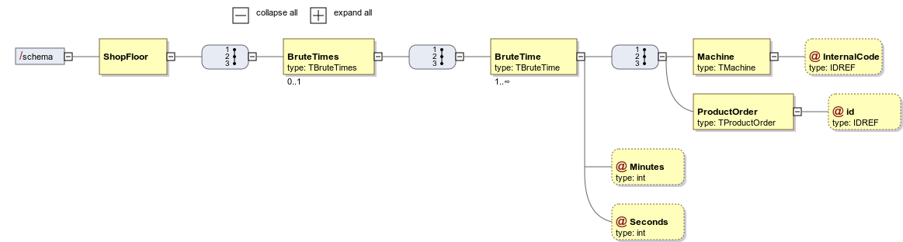

# [#57: [0-1010] Specify a XSD Document for Brute Time](https://bitbucket.org/pjoliveira/lei_isep_2019_20_sem4_2db_1180573_1180715_1180723_1180712/issues/57/0-1010-specify-a-xsd-document-for-brute)

# 1. Requirements

As **Project Manager**, I want the team to specify a XSD document that, later, can be used to validate XML content that is generated by the system.
This XSD should evaluate all information related to the Brute Time.

This use case is related to all other XSD ans XML use cases.

# 2. Analysis

There's nothing to be changed in the domain. All the information regarding the Brute Times is all represented.

# 3. Design

## 3.1. XML Diagram



# 4. Implementation

```xml
<?xml version="1.0" encoding="UTF-8" ?>
<xsd:schema xmlns:xsd="http://www.w3.org/2001/XMLSchema">

  <xsd:element name="ShopFloor">
    <xsd:complexType>
      <xsd:sequence>
        <xsd:element name="BruteTimes" type="TBruteTimes" minOccurs="0" />
      </xsd:sequence>
    </xsd:complexType>
  </xsd:element>

  <xsd:complexType name="TBruteTimes">
    <xsd:sequence>
      <xsd:element name="BruteTime" type="TBruteTime" maxOccurs="unbounded" />
    </xsd:sequence>
  </xsd:complexType>

  <xsd:complexType name="TBruteTime">
    <xsd:sequence>
      <xsd:element name="Machine" type="TMachine" />
      <xsd:element name="ProductOrder" type="TProductOrder" />
    </xsd:sequence>
    <xsd:attribute name="Minutes" type="xsd:int" />
    <xsd:attribute name="Seconds" type="xsd:int" />
  </xsd:complexType>

  <xsd:complexType name="TMachine">
    <xsd:attribute name="InternalCode" type="xsd:IDREF" />
  </xsd:complexType>

  <xsd:complexType name="TProductOrder">
    <xsd:attribute name="id" type="xsd:IDREF" />
  </xsd:complexType>
</xsd:schema>
```

# 6. Observations

None.


