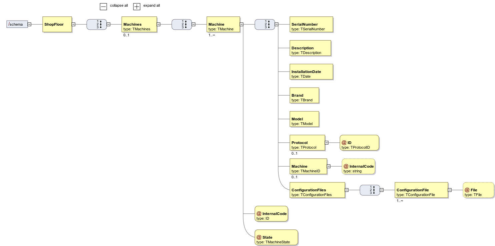

# [#33: [0-1010] Specify a XSD Document(Machine)](https://bitbucket.org/pjoliveira/lei_isep_2019_20_sem4_2db_1180573_1180715_1180723_1180712/issues/33/0-1010-specify-a-xsd-document-machines)

# 1. Requirements

As **Project Manager**, I want the team to specify a XSD document that, later, can be used to validate XML content that is generated by the system.
This XSD should evaluate all information related to the Machine.

This use case is related to all other XSD ans XML use cases.

# 2. Analysis

There's nothing to be changed in the domain. All the information regarding the Machine Aggregate is all represented.

# 3. Design

## 3.1. XML Diagram



# 4. Implementation

```xml
<xsd:complexType name="TMachine">
        <xsd:sequence>
            <xsd:element name="SerialNumber" type="TSerialNumber"/>
            <xsd:element name="Description" type="TDescription"/>
            <xsd:element name="InstallationDate" type="TDate"/>
            <xsd:element name="Brand" type="TBrand"/>
            <xsd:element name="Model" type="TModel"/>
            <xsd:element name="Protocol" type="TProtocol" minOccurs="0"/>
            <xsd:element name="Machine" type="TMachine" minOccurs="0"/>
            <xsd:element name="ConfigurationFiles" type="TConfigurationFiles" minOccurs="1"/>
        </xsd:sequence>
        <xsd:attribute name="InternalCode" type="xsd:string" use="required"/>
        <xsd:attribute name="State" type="TMachineState" use="required"/>
    </xsd:complexType>

    <xsd:simpleType name="TSerialNumber">
        <xsd:restriction base="xsd:string"/>
    </xsd:simpleType>

    <xsd:simpleType name="TDescription">
        <xsd:restriction base="xsd:string"/>
    </xsd:simpleType>

    <xsd:simpleType name="TDate">
        <xsd:restriction base="xsd:date"/>
    </xsd:simpleType>

    <xsd:simpleType name="TModel">
        <xsd:restriction base="xsd:string"/>
    </xsd:simpleType>

    <xsd:simpleType name="TBrand">
        <xsd:restriction base="xsd:string"/>
    </xsd:simpleType>

    <xsd:complexType name="TProtocol">
        <xsd:attribute name="ID" type="TProtocolID" use="required"/>
    </xsd:complexType>

    <xsd:simpleType name="TProtocolID">
        <xsd:restriction base="xsd:integer">
            <xsd:maxInclusive value="65535"/>
            <xsd:minInclusive value="1"/>
        </xsd:restriction>
    </xsd:simpleType>

    <xsd:complexType name="TConfigurationFiles">
        <xsd:sequence>
            <xsd:element name="ConfigurationFile" type="TConfigurationFile" maxOccurs="unbounded"/>
        </xsd:sequence>
    </xsd:complexType>

    <xsd:complexType name="TConfigurationFile">
        <xsd:simpleContent>
            <xsd:extension base="xsd:string">
                <xsd:attribute name="File" type="TFile"/>
            </xsd:extension>
        </xsd:simpleContent>       
    </xsd:complexType>

    <xsd:simpleType name="TFile">
        <xsd:restriction base="xsd:string">
            <xsd:pattern value="(/|.)*/?.*\..*"/>
        </xsd:restriction>
    </xsd:simpleType>

    <xsd:simpleType name="TMachineState">
        <xsd:restriction base="xsd:string">
            <xsd:enumeration value="Active"/>
            <xsd:enumeration value="Disable"/>
            <xsd:enumeration value="Standby"/>
        </xsd:restriction>
    </xsd:simpleType>
```

# 6. Observations

None.


