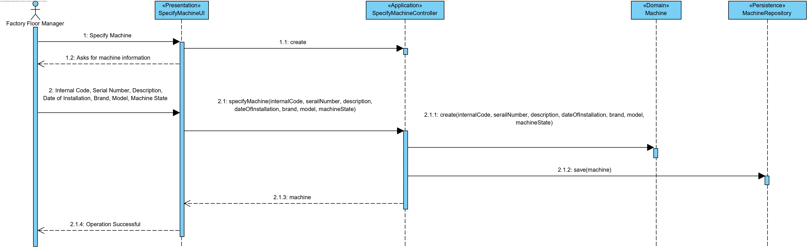
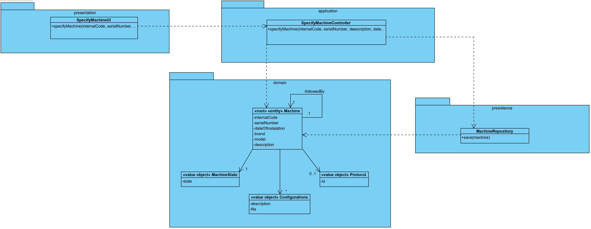

# [2-1-1007] - Specify Machine

# 1. Requirements

**As a Factory Floor Manager:**

-  I intend to define the existence of a new machine.

This is a basic functionality of the program. This use case is needed so that machines within the system can be used

**Correlation/Dependecies:**

- [[2-1-3001] - Machine Bootstrap](MachineBootstrap.md)
- [[2-2-1008] - Line production intialization (bootstrap)](../1180725/LineProductionBootstrap.md)

# 2. Analyze

#### **Statement**

- Machine specification: a machine has an internal code, a serial number, a description, date of installation, a brand and model.
- There must be a possibility to associate one or more configuration files to the machine complemented with a brief description.

# 3. Design

## 3.1. Realization of Functionality



## 3.2. Class Diagram



## 3.3. Applied Patterns

In this functionality, several design standards were applied, namely:

- Information Expert: in assigning responsibilities
- Use Case Controller: used to controll the flow of the Use Case
- Tell, don’t ask: assigning business logic to each class what it is responsible for
- Single Responsibility Principle: by making the classes have only one responsibility
- Repository: to save the data from the aggregates

I used this design standards while maintaining the business logic.

## 3.4. Tests 

In addition to the tests presented here, tests were also made for empty and/or null values.

**Test 1:** Check that it is not possible to create instances of the Machine class with a date greater than the current one.

```java
@Test(expected = IllegalArgumentException.class)
	public void ensureInstallationDateNotFromFuture() {
	Machine instance = new Machine(internalCode, SerialNumber, Calendars.of(futureDate), ...);
}
```

**Functional Test 1:** 

1. Run Back-office Application
2. Log in with Factory Floor Manager or Power User Privileges 
3. Choose Machine Menu
4. Choose Specify New Machine option
5. Fill the parameters with valid info
6. Operation well succeeded
7. Exit application

**Functional Test 2:** 

1. Run Back-office Application
2. Log in with Factory Floor Manager or Power User Privileges 
3. Choose Machine Menu
4. Choose Specify New Machine option
5. Fill the parameters with invalid info
6. Operation didn't succeeded
7. Exit application

# 4. Implementation

The implementation of these UC was not required any specific detail.

# 5. Integration/Demonstration

None.

# 6. Observations

None.


