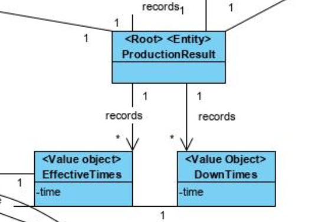
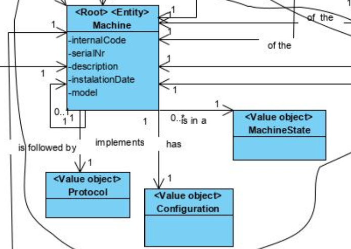

# [#61: [5-1-2013] Apply XSLT to XML ](https://bitbucket.org/pjoliveira/lei_isep_2019_20_sem4_2db_1180573_1180715_1180723_1180712/issues/61/5-1-2013-apply-xslt-to-xml-machine)

# 1. Requirements

As a production manager
I want to transform the xml files previously exported 
So that they are availble to be consulted

Acceptance criteria:

 - XSLT must be used

# 2. Analysis





# 3. Design

The use case is equal to the other XSLT transformations Use Cases, by that, theres no need to repeat the designs.

## 3.4. Tests 
XMLDocument used for test: 

```xml
<?xml version="1.0" encoding="UTF-8" ?>
<!--
To change this license header, choose License Headers in Project Properties.
To change this template file, choose Tools | Templates
and open the template in the editor.
-->


<SSFM xmlns:xsi="http://www.w3.org/2001/XMLSchema-instance" xsi:noNamespaceSchemaLocation="global.xsd">

    <Wastes>
        <!--1 or more repetitions:-->
        <Waste quantity="3">
            <Machine InternalCode="mach1"/>
            <Deposit ID="d2"/>
            <!--Optional:-->
            <RawMaterial ID="rm2"/>
            <ProductionOrder ID="po1"/>
        </Waste>
    </Wastes>

    <Machines>
        <Machine InternalCode="mach1" State="Disable">
            <SerialNumber>A12031010230</SerialNumber>
            <Description>Máquina de engomar</Description>
            <InstallationDate>2008-11-15</InstallationDate>
            <Brand>Ford</Brand>
            <Model>103</Model>
            <!--Optional:-->
            <Protocol ID="100" />
            <!--Optional:-->
            <Machine InternalCode="mach1" />
            <ConfigurationFiles>
                <!--1 or more repetitions:-->
                <ConfigurationFile File="string.c">config1</ConfigurationFile>
            </ConfigurationFiles>
        </Machine>
    </Machines>

    <EffectiveTimes>
        <!--1 or more repetitions:-->
        <EffectiveTime Minutes="5" Seconds="3">
            <Machine InternalCode="mach1"></Machine>
            <ProductionOrder ID="po1"></ProductionOrder>
        </EffectiveTime>
    </EffectiveTimes>

    <BruteTimes>
        <!--1 or more repetitions:-->
        <BruteTime Minutes="5" Seconds="3">
            <Machine InternalCode="mach1"></Machine>
            <ProductionOrder ID="po1"></ProductionOrder>
        </BruteTime>
    </BruteTimes>
</SSFM>
```

# 4. Implementation

#### **To HTML1**

```xml
<xsl:template match="Machines">
        <h3>Machines</h3>
        <table border="1">
            <tr>
                <th>Internal Code</th>
                <th>State</th>
                <th>Serial Number</th>
                <th>Description</th>
                <th>Installation Date</th>
                <th>Brand</th>
                <th>Model</th>
                <th>Protocol</th>
                <th>Followed by Machine</th>
            </tr>
            <xsl:apply-templates select="Machine" />
        </table>

        <h3>Configuration Files</h3>
        <table border="1">
            <tr>
                <th>Machine</th>
                <th>Description</th>
            </tr>
            <xsl:apply-templates select="Machine/ConfigurationFiles/ConfigurationFile" />
        </table>
    </xsl:template>

    <xsl:template match="Machine">
        <tr>
            <td>
                <xsl:value-of select="@InternalCode" />
            </td>
            <td>
                <xsl:value-of select="@State" />
            </td>
            <td>
                <xsl:value-of select="SerialNumber" />
            </td>
            <td>
                <xsl:value-of select="Description" />
            </td>
            <td>
                <xsl:value-of select="InstallationDate" />
            </td>
            <td>
                <xsl:value-of select="Brand" />
            </td>
            <td>
                <xsl:value-of select="Model" />
            </td>
            <td>
                <xsl:value-of select="Protocol/@ID" />
            </td>
            <td>
                <xsl:value-of select="Machine/@InternalCode" />
            </td>
        </tr>
    </xsl:template>


    <xsl:template match="Machine/ConfigurationFiles/ConfigurationFile">
        <tr>
            <td>
                <xsl:value-of select="../../@InternalCode" />
            </td>
            <td>
                <xsl:value-of select="." />
            </td>
        </tr>
    </xsl:template>

    <xsl:template match="Wastes">
        <h3>Wastes</h3>
        <table border="1">
            <tr>
                <th>Production Order</th>
                <th>Machine</th>
                <th>Item</th>
                <th>Quantity</th>
                <th>Deposit</th>
            </tr>
            <xsl:apply-templates select="Waste" />
        </table>
    </xsl:template>

    <xsl:template match="Waste">
        <tr>
            <td>
                <xsl:value-of select="./ProductionOrder/@ID" />
            </td>
            <td>
                <xsl:value-of select="./Machine/@InternalCode" />
            </td>
            <td>
                <xsl:if test="./Product">
                    <xsl:value-of select="./Product/@ID" />
                </xsl:if>
                <xsl:if test="./RawMaterial">
                    <xsl:value-of select="./RawMaterial/@ID" />
                </xsl:if>
            </td>
            <td>
                <xsl:value-of select="@quantity" />
            </td>
            <td>
                <xsl:value-of select="./Deposit/@ID" />
            </td>
        </tr>
    </xsl:template>

    <xsl:template match="EffectiveTimes">
        <h3>Effective Times</h3>
        <table border="1">
            <tr>
                <th>Production Order</th>
                <th>Machine</th>
                <th>Minutes</th>
                <th>Seconds</th>
            </tr>
            <xsl:apply-templates select="EffectiveTime" />
        </table>
    </xsl:template>

    <xsl:template match="EffectiveTime">
        <tr>
            <td>
                <xsl:value-of select="./ProductionOrder/@ID" />
            </td>
            <td>
                <xsl:value-of select="./Machine/@InternalCode" />
            </td>
            <td>
                <xsl:value-of select="./@Minutes" />
            </td>
            <td>
                <xsl:value-of select="./@Seconds" />
            </td>
        </tr>
    </xsl:template>

    <xsl:template match="BruteTimes">
        <h3>Brute Times</h3>
        <table border="1">
            <tr>
                <th>Production Order</th>
                <th>Machine</th>
                <th>Minutes</th>
                <th>Seconds</th>
            </tr>
            <xsl:apply-templates select="BruteTime" />
        </table>
    </xsl:template>

    <xsl:template match="BruteTime">
        <tr>
            <td>
                <xsl:value-of select="./ProductionOrder/@ID" />
            </td>
            <td>
                <xsl:value-of select="./Machine/@InternalCode" />
            </td>
            <td>
                <xsl:value-of select="./@Minutes" />
            </td>
            <td>
                <xsl:value-of select="./@Seconds" />
            </td>
        </tr>
    </xsl:template>
```

#### To HTML 2

```xml
<xsl:template match="Machines">
        <h3>Machines</h3>
        <xsl:apply-templates select="Machine" />
        <h3>Configuration Files</h3>
        <xsl:apply-templates select="Machine/ConfigurationFiles/ConfigurationFile" />
    </xsl:template>

    <xsl:template match="Machine">
        <p>
            Internal Code:
            <xsl:value-of select="@InternalCode" />
            <br />
            State:
            <xsl:value-of select="@State" />
            <br />
            Serial Number:
            <xsl:value-of select="SerialNumber" />
            <br />
            Description:
            <xsl:value-of select="Description" />
            <br />
            Installation Date:
            <xsl:value-of select="InstallationDate" />
            <br />
            Brand:
            <xsl:value-of select="Brand" />
            <br />
            Model:
            <xsl:value-of select="Model" />
            <br />
            <xsl:apply-templates select="Protocol" />
            <xsl:call-template name="MachineID" />
        </p>
    </xsl:template>

    <xsl:template match="Protocol">
        Protocol:
        <xsl:value-of select="@ID" />
        <br />
    </xsl:template>

    <xsl:template name="MachineID">
        <xsl:if test="Machine">
            Machine:
            <xsl:value-of select="Machine/@InternalCode" />
            <br />
        </xsl:if>
    </xsl:template>

    <xsl:template match="Machine/ConfigurationFiles/ConfigurationFile">
        <p>
            Machine:
            <xsl:value-of select="../../@InternalCode" />
            <br />
            Descrition:
            <xsl:value-of select="." />
            <br />
        </p>
    </xsl:template>

    <xsl:template match="Wastes">
        <h3>Wastes</h3>
        <xsl:apply-templates select="Waste" />
    </xsl:template>

    <xsl:template match="Waste">
        <p>
            Production Order:
            <xsl:value-of select="ProductionOrder/@ID" />
            <br />
            Machine:
            <xsl:value-of select="Machine/@InternalCode" />
            <br />
            Quatity:
            <xsl:value-of select="@quantity" />
            <br />
            <xsl:if test="Product">
                Product:
                <xsl:value-of select="Product/@ID" />
                <br />
            </xsl:if>
            <xsl:if test="RawMaterial">
                Raw Material:
                <xsl:value-of select="RawMaterial/@ID" />
                <br />
            </xsl:if>
            Deposit:
            <xsl:value-of select="Deposit/@ID" />
            <br />
        </p>
    </xsl:template>

    <xsl:template match="EffectiveTimes">
        <h3>Effective Times</h3>
        <xsl:apply-templates select="EffectiveTime" />
    </xsl:template>

    <xsl:template match="EffectiveTime">
        <p>
            Production Order:
            <xsl:value-of select="ProductionOrder/@ID" />
            <br />
            Machine:
            <xsl:value-of select="Machine/@InternalCode" />
            <br />
            Minutes:
            <xsl:value-of select="@Minutes" />
            <br />
            Seconds:
            <xsl:value-of select="@Seconds" />
            <br />
        </p>
    </xsl:template>

    <xsl:template match="BruteTimes">
        <h3>Brute Times</h3>
        <xsl:apply-templates select="BruteTime" />
    </xsl:template>

    <xsl:template match="BruteTime">
        <p>
            Production Order:
            <xsl:value-of select="ProductionOrder/@ID" />
            <br />
            Machine:
            <xsl:value-of select="Machine/@InternalCode" />
            <br />
            Minutes:
            <xsl:value-of select="@Minutes" />
            <br />
            Seconds:
            <xsl:value-of select="@Seconds" />
            <br />
        </p>
    </xsl:template>

```

#### To HTML 3

```xml
<xsl:template name="Results">
        <xsl:for-each select="//ProductionOrders/ProductionOrder">
            <xsl:variable name="orderID">
                <xsl:value-of select="./@internalCode" />
            </xsl:variable>

            <xsl:if test="//EffectiveTime/ProductionOrder/@ID=$orderID">
                <xsl:variable name="maxEffectiveMinutes">
                    <xsl:value-of select="max(//EffectiveTime[ProductionOrder/@ID=$orderID]/@Minutes)" />
                </xsl:variable>
                <xsl:variable name="maxEffectiveSeconds">
                    <xsl:value-of select="max(//EffectiveTime[ProductionOrder/@ID=$orderID and @Minutes=$maxEffectiveMinutes]/@Seconds)" />
                </xsl:variable>
                <xsl:variable name="minEffectiveMinutes">
                    <xsl:value-of select="min(//EffectiveTime[ProductionOrder/@ID=$orderID]/@Minutes)" />
                </xsl:variable>
                <xsl:variable name="minEffectiveSeconds">
                    <xsl:value-of select="min(//EffectiveTime[ProductionOrder/@ID=$orderID and @Minutes=$minEffectiveMinutes]/@Seconds)" />
                </xsl:variable>
                <xsl:variable name="sumEffectiveTimesMinutes">
                    <xsl:value-of select="sum(//EffectiveTime[ProductionOrder/@ID=$orderID]/@Minutes)" />
                </xsl:variable>
                <xsl:variable name="sumEffectiveTimesSeconds">
                    <xsl:value-of select="sum(//EffectiveTime[ProductionOrder/@ID=$orderID]/@Seconds)" />
                </xsl:variable>
                <xsl:variable name="sumBruteTimesMinutes">
                    <xsl:value-of select="sum(//BruteTime[ProductionOrder/@ID=$orderID]/@Minutes)" />
                </xsl:variable>
                <xsl:variable name="sumBruteTimesSeconds">
                    <xsl:value-of select="sum(//BruteTime[ProductionOrder/@ID=$orderID]/@Seconds)" />
                </xsl:variable>
                <h3>
                    Production Order:
                    <strong>
                        <xsl:value-of select="@internalCode" />
                    </strong>
                </h3>
                <ul>
                    <li>
                        Machine with the highest effective time:
                        <xsl:value-of select="//EffectiveTime/Machine[../ProductionOrder/@ID=$orderID and ../@Minutes=$maxEffectiveMinutes and ../@Seconds=$maxEffectiveSeconds]/@InternalCode" />
                    </li>
                    <li>
                        Machine with the lowest effective time:
                        <xsl:value-of select="//EffectiveTime/Machine[../ProductionOrder/@ID=$orderID and ../@Minutes=$minEffectiveMinutes and ../@Seconds=$minEffectiveSeconds]/@InternalCode" />
                    </li>
                    <li>
                        Total DownTime:
                        <xsl:value-of select="abs($sumBruteTimesMinutes - $sumEffectiveTimesMinutes)" />
                        :
                        <xsl:value-of select="abs($sumBruteTimesSeconds - $sumEffectiveTimesSeconds)" />
                    </li>
                </ul>
            </xsl:if>

        </xsl:for-each>
    </xsl:template>


```

#### To JSON 1

```xml
<!-- Machines -->
    <xsl:template match="Machines">
        "Machines" :[<xsl:apply-templates select="Machine" />
        ]<xsl:if test="following-sibling::*">,</xsl:if>
    </xsl:template>

    <xsl:template match="Machine">
            {
                "InternalCode" : "<xsl:value-of select="@InternalCode" />",
                "State" : "<xsl:value-of select="@State" />",
                "SerialNumber" : "<xsl:value-of select="SerialNumber" />",
                "Description" : "<xsl:value-of select="Description" />",
                "InstallationDate" : "<xsl:value-of select="InstallationDate" />",
                "Brand" : "<xsl:value-of select="Brand" />",
                "Model" : "<xsl:value-of select="Model" />",
                "Protocol" : "<xsl:value-of select="Protocol/@ID" />",
                "Machine" : "<xsl:value-of select="Machine/@InternalCode" />"
            }<xsl:if test="following-sibling::*">,</xsl:if>
    </xsl:template>

    <!-- Configuration Files -->

    <xsl:template name="ConfigurationFiles">
        "ConfigurationFiles" :[<xsl:call-template name="ConfigurationFilePerMachine" />
        ]<xsl:if test="following-sibling::*">,</xsl:if>
    </xsl:template>

    <xsl:template name="ConfigurationFilePerMachine">

        <xsl:for-each select="Machines/Machine">
            <xsl:variable name="mach">
                <xsl:value-of select="@InternalCode" />
            </xsl:variable>
            {
                "Machine" : "<xsl:value-of select="$mach" />",
                "ConfigurationFiles" : [<xsl:for-each select="ConfigurationFiles/ConfigurationFile">
                        "<xsl:value-of select="." />"<xsl:if test="following-sibling::*">,</xsl:if>
                    </xsl:for-each>
                ]
            }<xsl:if test="following-sibling::*">,</xsl:if>
        </xsl:for-each><xsl:if test="following-sibling::*">,</xsl:if>

    </xsl:template>

```

#### To JSON 2

```xml
<!-- Wastes -->
    <xsl:template match="Wastes">
        "Wastes" :[<xsl:apply-templates select="Waste" />
        ]
    </xsl:template>

    <xsl:template match="Waste">
            {
                "ProductionOrder" : "<xsl:value-of select="ProductionOrder/@ID" />",
                "Machine" : "<xsl:value-of select="Machine/@InternalCode" />",
                <xsl:if test="Product">"Product" : "<xsl:value-of select="Product/@ID" />",</xsl:if>
                <xsl:if test="RawMaterial">"RawMaterial" : "<xsl:value-of select="RawMaterial/@ID" />",</xsl:if>
                "Quantity" : "<xsl:value-of select="@quantity" />",
                "Deposit" : "<xsl:value-of select="Deposit/@ID" />"
            }<xsl:if test="following-sibling::*">,</xsl:if>
    </xsl:template>

    <!-- EffecitveTimes -->
    <xsl:template match="EffectiveTimes">
        "EffectiveTimes" :[<xsl:apply-templates select="EffectiveTime" />
        ]
    </xsl:template>

    <xsl:template match="EffectiveTime">
            {
                "ProductionOrder" : "<xsl:value-of select="ProductionOrder/@ID" />",
                "Machine" : "<xsl:value-of select="Machine/@InternalCode" />",
                "Minutes" : "<xsl:value-of select="@Minutes" />",
                "Seconds" : "<xsl:value-of select="@Seconds" />"
            }<xsl:if test="following-sibling::*">,</xsl:if>
    </xsl:template>

    <!-- BruteTimes -->
    <xsl:template match="BruteTimes">
        "BruteTimes" :[<xsl:apply-templates select="BruteTime" />
        ]
    </xsl:template>

    <xsl:template match="BruteTime">
            {
                "ProductionOrder" : "<xsl:value-of select="ProductionOrder/@ID" />",
                "Machine" : "<xsl:value-of select="Machine/@InternalCode" />",
                "Minutes" : "<xsl:value-of select="@Minutes" />",
                "Seconds" : "<xsl:value-of select="@Seconds" />"
            }<xsl:if test="following-sibling::*">,</xsl:if>
    </xsl:template>


```

#### To JSON 3

```xml
<xsl:template name="Results">
        <xsl:for-each select="//ProductionOrders/ProductionOrder">
            <xsl:variable name="orderID">
                <xsl:value-of select="./@internalCode" />
            </xsl:variable>

            <xsl:if test="//EffectiveTime/ProductionOrder/@ID=$orderID">
                <xsl:variable name="maxEffectiveMinutes">
                    <xsl:value-of select="max(//EffectiveTime[ProductionOrder/@ID=$orderID]/@Minutes)" />
                </xsl:variable>
                <xsl:variable name="maxEffectiveSeconds">
                    <xsl:value-of select="max(//EffectiveTime[ProductionOrder/@ID=$orderID and @Minutes=$maxEffectiveMinutes]/@Seconds)" />
                </xsl:variable>
                <xsl:variable name="minEffectiveMinutes">
                    <xsl:value-of select="min(//EffectiveTime[ProductionOrder/@ID=$orderID]/@Minutes)" />
                </xsl:variable>
                <xsl:variable name="minEffectiveSeconds">
                    <xsl:value-of select="min(//EffectiveTime[ProductionOrder/@ID=$orderID and @Minutes=$minEffectiveMinutes]/@Seconds)" />
                </xsl:variable>
                <xsl:variable name="sumEffectiveTimesMinutes">
                    <xsl:value-of select="sum(//EffectiveTime[ProductionOrder/@ID=$orderID]/@Minutes)" />
                </xsl:variable>
                <xsl:variable name="sumEffectiveTimesSeconds">
                    <xsl:value-of select="sum(//EffectiveTime[ProductionOrder/@ID=$orderID]/@Seconds)" />
                </xsl:variable>
                <xsl:variable name="sumBruteTimesMinutes">
                    <xsl:value-of select="sum(//BruteTime[ProductionOrder/@ID=$orderID]/@Minutes)" />
                </xsl:variable>
                <xsl:variable name="sumBruteTimesSeconds">
                    <xsl:value-of select="sum(//BruteTime[ProductionOrder/@ID=$orderID]/@Seconds)" />
                </xsl:variable>
                    "Production Order [<xsl:value-of select="@internalCode" />]" : {
                        "Machine with the highest effective time" : "<xsl:value-of select="//EffectiveTime/Machine[../ProductionOrder/@ID=$orderID and ../@Minutes=$maxEffectiveMinutes and ../@Seconds=$maxEffectiveSeconds]/@InternalCode" />",
                        "Machine with the lowest effective time" : "<xsl:value-of select="//EffectiveTime/Machine[../ProductionOrder/@ID=$orderID and ../@Minutes=$minEffectiveMinutes and ../@Seconds=$minEffectiveSeconds]/@InternalCode" />",
                        "Total DownTime" : "<xsl:value-of select="abs($sumBruteTimesMinutes - $sumEffectiveTimesMinutes)" />:<xsl:value-of select="abs($sumBruteTimesSeconds - $sumEffectiveTimesSeconds)" />"
                    }<xsl:if test="following-sibling::*">,</xsl:if>
            </xsl:if>

        </xsl:for-each>
    </xsl:template>

```

#### To Text 1

```xml
<xsl:template match="Machines">

        Machines: <xsl:apply-templates select="Machine" />

        Configuration Files: <xsl:apply-templates select="Machine/ConfigurationFiles/ConfigurationFile" />
    </xsl:template>

    <xsl:template match="Machine">

            Internal Code: <xsl:value-of select="@InternalCode" />
            State: <xsl:value-of select="@State" />
            Serial Number: <xsl:value-of select="SerialNumber" />
            Description: <xsl:value-of select="Description" />
            Installation Date: <xsl:value-of select="InstallationDate" />
            Brand: <xsl:value-of select="Brand" />
            Model: <xsl:value-of select="Model" />
            <xsl:if test="Protocol">
            Protocol: <xsl:value-of select="Protocol/@ID" />
            </xsl:if>
            <xsl:if test="Machine">
            Followed by Machine: <xsl:value-of select="Machine/@InternalCode" />
            </xsl:if>

    </xsl:template>


    <xsl:template match="Machine/ConfigurationFiles/ConfigurationFile">

            Machine: <xsl:value-of select="../../@InternalCode" />
            Description: <xsl:value-of select="." />
    </xsl:template>

    <xsl:template match="Wastes">

        Wastes:<xsl:apply-templates select="Waste" />
    </xsl:template>

    <xsl:template match="Waste">

            Production Order: <xsl:value-of select="./ProductionOrder/@ID" />
            Machine: <xsl:value-of select="./Machine/@InternalCode" />
            <xsl:if test="./Product">
            Product: <xsl:value-of select="./Product/@ID" /></xsl:if>
            <xsl:if test="./RawMaterial">
            Raw Material: <xsl:value-of select="./RawMaterial/@ID" /></xsl:if>
            Quantity: <xsl:value-of select="@quantity" />
            Deposit: <xsl:value-of select="./Deposit/@ID" />
    </xsl:template>

    <xsl:template match="EffectiveTimes">

        Effective Times: <xsl:apply-templates select="EffectiveTime" />
    </xsl:template>

    <xsl:template match="EffectiveTime">

            Production Order: <xsl:value-of select="./ProductionOrder/@ID" />
            Machine: <xsl:value-of select="./Machine/@InternalCode" />
            Minutes: <xsl:value-of select="./@Minutes" />
            Seconds: <xsl:value-of select="./@Seconds" />
    </xsl:template>

    <xsl:template match="BruteTimes">

        Brute Times: <xsl:apply-templates select="BruteTime" />
    </xsl:template>

    <xsl:template match="BruteTime">

            Production Order: <xsl:value-of select="./ProductionOrder/@ID" />
            Machine: <xsl:value-of select="./Machine/@InternalCode" />
            Minutes: <xsl:value-of select="./@Minutes" />
            Seconds: <xsl:value-of select="./@Seconds" />
    </xsl:template>


```

#### To Text 2

```xml
<xsl:template name="Results">
        <xsl:for-each select="//ProductionOrders/ProductionOrder">
            <xsl:variable name="orderID">
                <xsl:value-of select="./@internalCode" />
            </xsl:variable>

            <xsl:if test="//EffectiveTime/ProductionOrder/@ID=$orderID">
                <xsl:variable name="maxEffectiveMinutes">
                    <xsl:value-of select="max(//EffectiveTime[ProductionOrder/@ID=$orderID]/@Minutes)" />
                </xsl:variable>
                <xsl:variable name="maxEffectiveSeconds">
                    <xsl:value-of select="max(//EffectiveTime[ProductionOrder/@ID=$orderID and @Minutes=$maxEffectiveMinutes]/@Seconds)" />
                </xsl:variable>
                <xsl:variable name="minEffectiveMinutes">
                    <xsl:value-of select="min(//EffectiveTime[ProductionOrder/@ID=$orderID]/@Minutes)" />
                </xsl:variable>
                <xsl:variable name="minEffectiveSeconds">
                    <xsl:value-of select="min(//EffectiveTime[ProductionOrder/@ID=$orderID and @Minutes=$minEffectiveMinutes]/@Seconds)" />
                </xsl:variable>
                <xsl:variable name="sumEffectiveTimesMinutes">
                    <xsl:value-of select="sum(//EffectiveTime[ProductionOrder/@ID=$orderID]/@Minutes)" />
                </xsl:variable>
                <xsl:variable name="sumEffectiveTimesSeconds">
                    <xsl:value-of select="sum(//EffectiveTime[ProductionOrder/@ID=$orderID]/@Seconds)" />
                </xsl:variable>
                <xsl:variable name="sumBruteTimesMinutes">
                    <xsl:value-of select="sum(//BruteTime[ProductionOrder/@ID=$orderID]/@Minutes)" />
                </xsl:variable>
                <xsl:variable name="sumBruteTimesSeconds">
                    <xsl:value-of select="sum(//BruteTime[ProductionOrder/@ID=$orderID]/@Seconds)" />
                </xsl:variable>
                
                Production Order: <xsl:value-of select="@internalCode" />
                
                Machine with the highest effective time: <xsl:value-of select="//EffectiveTime/Machine[../ProductionOrder/@ID=$orderID and ../@Minutes=$maxEffectiveMinutes and ../@Seconds=$maxEffectiveSeconds]/@InternalCode" />
                Machine with the lowest effective time: <xsl:value-of select="//EffectiveTime/Machine[../ProductionOrder/@ID=$orderID and ../@Minutes=$minEffectiveMinutes and ../@Seconds=$minEffectiveSeconds]/@InternalCode" />
                Total DownTime: <xsl:value-of select="abs($sumBruteTimesMinutes - $sumEffectiveTimesMinutes)" />:<xsl:value-of select="abs($sumBruteTimesSeconds - $sumEffectiveTimesSeconds)" />
            </xsl:if>

        </xsl:for-each>
    </xsl:template>

```

#### To XML

```xml
<xsl:template match="Machine">
        
        <Machine>
            <xsl:attribute name="InternalCode">
                <xsl:value-of select="@InternalCode"/>
            </xsl:attribute>
            <xsl:attribute name="State">
                <xsl:value-of select="@State"/>
            </xsl:attribute>
            <SerialNumber><xsl:value-of select="SerialNumber" /></SerialNumber>
            <Description><xsl:value-of select="Description" /></Description>
            <InstallationDate><xsl:value-of select="InstallationDate" /></InstallationDate>
            <Brand><xsl:value-of select="Brand" /></Brand>
            <Model><xsl:value-of select="Model" /></Model>
            <xsl:if test="Protocol">
            <Protocol><xsl:value-of select="Protocol/@ID" /></Protocol>
            </xsl:if>
            <xsl:if test="Protocol">
            <Machine><xsl:value-of select="Machine/@InternalCode" /></Machine>
            </xsl:if>
            <ConfigurationFiles>
                <xsl:for-each select="ConfigurationFiles/ConfigurationFile">
                <ConfigurationFile><xsl:attribute name="file"><xsl:value-of select="@File"/></xsl:attribute><xsl:value-of select="." /></ConfigurationFile>
                </xsl:for-each>
            </ConfigurationFiles>
        </Machine>

    </xsl:template>

```


# 5. Integration/Demonstration

The integration part was adding the corresponding elements created to the root element.

# 6. Observations

None.


