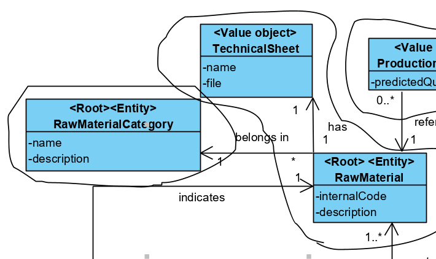
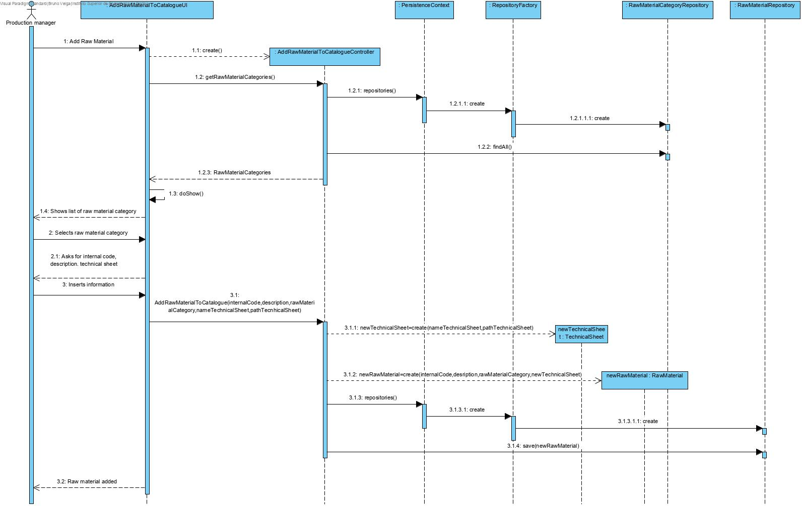
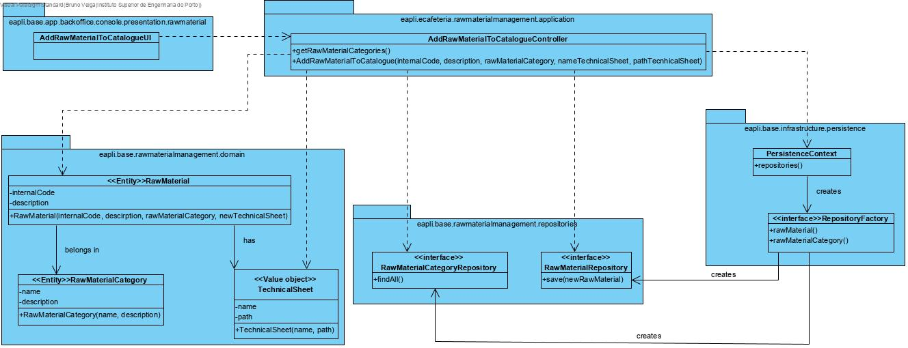
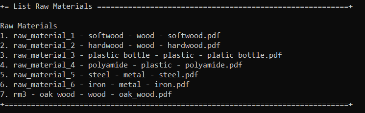
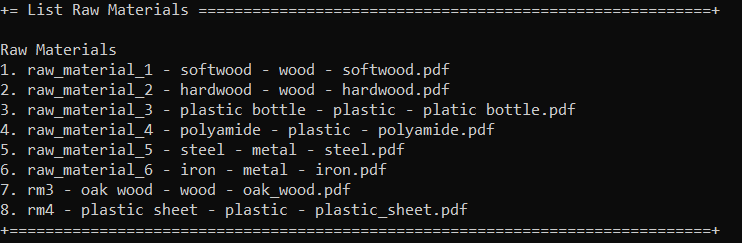

# Add Raw Material Category
=======================================

# 1. Requirements 

As a Production Manager

I want to add a raw material to the catalog

So that it can be used to fabricate products

This functionality has to be developed after being possible to add raw material categories to the system.

Basically, there is a need to add raw material to a catalogue, so that it can be used to fabricate products.

**Client details:**

- The raw material internal code is alphanumeric with length less or equal to 15

# 2. Analysis

The domain model was altered. The attributes name and path were given to the class "Technical sheet".

# 3. Design

## 3.1. Functionality realisation

## 3.2. Class diagram

## 3.3. Design patterns applied

**Pure Fabrication** - used in the creation of the class "AddRawMaterialUI", since no other rule can be applied to create it.

**Controller** - the class "AddRawMaterialController" controls the user case.

**Single responsibility** - Every class has only one responsibility, the controller class only controls the user case, the class "RawMaterial" is only responsible for operations related to Raw Materials,"RawMaterialCategory" to raw material categories and technical sheet to the PDF documents and the repository class is only responsible for communicating with the database, and bring information to memory.

**Repository** - There are classes ("RawMaterialRepository" and "RawMaterialCategoryRepository") responsible for operations with the database related to the domain classes correspondent. 

**Command:** In the presentation classes of this UC is used classes that implement actions and are responsible for executing the UI related to a certain menu option (AddRawMaterialAction executes AddRawMaterialUI).

**Factory:** In this case a simple constructor for the "RawMaterial" was enough since it is a simple constructor and there aren't many variations for objects of that type. "RepositoryFactory" is responsible for creating all the repository classes.

## 3.4. Tests

**Test 1:** Verifies that a raw material instance can be created with an internal code, category, a description and a technical sheet

	@Test
	public void ensureRawMaterialWithInternalCodeDescriptionCategoryTechnicalSheet() {
	        new RawMaterial(INTERNAL_CODE, DESCRIPTION, CATEGORY_WOOD, TECHNICAL_SHEET);
	        assertTrue(true);
	}

**Test 2:** Verifies that a raw material instance can't be created without a category

	@Test(expected = IllegalArgumentException.class)
	public void ensureMustHaveCategory() {
	        new RawMaterial(INTERNAL_CODE, DESCRIPTION, null, TECHNICAL_SHEET);
	}

**Test 3:** Verifies that a raw material instance can't be created without a technical sheet

	@Test(expected = IllegalArgumentException.class)
	public void ensureMustHaveTechnicalSheet() {
	        new RawMaterial(INTERNAL_CODE, DESCRIPTION, CATEGORY_WOOD, null);
	}

**Test 4:** Verifies that a raw material instance can't be created with a null description

	@Test(expected = IllegalArgumentException.class)
	public void ensureDescriptionMustNotBeNull() {
	        new RawMaterial(INTERNAL_CODE, null, CATEGORY_WOOD, TECHNICAL_SHEET);
	}

**Test 5:** Verifies that a raw material instance can't be created with a empty description

	@Test(expected = IllegalArgumentException.class)
	public void ensureDescriptionMustNotBeEmpty() {
	        new RawMaterial(INTERNAL_CODE, "", CATEGORY_WOOD, TECHNICAL_SHEET);
	}

**Test 6:** Verifies that a raw material instance can't be created without an internal code

	@Test(expected = IllegalArgumentException.class)
	public void ensureMustHaveInternalCode() {
	        new RawMaterial(null, DESCRIPTION, CATEGORY_WOOD, TECHNICAL_SHEET);
	}

**Test 7:** Verifies that a technical sheet can be created with a name and path

	@Test
	public void ensureTechnicalSheetWithNamePath() {
		new TechnicalSheet(NAME, PATH);
	    assertTrue(true);
	}

**Test 8:** Verifies that a technical sheet can't have a null name 

	@Test(expected = IllegalArgumentException.class)
	public void ensureTechnicalSheetNameMutNotBeNull() {
		new TechnicalSheet(null, PATH);
	}

**Test 9:** Verifies that a technical sheet can't have an empty name

	@Test(expected = IllegalArgumentException.class)
	public void ensureTechinicalSheetNameMustNotBeEmpty() {
		new TechnicalSheet("", PATH);
	}

**Test 10:** Verifies that a technical sheet can't have a null path

	@Test(expected = IllegalArgumentException.class)
	public void ensureTechnicalSheetPathMustNotBeNull() {
		new TechnicalSheet(NAME, null);
	}

**Test 11:** Verifies that a technical sheet can't have an empty path

	@Test(expected = IllegalArgumentException.class)
	public void ensureTechnicalSheetPathMustNotBeEmpty() {
		new TechnicalSheet(NAME, "");
	}

**Scenario 1:**

1. Run backoffice app

2. Login with poweruser or production_manager account(poweruser,poweruserA1|production_manager,Password1)

3. Select raw materials option

4. Select add raw material to catalogue option

5. Select raw material category 1, wood

6. Write as internalCode "rm3" and description "oak wood"

7. Write as name for the technical sheet "oak_wood.pdf" and as path ".///files/oak_wood.pdf"

8. New raw Material added

9. Select raw materials option, and then list raw materials to verify that a new raw material was added

   
   
   

**Scenario 2:**

1. Run backoffice app

2. Login with poweruser or production_manager account(poweruser,poweruserA1|production_manager,Password1)

3. Select raw materials option

4. Select add raw material to catalogue option

5. Select raw material category 2, plastic

6. Write as internalCode "rm4123456789012345" and description "plastic sheet"

7. Write as name for the technical sheet "plastic sheet" and as path ".///files/plastic_sheet.pdf"

8. Verify that it is not possible to write an internal code with more that 15 characters

9. Repeat steps 3, 4, 5

10. Write as internalCode "raw_material_1" and description "plastic sheet"

11. Write as name for the technical sheet "plastic sheet" and as path ".///files/plastic_sheet.pdf"

12. Verify that raw materials can not have the same internal code

13. Repeat steps 3, 4, 5

14. Write as internalCode "rm4" and description "plastic sheet"

15. Write as name for the technical sheet "plastic_sheet.pdf" and as path ".///files/plastic_sheet.pdf"

16. New raw Material added

17. Select raw materials option, and then list raw materials to verify that a new raw material was added

    

# 4. Implementation

## 4.1. Controller  

    public class AddRawMaterialToCatalogueController {
     	private final AuthorizationService authz = AuthzRegistry.authorizationService();
     	private final ListRawMaterialCategoryService rmcs= new 
     	ListRawMaterialCategoryService();
     	private final RawMaterialRepository repository=   
     	PersistenceContext.repositories().rawMaterial();
       
    	public RawMaterial addRawMaterialToCatalogue(String internalCode,String description, 	RawMaterialCategory rawMaterialCategory, String nameTechnicalSheet,String 
    	pathTechnicalSheet) { 
      
     	 	authz.ensureAuthenticatedUserHasAnyOf(BaseRoles.POWER_USER, 	
      		BaseRoles.PRODUCTION_MANAGER);
        
        	final RawMaterial rawMaterial= 
    		new RawMaterial(Designation.valueof(internalCode),description,rawMaterialCategory
         	,new TechnicalSheet(nameTechnicalSheet,pathTechnicalSheet));
        
        	return this.repository.save(rawMaterial);
    	}
    	public Iterable<RawMaterialCategory> getRawMaterialCategories() {
            return this.rmcs.allRawMaterialCategories();
       	}   
    }

​    

## 4.2. Domain

    package eapli.base.rawmaterialmanagement.domain;
    
    @Entity
    public class RawMaterial implements Serializable, AggregateRoot<Designation> {
    
        private static final long serialVersionUID = 1L;
        @Version
        private Long version;
        
        //internal code
        @EmbeddedId
        private Designation internalCode;
        /**
         * Desription of the raw material
         */
        private String description;
        /**
         * Category of the raw material
         */
        @ManyToOne
        private RawMaterialCategory rawMaterialCategory;
        /**
         * Technical sheet of raw material
         */
        private TechnicalSheet technicalSheet;
    
        protected RawMaterial() {
            //ORM
        }
    
        /**
         * Raw Material Constructor
         * @param internalCode: internal code of raw material
         * @param description: description of raw material
         * @param rawMaterialCategory: category of raw material
         * @param technicalSheet : technical sheet of raw material
         */
        public RawMaterial(final Designation internalCode, final String description, final 
        RawMaterialCategory rawMaterialCategory, final TechnicalSheet technicalSheet) {
            Preconditions.noneNull(rawMaterialCategory, technicalSheet);
            this.rawMaterialCategory=rawMaterialCategory;
            this.technicalSheet=technicalSheet;
            setInternalCode(internalCode);
            setDescription(description);
        }
    
        /**
         * Sets and validates internal code
         * @param internalCode 
         */
        private void setInternalCode(Designation internalCode) {
            if(internalCodeMeetsMinimumRequirements(internalCode)) {
                this.internalCode=internalCode;
            }else{
                throw new IllegalArgumentException("Invalid internal code");
            }
        }
        
        /**
         * Sets and validates newDescription.
         *
         * @param newDescription
         */
        private void setDescription(final String newDescription) {
            if (descriptionMeetsMinimumRequirements(newDescription)) {
                this.description = newDescription;
            } else {
                throw new IllegalArgumentException("Invalid Description");
            }
        }
    
        /**
         * Ensure description is not null or empty.
         *
         * @param description
         * @return True if description meets minimum requirements. False if description
         *         does not meet minimum requirements.
         */
        private static boolean descriptionMeetsMinimumRequirements(final String description)     {
            return !StringPredicates.isNullOrEmpty(description);
        }
        
        /**
         * ´Ensures that the internal code has 15 or less characters
         * @param internalCode
         * @return 
         */
        private static boolean internalCodeMeetsMinimumRequirements(final Designation      
        internalCode) {
            Preconditions.nonNull(internalCode);
            return internalCode.toString().length()<=15;
        }

    @Embeddable
    public class TechnicalSheet implements ValueObject{
     	private String nameTechnicalSheet;
        @Lob
        @Basic(fetch = FetchType.LAZY)
        private byte[] file;
    
        protected TechnicalSheet() {
            //ORM
        }
    
        /**
         * Technical Sheet constructor
         *
         * @param nameTechnicalSheet
         * @param pathTechnicalSheet
         */
        public TechnicalSheet(final String nameTechnicalSheet, final String 	
        pathTechnicalSheet) {
            this.setNameTechnicalSheet(nameTechnicalSheet);
            this.setFile(pathTechnicalSheet);
        }
    
        /**
         * ub Sets and validates nameTechnicalSheet
         *
         * @param nameTechnicalSheet
         */
        private void setNameTechnicalSheet(final String nameTechnicalSheet) {
            if (nameMeetsMinimumRequirements(nameTechnicalSheet)) {
                this.nameTechnicalSheet = nameTechnicalSheet;
            } else {
                throw new IllegalArgumentException("Invalid name");
            }
        }
    
        /**
         * Sets and validates pathTechnicalSheet
         *
         * @param pathTechnicalSheet
         */
        private void setFile(final String pathTechnicalSheet) {
            if(!pathMeetsMinimumRequirements(pathTechnicalSheet)) throw new 
            IllegalArgumentException("Path can't be null or empty");
            try {
                File tempFile = new File(pathTechnicalSheet);
                FileInputStream fis = new FileInputStream(tempFile);
                this.file = new byte[(int) tempFile.length()];
                fis.read(file);
                ByteArrayOutputStream bos = new ByteArrayOutputStream();
                file = bos.toByteArray();
            } catch (IOException ex) {
                throw new IllegalArgumentException("Invalid file path");
            }
        }
    
        /**
         * Ensure name is not null or empty.
         *
         * @param name
         * @return True if name meets minimum requirements. False if description
         * does not meet minimum requirements.
         */
        private static boolean nameMeetsMinimumRequirements(final String name) {
            return !StringPredicates.isNullOrEmpty(name);
        }
    
        /**
         * Ensure path is not null or empty.
         *
         * @param path
         * @return True if path meets minimum requirements. False if description
         * does not meet minimum requirements.
         */
        private static boolean pathMeetsMinimumRequirements(final String path) {
            return !StringPredicates.isNullOrEmpty(path);
        }
    
        @Override
        public boolean equals(final Object o) {
            if (this == o) {
                return true;
            }
            if (!(o instanceof TechnicalSheet)) {
                return false;
            }
    
            final TechnicalSheet that = (TechnicalSheet) o;
            return this.nameTechnicalSheet.equals(that.nameTechnicalSheet) && 	
            this.file.equals(that.file);
        }
    
        @Override
        public int hashCode() {
            return new HashCoder().with(nameTechnicalSheet).with(file).code();
        }
    
        @Override
        public String toString() {
            return this.nameTechnicalSheet;
        }
    }
## 4.3. Repository

    public interface RawMaterialRepository extends DomainRepository<Designation, RawMaterial>{
        
    }
## 4.4. Services

    public class ListRawMaterialCategoryService {
    private final AuthorizationService authz = AuthzRegistry.authorizationService();
    private final RawMaterialCategoryRepository rawMaterialCategoryRepository = PersistenceContext.repositories().rawMaterialCategory();
    
    /**
     * Returns all the raw material categories existing 
     * @return raw material categories
     */
    public Iterable<RawMaterialCategory> allRawMaterialCategories() {
        authz.ensureAuthenticatedUserHasAnyOf(BaseRoles.POWER_USER,
                BaseRoles.PRODUCTION_MANAGER);
    
        return this.rawMaterialCategoryRepository.findAll();
    }
    }
## 4.5. Commits

Commit 1: \#5: Add raw material to catalogue engineer process

Commit 2 #5: [1-1-2001\] - Add raw material to catalogue #comment User case implemented and tested, only missing UI

Commit 3: \#5: [1-1-2001] - Add raw material to catalog #comment Corrected engineer process

Commit 4:\#5: [1-1-2001] - Add raw material to catalog #comment corrected issues related to persistence

Commit 5:#5: [1-1-2001] - Add raw material to catalog #comment Corrected some mistakes and added UI

# 5. Integration/Demonstration

This functionality had to be integrated for persistence in memory and Jpa

    public interface RepositoryFactory {
    	/* repository will be created in auto transaction mode
    	* 
    	* @return 
    	*/
        RawMaterialRepository rawMaterial();
    }
    
    package eapli.base.persistence.impl.inmemory;
    
    public class InMemoryRawMaterialRepository extends InMemoryDomainRepository<Designation, RawMaterial> implements RawMaterialRepository{
        
        static{
            InMemoryInitializer.init();
        }
    }
    
    package eapli.base.persistence.impl.inmemory;
    
    public class InMemoryRepositoryFactory implements RepositoryFactory {
    	@Override
        public RawMaterialRepository rawMaterial() {
            return new InMemoryRawMaterialRepository();
        }
    }
    
    package eapli.base.persistence.impl.jpa;
    
    public class JpaRawMaterialRepository extends BasepaRepositoryBase<RawMaterial,Designation,Designation> implements RawMaterialRepository {
        
        public JpaRawMaterialRepository() {
            super("internalCode");
        }
        
    }
    
    package eapli.base.persistence.impl.jpa;
    
    public class JpaRepositoryFactory implements RepositoryFactory {
    	@Override
        public RawMaterialRepository rawMaterial() {
            return new JpaRawMaterialRepository();
        }
    }

# 6. Observations

This functionality was implemented without any issues.