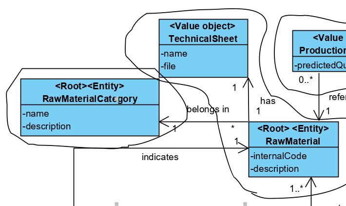

# Add Raw Material Category
=======================================

# 1. Requirements 

As a Production Manager

I want to add a raw material category to the catalogue

So that it can be used as an identification of the type of raw materials

This functionality has no dependencies from others.

Basically, there is a need to add raw material categories to the system, so that later when adding a raw material itself it can be related to a certain category.

**Client details:**

- The raw material category name/code is alphanumeric and has length less or equal to 10

# 2. Analysis

The domain model was changed. It was created a new aggregate where "RawMaterialCategory" is the aggregate root and this class also became an entity instead of an value object.

# 3. Design

## 3.1. Functionality realisation

## 3.2. Class diagram

## 3.3. Design patterns applied

**Pure Fabrication** - used in the creation of the class "AddRawMaterialCategoryUI", since no other rule can be applied to create it.

**Controller** - the class "AddRawMaterialCategoryController" controls the user case.

**Simple responsibility** - Every class has only one responsibility, the controller class only controls the user case, the class "RawMaterialCategory" is only responsible for operations related to Raw Material Categories, and the repository class is only responsible for communicating with the database, and bring information to memory.

**Low coupling and high cohesion** - most classes only depend on the controller and have no more dependencies, except the "RawMaterialCategoryRepository" that depends on its creator," "RepositoryFactory".

**Repository** - There is a class ("RawMaterialCategoryRepository") responsible for operations related to the database.

**Command:** In the presentation classes of this UC is used classes that implement actions and are responsible for executing the UI related to a certain menu option (AddRawMaterialCategoryAction executes AddRawMaterialCategoryUI).

**Factory:** In this case a simple constructor for the "RawMaterialCategory" was enough since it is a simple constructor and there aren't many variations for objects of that type. "RepositoryFactory" is responsible for creating all the repository classes.

## 3.4. Tests 
**Test 1:** Verifies that a raw material category instance can be created with a name and a description

	 @Test
	 public void ensureRawMaterialCategorytestWithNameDescription() {
	        new RawMaterialCategory("wood", "wood");
	        assertTrue(true);
	 }

**Test 2:** Verifies that a raw material category instance can't be created with a null name

	@Test(expected = IllegalArgumentException.class)
	public void ensureRawMaterialCategoryNameMustNotBeNull() {
	        new RawMaterialCategory(null, "wood");
	}

**Test 3:** Verifies that a raw material category instance can't be created with a empty name

	@Test(expected = IllegalArgumentException.class)
	public void ensureRawMaterialCategoryNameMustNotBeEmpty() {
	        new RawMaterialCategory("", "wood");
	}

**Test 4:** Verifies that a raw material category instance can't be created with a null description

	@Test(expected = IllegalArgumentException.class)
	 public void ensureRawMaterialCategoryDescriptionMustNotBeNull() {
	        new RawMaterialCategory("wood", null);
	 }

 **Test 5:** Verifies that a raw material category instance can't be created with a empty description

	@Test(expected = IllegalArgumentException.class)
	public void ensureRawMaterialCategoryDescriptionMustNotBeEmpty() {
	        new RawMaterialCategory("wood", "");
	}

**Test 6:** Verifies that a raw material category name can't have more than 10 characters

	 @Test(expected = IllegalArgumentException.class)
	    public void ensureRawMaterialCategoryNameCantHaveMore10Characters() {
	        new RawMaterialCategory("12345678901", "wood");
	 }

**Scenario 1:**

1. Run backoffice app

2. Login with poweruser or production_manager account(poweruser,poweruserA1|production_manager,Password1)

3. Select raw materials option

4. Select add raw material category option

5. Write as raw material category name "c1" and as description "organic"

6. Raw material category added

7. Select raw materials and then list raw material categories to see a new category added

   

**Scenario 2:**

1. Run backoffice app

2. Login with poweruser or production_manager(poweruser,poweruserA1|production_manager,Password1)

3. Select raw materials option

4. Select add raw material category option

5. Write as raw material category name "12345678901" and description "organic"

6. Verify that the name can not have more than 10 characters

7. Repeat steps 3 and 4.

8. Write as raw material category name "wood" and description "mineral"

9. Verify that categories can not have the same names

10. Repeat steps 3 and 4.

11. Write as raw material category name "c2" and description "mineral"

12. Raw material category added

13. Select raw materials and then list raw material categories to see a new category added

    

# 4. Implementation

## 4.1. Application   

    public class AddRawMaterialCategory {
    private final AuthorizationService authz = AuthzRegistry.authorizationService();
    private final RawMaterialCategoryRepository repository= PersistenceContext.repositories().rawMaterialCategory();
    
    /**
     * Controller do add a raw material category
     * @param name: name of the category
     * @param description: description of the category
     * @return 
     */
    public RawMaterialCategory registerRawMaterialCategory(String name,String description) {
        authz.ensureAuthenticatedUserHasAnyOf(BaseRoles.POWER_USER,BaseRoles.PRODUCTION_MANAGER);
        
        final RawMaterialCategory rawMaterialCategory=new RawMaterialCategory(name, description);
        return this.repository.save(rawMaterialCategory);
    }
    }
## 4.2. Domain

    @Entity
    public class RawMaterialCategory implements Serializable,AggregateRoot<String> {
    private static final long serialVersionUID = 1L;
    //ORM primary key
    @Id
    @GeneratedValue(strategy = GenerationType.AUTO)
    private Long id;
    @Version
    private Long version;
    
    //business id
    /**
     * Name of raw material category
     */
    @Column(unique = true, nullable = false)
    private String name;
    /**
     * Description of raw material description
    */
    private String description;
    
    protected RawMaterialCategory() {
        //ORM
    }
    
    /**
     * Constructor for a raw material category
     * 
     * @param name: name of the category
     * @param description: description of the category 
     */
    public RawMaterialCategory(final String name,final String description) {
        setName(name);
        setDescription(description);
    }
    }
## 4.3. Repository

    public interface RawMaterialCategoryRepository extends DomainRepository<String, RawMaterialCategory> {
    }

## 4.5. Commits

Commit 1:\#12: Add raw material category engineer process

Commit 2: #12: [2-1-2002\] - Add raw material category #comment User case implemented and tested, only missing UI

Commit 3:\#12: [2-1-2002] - Add raw material category #comment Corrected engineer process

Commit 4:\#12: [2-1-2002] - Add raw material category #comment corrected issues related to persistence 

Commit 5:#12: [2-1-2002] - Add raw material category #comment Corrected some mistakes and added UI

# 5. Integration/Demonstration

This functionality had to be integrated to work with persistence in memory and with JPA.

    public final class BaseRoles {
      /**
       * 
      */
     public static final Role PRODUCTION_MANAGER=Role.valueOf("PRODUCTION_MANAGER");
    }
    public interface RepositoryFactory {
     /**
     * repository will be created in auto transaction mode
     * 
     * @return 
     */
     RawMaterialCategoryRepository rawMaterialCategory();
     
    }
    
    package eapli.base.persistence.impl.inmemory;
    
    public class InMemoryRawMaterialCategoryRepository extends InMemoryDomainRepository<String, RawMaterialCategory> implements RawMaterialCategoryRepository{
        
        static{
            InMemoryInitializer.init();
        }
        
    }
    
    package eapli.base.persistence.impl.inmemory;
    
    public class InMemoryRepositoryFactory implements RepositoryFactory {
    
    	@Override
    	public RawMaterialCategoryRepository rawMaterialCategory() {
        	return new InMemoryRawMaterialCategoryRepository();
    	}
    }
    
    package eapli.base.persistence.impl.jpa;
    
    public class JpaRepositoryFactory implements RepositoryFactory {
    
    	@Override
    	public RawMaterialCategoryRepository rawMaterialCategory() {
        	return new JpaRawMaterialCategoryRepository();
    	}
    }
    
    package eapli.base.persistence.impl.jpa;
    
    public class JpaRawMaterialRepository extends BasepaRepositoryBase<RawMaterial,Designation,Designation> implements RawMaterialRepository {
        
    	public JpaRawMaterialRepository() {
        	super("internalCode");
    	}
    }

# 6. Observations

This functionality was implemented without any issues.

