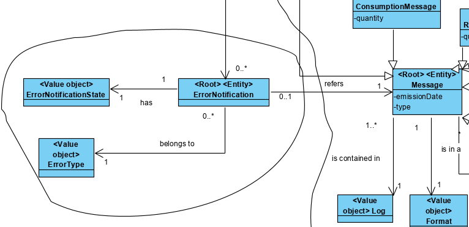

# Archive error notifications

=======================================

# 1. Requirements 

As a factory floor manager
I want to archive error notifications
So that they can be used later consult and transformation

# 2. Analysis

# 3. Design

## 3.1. Functionality realisation for creating error notifications

## 3.2. Functionality realisation for archiving error notifications

## 3.3. Class diagram for creating error notification

## 3.4. Class diagram for creating error notification

## 3.5. Design patterns applied

**Controller** - the class "ArchiveErrorNotificationController" controls the user case.

**Repository** - There is a class "ErrorNotificationRepository" responsible for operations with database

**Factory: ** There is a factory "ErrorNotificationFactory" responsible for creating ErrorNotifications

## 3.6. Tests

**Test 1:** Verifies that a error notification can be created

	@Test
	public void ensureErrorNotificationCanBeCreated() {
	        new ErrorNotification(MACHINE,DESCRIPTION, TYPE, MESSAGE_TYPE,LocalDateTime.now());
	}

**Test 2:** Verifies that a error notification can't be created without a description

	@Test(expected = IllegalArgumentException.class)
	 public void ensureErrorNotificationCantBeCreatedWithoutDescription() {
	        new ErrorNotification(MACHINE,null, TYPE, MESSAGE_TYPE,LocalDateTime.now());
	 }

**Test 3:** Verifies that a error notification can't be created without a type

	@Test(expected = IllegalArgumentException.class)
	public void ensureErrorNotificationCantBeCreatedWithoutType() {
	        new ErrorNotification(MACHINE,DESCRIPTION, null, MESSAGE_TYPE,LocalDateTime.now());
	}

**Test 4:** Verifies that a error notification can't be created without a message type

	@Test(expected = IllegalArgumentException.class)
	public void ensureErrorNotificationCantBeCreatedWithoutMessageType() {
	        new ErrorNotification(MACHINE,DESCRIPTION, TYPE, null,LocalDateTime.now());
	}

**Scenario 1:**

1. While importing messages from files and trying to save them or receiving messages from machines and saving them exceptions will be caught.
2. The information present in the exception will be use to create an error notification and save it

# 4. Implementation

## 4.1. Application

    public class ArchiveErrorNotificationController implements Controller {
        
    private ErrorNotificationRepository repository= PersistenceContext.repositories().errornotification();
    
    public Iterable<ErrorNotification> getUntreatedErrorNotifications() {
        return repository.getUntreatedErrorNotifications();   
    }
    
    public void archiveErrorNotification(ErrorNotification errorNotification) {
        errorNotification.archive();
        repository.save(errorNotification);
    }
    }

    public class CreateErrorNotificationController {
        
        private ErrorNotificationRepository repository= PersistenceContext.repositories().errornotification();
    
        public ErrorNotification createErrorNotification(String description, String type, String messageType) {
            ErrorNotification errorNotification = new ErrorNotificationFactory().createErrorNotification(Description.valueOf(description), 
                    new ErrorNotificationType(Description.valueOf(type)), Description.valueOf(messageType));
            return this.repository.save(errorNotification);
        }   
        
    }

    public class ErrorNotificationFactory {
    private MachineRepository repository = PersistenceContext.repositories().machine();
    
    public ErrorNotification createErrorNotification(Description description, ErrorNotificationType errorNotificationType, Description messageType) {
        Machine machine = repository.ofIdentity(new InternalCode(Arrays.asList(description.toString().split(";")).get(0))).orElseGet(null);
        return new ErrorNotification(machine,description, errorNotificationType, messageType, LocalDateTime.now());
    }
    }
## 4.2. Domain

    @Entity
    public class ErrorNotification implements Serializable, AggregateRoot<Long> {
    private static final long serialVersionUID = 1L;
    @Version
    private Long version;
    
    @Id
    @GeneratedValue(strategy = GenerationType.AUTO)
    private Long id;
    @ManyToOne
    @JoinColumn(nullable = true)
    private Machine machine;
    /**
     * State of error notification
     */
    private ErrorNotificationState errorNotificationState;
    /**
     * Description of error
     */
    @AttributeOverrides({
        @AttributeOverride(name = "theDescription", column = @Column(name = "description"))})
    private Description description;
    /**
     * Type of error
     */
    @AttributeOverrides({
        @AttributeOverride(name = "theDescription", column = @Column(name = "errorNotificationType"))})
    private ErrorNotificationType errorNotificationType;
    /**
     * Date time of the error
     */
    private LocalDateTime dateTime;
    /**
     * Message type
     */
    private Description messageType;
    
    protected ErrorNotification() {
        //ORM
    }
    
    /**
     * Constructor for an error notification
     *
     * @param description
     * @param type
     * @param messageType
     */
    public ErrorNotification(final Machine machine, final Description description, final ErrorNotificationType type, final Description messageType, final LocalDateTime dateTime) {
        Preconditions.noneNull(description, type, messageType);
        this.machine = machine;
        this.description = description;
        this.errorNotificationType = type;
        this.messageType = messageType;
        this.dateTime = dateTime;
        errorNotificationState = new ErrorNotificationState(StateEnum.UNTREATED);
    }
@Embeddable
public class ErrorNotificationState implements ValueObject {

    /**
     * State of error notification
     */
    @Enumerated(EnumType.STRING)
    private StateEnum stateError;

​    
    protected ErrorNotificationState() {
        //ORM
    }
    
    /**
     * Constructor
     * 
     * @param state 
     */
    public ErrorNotificationState(StateEnum state) {
        this.stateError = state;
    }

    @Embeddable
    public class ErrorNotificationType implements ValueObject {
    /**
     * Description of error notificatio type
     */
     @AttributeOverrides({
        @AttributeOverride(name = "theDescription", column = @Column(name = "typeDescription"))})
    private Description typeDescription;
    
    protected ErrorNotificationType() {
        //ORM
    }
    
    /**
     * Constructor for an error notification type
     * 
     * @param description 
     */
    public ErrorNotificationType(Description description) {
        Preconditions.noneNull(description);
        this.typeDescription = description;
    }
    
    /**
     * Verifies if two objects are equal
     * 
     * @param o
     * @return boolean that indicates if two objects are equal
     */
    @Override
    public boolean equals(final Object o) {
        if (this == o) {
            return true;
        }
        if (!(o instanceof ErrorNotificationType)) {
            return false;
        }
    
        final ErrorNotificationType that = (ErrorNotificationType) o;
        return this.typeDescription.equals(that.typeDescription);
    }
## 4.3. Presentation

    public class ArchiveErrorNotificationUI extends AbstractUI{
        private final ArchiveErrorNotificationController theController= new ArchiveErrorNotificationController();
        
    protected Controller controller() {
        return this.theController;
    }
    @Override
    protected boolean doShow() {
        final Iterable<ErrorNotification> errorNotifications = theController.getUntreatedErrorNotifications();
          final SelectWidget<ErrorNotification> selector = new SelectWidget<>("Error notifications: ", errorNotifications,
                new ErrorNotificationPrinter());
          selector.show();
          final ErrorNotification theErrorNotification=selector.selectedElement();
           if(theErrorNotification == null) return false;
           theController.archiveErrorNotification(theErrorNotification);
          return false;
    }
    
    @Override
    public String headline() {
        return "Archive error notification";
    }
    }

    public class ArchiveErrorNotificationAction implements Action {
    
        @Override
        public boolean execute() {
            return new ArchiveErrorNotificationUI().show();
        }
    
    }
    
    
    public class ErrorNotificationPrinter implements Visitor<ErrorNotification> {
    
        @Override
        public void visit(ErrorNotification visitee) {
            System.out.println(visitee.toString());
        }
        
    }

## 4.4. Repository

    public interface ErrorNotificationRepository extends DomainRepository<Long, ErrorNotification>{
        Iterable<ErrorNotification> findByTime();
        Iterable<ErrorNotification> findByMachine(Machine machine);
        public Iterable<ErrorNotification> getUntreatedErrorNotifications();
    }
    
    
    public class InMemoryErrorNotificationRepository extends InMemoryDomainRepository<Long, ErrorNotification> implements ErrorNotificationRepository {
    
    static {
        InMemoryInitializer.init();
    }
    
    public Iterable<ErrorNotification> findByType(ErrorNotificationType type) {
        return match(e -> e.hasNotificationType(type));
    }
    
    @Override
    public Iterable<ErrorNotification> findByTime() {
        return findAll();
    }
    
    @Override
    public Iterable<ErrorNotification> findByMachine(Machine machine) {
        return match(e -> e.hasMachine(machine));
    }
    
    @Override
    public Iterable<ErrorNotification> getUntreatedErrorNotifications() {
        return match(e->e.hasState(StateEnum.UNTREATED));
    }
    }
    
    
    public class JpaErrorNotificationRepository extends BasepaRepositoryBase<ErrorNotification,Long,Long> implements ErrorNotificationRepository {
        
        public JpaErrorNotificationRepository() {
            super("id");
        }
    
        public Iterable<ErrorNotification> findByTime(){
            final TypedQuery<ErrorNotification> query = entityManager().createQuery(
                    "Select e From ErrorNotification e where e.errorNotificationState.stateError = :state order by e.dateTime", ErrorNotification.class);
            query.setParameter("state", StateEnum.ARCHIVED);
            return query.getResultList();
        }
    
        public Iterable<ErrorNotification> findByMachine(Machine machine){
            final TypedQuery<ErrorNotification> query = entityManager().createQuery(
                    "Select e from ErrorNotification e where e.machine = :machine and e.errorNotificationState.stateError = :state",ErrorNotification.class);
            query.setParameter("state", StateEnum.ARCHIVED);
            query.setParameter("machine",machine);
            return query.getResultList();
        }
    
        @Override
        public Iterable<ErrorNotification> getUntreatedErrorNotifications() {
            final TypedQuery<ErrorNotification> query = entityManager().createQuery(
                    "Select e from ErrorNotification e where e.errorNotificationState.stateError = :state",ErrorNotification.class);
            query.setParameter("state", StateEnum.UNTREATED);
            return query.getResultList();
        }
    
    }
# 5. Integration/Demonstration

    public class TcpSrvMachine implements Runnable {
    
      private boolean createMessage(String message, CreateMessageService cms) {
            List<String> attributes;
            String[] attributeSplit = message.split(";");
            String format = attributeSplit[1];
            attributes = Arrays.asList(attributeSplit);
            try {
                cms.createMessage(format, attributes);
                return true;
            } catch (IllegalStateException ex) {
                new CreateErrorNotificationController().createErrorNotification(StringUtils.join(attributes, ';'), ex.getMessage(), attributes.get(1).trim());
            } catch (ArrayIndexOutOfBoundsException ex2) {
                System.out.println("Wrong format");
            } catch (NoResultException ex3) {
                new CreateErrorNotificationController().createErrorNotification(StringUtils.join(attributes, ';'), "Lot doesn't exist", attributes.get(1).trim());
            } catch (DateTimeParseException | IllegalArgumentException ex4) {
                new CreateErrorNotificationController().createErrorNotification(StringUtils.join(attributes, ';'), "Wrong date hour", attributes.get(1).trim());
            } catch (Exception ex5) {
                new CreateErrorNotificationController().createErrorNotification(StringUtils.join(attributes, ';'), "Wrong format", attributes.get(1).trim());
            }
            return false;
        }
    
    }
    
    public class ImportMessageService {
    private static final Logger logger = LogManager.getLogger(ImportMessageService.class);
    
    public void importFile(File file, MessagesImporter importer) throws IOException {
        final CreateMessageService createMessageService = new CreateMessageService();
        List<String> attributes;
        BufferedReader stream = null;
        try {
            stream = importer.begin(file);
            attributes = importer.element(stream);
            while (attributes != null) {
                try {
                    createMessageService.createMessage(attributes.get(1).trim(), attributes);
                } catch (IllegalStateException ex) {
                    new CreateErrorNotificationController().createErrorNotification(StringUtils.join(attributes, ';'), ex.getMessage(), attributes.get(1).trim());
                }catch(ArrayIndexOutOfBoundsException ex2) {
                    logger.error("Error importing a message");
                }catch(NoResultException ex3) {
                    new CreateErrorNotificationController().createErrorNotification(StringUtils.join(attributes, ';'), "Lot doesn't exist", attributes.get(1).trim());
                }catch(DateTimeParseException|IllegalArgumentException ex4) {
                    new CreateErrorNotificationController().createErrorNotification(StringUtils.join(attributes, ';'), "Wrong date hour", attributes.get(1).trim());
                }catch(Exception ex4) {
                    new CreateErrorNotificationController().createErrorNotification(StringUtils.join(attributes, ';'), "Wrong format", attributes.get(1).trim());
                }
                attributes = importer.element(stream);
            }
        } catch (IOException ex) {
            logger.error("Error importing messages", ex);
            throw ex;
        } finally {
            importer.end(stream);
        }
    }
}

# 6. Observations

This user case was implemented without any issues

