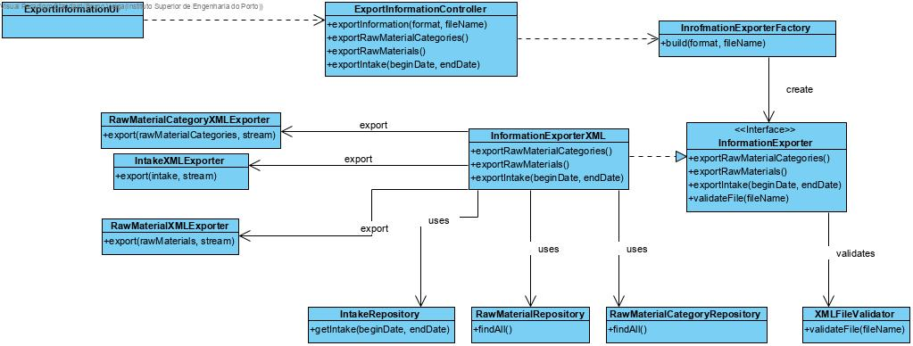

# Import Messages SCM
=======================================

# 1. Requirements 

As SCM 
I want to currently import existing messages in text files that are present in the input directory
So that they are available for processing

Acceptance criteria:
 - Java application using threads
 - After being imported the files should be moved to a new directory of processed files
 - Both directories should be defined by configuration

# 2. Analysis

# 3. Design

## 3.1. Functionality realisation

## 3.2. Class diagram

## 3.3. Design patterns applied

**Controller** - the class "ImportMessagesController" controls the user case.

**Strategy: ** A strategy is used for exporting diverse types of files. For now, there is only need to export to XML but by applying a strategy the application is open for more importing user cases but closed to changes.

**Repository** - There are repository classes to access raw materials, raw material categories and intake.

**Factory:** There is a factory "InformationExporterFactory" responsible for creating the right exporter class depending on the format to be exported

**Single responsibility: ** Every class has specific responsibilities. Each exporter class will only have the responsibility of exporting one of the domain classes they represent.

## 3.4. Tests 
## Scenario 1:

- After starting the backoffice application, choose the option export information to xml and select the option export all and enter the path
- The application will then proceed to export messages to the file, and finally validate the file with the XSD created

# 4. Implementation

## 4.1. Controller

    public class ExportInformationController implements Controller {
    private final AuthorizationService authz = AuthzRegistry.authorizationService();
    private final InformationExporterFactory factory = new InformationExporterFactory();
    private InformationExporter exporter;
    
    public void exportInformation(final String format, final String fileName) throws IOException {
        authz.ensureAuthenticatedUserHasAnyOf(BaseRoles.POWER_USER, BaseRoles.PRODUCTION_MANAGER);
        exporter = factory.build(format);
        exporter.defineFilePrinter("./xml/"+fileName);
    }
    
    public void exportRawMaterialCategories() {
        exporter.exportRawMaterialCategories();
    }
    
    public void exportRawMaterials() {
        exporter.exportRawMaterials();
    }
    
    public void exportIntake() {
        exporter.exportIntake();
    }
    
    public void exportEndFile() {
        exporter.exportEndFile();
    
    }
    
    public boolean validateFile(String fileName) {
        return new XMLFileValidator().validateFile("./xml/"+fileName);
    }
## 4.2. Raw Material Categories

public class RawMaterialCategoryXMLExporter {
    public void export(final Iterable<RawMaterialCategory> rawMaterials, final PrintWriter stream) {
        stream.println("<RawMaterialCategories>");
        for(RawMaterialCategory rmc: rawMaterials) {
            stream.printf("<RawMaterialCategory name=\"%s\">%n",rmc.identity());
            stream.printf("<description>%s</description>%n",rmc.description());
            stream.printf("</RawMaterialCategory>%n");
        }
        stream.println("</RawMaterialCategories>");
    }
}

## 4.3. Raw Materials

public class RawMaterialXMLExporter {
    public void export(final Iterable<RawMaterial> rawMaterials, final PrintWriter stream) {
        stream.println("<RawMaterials>");
        for(RawMaterial rm: rawMaterials) {
            stream.printf("<RawMaterial internalCode=\"%s\" nameRawMaterialCategory=\"%s\">%n",rm.internalCode(),rm.category());
            stream.printf("<description>%s</description>%n",rm.description());
            stream.println("<TechnicalSheet");
            stream.printf("<nameTechnicalSheet>%s</nameTechnicalSheet>%n", rm.technicalSheet());
            stream.println("</TechnicalSheet");
            stream.printf("</RawMaterial>%n");
        }
        stream.println("</RawMaterials>");
    }
} 

## 4.4. Effective and real consumptions

    public class IntakeXMLExporter {
    public void export(final Iterable<ProductionResult> productionResults, final PrintWriter stream) {
        List<StockMovement> stockMovements = new ArrayList<>();
        Map<Designation, Integer> totalConsumptionsDeposit = new HashMap<>();
        Map<Designation, Integer> totalConsumptionsRawMaterial = new HashMap<>();
        Map<Designation, Integer> totalConsumptionsProduct = new HashMap<>();
        stream.println("<Consumptions>");
        stream.println("<EffectiveConsumptions>");
        Deposit deposit;
        Product product;
        RawMaterial rawMaterial;
        for (ProductionResult pr : productionResults) {
            for (StockMovement sm : pr.consumptions()) {
                deposit = sm.deposit();
                rawMaterial = sm.rawMaterial();
                product = sm.product();
                stockMovements.add(sm);
                stream.printf("<Consumption machine=\"%s\" ", sm.machine().identity());
                if (deposit != null) {
                    stream.printf("deposit=\"%s\" ", deposit.identity());
                }
                if (product != null) {
                    stream.printf("product=\"%s\">%n", product.identity());
                }
                if (rawMaterial != null) {
                    stream.printf("rawMaterial=\"%s\">%n", rawMaterial.identity());
                }
                stream.printf("<quantity>%d</quantity>%n", sm.getQuantaty());
                stream.printf("</Consumption>%n");
            }
        }
        stream.println("</EffectiveConsumptions>");
        getTotalConsumptions(stockMovements, totalConsumptionsDeposit, totalConsumptionsRawMaterial, totalConsumptionsProduct);
        stream.println("<RealConsumptions>");
        for (Designation d : totalConsumptionsDeposit.keySet()) {
            stream.printf("<Deposit id=\"%s\">%n", d);
            stream.printf("<quantity>%d</quantity>%n", totalConsumptionsDeposit.get(d));
            stream.printf("</Deposit>%n");
        }
        for (Designation d : totalConsumptionsRawMaterial.keySet()) {
            stream.printf("<RawMaterial id=\"%s\">%n", d);
            stream.printf("<quantity>%d</quantity>%n",totalConsumptionsRawMaterial.get(d));
            stream.printf("</RawMaterial>%n");
        }
        for(Designation d: totalConsumptionsProduct.keySet()) {
            stream.printf("<Product id=\"%s\">%n", d);
            stream.printf("<quantity>%d</quantity>", totalConsumptionsProduct.get(d));
            stream.printf("</Product>");
        }
        stream.println("</RealConsumptions>");
        stream.println("</Consumptions>");
    }
    
    private void getTotalConsumptions(List<StockMovement> stockMovement, Map<Designation, Integer> totalConsumptionsDeposit,
             Map<Designation, Integer> totalConsumptionsRawMaterial, Map<Designation, Integer> totalConsumptionsProduct) {
        Deposit deposit;
        Product product;
        RawMaterial rawMaterial;
        for (StockMovement sm : stockMovement) {
            deposit = sm.deposit();
            if (deposit != null) {
                if (totalConsumptionsDeposit.containsKey(deposit.identity())) {
                    totalConsumptionsDeposit.put(deposit.identity(), totalConsumptionsDeposit.get(deposit.identity()) + sm.getQuantaty());
                } else {
                    totalConsumptionsDeposit.put(deposit.identity(), sm.getQuantaty());
                }
            }
            product = sm.product();
            if (product != null) {
                if (totalConsumptionsProduct.containsKey(product.identity())) {
                    totalConsumptionsProduct.put(product.identity(), totalConsumptionsProduct.get(product.identity()) + sm.getQuantaty());
                } else {
                    totalConsumptionsProduct.put(product.identity(), sm.getQuantaty());
                }
            }
            rawMaterial = sm.rawMaterial();
            if (rawMaterial != null) {
                if (totalConsumptionsRawMaterial.containsKey(rawMaterial.identity())) {
                    totalConsumptionsRawMaterial.put(rawMaterial.identity(), totalConsumptionsRawMaterial.get(rawMaterial.identity()) + sm.getQuantaty());
                } else {
                    totalConsumptionsRawMaterial.put(rawMaterial.identity(), sm.getQuantaty());
                }
            }
        }
    
    }
## 4.5. Presentation

    public class ExportInformationtUI extends AbstractUI {
    private static final String YES = "Yes";
    private static final String NO = "No";
    private static final String RETURN = "Return";
    
    private final ExportInformationController theController = new ExportInformationController();
    
    protected Controller controller() {
        return this.theController;
    }
    
    @Override
    protected boolean doShow() {
        final List<String> options = new ArrayList<>();
        options.add(YES);
        options.add(NO);
        final SelectWidget<String> selector = new SelectWidget<>("Options:", options,
                new OptionsPrinter());
        String fileName = Console.readLine("File name: ");
        String format = findFormat(fileName); //Format is entered automatically
        try {
            theController.exportInformation(format, fileName);
        } catch (IOException ex) {
            System.out.println("Wrong fileName");
            return false;
        } catch (Exception e) {
            System.out.println("Wrong format");
            return false;
        }
        System.out.println("Do you wish to export all information");
        selector.show();
        String answer = selector.selectedElement();
        if (answer == null) {
            return false;
        }
        if (answeredYes(answer)) {
            exportAll();
        } else {
            int choice;
            final List<String> options2 = new ArrayList<>();
            options2.add("Raw Material Categories");
            options2.add("Raw Materials");
            options2.add("Products");
            options2.add("Deposits");
            options2.add("Machines");
            options2.add("Production sheets");
            options2.add("Lots");
            options2.add("Production orders");
            options2.add("Production lines");
            options2.add("Effective and real consumption");
            boolean[] flags = new boolean[10];
            final SelectWidget<String> selector2 = new SelectWidget<>("Options:", options2,
                    new OptionsPrinter());
            do {
                selector2.show();
                choice = selector2.selectedOption();
                switch (choice) {
                    case 1:
                        if (flags[0]) {
                            System.out.println("Raw Material Categories have already been exported.");
                            break;
                        }
                        theController.exportRawMaterialCategories();
                        flags[0] = true;
                        System.out.println("Raw Material categories exported.\n");
                        break;
                    case 2:
                        if (flags[1]) {
                            System.out.println("Raw Materials have already been exported.");
                            break;
                        } else if (!flags[0]) {
                            System.out.println("Raw Material categories must be exported first.\n");
                            break;
                        }
                        theController.exportRawMaterials();
                        flags[1] = true;
                        System.out.println("Raw Materials exported.\n");
                        break;
                    case 3:
                        if (flags[2]) {
                            System.out.println("Products have already been exported.");
                            break;
                        }
                        theController.exportProducts();
                        //flags[2]=true;            Uncomment when finished
                        System.out.println("Products exported.\n");
                        break;
                    case 4:
                        if (flags[3]) {
                            System.out.println("Deposits have already been exported.");
                            break;
                        } else if (!flags[1] || !flags[2]) {
                            System.out.println("Raw Materials and Products must be exported first.\n");
                            break;
                        }
                        theController.exportDeposits();
                        flags[3] = true;
                        System.out.println("Deposits exported.\n");
                        break;
                    case 5:
                        if (flags[4]) {
                            System.out.println("Machines have already been exported.");
                            break;
                        }
                        theController.exportMachines();
                        //flags[4]=true;            Uncomment when finished
                        System.out.println("Machines exported.\n");
                        break;
                    case 6:
                        if (flags[5]) {
                            System.out.println("Production sheets have already been exported.");
                            break;
                        } else if (!flags[1] || !flags[2]) {
                            System.out.println("Raw Materials and Products must be exported first.\n");
                            break;
                        }
                        theController.exportProductionSheets();
                        //flags[5]=true;            Uncomment when finished
                        System.out.println("Production sheets exported.\n");
                        break;
                    case 7:
                        if (flags[6]) {
                            System.out.println("Lots have already been exported.");
                            break;
                        }
                        theController.exportLots();
                        flags[6] = true;
                        System.out.println("Lots exported.\n");
                        break;
                    case 8:
                        if (flags[7]) {
                            System.out.println("Production orders have already been exported.");
                            break;
                        } else if (!flags[6] || !flags[5]) {
                            System.out.println("Lots and Production sheets must be exported first.\n");
                            break;
                        }
                        theController.exportProductionOrders();
                        flags[7] = true;
                        System.out.println("Production orders exported.\n");
                        break;
                    case 9:
                        if (flags[8]) {
                            System.out.println("Production lines have already been exported.");
                            break;
                        } else if (!flags[4]) {
                            System.out.println("Machines must be exported first.\n");
                            break;
                        }
                        theController.exportProductionLines();
                        flags[8] = true;
                        System.out.println("Production lines exported.\n");
                        break;
                    case 10:
                        if (flags[9]) {
                            System.out.println("Consumptions have already been exported.");
                            break;
                        }else if(!flags[1] || !flags[2] || flags[3] || flags[5]) {
                            System.out.println("Raw materials, products, machines and deposits must be exported first.\n");
                        }
                        theController.exportIntake();
                        break;
                    default:
                        break;
                }
            } while (choice != 0);
        }
        theController.exportEndFile();
        if (theController.validateFile(fileName)) {
            System.out.println("Valid file");
        } else {
            System.out.println("Invalid file");
        }
        return false;
    }
    
    private boolean answeredYes(String answer) {
        return answer.equals(YES);
    }
    
    private void exportAll() {
        theController.exportRawMaterialCategories();
        theController.exportRawMaterials();
        theController.exportProducts();
        theController.exportDeposits();
        theController.exportMachines();
        theController.exportProductionSheets();
        theController.exportProductionOrders();
        theController.exportLots();
        theController.exportProductionLines();
        theController.exportIntake();
    }
    
    @Override
    public String headline() {
        return "Export Information";
    }
    
    private String findFormat(String filename) {
        for (int i = filename.length() - 1; i > 0; i--) {
            if (filename.charAt(i) == '.') {
                return filename.substring(i);
            }
        }
        return null;
    }

# 5. Integration/Demonstration

    public interface InformationExporter {
    void exportRawMaterialCategories();
    
    void exportRawMaterials();
    
    void exportProducts();
    
    void exportDeposits();
    
    void exportMachines();
    
    void exportProductionSheets();
    
    void exportProductionOrders();
    
    void exportLots();
    
    void exportProductionLines();
    
    void exportIntake();
    
    void defineFilePrinter(String fileName) throws IOException;
    
    void exportEndFile();
    }

    public class InformationExporterFactory {
    private static final AppSettings SETTINGS = Application.settings();
    
    public InformationExporter build(String format) {
        String formatTemp=format.substring(format.length()-3).toLowerCase();
        InformationExporter exporter=null;
        try {
            exporter = (InformationExporter) Class.forName(SETTINGS.getProperty(formatTemp)).newInstance();
        } catch (ClassNotFoundException | InstantiationException | IllegalAccessException | NullPointerException ex) {
            Logger.getLogger(ImportMessagesFactory.class.getName()).log(Level.SEVERE, null, ex);
        }
        return exporter;
    }
    }
# 6. Observations

