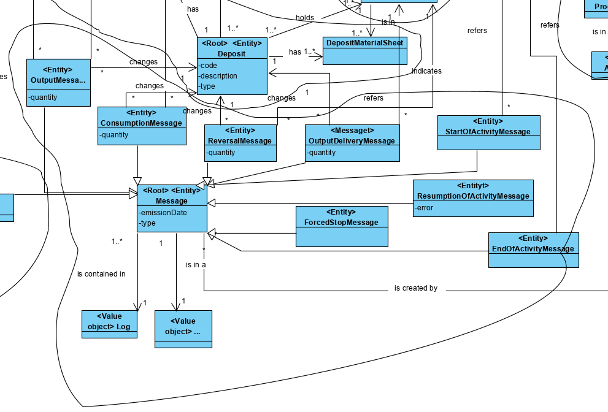
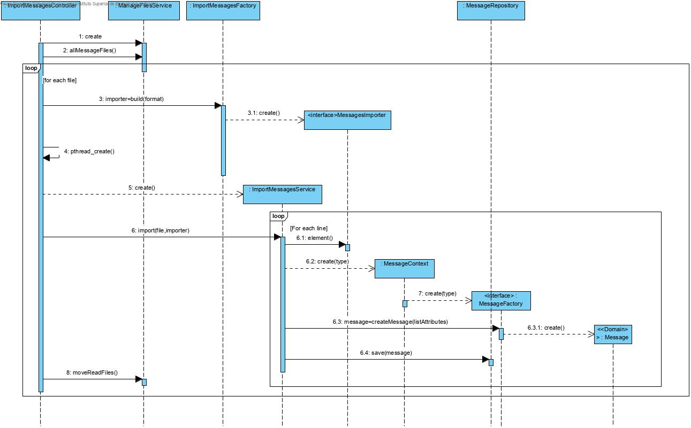
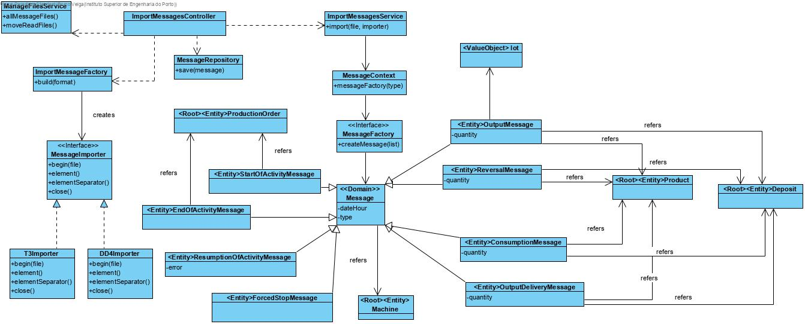

# Import Messages SCM
=======================================

# 1. Requirements 

As SCM 
I want to currently import existing messages in text files that are present in the input directory
So that they are available for processing

Acceptance criteria:
 - Java application using threads
 - After being imported the files should be moved to a new directory of processed files
 - Both directories should be defined by configuration

# 2. Analysis

# 3. Design

## 3.1. Functionality realisation

## 3.2. Class diagram

## 3.3. Design patterns applied

**Controller** - the class "ImportMessagesController" controls the user case.

**Strategy: ** A strategy is used for importing diverse types of files

**Repository** - There is a class ("MessageRepository") responsible for operations related to the database.

**Factory:** There is an abstract factory "Message factory" that will be implemented by other simple factorys, one for each type of message. To make the Class diagram legible they were not represented.

## 3.4. Tests 
**Test 1:** Verifies that a start of activity message can be created

	 @Test
	 public void ensureStartOfActivityMessageCanBeCreated() {
	        new StartOfActivityMessage(MACHINE,TYPE_OF_MESSAGE,DATAHOUR,PRODUCTION_ORDER);
	        assertTrue(true);
	 }

**Test 2:** Verifies that a end of activity message can be created

	@Test
	public void ensureEndOfActivityMessageCanBeCreated() {
	        new EndOfActivityMessage(MACHINE,TYPE_OF_MESSAGE,DATAHOUR,PRODUCTION_ORDER);
	        assert(true);
	}

**Test 3:** Verifies that a Resumption of activity message can be created

	@Test
	public void ensureResumptionOfActivityMessageCanBeCreated() {
	        new ResumptionOfActivityMessage(MACHINE,TYPE_OF_MESSAGE,DATAHOUR,ERROR);
	        assert(true);
	}

**Test 4:** Verifies that a force stoppage message can be created

	@Test
	 public void ensureForceStoppageMessageCanBeCreated() {
	        new ForcedStoppageMessage(MACHINE,TYPE_OF_MESSAGE,DATAHOUR);
	        assert(true);
	 }

 **Test 5:** Verifies that a consumption message can be created with a product

	    @Test
	    public void ensureComsumptionMessageCanBeCreatedWithProduct() {
	        new ConsumptionMessage(MACHINE, TYPE_OF_MESSAGE, DATEHOUR, PRODUCT, QUANTITY, DEPOSIT);
	        assert (true);
	    }

**Test 6:** Verifies that a consumption message can be created with a raw material

	@Test
	    public void ensureComsumptionMessageCanBeCreatedWithRawMaterial() {
	        new ConsumptionMessage(MACHINE, TYPE_OF_MESSAGE, DATEHOUR, RAW_MATERIAL, QUANTITY, DEPOSIT);
	        assert (true);
	    }

**Test 7:** Verifies that a Reversal message can  be created with product

	 @Test
	    public void ensureReversalMessageCanBeCreated() {
	        new ReversalMessage(MACHINE,TYPE_OF_MESSAGE,DATAHOUR,PRODUCT,QUANTITY,DEPOSIT);
	        assert(true);
	 }

**Test 8:** Verifies that a Reversal message can  be created with raw material

	@Test
	public void ensureReversalMessageCanBeCreatedWithRawMaterial() {
	        new ReversalMessage(MACHINE, TYPE_OF_MESSAGE, DATEHOUR, RAW_MATERIAL, QUANTITY, DEPOSIT);
	        assert (true);
	 }

**Test 7:** Verifies that a Output Delivery message can  be created

	 @Test
	 public void ensureOutputDeliveryMessageCanBeCreated() {
	        new OutputDeliveryMessage(MACHINE,TYPE_OF_MESSAGE,DATAHOUR,PRODUCT,QUANTITY,DEPOSIT);
	        assert(true);
	 }

**Test 9: ** Verifies that a Output message can  be created

	 @Test
	    public void ensureOutputMessageCanBeCreated() {
	        new OutputMessage(MACHINE,TYPE_OF_MESSAGE,DATAHOUR,PRODUCT,QUANTITY,LOT);
	        assert(true);
	 }

**Test 10:** Verifies that a message can't be created with a null machine

	 @Test(expected = IllegalArgumentException.class)
	 public void ensureMessageMustHaveMachine() {
	        new StartOfActivityMessage(NULL,TYPE_OF_MESSAGE,DATAHOUR,PRODUCTION_ORDER);
	 }

**Test 11:** Verifies that a message can't be created with a null type of message

	 @Test(expected = IllegalArgumentException.class)
	 public void ensureMessageMustHaveType() {
	        new StartOfActivityMessage(MACHINE,NULL,DATAHOUR,PRODUCTION_ORDER);
	 }

**Test 12:** Verifies that a  message can't be created with a null date hour

	 @Test(expected = IllegalArgumentException.class)
	 public void ensureMessageMustHaveDateHour() {
	        new StartOfActivityMessage(MACHINE,TYPE_OF_MESSAGE,NULL,PRODUCTION_ORDER);
	 }

**Test 13:** Verifies that a Resumption of activity message can't be created with a null error

	 @Test(expected = IllegalArgumentException.class)
	public void ensureResumptionOfActivityMessageMustHaveError() {
	        new ResumptionOfActivityMessage(MACHINE,TYPE_OF_MESSAGE,DATAHOUR,null);
	}

**Test 14:** Verifies that a consumption message can't be created without a product

	 @Test(expected = IllegalArgumentException.class)
	public void ensureComsumptionMessageMustHaveProduct() {
	        new ComsumptionMessage(MACHINE,TYPE_OF_MESSAGE,DATAHOUR,null,QUANTITY,DEPOSIT);
	}

**Test 15:** Verifies that a consumption message can't be created without a raw material

	 @Test(expected = IllegalArgumentException.class)
	public void ensureComsumptionMessageMustHaveProduct() {
	        new ComsumptionMessage(MACHINE,TYPE_OF_MESSAGE,DATAHOUR,null,QUANTITY,DEPOSIT);
	}

**Test 16:** Verifies that a consumption message can't be created with a negative quantity for the product constructor

	 @Test(expected = IllegalArgumentException.class)
	public void ensureComsumptionMessageMustHaveQuantity() {
	        new ComsumptionMessage(MACHINE,TYPE_OF_MESSAGE,DATAHOUR,PRODUCT,null,DEPOSIT);
	}

**Test 17:** Verifies that a consumption message can't be created with a negative quantity for the raw material constructor

	 @Test(expected = IllegalArgumentException.class)
	public void ensureComsumptionMessageMustHaveQuantity() {
	        new ComsumptionMessage(MACHINE,TYPE_OF_MESSAGE,DATAHOUR,PRODUCT,null,DEPOSIT);
	}

**Test 18:** Verifies that a reversal message can't be created without a product

	 @Test(expected = IllegalArgumentException.class)
	public void ensureReversalMessageMustHaveProduct() {
	        new ReversalMessage(MACHINE,TYPE_OF_MESSAGE,DATAHOUR,null,QUANTITY,DEPOSIT);
	}

**Test 19:** Verifies that a reversal message can't be created without a raw material

	 @Test(expected = IllegalArgumentException.class)
	public void ensureReversalMessageMustHaveProduct() {
	        new ReversalMessage(MACHINE,TYPE_OF_MESSAGE,DATAHOUR,null,QUANTITY,DEPOSIT);
	}

**Test 20:** Verifies that a reversal message can't be created with a negative quantity for 

	 @Test(expected = IllegalArgumentException.class)
	    public void ensureReversalMessageMustHaveQuantityForProduct() {
	        new ReversalMessage(MACHINE, TYPE_OF_MESSAGE, DATEHOUR, PRODUCT, -1, DEPOSIT);
	    }

**Test 21:** Verifies that a reversal message can't be created with a negative quantity for product raw material

	 @Test(expected = IllegalArgumentException.class)
	    public void ensureReversalMessageMustHaveDepositForRawMaterial() {
	        new ReversalMessage(MACHINE, TYPE_OF_MESSAGE, DATEHOUR, RAW_MATERIAL, QUANTITY, null);
	    }

**Test 22:** Verifies that a reversal message can't be created without deposit for raw material constructor

	 @Test(expected = IllegalArgumentException.class)
	public void ensureReversalMessageMustHaveDeposit() {
	        new ReversalMessage(MACHINE,TYPE_OF_MESSAGE,DATAHOUR,PRODUCT,QUANTITY,null);
	}

**Test 23:** Verifies that a reversal message can't be created without deposit for product constructor

	 @Test(expected = IllegalArgumentException.class)
	public void ensureReversalMessageMustHaveDeposit() {
	        new ReversalMessage(MACHINE,TYPE_OF_MESSAGE,DATAHOUR,PRODUCT,QUANTITY,null);
	}

**Test 24:** Verifies that a Output Delivery Message can't be created without a product

	 @Test(expected = IllegalArgumentException.class)
	public void ensureOutputDeliveryMessageMustHaveProduct() {
	        new OutputDeliveryMessage(MACHINE,TYPE_OF_MESSAGE,DATAHOUR,null,QUANTITY,DEPOSIT);
	}

**Test 25:** Verifies that a Output Delivery Message can't be created with a negative quantity

	 @Test(expected = IllegalArgumentException.class)
	public void ensureOutputMessageMustHaveQuantity() {
	        new OutputDeliveryMessage(MACHINE,TYPE_OF_MESSAGE,DATAHOUR,PRODUCT,-1,DEPOSIT);
	}

**Test 26:** Verifies that a Output Delivery Message can't be created without deposit

	 @Test(expected = IllegalArgumentException.class)
	public void ensureOutputMessageMustHaveDeposit() {
	        new OutputDeliveryMessage(MACHINE,TYPE_OF_MESSAGE,DATAHOUR,PRODUCT,QUANTITY,null);
	}

**Test 27:** Verifies that a Output Message can't be created without a product

	 @Test(expected = IllegalArgumentException.class)
	public void ensureOutputMessageMustHaveProduct() {
	        new OutputMessage(MACHINE,TYPE_OF_MESSAGE,DATAHOUR,null,QUANTITY,LOT);
	}

**Test 28:** Verifies that a Output Message can't be created with a negative quantity

	 @Test(expected = IllegalArgumentException.class)
	public void ensureOutputMessageMustHaveQuantity() {
	        new OutputMessage(MACHINE,TYPE_OF_MESSAGE,DATAHOUR,PRODUCT,-1,LOT);
	}

## Scenario 1:

The app reads all the files from the right directory creating the messages and saving them in the database, after that moves all the files to a processed files directory.

# 4. Implementation

## 4.1. Application

    public class CSVImporter implements MessagesImporter {
    @Override
    public BufferedReader begin(File file) throws IOException {
        return new BufferedReader(new FileReader(file));
    }
    
    @Override
    public List<String> element(BufferedReader stream) throws IOException {
        String line = stream.readLine();
        return line!=null ? Arrays.asList(line.split(";")):null;
    }
    
    @Override
    public void end(BufferedReader stream) throws IOException {
        stream.close();
    }
    }

    public class CreateMessageService {
    public void createMessage(String format, List<String> attributes) {
        final MessageRepository repository = PersistenceContext.repositories().messages();
        final MessageFactory messageFactory = MessageContext.messageFactory(format);
        Message message = messageFactory.createMessage(attributes);
        repository.save(message);
    }
    }

    public class ImportMessageService {
    private static final Logger logger = LogManager.getLogger(ImportMessageService.class);
    
    public void importFile(File file, MessagesImporter importer) throws IOException {
        final CreateMessageService createMessageService = new CreateMessageService();
        List<String> attributes;
        BufferedReader stream = null;
        try {
            stream = importer.begin(file);
            attributes = importer.element(stream);
            while (attributes != null) {
                try {
                    createMessageService.createMessage(attributes.get(1).trim(), attributes);
                } catch (IllegalStateException ex) {
                    new CreateErrorNotificationController().createErrorNotification(StringUtils.join(attributes, ';'), ex.getMessage(), attributes.get(1).trim());
                }catch(ArrayIndexOutOfBoundsException ex2) {
                    logger.error("Error importing a message");
                }catch(NoResultException ex3) {
                    new CreateErrorNotificationController().createErrorNotification(StringUtils.join(attributes, ';'), "Lot doesn't exist", attributes.get(1).trim());
                }catch(DateTimeParseException|IllegalArgumentException ex4) {
                    new CreateErrorNotificationController().createErrorNotification(StringUtils.join(attributes, ';'), "Wrong date hour", attributes.get(1).trim());
                }catch(Exception ex4) {
                    new CreateErrorNotificationController().createErrorNotification(StringUtils.join(attributes, ';'), "Wrong format", attributes.get(1).trim());
                }
                attributes = importer.element(stream);
            }
        } catch (IOException ex) {
            logger.error("Error importing messages", ex);
            throw ex;
        } finally {
            importer.end(stream);
        }
    }
    }

    public class ImportMessagesController {
    private final ManageFilesService manageFilesService = new ManageFilesService();
    
    public void importMessages() throws IOException, InterruptedException {
        List<File> fileList = manageFilesService.allMessageFiles();
        List<Thread> listThreads = new ArrayList<>();
        for (File f : fileList) {
            final ImportMessageService importMessageService = new ImportMessageService();
            final MessagesImporter messageImporter = ImportMessagesFactory.build(FilenameUtils.getExtension(f.getName()));
            Thread t = createThread(importMessageService, f, messageImporter);
            t.start();
            listThreads.add(t);
        }
        waitThreads(fileList, fileList.size(), listThreads);
        
    }
    
    private Thread createThread(ImportMessageService importMessageService, File f, MessagesImporter messageImporter) {
        Thread t = new Thread() {
            @Override
            public void run() {
                try {
                    importMessageService.importFile(f, messageImporter);
                } catch (IOException ex) {
                    Logger.getLogger(ImportMessagesController.class.getName()).log(Level.SEVERE, null, ex);
                }
            }
        };
        return t;
    }
    
    private void waitThreads(List<File>fileList,int n,List<Thread> listThreads) throws IOException, InterruptedException {
        for(int i=0;i<n;i++) {
            listThreads.get(i).join();
        }
        manageFilesService.moveReadFiles(fileList);
    }

    public class ManageFilesService {
    public List<File> allMessageFiles() {
        List<File> fileNames = new ArrayList<>();
        final File folder = new File(Application.settings().getMessageEntryFolder());
        for (final File fileEntry : folder.listFiles()) {
            fileNames.add(fileEntry);
        }
        return fileNames;
    }
    
    public void moveReadFiles(List<File> files) throws IOException {
        for (File f : files) {
            final String processedFolder = String.format("%s%s",Application.settings().getMessageOutFolder(),f.getName());
            Files.move(Paths.get(f.getAbsolutePath()), Paths.get(processedFolder));
    
        }
    }
    }

    public class MessageContext {
    private static final AppSettings SETTINGS = Application.settings();
    
    public static MessageFactory messageFactory(String format) {
        MessageFactory importer=null;
        try {
            importer = (MessageFactory) Class.forName(SETTINGS.getProperty(format)).newInstance();
        } catch (ClassNotFoundException | InstantiationException | IllegalAccessException ex) {
            Logger.getLogger(ImportMessagesFactory.class.getName()).log(Level.SEVERE, null, ex);
        }
        return importer;
    }

    public interface MessageFactory {
        Message createMessage(List<String> attributes);
    }
    
    public interface MessagesImporter {
    BufferedReader begin(File file) throws IOException;
    
    List<String> element(BufferedReader stream) throws IOException;
    
    void end(BufferedReader stream) throws IOException;
    }

    public class ConsumptionMessageFactory implements MessageFactory {
    @Override
    public Message createMessage(List<String> attributes) {
        final MachineRepository repositoryMachine = PersistenceContext.repositories().machine();
        final ProductRepository productRepository = PersistenceContext.repositories().products();
        final DepositRepository depositRepository = PersistenceContext.repositories().deposit();
        final RawMaterialRepository rawMaterialRepository = PersistenceContext.repositories().rawMaterial();
    
        final Machine machine = repositoryMachine.ofIdentity(new InternalCode(attributes.get(0).trim())).orElseThrow(() -> new IllegalStateException("Machine doesn't exist"));
        final Description type = Description.valueOf(attributes.get(1).trim());
        final DateTimeFormatter formatter = DateTimeFormatter.ofPattern("yyyyMMddHHmmss");
        final LocalDateTime dateHour = LocalDateTime.parse(attributes.get(2).trim(), formatter);
        final Integer quantity = Integer.parseInt(attributes.get(4).trim());
        Deposit deposit = null;
        if (attributes.size()== 6) {
            deposit = depositRepository.ofIdentity(Designation.valueOf(attributes.get(5).trim())).orElseThrow(() -> new IllegalStateException("Deposit doesn't exist"));
        }
        if (rawMaterialRepository.ofIdentity(Designation.valueOf(attributes.get(3).trim())).isPresent()) {
            final RawMaterial rawMaterial = rawMaterialRepository.ofIdentity(Designation.valueOf(attributes.get(3).trim())).get();
            return new ConsumptionMessage(machine, type, dateHour, rawMaterial, quantity, deposit);
        } else {
            final Product product = productRepository.ofIdentity(Designation.valueOf(attributes.get(3).trim())).orElseThrow(() -> new IllegalStateException("Product or raw material don't exist"));
            return new ConsumptionMessage(machine, type, dateHour, product, quantity, deposit);
        }
    }
    }

    public class EndOfActivityMessageFactory implements MessageFactory {
    @Override
    public Message createMessage(List<String> attributes) {
        final MachineRepository repositoryMachine = PersistenceContext.repositories().machine();
    
        final ProductionOrderRepository repositoryProductionOrder = PersistenceContext.repositories().productionOrder();
        final Machine machine = repositoryMachine.ofIdentity(new InternalCode(attributes.get(0).trim())).orElseThrow(() -> new IllegalStateException("Machine doesn't exist"));
        final Description type = Description.valueOf(attributes.get(1).trim());
        final DateTimeFormatter formatter = DateTimeFormatter.ofPattern("yyyyMMddHHmmss");
        final LocalDateTime dateHour = LocalDateTime.parse(attributes.get(2).trim(), formatter);
        ProductionOrder productionOrder=null;
        if (attributes.size() ==4) {
            productionOrder = repositoryProductionOrder.ofIdentity(Designation.valueOf(attributes.get(3).trim())).orElseThrow(() -> new IllegalStateException("Production order doesn't exist"));
        }
        return new EndOfActivityMessage(machine, type, dateHour, productionOrder);
    }
    }

    public class ForcedStopMessageFactory implements MessageFactory {
    @Override
    public Message createMessage(List<String> attributes) {
        final MachineRepository repositoryMachine = PersistenceContext.repositories().machine();
        
        final Machine machine = repositoryMachine.ofIdentity(new InternalCode(attributes.get(0).trim())).orElseThrow(() -> new IllegalStateException("Machine doesn't exist"));
        final Description type = Description.valueOf(attributes.get(1).trim());
        final DateTimeFormatter formatter = DateTimeFormatter.ofPattern("yyyyMMddHHmmss");
        final LocalDateTime dateHour = LocalDateTime.parse(attributes.get(2).trim(), formatter);
        return new ForcedStopMessage(machine, type, dateHour);
    }
    }

    public class OutputDeliveryMessageFactory implements MessageFactory {
    @Override
    public Message createMessage(List<String> attributes) {
        final MachineRepository repositoryMachine = PersistenceContext.repositories().machine();
        final ProductRepository productRepository = PersistenceContext.repositories().products();
        final DepositRepository depositRepository = PersistenceContext.repositories().deposit();
        
        final Machine machine = repositoryMachine.ofIdentity(new InternalCode(attributes.get(0).trim())).orElseThrow(() -> new IllegalStateException("Machine doesn't exist"));
        final Description type = Description.valueOf(attributes.get(1).trim());
        final DateTimeFormatter formatter = DateTimeFormatter.ofPattern("yyyyMMddHHmmss");
        final LocalDateTime dateHour = LocalDateTime.parse(attributes.get(2).trim(), formatter);
        final Product product = productRepository.ofIdentity(Designation.valueOf(attributes.get(3).trim())).orElseThrow(() -> new IllegalStateException("Product doesn't exist"));
        final Integer quantity = Integer.parseInt(attributes.get(4).trim());
        final Deposit deposit = depositRepository.ofIdentity(Designation.valueOf(attributes.get(5).trim())).orElseThrow(() -> new IllegalStateException("Deposit doesn't exist"));
        return new OutputDeliveryMessage(machine, type, dateHour, product, quantity, deposit);
    }
    }

    public class OutputMessageFactory implements MessageFactory {
    @Override
    public Message createMessage(List<String> attributes) {
        final MachineRepository repositoryMachine = PersistenceContext.repositories().machine();
        final ProductRepository productRepository = PersistenceContext.repositories().products();
        final ProductionOrderRepository productionOrderRepository = PersistenceContext.repositories().productionOrder();
    
        final Machine machine = repositoryMachine.ofIdentity(new InternalCode(attributes.get(0).trim())).orElseThrow(() -> new IllegalStateException("Machine doesn't exist"));
        final Description type = Description.valueOf(attributes.get(1).trim());
        final DateTimeFormatter formatter = DateTimeFormatter.ofPattern("yyyyMMddHHmmss");
        final LocalDateTime dateHour = LocalDateTime.parse(attributes.get(2).trim(), formatter);
        final Product product = productRepository.ofIdentity(Designation.valueOf(attributes.get(3).trim())).orElseThrow(() -> new IllegalStateException("Product doesn't exist"));
        final Integer quantity = Integer.parseInt(attributes.get(4).trim());
        ProductionOrder productionOrder = null;
        if (attributes.size() ==6) {
            productionOrder = productionOrderRepository.getProductionOrderByLot(Designation.valueOf(attributes.get(5).trim()));
        }
        return new OutputMessage(machine, type, dateHour, product, quantity, productionOrder);
    }
    }

    public class ResumptionOfActivityMessageFactory implements MessageFactory {
    @Override
    public Message createMessage(List<String> attributes) {
        final MachineRepository repositoryMachine = PersistenceContext.repositories().machine();
        
        final Machine machine = repositoryMachine.ofIdentity(new InternalCode(attributes.get(0).trim())).orElseThrow(() -> new IllegalStateException("Machine doesn't exist"));
        final Description type = Description.valueOf(attributes.get(1).trim());
        final DateTimeFormatter formatter = DateTimeFormatter.ofPattern("yyyyMMddHHmmss");
        final LocalDateTime dateHour = LocalDateTime.parse(attributes.get(2).trim(), formatter);
        final Description error = Description.valueOf(attributes.get(3).trim());
        return new ResumptionOfActivityMessage(machine, type, dateHour, error);
    }
    }

    public class ReversalMessageFactory implements MessageFactory {
    @Override
    public Message createMessage(List<String> attributes) {
        final MachineRepository repositoryMachine = PersistenceContext.repositories().machine();
        final ProductRepository productRepository = PersistenceContext.repositories().products();
        final DepositRepository depositRepository = PersistenceContext.repositories().deposit();
        final RawMaterialRepository rawMaterialRepository = PersistenceContext.repositories().rawMaterial();
    
        final Machine machine = repositoryMachine.ofIdentity(new InternalCode(attributes.get(0).trim())).orElseThrow(() -> new IllegalStateException("Machine doesn't exist"));
        final Description type = Description.valueOf(attributes.get(1).trim());
        final DateTimeFormatter formatter = DateTimeFormatter.ofPattern("yyyyMMddHHmmss");
        final LocalDateTime dateHour = LocalDateTime.parse(attributes.get(2).trim(), formatter);
        final Integer quantity = Integer.parseInt(attributes.get(4).trim());
        final Deposit deposit = depositRepository.ofIdentity(Designation.valueOf(attributes.get(5).trim())).orElseThrow(() -> new IllegalStateException("Deposit doesn't exist"));
        if (rawMaterialRepository.ofIdentity(Designation.valueOf(attributes.get(3).trim())).isPresent()) {
            final RawMaterial rawMaterial = rawMaterialRepository.ofIdentity(Designation.valueOf(attributes.get(3).trim())).get();
            return new ReversalMessage(machine, type, dateHour, rawMaterial, quantity, deposit);
        } else {
            final Product product = productRepository.ofIdentity(Designation.valueOf(attributes.get(3).trim())).orElseThrow(() -> new IllegalStateException("Product or raw material don't exist"));
            return new ReversalMessage(machine, type, dateHour, product, quantity, deposit);
        }
    }
    }

    public class StartOfActivityMessageFactory implements MessageFactory {
    @Override
    public Message createMessage(List<String> attributes) {
        final MachineRepository repositoryMachine = PersistenceContext.repositories().machine();
        final ProductionOrderRepository repositoryProductionOrder = PersistenceContext.repositories().productionOrder();
    
        final Machine machine = repositoryMachine.ofIdentity(new InternalCode(attributes.get(0).trim())).orElseThrow(() -> new IllegalStateException("Machine doesn't exist"));
        final Description type = Description.valueOf(attributes.get(1).trim());
        final DateTimeFormatter formatter = DateTimeFormatter.ofPattern("yyyyMMddHHmmss");
        final LocalDateTime dateHour = LocalDateTime.parse(attributes.get(2).trim(), formatter);
        ProductionOrder productionOrder=null;
        if (attributes.size()==4) {
            productionOrder = repositoryProductionOrder.ofIdentity(Designation.valueOf(attributes.get(3).trim())).orElseThrow(() -> new IllegalStateException("Production order doesn't exist"));
        }
        return new StartOfActivityMessage(machine, type, dateHour, productionOrder);
    }
    }

## 4.2. Domain

    @Entity
    public class ConsumptionMessage extends Message implements Serializable, DomainEntity<Long> {
    /**
     * Product delivered
     */
    @ManyToOne
    private Product product;
    @ManyToOne
    private RawMaterial rawMaterial;
    /**
     * Quantity of product
     */
    private Integer quantity;
    /**
     * Deposit delivered
     */
    @ManyToOne
    @JoinColumn(nullable = true)
    private Deposit deposit;
    
    protected ConsumptionMessage() {
        super();
    }
    
    /**
     * Constructor for a resumption of Output delivery message
     *
     * @param machine
     * @param dateHour
     * @param type
     * @param product
     * @param deposit
     * @param quantity
     */
    public ConsumptionMessage(final Machine machine, Description type, final LocalDateTime dateHour, final Product product, int quantity, final Deposit deposit) {
        super(machine, type, dateHour);
        Preconditions.noneNull(product, quantity);
        this.product = product;
        this.deposit = deposit;
        setQuantity(quantity);
    }
    
    /**
     * Constructor for a resumption of Output delivery message
     *
     * @param machine
     * @param dateHour
     * @param type
     * @param rawMaterial
     * @param deposit
     * @param quantity
     */
    public ConsumptionMessage(final Machine machine, Description type, final LocalDateTime dateHour, final RawMaterial rawMaterial, int quantity, final Deposit deposit) {
        super(machine, type, dateHour);
        Preconditions.noneNull(rawMaterial, quantity);
        this.rawMaterial = rawMaterial;
        this.deposit = deposit;
        setQuantity(quantity);
    }
    
    /**
     * sets and validates the quantity
     *
     * @param quantity
     */
    private void setQuantity(int quantity) {
        if (quantity <= 0) {
            throw new IllegalArgumentException("Quantity must be above 0");
        }
        this.quantity = quantity;
    }

    @Entity
    public class EndOfActivityMessage extends Message implements Serializable, DomainEntity<Long> {
    /**
     * Production order that ended production
     */
    @ManyToOne
    @JoinColumn(nullable = true)
    private ProductionOrder productionOrder;
    
    protected EndOfActivityMessage() {
        super();
    }
    
    /**
     * Constructor for a end of activity message
     *
     * @param machine
     * @param dateHour
     * @param type
     * @param productionOrder
     */
    public EndOfActivityMessage(final Machine machine, final Description type, final LocalDateTime dateHour, final ProductionOrder productionOrder) {
        super(machine, type, dateHour);
        this.productionOrder = productionOrder;
    }

    @Entity
    public class ForcedStopMessage extends Message implements Serializable,DomainEntity<Long>{
    protected ForcedStopMessage() {
        super();
    }
    
    /**
     * Constructor for a resumption of activity message
     *
     * @param machine
     * @param dateHour
     * @param type
     */
    public ForcedStopMessage(final Machine machine,final Description type,final LocalDateTime dateHour) {
        super(machine,type, dateHour);
    }

    @Table(
        uniqueConstraints=
            @UniqueConstraint(columnNames={"machine", "dateHour","TheDescription"})
    )
    @Entity
    @Inheritance(strategy = InheritanceType.JOINED)
    public abstract class Message implements Serializable, AggregateRoot<Long> {
    private static final long serialVersionUID = 1L;
    @Version
    private Long version;
    
    @Id
    @GeneratedValue(strategy = GenerationType.AUTO)
    private Long id;
    /**
     * Machine message refers to
     */
    @ManyToOne
    @JoinColumn(name = "machine")
    private Machine machine;
    /**
     * Date and hour sent
     */
    @Column(name = "dateHour")
    private LocalDateTime dateHour;
    /**
     * type of message
     */
    private Description type;
    @Enumerated(EnumType.STRING)
    private ProcessingState state;
    
    protected Message() {
        //ORM
    }
    
    /**
     * Constructor for a message
     *
     * @param machine
     * @param dateHour
     * @param type
     */
    public Message(final Machine machine,final Description type,final LocalDateTime dateHour) {
        Preconditions.noneNull(machine, dateHour, type);
        this.machine = machine;
        setDateHour(dateHour);
        this.type = type;
        this.state = ProcessingState.UNPROCESSED;
    }
    
    private void setDateHour(LocalDateTime dateHour) {
        if(!dateHour.isAfter(LocalDateTime.now().plusDays(1))) {
            this.dateHour=dateHour;
        }else{
            throw new IllegalArgumentException("Future date for message");
        }
    }

    @Entity
    public class OutputDeliveryMessage extends Message implements Serializable,DomainEntity<Long> {
        
    /**
     * Product delivered
     */
    @ManyToOne
    private Product product;
    /**
     * Quantity of product
     */
    private Integer quantity;
    /**
     * Deposit delivered
     */
    @ManyToOne
    private Deposit deposit;
    
    protected OutputDeliveryMessage() {
        super();
    }
    
    /**
     * Constructor for a resumption of Output delivery message
     *
     * @param machine
     * @param dateHour
     * @param type
     * @param product
     * @param deposit
     * @param quantity
     */
    public OutputDeliveryMessage(final Machine machine,final Description type,final LocalDateTime dateHour,final Product product, int quantity,final Deposit deposit) {
        super(machine,type, dateHour);
        Preconditions.noneNull(product, quantity, deposit);
        this.product = product;
        this.deposit = deposit;
        setQuantity(quantity);
    }
    
    /**
     * sets and validates the quantity
     * @param quantity 
     */
    private void setQuantity(int quantity) {
        if(quantity<=0) {
            throw new IllegalArgumentException("Quantity must be above 0");
        }
        this.quantity=quantity;
    }

    @Entity
    public class OutputMessage extends Message implements Serializable,DomainEntity<Long> {
        
    /**
     * Product delivered
     */
    @ManyToOne
    private Product product;
    /**
     * Quantity of product
     */
    private Integer quantity;
    /**
     * Deposit delivered
     */
    @ManyToOne
    @JoinColumn(nullable = true)
    private ProductionOrder productionOrder;
    
    protected OutputMessage() {
        super();
    }
    
    /**
     * Constructor for a resumption of Output delivery message
     *
     * @param machine
     * @param dateHour
     * @param type
     * @param product
     * @param productionOrder 
     * @param quantity
     */
    public OutputMessage(final Machine machine,final Description type,final LocalDateTime dateHour,final Product product, int quantity,final ProductionOrder productionOrder) {
        super(machine,type, dateHour);
        Preconditions.noneNull(product, quantity);
        this.product = product;
        this.productionOrder = productionOrder;
        setQuantity(quantity);
    }
    
    /**
     * sets and validates the quantity
     *
     * @param quantity
     */
    private void setQuantity(int quantity) {
        if (quantity <= 0) {
            throw new IllegalArgumentException("Quantity must be above 0");
        }
        this.quantity = quantity;
    }

    @Entity
    public class ResumptionOfActivityMessage extends Message implements Serializable,DomainEntity<Long> {
        
    /**
     * Error that was generated
     */
    @AttributeOverrides({@AttributeOverride(name="theDescription", column=@Column(name="error")) })
    private Description error;
    
    protected ResumptionOfActivityMessage() {
        super();
    }
       /**
    
       * Constructor for a resumption of activity message
    
            * @param machine
               @param dateHour
                 * @param type
                    @param error
                        */
                       public ResumptionOfActivityMessage(final Machine machine,final Description type,final LocalDateTime dateHour,final  Description error) {
                   super(machine,type, dateHour);
                   Preconditions.nonNull(error);
                   this.error = error;
       }
        
    
    

    @Entity
    public class ReversalMessage extends Message implements Serializable, DomainEntity<Long> {
    /**
     * Product delivered
     */
    @ManyToOne
    @JoinColumn(nullable = true)
    private Product product;
    /**
     * Raw Material delivered
     */
    @ManyToOne
    @JoinColumn(nullable = true)
    private RawMaterial rawMaterial;
    /**
     * Quantity of product
     */
    private Integer quantity;
    /**
     * Deposit delivered
     */
    @ManyToOne
    private Deposit deposit;
    
    protected ReversalMessage() {
        super();
    }
    
    /**
     * Constructor for a resumption of Output delivery message
     *
     * @param machine
     * @param dateHour
     * @param type
     * @param product
     * @param deposit
     * @param quantity
     */
    public ReversalMessage(final Machine machine, final Description type, final LocalDateTime dateHour, final Product product, int quantity, final Deposit deposit) {
        super(machine, type, dateHour);
        Preconditions.noneNull(product, quantity, deposit);
        this.product = product;
        this.deposit = deposit;
        setQuantity(quantity);
    }
    
    /**
     * Constructor for a resumption of Output delivery message
     *
     * @param machine
     * @param dateHour
     * @param type
     * @param rawMaterial
     * @param deposit
     * @param quantity
     */
    public ReversalMessage(final Machine machine, final Description type, final LocalDateTime dateHour, final RawMaterial rawMaterial, int quantity, final Deposit deposit) {
        super(machine, type, dateHour);
        Preconditions.noneNull(rawMaterial, quantity, deposit);
        this.rawMaterial = rawMaterial;
        this.deposit = deposit;
        setQuantity(quantity);
    }
    
    /**
     * sets and validates the quantity
     *
     * @param quantity
     */
    private void setQuantity(int quantity) {
        if (quantity <= 0) {
            throw new IllegalArgumentException("Quantity must be above 0");
        }
        this.quantity = quantity;
    }

    @Entity
    public class StartOfActivityMessage extends Message implements Serializable, DomainEntity<Long> {
    /**
     * Production order that started the production
     */
    @ManyToOne
    @JoinColumn(nullable = true)
    private ProductionOrder productionOrder;
    
    protected StartOfActivityMessage() {
        super();
    }
    
    /**
     * Constructor for a start of activity message
     *
     * @param machine
     * @param dateHour
     * @param type
     * @param productionOrder
     */
    public StartOfActivityMessage(final Machine machine, final Description type, final LocalDateTime dateHour, final ProductionOrder productionOrder) {
        super(machine, type, dateHour);
        this.productionOrder = productionOrder;
    }
## 4.3. Presentation

    @SuppressWarnings("squid:S106")
    public class BaseSCM {
    private static Map<String, String> knownIPs;
    
    /**
     * Empty constructor is private to avoid instantiation of this class.
     */
    private BaseSCM() {
    
    }
    
    public static void main(final String[] args) {
        knownIPs=new HashMap<>();
        System.out.println("=====================================");
        System.out.println("SCM App");
        System.out.println("(C) 2020 - 2070");
        System.out.println("=====================================");
        boolean works = true;
        System.out.println("Write 1 to stop");
        new Thread(new TcpSrvMachine(knownIPs)).start();
        while (works) {
            new Thread(new ImportMessageFilesAction()).start();
            try {
                TimeUnit.SECONDS.sleep(60);
            } catch (InterruptedException ex) {
                Logger.getLogger(BaseSCM.class.getName()).log(Level.SEVERE, null, ex);
            }
        }
        System.exit(0);
    }
    
    public class ImportMessageFilesUI {
    
        private static final Logger logger = LogManager.getLogger(ImportMessageFilesUI.class);
    
        public void importMessageFiles() {
            try {
                new ImportMessagesController().importMessages();
            } catch (IOException ex) {
                logger.info("Error opening message file");
            } catch (IllegalArgumentException ex) {
                logger.info("Error creating message");
            } catch (Exception ex) {
                logger.info("Error creating messages");
            }
        }
    }
## 4.4. Repository

    public interface MessageRepository extends DomainRepository<Long,Message>{
    public Optional<Calendar> getStartOfActivityOf(ProductionOrder order, Machine machine);
    
    public Optional<Calendar> getEndOfActivityOf(ProductionOrder order, Machine machine);
    
    public Iterable<Message> getOutputDeliveryMessagesBetween(Calendar startOfActivity, Calendar endOfActivity, Machine fromMachine);
    
    public Iterable<Message> getReversalMessagesBetween(Calendar startOfActivity, Calendar endOfActivity, Machine fromMachine);
    
    public Iterable<Message> getConsumptionMessagesBetween(Calendar startOfActivity, Calendar endOfActivity, Machine fromMachine);
    
    public Iterable<Message> getOutputMessagesBetween(Calendar startOfActivity, Calendar endOfActivity, Machine fromMachine);
    }
    
    public class JpaMessageRepository extends BasepaRepositoryBase<Message,Long,Long> implements  MessageRepository{
        
        public JpaMessageRepository() {
            super("id");
        }
    }
    
    public class InMemoryMessageRepository extends InMemoryDomainRepository<Long,Message> implements MessageRepository {
        
        static{
            InMemoryInitializer.init();
        }
       }
# 5. Integration/Demonstration

    public interface RepositoryFactory {
    
     /**
         * Message repository
         *
         * @return
         */
        MessageRepository messages();
    }
    
    

# 6. Observations

This user case was implemented without any issues

