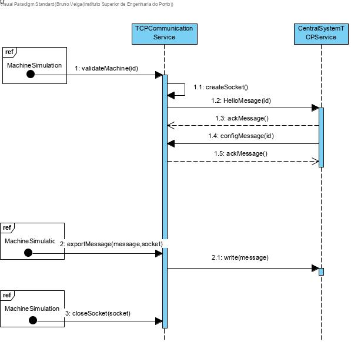
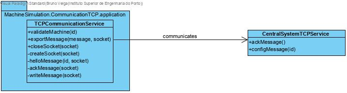

# Industrial Machine Communications with Central System
=======================================

# 1. Requirements 

As project manager
I want to develop a communication via TCP with the central system
So that the app can send messages

# 2. Analysis

There was no need to apply changes to the domain model.

# 3. Design

## 3.1. Functionality realisation

## 3.2. Class diagram

## 3.3. Design patterns applied

**Single responsible principle: ** Operations related to communication via TCP are all done with the class "TCPCommunicationService".

## 3.4. Tests

An simple app to test TCP communication

	#include <stdlib.h>
	#include <unistd.h>
	#include <stdio.h>
	#include <string.h>
	#include <sys/types.h>
	#include <sys/socket.h>
	#include <netinet/in.h>
	#include <arpa/inet.h>
	#include <netdb.h>
	#include <pthread.h>
	#include "../Application/TCPCommunicationService.h"
	#include "../../Simulation/Domain/Machine.h"
	#define BUF_SIZE 300
	#define SERVER_PORT "9999"
	
	Machine *m;
	pthread_mutex_t mux;
	
	
	static void receiveHelloMessage(int sock) {
		char hellomessage[6];
		char exp=0;
		if(read(sock,&hellomessage,6)==-1) {
			perror("Hello message error\n");
			exit(1);
		}
		if(*(hellomessage+1)!=exp) {
			perror("Hello message denied\n");
			exit(1);
		}
	}
	
	static void sendAckMessage(int sock) {
		char *ackMessage=(char*) malloc(2);
		sprintf(ackMessage,"%c%c",0,150);
		if(write(sock,ackMessage,2)==-1) {perror("Sending confirmation error\n");exit(1);}
	}
	
	static void sendConfigFile(int sock) {
		char config[4];
		sprintf(config,"%c",0);
		sprintf((config+1),"%c",2);
		sprintf((config+2),"%c%c",0,1);
		if(write(sock,config,4)==-1) {perror("Config message error\n");exit(1);}
	}
	
	static void receiveConfigResponse(int sock) {
		char response[100];
		char exp=150;
		if(read(sock,&response,100) ==-1) {
			perror("Error receiving config response\n");
			exit(1);
		}
		if(*(response+1)!=exp) {
			perror("Wrong message type\n");
			exit(1);
		}
	}
	
	static void receiveMessage(int sock) {
		char message[100];
		char exp=1;
		if(read(sock,&message,100)==-1){
			perror("Message not received\n");
			exit(1);
		}
		if(*(message+1)!=exp) {
			perror("Wrong message code\n");
			exit(1);
		}
	}
	
	void* client_func(void* arg) {
		int sock;
		sock=validateMachine(1);
		char message1[20],message2[20];
		sprintf(message1,"%c%c%c%c%c%cNova mensagem1",0,1,1,0,14,0);
		sprintf(message2,"%c%c%c%c%c%cNova mensagem2",0,1,1,0,14,0);
		exportMessage(message1,sock);
		exportMessage(message2,sock);
		pthread_exit((void*)NULL);
	}
	
	int main(void) {
		m=(Machine*) malloc(sizeof(Machine));
		pthread_mutex_init(&mux, NULL);
		pthread_t t,t2;
		struct sockaddr_storage from;
		int err, newSock, sock,i;
		unsigned int adl;
		char cliIPtext[BUF_SIZE], cliPortText[BUF_SIZE];
		struct addrinfo req, *list;
		bzero((char *)&req,sizeof(req));
		// requesting a IPv6 local address will allow both IPv4 and IPv6 clients to use it
		req.ai_family = AF_INET6;
		req.ai_socktype = SOCK_STREAM;	
		req.ai_flags = AI_PASSIVE; // local address
		
		err=getaddrinfo(NULL, SERVER_PORT , &req, &list);
		if(err) { 
			printf("Failed to get local address, error: %s\n",gai_strerror(err)); 
			exit(1); 
		}
		sock=socket(list->ai_family,list->ai_socktype,list->ai_protocol);
		if(sock==-1) { 
			perror("Failed to open socket"); 
			freeaddrinfo(list); 
			exit(1);
		}
		if(bind(sock,(struct sockaddr *)list->ai_addr, list->ai_addrlen)==-1) {
			perror("Bind failed");
			close(sock);
			freeaddrinfo(list);
			exit(1);
		}
		freeaddrinfo(list);
		listen(sock,SOMAXCONN);
		puts("Accepting TCP connections (IPv6/IPv4). Use CTRL+C to terminate the server");
		pthread_create(&t,NULL,client_func,NULL);
		pthread_create(&t2,NULL,client_func,NULL);
		adl=sizeof(from);
		for(i=0;i<2;i++) { 
			newSock=accept(sock,(struct sockaddr *)&from,&adl);
			if(!fork()) {
				close(sock);
				getnameinfo((struct sockaddr *)&from,adl,cliIPtext,BUF_SIZE,cliPortText,BUF_SIZE, NI_NUMERICHOST|NI_NUMERICSERV);
				printf("New connection from %s, port number %s\n", cliIPtext, cliPortText);
				receiveHelloMessage(newSock);
				printf("Received hello message\n");
				sendAckMessage(newSock);
				printf("Sent ack message\n");
				sendConfigFile(newSock);
				printf("Sent config file\n");
				receiveConfigResponse(newSock);
				printf("Configuration response received\n");
				receiveMessage(newSock);
				printf("Received message\n");
				receiveMessage(newSock);
				printf("Received message\n");
				close(newSock);
				printf("Connection %s, port number %s closed\n", cliIPtext, cliPortText);
				exit(0);
			}
			close(newSock);
		}
		pthread_join(t,NULL);
		pthread_join(t2,NULL);
		pthread_mutex_destroy(&mux);
		sleep(2);
		close(sock);
		return 0;
	}
**Scenario 1:**

- Start the application, enter as ID "1", as time "4" and as type "T3"
- The machine simulator will automatically validate the machine id and start importing messages from files sending them to the Central System. In the end all machines turn off.

# 4. Implementation

	#include "../../Protocol/Application/CommunicationProtocolService.h"
	#include "../../Simulation/Domain/Machine.h"
	#include <stdlib.h>
	#include <unistd.h>
	#include <stdio.h>
	#include <string.h>
	#include <sys/types.h>
	#include <sys/socket.h>
	#include <netinet/in.h>
	#include <arpa/inet.h>
	#include <netdb.h>
	#include <pthread.h>
	#include "../../Protocol/Domain/MessageCodes.h"
	#define HELLO_MESSAGE_SIZE 6
	#define RESPONSE_SIZE 2
	#define CONFIGURATION_SIZE 4
	#define BUF_SIZE 100
	#define DATA_LENGTH_BYTE_ONE 94
	#define DATA_LENGTH_BYTE_TWO 0
	#define SERVER_PORT "9999"
	// read a string from stdin protecting buffer overflow
	#define GETS(B, S) {  fgets(B, S - 2, stdin); B[strlen(B) - 1] = 0; }
	
	extern Machine *m;
	extern pthread_mutex_t mux;
	
	/*Creates the socket */
	static int createSocket()
	{
		int sock;
		int err;
		struct addrinfo req, *list;
		/*if(argc!=2) {
			puts("Server's IPv4/IPv6 address or DNS name is required as argument");
			exit(1);
		}*/
		bzero((char *)&req, sizeof(req));
		// let getaddrinfo set the family depending on the supplied server address
		req.ai_family = AF_UNSPEC;
		req.ai_socktype = SOCK_STREAM;
		err = getaddrinfo("localhost", SERVER_PORT, &req, &list);
		if (err)
		{
			printf("Failed to get server address, error: %s\n", gai_strerror(err));
			exit(1);
		}
		sock = socket(list->ai_family, list->ai_socktype, list->ai_protocol);
		if (sock == -1)
		{
			perror("Failed to open socket");
			freeaddrinfo(list);
			exit(1);
		}
		if (connect(sock, (struct sockaddr *)list->ai_addr, list->ai_addrlen) == -1)
		{
			perror("Failed connect");
			freeaddrinfo(list);
			close(sock);
			exit(1);
		}
		return sock;
	}
	
	/* Sends an hello message to the central system */
	static void helloMessage(int id, int sock)
	{
		char firstByte, secondByte;
		firstByte = (char)(id % 256);
		secondByte = (char)(id / 256);
		char *message = (char *)malloc(HELLO_MESSAGE_SIZE);
		if(message==NULL) {
			perror("Error allocating memory");
			exit(1);
		}
		sprintf(message, "%c", 0);
		sprintf((message + 1), "%c", 0);
		sprintf((message + 2), "%c", firstByte);
		sprintf((message + 3), "%c", secondByte);
		sprintf((message + 4), "%c%c", 0, 0);
		if (write(sock, message, HELLO_MESSAGE_SIZE) == -1)
		{
			perror("Error in hello message\n");
			exit(1);
		}
		free(message);
	}
	
	/* Gets a response from the central system */
	void getReponse(int sock)
	{
		char response[RESPONSE_SIZE];
		char exp = 150;
		if (read(sock, &response, RESPONSE_SIZE) == -1)
		{
			perror("Error obtaining a response\n");
			exit(1);
		}
		if (*(response + 1) != exp)
		{
	
			perror("NACK response\n");
			if(m!=NULL) {
				if(pthread_mutex_lock(&mux)!=0){perror("Error locking mutex tcp\n");exit(1);}
				m->status=NACK;
				if(pthread_mutex_unlock(&mux)!=0){perror("Error unlocking mutex tcp\n");exit(1);}
			}
		}else{
			if(m!=NULL) {
				if(pthread_mutex_lock(&mux)!=0){perror("Error locking mutex tcp\n");exit(1);}
				m->status=ACK;
				if(pthread_mutex_unlock(&mux)!=0){perror("Error unlocking mutex tcp\n");exit(1);}
			}
		}
		perror("NACK response\n");
		if(m!=NULL) {
			if(pthread_mutex_lock(&mux)!=0){perror("Error locking mutex tcp\n");exit(1);}
			m->status=NACK;
			if(pthread_mutex_unlock(&mux)!=0){perror("Error unlocking mutex tcp\n");exit(1);}
		}
	}else{
		if(m!=NULL) {
			if(pthread_mutex_lock(&mux)!=0){perror("Error locking mutex tcp\n");exit(1);}
			m->status=ACK;
			if(pthread_mutex_unlock(&mux)!=0){perror("Error unlocking mutex tcp\n");exit(1);}
		}
	}
	}
	
	/*Sends a ack message */
	static void ackMessage(int sock)
	{
		char *message = (char *)malloc(BUF_SIZE);
		if(message==NULL) {
			perror("Error allocating memory");
			exit(1);
		}
		sprintf(message, "%c", 0);
		sprintf((message + 1), "%c", 150);
		sprintf((message + 2), "%c", 0);
		sprintf((message + 4), "%c", DATA_LENGTH_BYTE_ONE);
		sprintf((message + 5), "%c", DATA_LENGTH_BYTE_TWO);
		/*sprintf((message+6),"Configuration received - Machine will start working");*/
		if (write(sock, message, BUF_SIZE) == -1)
		{
			perror("Error sendind ack message\n");
			exit(1);
		}
		free(message);
	}
	
	/* Sends a nack message */
	static void nackMessage(int sock)
	{
		char *message = (char *)malloc(BUF_SIZE);
		if(message==NULL) {
			perror("Error allocating memory");
			exit(1);
		}
		sprintf(message, "%c", 0);
		sprintf((message + 1), "%c", 151);
		sprintf((message + 2), "%c%c", 0, 0);
		sprintf((message + 4), "%c", DATA_LENGTH_BYTE_ONE);
		sprintf((message + 5), "%c", DATA_LENGTH_BYTE_TWO);
		sprintf((message + 6), "Configuration not received - Machine will not start working");
		if (write(sock, message, BUF_SIZE) == -1)
		{
			perror("Error sendind nack message\n");
			exit(1);
		}
		free(message);
		exit(1);
	}
	
	/* Gets the machine configuration */
	static void getConfiguration(int id, int sock)
	{
		char configuration[CONFIGURATION_SIZE];
		int id_temp;
		char exp = 2;
		if (read(sock, &configuration, CONFIGURATION_SIZE) == -1)
		{
			perror("Error obtaining the configuration\n");
			exit(1);
		}
		if (*(configuration + 1) != exp)
		{
			perror("Wrong message code\n");
			exit(1);
		}
		id_temp =(int) ((unsigned char) *(configuration + 3)) + ((unsigned char) *(configuration + 2)) * 256;
		if (id_temp != id)
		{
			nackMessage(sock);
		}
		else
		{
			ackMessage(sock);
		}
	}
	
	/* Validates a machine with the central system*/
	int validateMachine(int id)
	{
		int sock;
		sock = createSocket();
		helloMessage(id, sock);
		getReponse(sock);
		getConfiguration(id, sock);
		return sock;
	}
	
	/* Exports a message to the central system*/
	void exportMessage(char *message, int sock)
	{
		if (write(sock, message, BUF_SIZE) == -1)
		{
			perror("Error sending message\n");
			exit(1);
		}
	}
	
	/* Closes socket */
	void closeSocket(int sock)
	{
		close(sock);
	}
	
	void askToResetTheMachine(Machine *machine, Message *message)
	{
		char line[BUF_SIZE];
		int sock = createSocket();
		helloMessage(machine->id, sock);
		if (read(sock, line, BUF_SIZE) == -1)
		{
			perror("Error obtaining a response\n");
			exit(1);
		}
		packetToMessage(line, message);
	}

# 5. Integration/Demonstration

	/*
	
	 * ImportFilesT3.c
	   *
	 * Created on: 19/05/2020
	 * Author: isep
	    */
	   #include <stdio.h>
	   #include <stdlib.h>
	   #include <unistd.h>
	   #include <pthread.h>
	   #include "../../CommunicationTCP/Application/TCPCommunicationService.h"
	   #define BUF_SIZE 100
	
	extern Machine *m;
	extern pthread_mutex_t mux;
	
	/* Imports and sends messages to central system */
	char importStandard() {
		int time;
		char fileName[20];
		FILE *f;
		char firstByteID,secondByteID,firstByteLength,secondByteLength;
		char *line=NULL,*message;
		size_t len=0;
		size_t read=0;
		sprintf(fileName,"./MachineFiles/Machine.%s",m->internal_code);
		f = fopen(fileName, "r");
		if (f == NULL){
			perror("Error while opening the file.\n");
			exit(1);
		}
		while ((read = getline(&line, &len, f)) != -1) {
			message=(char *) malloc(BUF_SIZE);
			if (message==NULL) { perror("Error in malloc"); break; }
			firstByteID=(char)(m->id%256);
			secondByteID=(char)(m->id/256);
			firstByteLength=(char)(len%256);
			secondByteLength=(char)(len/256);
			sprintf((message),"%c",0);
			sprintf((message+1),"%c",1);
			sprintf((message+2),"%c",firstByteID);
			sprintf((message+3),"%c",secondByteID);
			sprintf((message+4),"%c",firstByteLength);
			sprintf((message+5),"%c",secondByteLength);
			sprintf((message+6),"%s",line);
			exportMessage(message,m->sock);
			getReponse(m->sock);
			sleep(m->time);
			free(message);
	    }
		if (fclose(f)!=0) perror("Error closing file");
		return 0;
	}
	
	
	
	/*
	
	 * main.c
	   *
	 * Created on: 19/05/2020
	 * Author: isep
	    */
	   #include <pthread.h>
	   #include "ImportFilesService.h"
	   #include "args.h"
	   #include "../../CommunicationTCP/Application/TCPCommunicationService.h"
	   #include "../../CommunicationUDP/Application/UDPCommunicationService.h"
	
	#define NUM_MACHINES 10
	
	pthread_t thread_ids;
	pthread_t thread_MS;
	pthread_mutex_t mux;
	int sock ;
	Machine *m=NULL;
	
	/*Turns the machine on and starts the communications protocols */
	void *turnOnMachine(void *arg) {
		if(pthread_mutex_init(&mux, NULL)!=0) {perror("Error creating mutex\n");exit(1);}
		args *a;
		a=(args*) arg;
		sock = validateMachine(a->id);
		m = createMachine(a->id, a->time, a->internalCode, sock);
		if(pthread_create(&thread_ids, NULL, sendmessages_func, (void*) NULL)!=0) {perror("Error creating tcp thread\n");exit(1);}
		if(pthread_create(&thread_MS, NULL, establishConnectionToTheMonitoringSystem,
				(void *) NULL)!=0) {perror("Error creating udp thread\n");exit(1);}
		pthread_exit((void*)NULL);
	}
	
	/*Turns the machine off*/
	int turnOffMachines() {
		int i;
	if (pthread_join(thread_ids, NULL) != 0) {
		perror("Error in closing thread tcp");
		exit(1);
	}
	if (pthread_join(thread_MS, NULL) != 0) {
		perror("Error in closing thread udp");
		exit(1);
	}
	closeSocket(sock);
	if(pthread_mutex_destroy(&mux)!=0) {perror("Error destroying mutex\n");exit(1);}
	printf("Closed threads\n");
	return 0;
	}
# 6. Observations

The user case was implemented without issues

