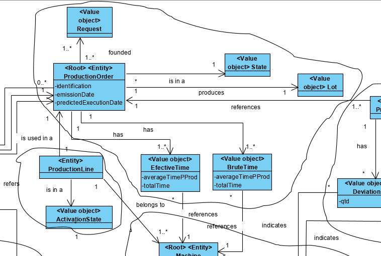
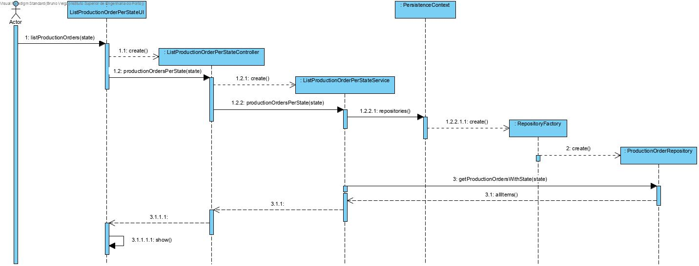
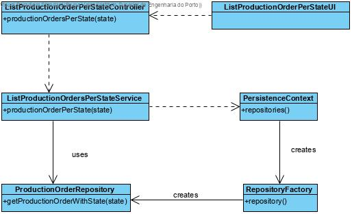
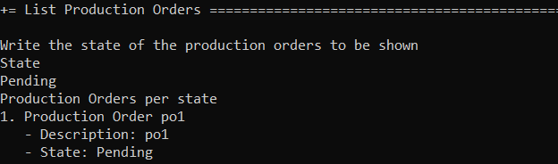

# List user cases
=======================================

# 1. Requirements 

As a Production Manager
I want to consult production orders in a certain state
To see which production orders are active and those that aren't

# 2. Analysis

# 3. Design

## 3.1. Functionality realisation

## 3.2. Class diagram

## 3.3. Design patterns applied

**Pure Fabrication** - used in the creation of the class "ListProductionOrderPerStateUI", since no other rule can be applied to create it.

**Controller** - the class "ListProductionOrderPerStateController" controls the user case.

**Repository** - There is a class, "ProductionOrderRepository" responsible for operations with the database related to the domain classes correspondent, created by the repository factory.

**Factory:** "RepositoryFactory" is responsible for creating all the repository classes.

## 3.4. Tests

**Scenario 1: ** 

- Start backoffice application, select Production Order and then list Production Order Per State.

- Write as state Pending

- The output should look like

  

# 4. Implementation

## 4.1. Application

    public class ListProductionOrdersPerStateController {
    final ListProductionOrdersPerStateService svc = new ListProductionOrdersPerStateService();
    
    /**
     * All production orders in a state
     *
     * @return all production orders in a state
     */
    public Iterable<ProductionOrder> productionOrdersPerState(String state) {
        return this.svc.productionOrdersPerState(state);
    }
    }

    public class ListProductionOrdersPerStateService {
    private final AuthorizationService authz = AuthzRegistry.authorizationService();
    private final ProductionOrderRepository repo = PersistenceContext.repositories().productionOrder();
    
    /**
     * All production orders in a state
     *
     * @param state
     * @return all productions orders in a state
     */
    public Iterable<ProductionOrder> productionOrdersPerState(String state) {
        authz.ensureAuthenticatedUserHasAnyOf(BaseRoles.POWER_USER, BaseRoles.PRODUCTION_MANAGER);
        return this.repo.getProductionOrdersWithState(state);
    }
    }
## 4.3. Presentation

    public class ListProductionOrdersPerStateUI extends AbstractListUI<ProductionOrder> {
    final ListProductionOrdersPerStateController theController = new ListProductionOrdersPerStateController();
    
    @Override
    protected Iterable<ProductionOrder> elements() {
        System.out.println("Write the state of the production orders to be shown");
        String state=Console.readLine("State");
        return this.theController.productionOrdersPerState(state);
    }
    
    @Override
    protected Visitor<ProductionOrder> elementPrinter() {
        return new ProductionOrderPrinter();
    }
    
    @Override
    protected String elementName() {
        return "Production Order";
    }
    
    @Override
    protected String listHeader() {
        return "Production Orders per state";
    }
    }

    public class ListProductionOrdersPerStateAction implements Action {
    @Override
    public boolean execute() {
        return new ListProductionOrdersPerStateUI().show();
    }
    }
## 4.4. Repository

    public interface ProductionOrderRepository extends DomainRepository<Designation, ProductionOrder>  {
    Iterable<ProductionOrder> getPendingOrSuspended();
    ProductionOrder getProductionOrderByLot(Designation lotCode);
    Iterable<ProductionOrder> getProductionOrdersByRequest(Designation requestCode);
    Iterable<ProductionOrder> getProductionOrdersWithState(String state);
    Iterable<ProductionOrder> getUnprocessedProductionOrders();
    }

    public class JpaProductionOrderRepository extends BasepaRepositoryBase<ProductionOrder, Designation,Designation> implements ProductionOrderRepository {
        public JpaProductionOrderRepository() {
            super("internalCode");
        }
    @Override
    public Iterable<ProductionOrder> getPendingOrSuspended(){
        final TypedQuery<ProductionOrder> query = entityManager().createQuery(
                "SELECT p FROM ProductionOrder p where p.state = 'Suspended' OR p.state = 'Pending'", ProductionOrder.class
        );
        return query.getResultList();
    }
    
    @Override
    public ProductionOrder getProductionOrderByLot(Designation lotCode) {
        final TypedQuery<ProductionOrder> query = entityManager().createQuery(
                "SELECT p FROM ProductionOrder p where p.lot.lotCode=:p",ProductionOrder.class
        );
        query.setParameter("p", lotCode);
        return query.getSingleResult();
    }
    
    @Override
    public Iterable<ProductionOrder> getProductionOrdersByRequest(Designation requestCode) {
        final TypedQuery<ProductionOrder> query = entityManager().createQuery(
                "SELECT p FROM ProductionOrder p where p.request.requestCode=:s",ProductionOrder.class
        );
        query.setParameter("s", requestCode);
        return query.getResultList();
    }
    
    @Override
    public Iterable<ProductionOrder> getProductionOrdersWithState(String state) {
        final TypedQuery<ProductionOrder> query = entityManager().createQuery(
                "SELECT p FROM ProductionOrder p where p.state.state=:s",ProductionOrder.class
        );
        query.setParameter("s", state);
        return query.getResultList();
    }
    
    @Override
    public Iterable<ProductionOrder> getUnprocessedProductionOrders() {
        final Map<String, Object> params = new HashMap<>();
    
        params.put("state", ProcessingState.UNPROCESSED);
        
        return match("e.processingState = :state", params);
    }
    }

    public class InMemoryProductionOrderRepository extends InMemoryDomainRepository<Designation, ProductionOrder> implements ProductionOrderRepository {
    static {
        InMemoryInitializer.init();
    }
    
    public Iterable<ProductionOrder> getPendingOrSuspended(){
        return match(ProductionOrder::isPendingOrSuspended);
    }
    
    @Override
    public ProductionOrder getProductionOrderByLot(Designation lotCode) {
        return matchOne(e->e.hasLot(lotCode)).get();
    }
    
    @Override
    public Iterable<ProductionOrder> getProductionOrdersByRequest(Designation requestCode) { return match(e->e.hasRequest(requestCode)); }
    
    @Override
    public Iterable<ProductionOrder> getProductionOrdersWithState(String state) {
        return match(p->p.hasState(state));
    }
    
    @Override
    public Iterable<ProductionOrder> getUnprocessedProductionOrders() {
        return match(e -> e.processingState().equals(ProcessingState.UNPROCESSED));
    }
    }
# 5. Integration/Demonstration

The integration is already represented above in the repository classes.

# 6. Observations

This user case was implemented without any issues

