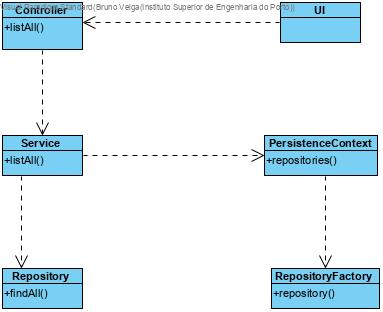

# List user cases
=======================================

# 1. Requirements 

This document is a general guideline for list user cases.

For now, it is applied in "List Raw Materials" and "List Raw Material Categories".

# 2. Analysis

The domain model does not need to be altered since this user cases only lists concepts that are already in the database and well defined.

# 3. Design

## 3.1. Functionality realisation

## 3.2. Class diagram

## 3.3. Design patterns applied

**Pure Fabrication** - used in the creation of the class "UI", since no other rule can be applied to create it.

**Controller** - the class "Controller" controls the user case.

**Repository** - There is a class, "Repository" responsible for operations with the database related to the domain classes correspondent, created by the repository factory.

**Factory:** "RepositoryFactory" is responsible for creating all the repository classes.

**Service:** A service is used to reutilize code. 

## 3.4. Tests

### 3.4.1 List Raw Material Categories

**Scenario 1**:

- Make sure the bootstrap has been run.

- Start backoffice app

- Login with poweruser account or production manager account(poweruser,poweruserA1|production_manager,Password1)

- Select raw materials option

- Select list raw material categories option

- The app should show 3 categories that were added by the bootstrap (wood,plastic,metal)

  warning: If other user cases are run first like "AddRawMaterialCategories" there will be more categories listed.

### 3.4.2. List Raw Materials

**Scenario 1:**

- Make sure the bootstrap has been run.

- Start backoffice app

- Login with poweruser account or production manager account(poweruser,poweruserA1|production_manager,Password1)

- Select raw materials option

- Select list raw material option

- The app should show 6 raw materials that were added by the bootstrap(softwoof,hardwood,plastic bottle,polyamide,steel,iron) 

  warning: If other user cases are run first like "AddRawMaterialToCatalogue" there will be more categories listed.

# 4. Implementation

## 4.1. List Raw Material Categories

UI: ListRawMaterialCategoriesUI

Controller: ListRawMaterialCategoriesController

Service: ListRawMaterialCategoryService

Repository: RawMaterialCategoryRepository

### 4.1.1. Controller

    public class ListRawMaterialCategoriesController {
    
    final ListRawMaterialCategoryService svc= new ListRawMaterialCategoryService();
    
    /**
     * All raw materal categories
     * 
     * @return all raw material categories
     */
    public Iterable<RawMaterialCategory> allRawMaterialsCategory() {
        return this.svc.allRawMaterialCategories();
    }
    }
### 4.1.2. Service

    public class ListRawMaterialCategoryService {
    
    private final AuthorizationService authz = AuthzRegistry.authorizationService();
    private final RawMaterialCategoryRepository rawMaterialCategoryRepository = PersistenceContext.repositories().rawMaterialCategory();
    
    /**
     * Returns all the raw material categories existing 
     * @return raw material categories
     */
    public Iterable<RawMaterialCategory> allRawMaterialCategories() {
        authz.ensureAuthenticatedUserHasAnyOf(BaseRoles.POWER_USER,
                BaseRoles.PRODUCTION_MANAGER);
    
        return this.rawMaterialCategoryRepository.findAll();
    }
    }
## 4.2. List Raw Materials

UI: ListRawMaterialsUI

Controller: ListRawMaterialsController

Service: ListRawMaterialService

Repository: RawMaterialRepository

### 4.2.1. Controller    

    public class ListRawMaterialsController {
    
    final ListRawMaterialService svc= new ListRawMaterialService();
    
    /**
     * All raw materials
     * @return all raw materials
     */
    public Iterable<RawMaterial> allRawMaterials(){
        return this.svc.allRawMaterials();
    }
    }

### 4.2.2. Service

    public class ListRawMaterialService {
        private final AuthorizationService authz= AuthzRegistry.authorizationService();
        private final RawMaterialRepository repo= PersistenceContext.repositories().rawMaterial();
    /**
     * All Raw Materials
     * 
     * @return all raw materials 
     */
    public Iterable<RawMaterial> allRawMaterials() {
        authz.ensureAuthenticatedUserHasAnyOf(BaseRoles.POWER_USER,BaseRoles.PRODUCTION_MANAGER);
        return this.repo.findAll();
    }
    }

## 4.5. Commits

Commit 1: #18 #19: list user cases added

Commit 2: #18: [3-1-2002] - List raw material categories #comment Implemented and tested

Commit 3: #19: [2-1-2001] - List raw materials #comment implemented and tested

# 5. Integration/Demonstration

There is no need for integration with other functionalities because this type of user cases are simply recovering information from the database and present it.

# 6. Observations

This user case was well developed without any issues.

