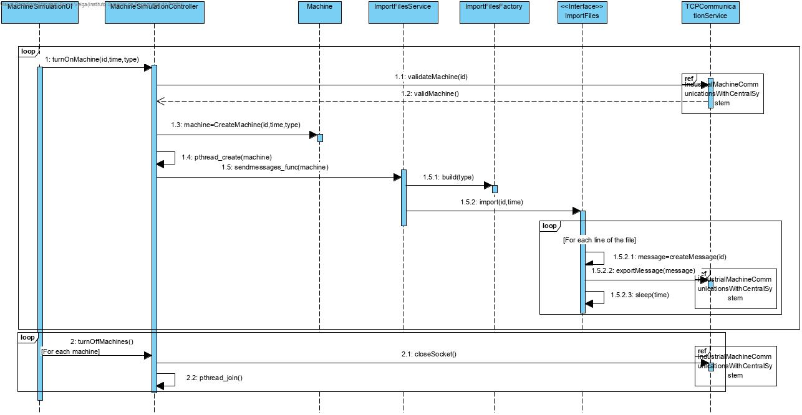
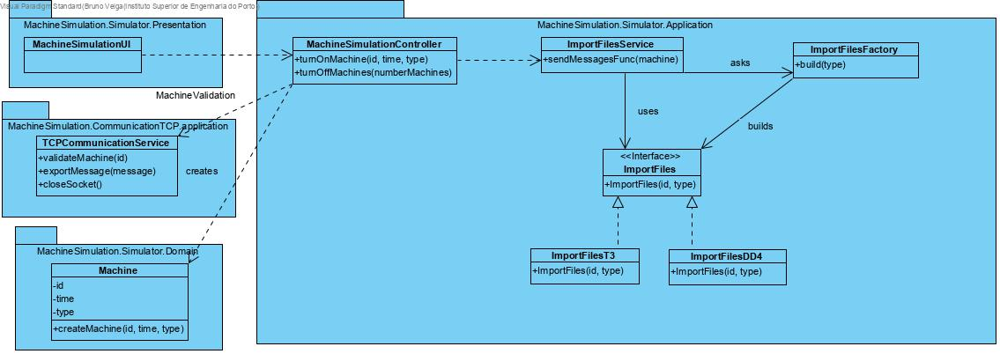

# Machine Simulation
=======================================

# 1. Requirements 

As a project manager 
I want an app that simulates the funcionality of a machine
So that messages generated can be sent to the main application

Acceptance criteria:
 - Developed in C
 - The messages sent are read from a text file
 - The machine identifier are stipulated by parameter
 - Should contemplate error scenarios

# 2. Analysis

The domain didn't need any type of alteration because it was already able to support this functionality.

# 3. Design

## 3.1. Functionality realisation

## 3.2. Class diagram

## 3.3. Design patterns applied

**Strategy: **A strategy was used to import information from files. The interface "ImportFiles" permits a variation of the import algorithm independently of which concrete class uses it.

**Factory:** There is a factory (ImportFilesFactory) responsible for creating a class that will import files of a certain type and return it as the interface "ImportFiles". 

**Controller: ** The controller class "MachineSimulationController" controls the user case.

**Service: ** There is a service("ImportFilesService") responsible for importing files.

**Single responsibility principle: ** Any class is only responsible for operations related to what they stand for.

## 3.4. Tests

**Scenario 1:**

- Start the application, enter as ID "1", as time "4" and as type "T3"
- The machine simulator will automatically validate the machine id and start importing messages from files sending them to the Central System. In the end all machines turn off.

# 4. Implementation

### 4.1. Application

	/*
	
	 * main.c
	   *
	 * Created on: 19/05/2020
	 * Author: isep
	    */
	   #include <pthread.h>
	   #include "ImportFilesService.h"
	   #include "args.h"
	   #include "../../CommunicationTCP/Application/TCPCommunicationService.h"
	   #include "../../CommunicationUDP/Application/UDPCommunicationService.h"
	
	#define NUM_MACHINES 10
	
	pthread_t thread_ids;
	pthread_t thread_MS;
	pthread_mutex_t mux;
	int sock ;
	Machine *m=NULL;
	
	/*Turns the machine on and starts the communications protocols */
	void *turnOnMachine(void *arg) {
		if(pthread_mutex_init(&mux, NULL)!=0) {perror("Error creating mutex\n");exit(1);}
		args *a;
		a=(args*) arg;
		sock = validateMachine(a->id);
		m = createMachine(a->id, a->time, a->internalCode, sock);
		if(pthread_create(&thread_ids, NULL, sendmessages_func, (void*) NULL)!=0) {perror("Error creating tcp thread\n");exit(1);}
		if(pthread_create(&thread_MS, NULL, establishConnectionToTheMonitoringSystem,
				(void *) NULL)!=0) {perror("Error creating udp thread\n");exit(1);}
		pthread_exit((void*)NULL);
	}
	
	/*Turns the machine off*/
	int turnOffMachines() {
		int i;
	if (pthread_join(thread_ids, NULL) != 0) {
		perror("Error in closing thread tcp");
		exit(1);
	}
	if (pthread_join(thread_MS, NULL) != 0) {
		perror("Error in closing thread udp");
		exit(1);
	}
	closeSocket(sock);
	if(pthread_mutex_destroy(&mux)!=0) {perror("Error destroying mutex\n");exit(1);}
	printf("Closed threads\n");
	return 0;
	}
	/*
	
	 * ImportFilesT3.c
	   *
	 * Created on: 19/05/2020
	 * Author: isep
	    */
	   #include <stdio.h>
	   #include <stdlib.h>
	   #include <unistd.h>
	   #include <pthread.h>
	   #include "../../CommunicationTCP/Application/TCPCommunicationService.h"
	   #define BUF_SIZE 100
	
	extern Machine *m;
	extern pthread_mutex_t mux;
	
	/* Imports and sends messages to central system */
	char importStandard() {
		int time;
		char fileName[20];
		FILE *f;
		char firstByteID,secondByteID,firstByteLength,secondByteLength;
		char *line=NULL,*message;
		size_t len=0;
		size_t read=0;
		sprintf(fileName,"./MachineFiles/Machine.%s",m->internal_code);
		f = fopen(fileName, "r");
		if (f == NULL){
			perror("Error while opening the file.\n");
			exit(1);
		}
		while ((read = getline(&line, &len, f)) != -1) {
			message=(char *) malloc(BUF_SIZE);
			if (message==NULL) { perror("Error in malloc"); break; }
			firstByteID=(char)(m->id%256);
			secondByteID=(char)(m->id/256);
			firstByteLength=(char)(len%256);
			secondByteLength=(char)(len/256);
			sprintf((message),"%c",0);
			sprintf((message+1),"%c",1);
			sprintf((message+2),"%c",firstByteID);
			sprintf((message+3),"%c",secondByteID);
			sprintf((message+4),"%c",firstByteLength);
			sprintf((message+5),"%c",secondByteLength);
			sprintf((message+6),"%s",line);
			exportMessage(message,m->sock);
			getReponse(m->sock);
			sleep(m->time);
			free(message);
	    }
		if (fclose(f)!=0) perror("Error closing file");
		return 0;
	}

​	
​	
	/*
	
	 * ImportFilesFactory.h
	   *
	 * Created on: 19/05/2020
	 * Author: isep
	    */ 
	   #include <stdio.h>
	   #include <stdlib.h>
	   #include <string.h>
	
	#include "ImportFilesStandard.h"
	
	typedef struct {
		ImportFilesStrategy strategy;
	}ImportStruct;
	
	ImportStruct* build(char *internalCode) {
		ImportStruct *imp=(ImportStruct*)malloc(sizeof(ImportStruct));
		imp->strategy=(ImportFilesStrategy)importStandard;
		return imp;
	}

​	
​	
	/*
	
	 * ImportFilesService.c
	   *
	 * Created on: 19/05/2020
	 * Author: isep
	    */
	   #include "ImportFiles.h"
	   #include "ImportFilesFactory.h"
	   #include "../Domain/Machine.h"
	   #include <pthread.h>
	
	extern Machine *m;
	
	void* sendmessages_func(void *arg) {
		ImportStruct *import;
		import=build(m->internal_code);
		if(import!=NULL) {
			import->strategy(m->id,m->time,m->sock,m->internal_code);
		}
		pthread_exit((void*)NULL);
	}

​	
	/*
	
	 * ImporFiles.h
	   *
	 * Created on: 19/05/2020
	 * Author: isep
	    */

​	
	typedef (*ImportFilesStrategy) (int id,int time,int sock, char *internal_code);
	
	### 4.2. Domain
	
	#include <stdlib.h>
	#include <string.h>
	
	typedef struct
	{
		int id;
		int time;
		char internal_code[10];
		int sock;
		int status;
	} Machine;
	
	Machine *createMachine(int id, int time, char *internal_code, int sock)
	{
		Machine *m = (Machine *)malloc(sizeof(Machine));
		m->id = id;
		m->time = time;
		strcpy(m->internal_code, internal_code);
		m->sock = sock;
		m->status=150;
		return m;
	}
	
	int getMostRecentStatus(Machine *m)
	{
		return m->status;
	}

### 4.3. Presentation

	
		void MachineSimulationUI() {
			args *a=(args*)malloc(sizeof(args));
			if(a==NULL) {
				perror("Error allocating memory");
				exit(1);
			}
			int id,on=0;
			pthread_t thread;
			char *internal_code=(char*)malloc(10);
			if(internal_code==NULL) {
				perror("Error allocating memory");
				exit(1);
			}
			a->internalCode=(char*) malloc(10);
			if(a->internalCode==NULL) {
				perror("Error allocating memory");
				exit(1);
			}
			int time = 0;
			printf("Write a machine id to add it, 0 to terminate\n");
			scanf("%d", &id);
			if (id != 0) {
				printf("Write the time the machine takes to send messages\n");
				scanf("%d%*c", &time);
				printf("Write the machine internal code\n");
				GETS(internal_code, sizeof(internal_code));
			a->id=id;
			a->time=time;
			sprintf(a->internalCode,"%s",internal_code);
			if(pthread_create(&thread, NULL, turnOnMachine,(void*) a)!=0) {
					perror("Error creating machine thread\n");
					exit(1);
			}
			printf("Write one to terminate the machine\n");
			while(on!=1) {
				scanf("%d",&on);
			}
			turnOffMachines();
			if(pthread_join(thread,NULL)!=0) {
				perror("Error closing machine thread");
				exit(1);
			}
			free(a->internalCode);
			free(a);
			free(internal_code);
		}
		}
		/*
	* ImportFilesUI.c
	   *
	 * Created on: 19/05/2020
	 * Author: isep
	    */
	   #include <stdlib.h>
	   #include <unistd.h>
	   #include <stdio.h>
	   #include <string.h>
	   #include <pthread.h>
	   #include "../Application/MachineSimulationController.h"
	
	#define GETS(B,S) {fgets(B,S-2,stdin);B[strlen(B)-1]=0;}

# 5. Integration/Demonstration

The integration e already represented above in controller and importStandard file.

# 6. Observations

The user case was implemented without any issues

