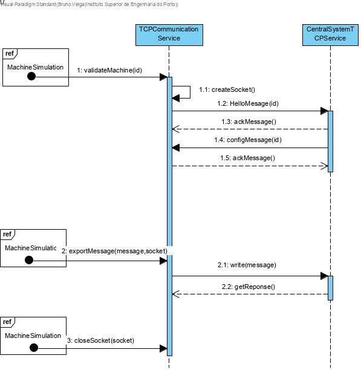

# Protect Communications between Industrial Machine and Central System
=======================================

# 1. Requirements 

As a project manager	
I want to protect the communications between SCM and the machine 	
So that it is security when sending messages	

Acceptance criteria:	

- Apply SSL/TLS with authentication by using public keys certificates

# 2. Analysis

There was no need to apply changes to the domain model.

# 3. Design

## 3.1. Functionality realisation

## 3.2. Class diagram

## 3.3. Design patterns applied

**Single responsible principle: ** Operations related to communication via TCP are all done with the class "TCPCommunicationService".

## 3.4. Tests

An simple app to test TCP communication

	#include <stdlib.h>
	#include <unistd.h>
	#include <stdio.h>
	#include <string.h>
	#include <sys/types.h>
	#include <sys/socket.h>
	#include <netinet/in.h>
	#include <arpa/inet.h>
	#include <netdb.h>
	#include <pthread.h>
	#include <openssl/crypto.h>
	#include <openssl/bio.h>
	#include <openssl/ssl.h>
	#include <openssl/err.h>
	#include "../Application/TCPCommunicationService.h"
	#include "../../Simulation/Domain/Machine.h"
	#define BUF_SIZE 300
	#define SERVER_PORT "9999"
	
	#define SERVER_SSL_CERT_FILE "server.pem"
	#define SERVER_SSL_KEY_FILE "server.key"
	#define AUTH_CLIENTS_SSL_CERTS_FILE "authentic-clients.pem"
	
	Machine *m;
	pthread_mutex_t mux;
		
		static void receiveHelloMessage(SSL *sslConn) {
			char hellomessage[6];
			char exp=0;
			if(SSL_read(sslConn,&hellomessage,6)==-1) {
				perror("Hello message error\n");
				exit(1);
			}
			if(*(hellomessage+1)!=exp) {
				perror("Hello message denied\n");
				exit(1);
			}
		}
		

	static void sendAckMessage(SSL *sslConn) {
		char *ackMessage=(char*) malloc(2);
		sprintf(ackMessage,"%c%c",0,150);
		if(SSL_write(sslConn,ackMessage,2)==-1) {perror("Sending confirmation error\n");exit(1);}
	}
	
	static void sendConfigFile(SSL *sslConn) {
		char config[4];
		sprintf(config,"%c",0);
		sprintf((config+1),"%c",2);
		sprintf((config+2),"%c%c",0,1);
		if(SSL_write(sslConn,config,4)==-1) {perror("Config message error\n");exit(1);}
	}
	
	static void receiveConfigResponse(SSL *sslConn) {
		char response[100];
		char exp=150;
		if(SSL_read(sslConn,&response,100) ==-1) {
			perror("Error receiving config response\n");
			exit(1);
		}
		if(*(response+1)!=exp) {
			perror("Wrong message type\n");
			exit(1);
		}
	}
	
	static void receiveMessage(SSL *sslConn) {
		char message[100];
		char exp=1;
		if(SSL_read(sslConn,&message,100)==-1){
			perror("Message not received\n");
			exit(1);
		}
		if(*(message+1)!=exp) {
			perror("Wrong message code\n");
			exit(1);
		}
	}
	
	void* client_func(void* arg) {
		int sock;
		SSL *sslConn;
		sslConn=validateMachine(1,&sock);
		char message1[20],message2[20];
		sprintf(message1,"%c%c%c%c%c%cNova mensagem1",0,1,1,0,14,0);
		sprintf(message2,"%c%c%c%c%c%cNova mensagem2",0,1,1,0,14,0);
		exportMessage(message1,sslConn);
		exportMessage(message2,sslConn);
		pthread_exit((void*)NULL);
	}
	
	int test(void) {
		m=(Machine*) malloc(sizeof(Machine));
		pthread_mutex_init(&mux, NULL);
		pthread_t t,t2;
		struct sockaddr_storage from;
		int err, newSock, sock,i;
		unsigned int adl;
		char cliIPtext[BUF_SIZE], cliPortText[BUF_SIZE];
		struct addrinfo req, *list;
		bzero((char *)&req,sizeof(req));
		// requesting a IPv6 local address will allow both IPv4 and IPv6 clients to use it
		req.ai_family = AF_INET6;
		req.ai_socktype = SOCK_STREAM;	
		req.ai_flags = AI_PASSIVE; // local address
		
		err=getaddrinfo(NULL, SERVER_PORT , &req, &list);
		if(err) { 
			printf("Failed to get local address, error: %s\n",gai_strerror(err)); 
			exit(1); 
		}
		sock=socket(list->ai_family,list->ai_socktype,list->ai_protocol);
		if(sock==-1) { 
			perror("Failed to open socket"); 
			freeaddrinfo(list); 
			exit(1);
		}
		if(bind(sock,(struct sockaddr *)list->ai_addr, list->ai_addrlen)==-1) {
			perror("Bind failed");
			close(sock);
			freeaddrinfo(list);
			exit(1);
		}
		freeaddrinfo(list);
		listen(sock,SOMAXCONN);
		
		const SSL_METHOD *method;
		SSL_CTX *ctx;
		method = SSLv23_server_method();
		ctx = SSL_CTX_new(method);	
		// Load the server's certificate and key
		SSL_CTX_use_certificate_file(ctx, SERVER_SSL_CERT_FILE, SSL_FILETYPE_PEM);
		SSL_CTX_use_PrivateKey_file(ctx, SERVER_SSL_KEY_FILE, SSL_FILETYPE_PEM);
		if (!SSL_CTX_check_private_key(ctx)) {
			puts("Error loading server's certificate/key");
			close(sock);
			exit(1);
		}
		// THE CLIENTS' CERTIFICATES ARE TRUSTED
		SSL_CTX_load_verify_locations(ctx, AUTH_CLIENTS_SSL_CERTS_FILE, NULL);
		// Restrict TLS version and cypher suite
		SSL_CTX_set_min_proto_version(ctx,TLS1_2_VERSION);
		SSL_CTX_set_cipher_list(ctx, "HIGH:!aNULL:!kRSA:!PSK:!SRP:!MD5:!RC4");
		// Clients must provide a trusted certificate, the handshake will fail otherwise
		SSL_CTX_set_verify(ctx, SSL_VERIFY_PEER|SSL_VERIFY_FAIL_IF_NO_PEER_CERT, NULL);
	
		puts("Accepting TCP connections (IPv6/IPv4). Use CTRL+C to terminate the server");
		pthread_create(&t,NULL,client_func,NULL);
		pthread_create(&t2,NULL,client_func,NULL);
		adl=sizeof(from);
		for(i=0;i<2;i++) { 
			newSock=accept(sock,(struct sockaddr *)&from,&adl);
			if(!fork()) {
				close(sock);
				getnameinfo((struct sockaddr *)&from,adl,cliIPtext,BUF_SIZE,cliPortText,BUF_SIZE, NI_NUMERICHOST|NI_NUMERICSERV);
				printf("New connection from %s, port number %s\n", cliIPtext, cliPortText);
				SSL *sslConn = SSL_new(ctx);
				SSL_set_fd(sslConn, newSock);
				if(SSL_accept(sslConn)!=1) {
					puts("TLS handshake error: client not authorized");
					SSL_free(sslConn);
					close(newSock);
					exit(1);
				}
				printf("TLS version: %s\nCypher suite: %s\n",
				SSL_get_cipher_version(sslConn),SSL_get_cipher(sslConn));
				X509* cert=SSL_get_peer_certificate(sslConn);
				X509_free(cert);
				X509_NAME_oneline(X509_get_subject_name(cert),cliIPtext,BUF_SIZE);
				printf("Client's certificate subject: %s\n",cliIPtext);
				receiveHelloMessage(sslConn);
				printf("Received hello message\n");
				sendAckMessage(sslConn);
				printf("Sent ack message\n");
				sendConfigFile(sslConn);
				printf("Sent config file\n");
				receiveConfigResponse(sslConn);
				printf("Configuration response received\n");
				receiveMessage(sslConn);
				printf("Received message\n");
				receiveMessage(sslConn);
				printf("Received message\n");
				SSL_free(sslConn);
				close(newSock);
				printf("Connection %s, port number %s closed\n", cliIPtext, cliPortText);
				exit(0);
			}
			close(newSock);
		}
		pthread_join(t,NULL);
		pthread_join(t2,NULL);
		pthread_mutex_destroy(&mux);
		sleep(2);
		close(sock);
		return 0;
	}

**Scenario 1:**

- Start the application, enter as ID "1001", as time "5" and as internal code"1001"
- The machine simulator will automatically validate the machine id and start importing messages from files sending them to the Central System through a protected connection.

# 4. Implementation

	extern Machine *m;
	extern pthread_mutex_t mux;
	extern pthread_mutex_t mux_reset;
	extern pthread_cond_t cond_reset;
	
	/*Saves the configuration file the machine is using */
	static void saveConfigFile(char *message){
		FILE *fptr;
		fptr = fopen("config.txt", "w");
		if (fptr == NULL) {
			printf("Error saving configuration");
		}else{
		    fprintf(fptr, "%s", message);
		    fclose(fptr);
		    printf("Configuration file saved\n");
		}
	}
	
	/* Gets the configugarion files from the scm */
	static void getConfigFiles(int *id, SSL *sslConn) {
		char cliIPtext[BUF_SIZE], cliPortText[BUF_SIZE];
		char configuration[6];
		int id_temp;
		char exp = 2;
		if (SSL_read(sslConn, &configuration, 6) == -1) {
			if (pthread_mutex_lock(&mux) != 0) {perror("Error locking mutex tcp\n");exit(1);}
			m->status = NACK;
			if (pthread_mutex_unlock(&mux) != 0) {perror("Error unlocking mutex tcp\n");exit(1);}
		}
		if (pthread_mutex_lock(&mux_reset) != 0) {perror("Error locking mutex reset\n");exit(1);}
		if(m->reset==1) {
			pthread_cond_wait(&cond_reset,&mux_reset);
		}
		if (pthread_mutex_unlock(&mux_reset) != 0) {perror("Error unlocking mutex reset\n");exit(1);}
		if (*(configuration + 1) != exp) {
			perror("Wrong message code\n");
			if (pthread_mutex_lock(&mux) != 0) {perror("Error locking mutex tcp\n");exit(1);}
			m->status = NACK;
			if (pthread_mutex_unlock(&mux) != 0) {perror("Error unlocking mutex tcp\n");exit(1);}
		}
		id_temp = (int) ((unsigned char) *(configuration + 2))
				+ ((unsigned char) *(configuration + 3)) * 256;
		if (id_temp != *id) {
			if (pthread_mutex_lock(&mux) != 0) {perror("Error locking mutex tcp\n");exit(1);}
			m->status = NACK;
			if (pthread_mutex_unlock(&mux) != 0) {perror("Error unlocking mutex tcp\n");exit(1);}
			char *message = (char *) malloc(BUF_SIZE);
			if (message == NULL) {
				perror("Error allocating memory");
				exit(1);
			}
			sprintf(message, "%c%c%c%c%c%c", 0,151,0,0,DATA_LENGTH_BYTE_ONE,DATA_LENGTH_BYTE_TWO);
			/*sprintf((message+6),"Configuration not received - Machine will not start working");*/
			if (SSL_write(sslConn, message, BUF_SIZE) == -1) {
				perror("Error sendind nack message\n");
				exit(1);
			}
			free(message);
		} else {
			if (pthread_mutex_lock(&mux) != 0) {perror("Error locking mutex tcp\n");exit(1);}
			m->status = ACK;
			if (pthread_mutex_unlock(&mux) != 0) {perror("Error unlocking mutex tcp\n");exit(1);}
			char *message = (char *) malloc(BUF_SIZE);
			if (message == NULL) {
				perror("Error allocating memory");
				exit(1);
			}
			sprintf(message, "%c%c%c%c%c%c", 0,150,0,0,DATA_LENGTH_BYTE_ONE,DATA_LENGTH_BYTE_ONE);
			/*sprintf((message + 6), "Configuration received - Machine will start working");*/
			if (SSL_write(sslConn, message, BUF_SIZE) == -1) {
				perror("Error sendind ack message\n");
				exit(1);
			}
			free(message);
		}
	
		int conf_size;
		conf_size=(int) ((unsigned char) *(configuration+4)) + ((unsigned char) *(configuration+5))*256;
		char conf[conf_size];
		if (SSL_read(sslConn, &conf, conf_size)==-1) {
			perror("Error obtaining the configuration\n");
			if (pthread_mutex_lock(&mux) != 0) {perror("Error locking mutex tcp\n");exit(1);}
			m->status = NACK;
			if (pthread_mutex_unlock(&mux) != 0) {perror("Error unlocking mutex tcp\n");exit(1);}
		}
		saveConfigFile(conf);
	
		SSL_free(sslConn);
	}
	
	/*Creates the socket for receiving configuration files*/
	void *createConfigSocket(void *arg) {
		int *id=(int *)arg;
		struct sockaddr_storage from;
		char cliIPtext[BUF_SIZE], cliPortText[BUF_SIZE];
		int err, newSock, sock;
		unsigned int adl;
		struct addrinfo req, *list;
	
		bzero((char *) &req, sizeof(req));
		// requesting a IPv6 local address will allow both IPv4 and IPv6 clients to use it
		req.ai_family = AF_INET6;
		req.ai_socktype = SOCK_STREAM;
		req.ai_flags = AI_PASSIVE;      // local address
	
		err = getaddrinfo(NULL, "9999", &req, &list);
	
		if (err) {
			printf("Failed to get local address, error: %s\n", gai_strerror(err));
			exit(1);
		}
	
		sock = socket(list->ai_family, list->ai_socktype, list->ai_protocol);
		if (sock == -1) {
			perror("Failed to open socket");
			freeaddrinfo(list);
			exit(1);
		}
	
		if (bind(sock, (struct sockaddr *) list->ai_addr, list->ai_addrlen) == -1) {
			perror("Bind failed");
			close(sock);
			freeaddrinfo(list);
			exit(1);
		}
	
		freeaddrinfo(list);
	
		listen(sock, SOMAXCONN);
	
		const SSL_METHOD *method;
	        SSL_CTX *ctx;
	
		method = SSLv23_server_method();
	        ctx = SSL_CTX_new(method);
	
		// Load the server's certificate and key
		SSL_CTX_use_certificate_file(ctx, MACHINE_SSL_CERT_FILE, SSL_FILETYPE_PEM);
		SSL_CTX_use_PrivateKey_file(ctx, MACHINE_SSL_KEY_FILE, SSL_FILETYPE_PEM);
		if (!SSL_CTX_check_private_key(ctx)) {
			puts("Error loading server's certificate/key");
			close(sock);
			exit(1);
		}
	
		// THE CLIENTS' CERTIFICATES ARE TRUSTED
		SSL_CTX_load_verify_locations(ctx,SCM_SSL_CERT_FILE,NULL);
	
		// Restrict TLS version and cypher suite
		SSL_CTX_set_min_proto_version(ctx,TLS1_2_VERSION);
		SSL_CTX_set_cipher_list(ctx, "HIGH:!aNULL:!kRSA:!PSK:!SRP:!MD5:!RC4");
	
		// The client must provide a certificate and it must be trusted, the handshake will fail otherwise
		SSL_CTX_set_verify(ctx, SSL_VERIFY_PEER|SSL_VERIFY_FAIL_IF_NO_PEER_CERT, NULL);
	
		puts("Accepting TCP connections (both over IPv6 or IPv4)");
	
		adl = sizeof(from);
		while (1) {
			newSock = accept(sock, (struct sockaddr *) &from, &adl);
			getnameinfo((struct sockaddr *) &from, adl, cliIPtext, BUF_SIZE, cliPortText, BUF_SIZE, NI_NUMERICHOST | NI_NUMERICSERV);
			printf("New connection from node %s, port number %s\n", cliIPtext, cliPortText);
			SSL *sslConn = SSL_new(ctx);
			SSL_set_fd(sslConn, newSock);
			if(SSL_accept(sslConn)!=1) {
				puts("TLS handshake error: client not authorized");
				SSL_free(sslConn);
	            close(newSock);
			}
			printf("TLS version: %s\nCypher suite: %s\n",SSL_get_cipher_version(sslConn),SSL_get_cipher(sslConn));
			X509* cert=SSL_get_peer_certificate(sslConn);
	        X509_free(cert);
			X509_NAME_oneline(X509_get_subject_name(cert),cliIPtext,BUF_SIZE);
	        printf("Client's certificate subject: %s\n",cliIPtext);
			getConfigFiles(id,sslConn);
			printf("Connection from node %s, port number %s closed\n", cliIPtext,cliPortText);
		}
		pthread_exit((void*)NULL);
	
	}
	
	/*Creates the socket */
	static SSL *createSocket(int *sock) {
		char line[BUF_SIZE];
		int err;
		struct addrinfo req, *list;
		/*if(argc!=2) {
		 puts("Server's IPv4/IPv6 address or DNS name is required as argument");
		 exit(1);
		 }*/
		bzero((char *) &req, sizeof(req));
	// let getaddrinfo set the family depending on the supplied server address
		req.ai_family = AF_UNSPEC;
		req.ai_socktype = SOCK_STREAM;
		err = getaddrinfo(SERVER_IP_ADDRESS, SERVER_PORT, &req, &list);
		if (err) {
			printf("Failed to get server address, error: %s\n", gai_strerror(err));
			exit(1);
		}
		*sock = socket(list->ai_family, list->ai_socktype, list->ai_protocol);
		if (*sock == -1) {
			perror("Failed to open socket");
			freeaddrinfo(list);
			exit(1);
		}
		if (connect(*sock, (struct sockaddr *) list->ai_addr, list->ai_addrlen)
				== -1) {
			perror("Failed connect");
			freeaddrinfo(list);
			close(*sock);
			exit(1);
		}
		const SSL_METHOD *method = SSLv23_client_method();
		SSL_CTX *ctx = SSL_CTX_new(method);
	
		// Load client's certificate and key
		SSL_CTX_use_certificate_file(ctx, MACHINE_SSL_CERT_FILE, SSL_FILETYPE_PEM);
		SSL_CTX_use_PrivateKey_file(ctx, MACHINE_SSL_KEY_FILE, SSL_FILETYPE_PEM);
		if (!SSL_CTX_check_private_key(ctx)) {
			puts("Error loading client's certificate/key");
			close(*sock);
			exit(1);
		}
	
		SSL_CTX_set_verify(ctx, SSL_VERIFY_PEER, NULL);
	// THE SERVER'S CERTIFICATE IS TRUSTED
		SSL_CTX_load_verify_locations(ctx, SCM_SSL_CERT_FILE, NULL);
	// Restrict TLS version and cypher suites
		SSL_CTX_set_min_proto_version(ctx, TLS1_2_VERSION);
		SSL_CTX_set_cipher_list(ctx, "HIGH:!aNULL:!kRSA:!PSK:!SRP:!MD5:!RC4");
		SSL *sslConn = SSL_new(ctx);
		SSL_set_fd(sslConn, *sock);
		if (SSL_connect(sslConn) != 1) {
			puts("TLS handshake error");
			SSL_free(sslConn);
			close(*sock);
			exit(1);
		}
		printf("TLS version: %s\nCypher suite: %s\n",
				SSL_get_cipher_version(sslConn), SSL_get_cipher(sslConn));
		if (SSL_get_verify_result(sslConn) != X509_V_OK) {
			puts("Sorry: invalid server certificate");
			SSL_free(sslConn);
			close(*sock);
			exit(1);
		}
		X509* cert = SSL_get_peer_certificate(sslConn);
		X509_free(cert);
		if (cert == NULL) {
			puts("Sorry: no certificate provided by the server");
			SSL_free(sslConn);
			close(*sock);
			exit(1);
		}
		return sslConn;
	}
	
	/* Sends an hello message to the central system */
	static int helloMessage(int id, SSL *sslConn,int size){
		char firstByte, secondByte;
		firstByte = (char) (id % 256);
		secondByte = (char) (id / 256);
		char *message = (char *) malloc(size);
		if (message == NULL) {
			perror("Error allocating memory");
			exit(1);
		}
		if(size==HELLO_MESSAGE_SIZE) {
			sprintf(message, "%c", 0);
		}else{
			sprintf(message, "%c", 1);
		}
		sprintf((message + 1), "%c", 1);
		sprintf((message + 2), "%c", firstByte);
		sprintf((message + 3), "%c", secondByte);
		sprintf((message + 4), "%c%c", 0, 0);
		if (SSL_write(sslConn, message, size) == -1) {
			perror("The connection to scm no longer exists\n");
			return 0;
		}
		free(message);
		return 1;
	}
	
	/* Gets a response from the central system */
	void getReponse(SSL *sslConn) {
		char response[RESPONSE_SIZE];
		char exp = 150;
	
		if (SSL_read(sslConn, &response, RESPONSE_SIZE) == -1) {
			perror("Error obtaining a response\n");
			exit(1);
		}
		if (*(response + 1) != exp) {
			perror("NACK response\n");
			if (m != NULL) {
				if (pthread_mutex_lock(&mux) != 0) {perror("Error locking mutex tcp\n");exit(1);}
				m->status = NACK;
				if (pthread_mutex_unlock(&mux) != 0) {perror("Error unlocking mutex tcp\n");exit(1);}
			}
		} else {
			if (m != NULL) {
				if (pthread_mutex_lock(&mux) != 0) {perror("Error locking mutex tcp\n");exit(1);}
				m->status = ACK;
				if (pthread_mutex_unlock(&mux) != 0) {perror("Error unlocking mutex tcp\n");exit(1);
				}
			}
		}
	}
	
	/*Sends a ack message */
	static void ackMessage(SSL *sslConn) {
		char *message = (char *) malloc(BUF_SIZE);
		if (message == NULL) {
			perror("Error allocating memory");
			exit(1);
		}
		sprintf(message, "%c", 0);
		sprintf((message + 1), "%c", 150);
		sprintf((message + 2), "%c", 0);
		sprintf((message + 4), "%c", DATA_LENGTH_BYTE_ONE);
		sprintf((message + 5), "%c", DATA_LENGTH_BYTE_TWO);
		/*sprintf((message+6),"Configuration received - Machine will start working");*/
		if (SSL_write(sslConn, message, BUF_SIZE) == -1) {
			perror("Error sendind ack message\n");
			exit(1);
		}
		free(message);
	}
	
	/* Sends a nack message */
	static void nackMessage(SSL *sslConn) {
		char *message = (char *) malloc(BUF_SIZE);
		if (message == NULL) {
			perror("Error allocating memory");
			exit(1);
		}
		sprintf(message, "%c", 0);
		sprintf((message + 1), "%c", 151);
		sprintf((message + 2), "%c%c", 0, 0);
		sprintf((message + 4), "%c", DATA_LENGTH_BYTE_ONE);
		sprintf((message + 5), "%c", DATA_LENGTH_BYTE_TWO);
		/*sprintf((message + 6), "Configuration not received - Machine will not start working");*/
		if (SSL_write(sslConn, message, BUF_SIZE) == -1) {
			perror("Error sendind nack message\n");
			exit(1);
		}
		free(message);
		exit(1);
	}
	
	/* Gets the machine configuration */
	static void getConfiguration(int id, SSL *sslConn) {
		char configuration[CONFIGURATION_SIZE];
		int id_temp;
		char exp = 2;
		if (SSL_read(sslConn, &configuration, CONFIGURATION_SIZE) == -1) {
			perror("Error obtaining the configuration\n");
			exit(1);
		}
		if (*(configuration + 1) != exp) {
			perror("Wrong message code\n");
			exit(1);
		}
		id_temp = (int) ((unsigned char) *(configuration + 2))
				+ ((unsigned char) *(configuration + 3)) * 256;
		if (id_temp != id) {
			nackMessage(sslConn);
		} else {
			ackMessage(sslConn);
		}
	}
	
	/* Validates a machine with the central system*/
	SSL *validateMachine(int id, int *sock) {
		SSL *sslConn;
		sslConn = createSocket(sock);
		helloMessage(id, sslConn,HELLO_MESSAGE_SIZE);
		getReponse(sslConn);
		getConfiguration(id, sslConn);
		return sslConn;
	}
	
	/* Exports a message to the central system*/
	void exportMessage(char *message, SSL * sslConn) {
		if (SSL_write(sslConn, message, BUF_SIZE) == -1) {
			perror("Error sending message\n");
			exit(1);
		}
	}
	
	/* Closes socket */
	void closeSocket(int *sock, SSL *sslConn) {
		SSL_free(sslConn);
		close(*sock);
	}
	
	void askToResetTheMachine(Machine *machine, Message *message) {
		int sock;
		char line[BUF_SIZE];
		int valid=helloMessage(machine->id, machine->sslConn,BUF_SIZE);
		if(valid) {
			if (SSL_read(machine->sslConn, line, 2) == -1) {
				perror("Error obtaining a response\n");
				exit(1);
			}
			packetToMessage(line, message);
		}
	}
# 5. Integration/Demonstration

	pthread_t thread_ids;
	pthread_t thread_MS;
	pthread_t thread_cf;
	pthread_mutex_t mux;
	pthread_mutex_t mux_reset;
	pthread_cond_t cond_reset;
	int sock ;
	SSL *sslConn;
	Machine *m=NULL;
	
	/*Turns the machine on and starts the communications protocols */
	void *turnOnMachine(void *arg) {
		if(pthread_mutex_init(&mux, NULL)!=0) {perror("Error creating mutex\n");exit(1);}
		if(pthread_mutex_init(&mux_reset, NULL)!=0) {perror("Error creating mutex\n");exit(1);}
		if(pthread_cond_init(&cond_reset, NULL)!=0) {perror("Error creating conditional variable\n");exit(1);}
		args *a;
		a=(args*) arg;
		sslConn = validateMachine(a->id,&sock);
		m = createMachine(a->id, a->time, a->internalCode, sock,sslConn);
		if(pthread_create(&thread_ids, NULL, sendmessages_func, (void*) NULL)!=0) {perror("Error creating tcp thread\n");exit(1);}
		if(pthread_create(&thread_MS, NULL, establishConnectionToTheMonitoringSystem, (void *) NULL)!=0) {perror("Error creating udp thread\n");exit(1);}
		if(pthread_create(&thread_cf,NULL,createConfigSocket,(void *)&(m->id))!=0) {perror("Error creating tcp config thread\n");exit(1);}
		pthread_exit((void*)NULL);
	}
	
	/*Turns the machine off*/
	int turnOffMachines() {
		int i;
	if (pthread_join(thread_ids, NULL) != 0) {
		perror("Error in closing thread tcp");
		exit(1);
	}
	if (pthread_join(thread_MS, NULL) != 0) {
		perror("Error in closing thread udp");
		exit(1);
	}
	if (pthread_join(thread_cf, NULL) != 0) {
		perror("Error in closing thread tcp config");
		exit(1);
	}
	closeSocket(sock,sslConn);
	if(pthread_mutex_destroy(&mux)!=0) {perror("Error destroying mutex\n");exit(1);}
	if(pthread_mutex_destroy(&mux_reset)!=0) {perror("Error destroying mutex\n");exit(1);}
	if(pthread_cond_destroy(&cond_reset)!=0) {perror("Error destroying conditional variable\n");exit(1);}
	printf("Closed threads\n");
	return 0;
	}

	extern Machine *m;
	extern pthread_mutex_t mux;
	extern pthread_mutex_t mux_reset;
	extern pthread_cond_t cond_reset;
	
	/* Imports and sends messages to central system */
	char importStandard() {
		int time;
		char fileName[20];
		FILE *f;
		char firstByteID,secondByteID,firstByteLength,secondByteLength;
		char *line=NULL,*message;
		size_t len=0;
		size_t read=0;
		sprintf(fileName,"./MachineFiles/Machine.%s",m->internal_code);
		f = fopen(fileName, "r");
		if (f == NULL){
			perror("Error while opening the file.\n");
			exit(1);
		}
		while ((read = getline(&line, &len, f)) != -1) {
			if (pthread_mutex_lock(&mux_reset) != 0) {perror("Error locking mutex reset\n");exit(1);}
			if(m->reset==1) {
				pthread_cond_wait(&cond_reset,&mux_reset);
			}
			if (pthread_mutex_unlock(&mux_reset) != 0) {perror("Error unlocking mutex reset\n");exit(1);}
			message=(char *) malloc(BUF_SIZE);
			if (message==NULL) { perror("Error in malloc"); break; }
			firstByteID=(char)(m->id%256);
			secondByteID=(char)(m->id/256);
			firstByteLength=(char)(len%256);
			secondByteLength=(char)(len/256);
			sprintf((message+1),"%s",line);
			exportMessage(message,m->sslConn);
			getReponse(m->sslConn);
			sleep(m->time);
			free(message);
	    }
		if (fclose(f)!=0) perror("Error closing file");
		return 0;
	}

# 6. Observations

The user case was implemented without any issues.