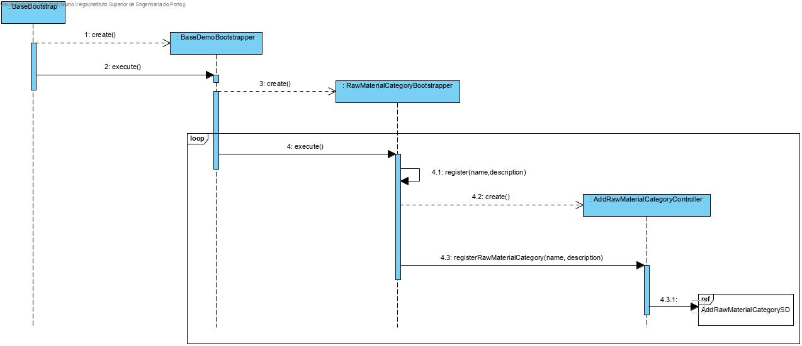
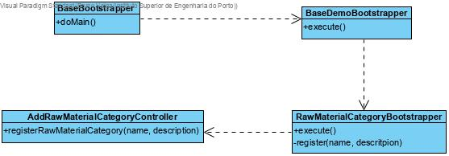
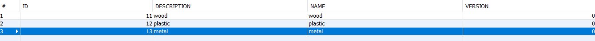

# Raw Material Category Initialization
=======================================

# 1. Requirements 

As a Project Manager

I want some raw material categories to be initialized(bootstrap)

So that there are already some information to test the application


This functionality has to be developed after being possible to add raw material categories to the system.

Basically, there is a need to add raw material categories to the system in order to show the application works.

# 2. Analysis


The domain didn't need any type of alteration because it was already able to support this functionality.

# 3. Design

## 3.1. Functionality realisation




## 3.2. Class diagram



## 3.3. Design patterns applied

This user case uses the controller of user case "Add Raw Material category", so the design patterns applied there will also be applied here.

Besides those, "tell, don't ask" is also applied here. Each and every one of the classes tell the others they create to execute the processes needed to initialize the raw material categories.

## 3.4. Tests

Verification that raw material categories are being added to the database:


 Smoke tests for basic functions:       

    public void testRawMaterialCategory() {
        //save
        repo.save(new RawMaterialCategory("first","first desc"));
        repo.save(new RawMaterialCategory("second","second desc"));
        LOGGER.info("»»» created raw material categories");
      	//findAll
        final Iterable<RawMaterialCategory> l= repo.findAll();
        Invariants.nonNull(l);
        Invariants.nonNull(l.iterator());
        Invariants.ensure(l.iterator().hasNext());
        LOGGER.info("»»» find all raw material categories");
        
        //count
        final long n = repo.count();
        LOGGER.info("»»» # raw material categories = {}", n);
        
        //ofIdentity
        final RawMaterialCategory 
        rm1=repo.ofIdentity("first").orElseThrow(IllegalStateException::new);
        final RawMaterialCategory 
        rm2=repo.ofIdentity("second").orElseThrow(IllegalStateException::new);
        LOGGER.info("»»» found raw material categories of identity");
        
         // containsOfIdentity
        final boolean hasId = repo.containsOfIdentity(rm1.identity());
        Invariants.ensure(hasId);
        LOGGER.info("»»» contains raw material category of identity");
        
        // contains
        final boolean has = repo.contains(rm1);
        Invariants.ensure(has);
        LOGGER.info("»»» contains raw material category");
        
        // delete
        repo.delete(rm1);
        LOGGER.info("»»» delete raw material category");
    
        // deleteOfIdentity
        repo.deleteOfIdentity(rm2.identity());
        LOGGER.info("»»» delete raw material category of identity");
        
        // size
        final long n2 = repo.size();
        Invariants.ensure(n2 == n - 2);
        LOGGER.info("»»» # raw material categories = {}", n2);
    }
# 4. Implementation

## 4.2. Boostrapper

The controller for adding raw material categories was used to initialize categories.

    public class RawMaterialCategoryBootstraper implements Action {
        private static final Logger LOGGER = 	
        LogManager.getLogger(RawMaterialCategoryBootstraper.class);
    	@Override
    	public boolean execute() {
        	register(TestDataConstants.RAW_MATERIAL_CATEGORY_WOOD, "wood");
        	register(TestDataConstants.RAW_MATERIAL_CATEGORY_PLASTIC, "plastic");
       	 	register(TestDataConstants.RAW_MATERIAL_CATEGORY_METAL, "metal");
        	return true;
    	}


​    
​    
## 4.1. Commits

Commit 1: #9: [2-1-1005] - Raw Material Category Initialization #comment Added Engineer process

Commit 2: #9: [2-1-1005] - Raw Material Category Initialization #comment User case implemented 

Commit 3:#9: [2-1-1005] - Raw Material Category Initialization #comment Added and corrected some scenarios

# 5. Integration/Demonstration

An instance of "RawMaterialCategoryBootstrapper" had to be created and run in "BaseDemoBootstrapper" in order to work.

```
public class BaseDemoBootstrapper implements Action {
private static final String POWERUSER_A1 = "poweruserA1";
private static final String POWERUSER = "poweruser";

private final AuthorizationService authz = AuthzRegistry.authorizationService();
private final AuthenticationService authenticationService = AuthzRegistry.authenticationService();

	@Override
	public boolean execute() {
    	// declare bootstrap actions
    	final Action[] actions = { new BackofficeUsersBootstrapper(),
            new ClientUserBootstrapper(),new RawMaterialCategoryBootstraper(),};

    	authenticateForBootstrapping();

    	// execute all bootstrapping
    	boolean ret = true;
    	for (final Action boot : actions) {
        	System.out.println("Bootstrapping " + nameOfEntity(boot) + "...");
        	ret &= boot.execute();
    	}
    	return ret;
	}
	private void register(final String name, final String description) {
    	final AddRawMaterialCategoryController controller = new 			
    		AddRawMaterialCategoryController();
        try {
          	controller.registerRawMaterialCategory(name, description);
        } catch (final IntegrityViolationException | ConcurrencyException ex) {
            // ignoring exception. assuming it is just a primary key violation
            // due to the tentative of inserting a duplicated user
            LOGGER.warn("Assuming {} already exists (activate trace log for details)", 
            LOGGER.trace("Assuming existing record", ex);
        }
    }
}
```
# 6. Observations

This user case was implemented without any issues.

