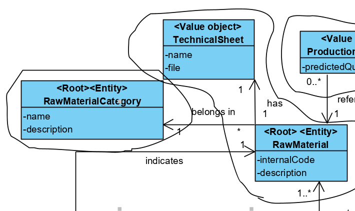
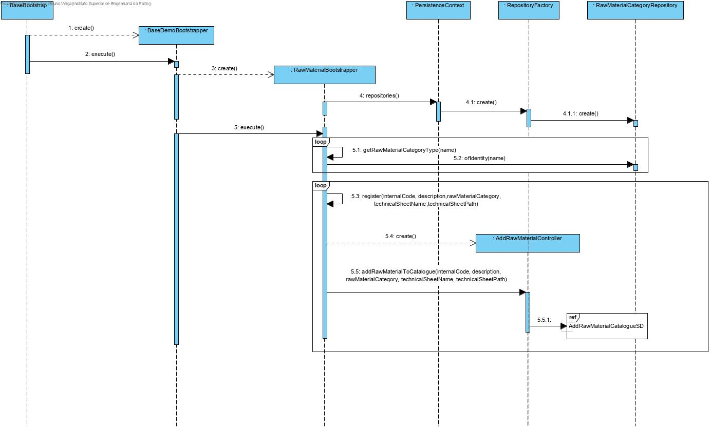
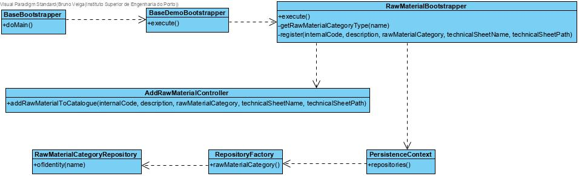
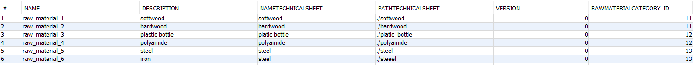

# Raw Material Category Initialization
=======================================

# 1. Requirements 

As the Project Manager

I want some raw materials to be initialized(bootstrap)

So that there are already some information to test the application

This functionality has to be developed after being possible to add raw materials to the system.

Basically, there is a need to add raw materials to the system in order to show the application works.

# 2. Analysis

The domain model was not altered since it was capable of answering this functionality.

# 3. Design

## 3.1. Functionality realisation

## 3.2. Class diagram

## 3.3. Design patterns applied

This user case uses the controller of user case "Add Raw Material", so the design patterns applied there will also be applied here.

Besides those "tell, don't ask" is also applied here. Each and every one of the classes tell the others they create to execute the processes needed to initialize the raw materials.

## 3.4. Tests

Verification that raw materials are being added to the database:

Some smoke tests to test basic functions work:

    public void testRawMaterialCategory() {
    	//setup categories
         aux.save(new RawMaterialCategory("first","first desc"));
         final RawMaterialCategory 
         cat=aux.ofIdentity("first").orElseThrow(IllegalStateException::new);
        
        //save
       
        repo.save(new RawMaterial(Designation.valueOf("first"),"first desc",cat,new 
        TechnicalSheet("first",".///files/teste.pdf")));
        repo.save(new RawMaterial(Designation.valueOf("second"),"second desc",cat, new 
        TechnicalSheet("secind",".///files/teste.pdf")));
        LOGGER.info("»»» created raw materials");
        
        //findAll
        final Iterable<RawMaterial> l= repo.findAll();
        Invariants.nonNull(l);
        Invariants.nonNull(l.iterator());
        Invariants.ensure(l.iterator().hasNext());
        LOGGER.info("»»» find all raw materials");
        
        //count
        final long n = repo.count();
        LOGGER.info("»»» # raw materials = {}", n);
        
        //ofIdentity
        final RawMaterial rm1=repo.ofIdentity(Designation.valueOf("first")).orElseThrow(IllegalStateException::new);
        final RawMaterial rm2=repo.ofIdentity(Designation.valueOf("second")).orElseThrow(IllegalStateException::new);
        LOGGER.info("»»» found raw materials of identity");
        
         // containsOfIdentity
        final boolean hasId = repo.containsOfIdentity(rm1.identity());
        Invariants.ensure(hasId);
        LOGGER.info("»»» contains raw material of identity");
        
        // contains
        final boolean has = repo.contains(rm1);
        Invariants.ensure(has);
        LOGGER.info("»»» contains raw material");
        
        // delete
        repo.delete(rm1);
        LOGGER.info("»»» delete raw material");
    
        // deleteOfIdentity
        repo.deleteOfIdentity(rm2.identity());
        aux.deleteOfIdentity("first");
        LOGGER.info("»»» delete raw material of identity");
        
        // size
        final long n2 = repo.size();
        Invariants.ensure(n2 == n - 2);
        LOGGER.info("»»» # raw materials = {}", n2);
    }
# 4. Implementation

## 4.1. Bootstrapper

The controller for adding  raw materials was used to initialize raw materials.

    public class RawMaterialBootstrapper implements Action {
    	private static final Logger LOGGER = 
    	LogManager.getLogger(RawMaterialBootstrapper.class);
    
    	private final RawMaterialCategoryRepository rawMaterialCategoryRepository = 		
    	PersistenceContext.repositories().rawMaterialCategory();
    
    	private RawMaterialCategory getRawMaterialCategoryType(final String name) {
        return 	
      rawMaterialCategoryRepository.ofIdentity(name).orElseThrow(IllegalStateException::new);
    	}
    
    	@Override
    	public boolean execute() {
        	final RawMaterialCategory wood = 
        	getRawMaterialCategoryType(TestDataConstants.RAW_MATERIAL_CATEGORY_WOOD);
        	final RawMaterialCategory plastic = 
        	getRawMaterialCategoryType(TestDataConstants.RAW_MATERIAL_CATEGORY_PLASTIC);
       	 	final RawMaterialCategory metal = 
       	 	getRawMaterialCategoryType(TestDataConstants.RAW_MATERIAL_CATEGORY_METAL);
        
        	register(TestDataConstants.RAW_MATERIAL_1, "softwood", wood, "softwood.pdf", 	
        	".///files/softwood.pdf");
        	register(TestDataConstants.RAW_MATERIAL_2, "hardwood", wood, "hardwood.pdf", 
        	".///files/hardwood.pdf");
        	register(TestDataConstants.RAW_MATERIAL_3, "plastic bottle.pdf",plastic,"platic 
        	bottle.pdf",".///files/platic_bottle.pdf");
        	register(TestDataConstants.RAW_MATERIAL_4, 
        	"polyamide",plastic,"polyamide.pdf",".///files/polyamide.pdf");
        	register(TestDataConstants.RAW_MATERIAL_5, 
        	"steel",metal,"steel.pdf",".///files/steel.pdf");
        	register(TestDataConstants.RAW_MATERIAL_6, 
        	"iron",metal,"steel.pdf",".///files/steeel.pdf");
    
        	return true;
    	}
    	private void register(final String internalCode, final String description, final 			RawMaterialCategory rawMaterialCategory,
                 final String technicalSheetName, final String technicalSheetPath) {
            	final AddRawMaterialToCatalogueController controller = new 
            	AddRawMaterialToCatalogueController();
            	try {
                	controller.addRawMaterialToCatalogue(internalCode, description, 	
                	rawMaterialCategory, technicalSheetName, technicalSheetPath);
            	} catch (final IntegrityViolationException | ConcurrencyException e) {
                	// ignoring exception. assuming it is just a primary key violation
                	// due to the tentative of inserting a duplicated user
                	LOGGER.warn("Assuming {} already exists (activate trace log for 
                	details)", 
                	description);
                	LOGGER.trace("Assuming existing record", e);
            	}
        	}
        }

## 4.5. Commits

Commit 1: #3: [1-1-1004] - Raw Material Initialization #comment Added engineer process

Commit 2: #3: [1-1-1004] - Raw Material Initialization #comment User case implemented

Commit 3: #3: [1-1-1004] - Raw Material Initialization #comment Added and corrected some scenarios

# 5. Integration/Demonstration

A instance of "RawMaterialBootstrapper" was created and executed in class "BaseDemoBootstrapper".

    public class BaseDemoBootstrapper implements Action {
    	private static final String POWERUSER_A1 = "poweruserA1";
    	private static final String POWERUSER = "poweruser";
    
    	private final AuthorizationService authz = AuthzRegistry.authorizationService();
    	private final AuthenticationService authenticationService = 		
    	AuthzRegistry.authenticationService();
    
    	@Override
    	public boolean execute() {
       	 	// declare bootstrap actions
        	final Action[] actions = { new BackofficeUsersBootstrapper(),
                new ClientUserBootstrapper(),new RawMaterialCategoryBootstrapper(),new 
                RawMaterialBootstrapper(),};
    
        	authenticateForBootstrapping();
    
        	// execute all bootstrapping
        	boolean ret = true;
        	for (final Action boot : actions) {
            	System.out.println("Bootstrapping " + nameOfEntity(boot) + "...");
            	ret &= boot.execute();
        	}
        	return ret;
    	}

# 6. Observations

This functionality was implemented without any issues.
