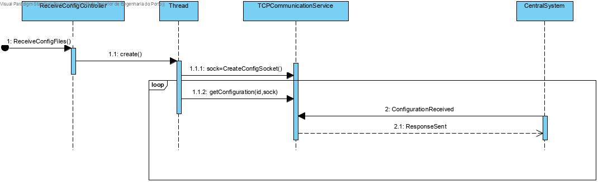
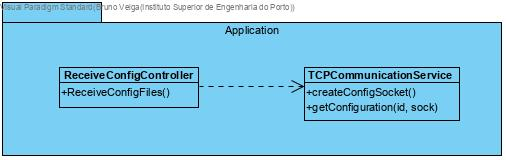

# Receive configuration files
=======================================

# 1. Requirements 

As a project manager	
I want the machine simulator to support receiving config files	
So that the machine can work	

Acceptance criteria:	

- Developed in C with the rest of the machine simulation and the state should be shared among threads

# 2. Analysis

There was no need to apply changes to the domain model.

# 3. Design

## 3.1. Functionality realisation

## 3.2. Class diagram

## 3.3. Design patterns applied

**Single responsible principle: ** Operations related to communication via TCP are all done with the class "TCPCommunicationService".

## 3.4. Tests

**Scenario 1:**

- The machine will work as a server TCP waiting indefinitely for config messages to be sent through the socket, while the rest of the machine works as default.
- Every time a machine receives a message, it updates the machine state.

# 4. Implementation

	extern Machine *m;
	extern pthread_mutex_t mux;
	extern pthread_mutex_t mux_reset;
	extern pthread_cond_t cond_reset;
	
	/*Saves the configuration file the machine is using */
	static void saveConfigFile(char *message){
		FILE *fptr;
		fptr = fopen("config.txt", "w");
		if (fptr == NULL) {
			printf("Error saving configuration");
		}else{
		    fprintf(fptr, "%s", message);
		    fclose(fptr);
		    printf("Configuration file saved\n");
		}
	}
	
	/* Gets the configugarion files from the scm */
	static void getConfigFiles(int *id, SSL *sslConn) {
		char cliIPtext[BUF_SIZE], cliPortText[BUF_SIZE];
		char configuration[6];
		int id_temp;
		char exp = 2;
		if (SSL_read(sslConn, &configuration, 6) == -1) {
			if (pthread_mutex_lock(&mux) != 0) {perror("Error locking mutex tcp\n");exit(1);}
			m->status = NACK;
			if (pthread_mutex_unlock(&mux) != 0) {perror("Error unlocking mutex tcp\n");exit(1);}
		}
		if (pthread_mutex_lock(&mux_reset) != 0) {perror("Error locking mutex reset\n");exit(1);}
		if(m->reset==1) {
			pthread_cond_wait(&cond_reset,&mux_reset);
		}
		if (pthread_mutex_unlock(&mux_reset) != 0) {perror("Error unlocking mutex reset\n");exit(1);}
		if (*(configuration + 1) != exp) {
			perror("Wrong message code\n");
			if (pthread_mutex_lock(&mux) != 0) {perror("Error locking mutex tcp\n");exit(1);}
			m->status = NACK;
			if (pthread_mutex_unlock(&mux) != 0) {perror("Error unlocking mutex tcp\n");exit(1);}
		}
		id_temp = (int) ((unsigned char) *(configuration + 2))
				+ ((unsigned char) *(configuration + 3)) * 256;
		if (id_temp != *id) {
			if (pthread_mutex_lock(&mux) != 0) {perror("Error locking mutex tcp\n");exit(1);}
			m->status = NACK;
			if (pthread_mutex_unlock(&mux) != 0) {perror("Error unlocking mutex tcp\n");exit(1);}
			char *message = (char *) malloc(BUF_SIZE);
			if (message == NULL) {
				perror("Error allocating memory");
				exit(1);
			}
			sprintf(message, "%c%c%c%c%c%c", 0,151,0,0,DATA_LENGTH_BYTE_ONE,DATA_LENGTH_BYTE_TWO);
			/*sprintf((message+6),"Configuration not received - Machine will not start working");*/
			if (SSL_write(sslConn, message, BUF_SIZE) == -1) {
				perror("Error sendind nack message\n");
				exit(1);
			}
			free(message);
		} else {
			if (pthread_mutex_lock(&mux) != 0) {perror("Error locking mutex tcp\n");exit(1);}
			m->status = ACK;
			if (pthread_mutex_unlock(&mux) != 0) {perror("Error unlocking mutex tcp\n");exit(1);}
			char *message = (char *) malloc(BUF_SIZE);
			if (message == NULL) {
				perror("Error allocating memory");
				exit(1);
			}
			sprintf(message, "%c%c%c%c%c%c", 0,150,0,0,DATA_LENGTH_BYTE_ONE,DATA_LENGTH_BYTE_ONE);
			/*sprintf((message + 6), "Configuration received - Machine will start working");*/
			if (SSL_write(sslConn, message, BUF_SIZE) == -1) {
				perror("Error sendind ack message\n");
				exit(1);
			}
			free(message);
		}
	
		int conf_size;
		conf_size=(int) ((unsigned char) *(configuration+4)) + ((unsigned char) *(configuration+5))*256;
		char conf[conf_size];
		if (SSL_read(sslConn, &conf, conf_size)==-1) {
			perror("Error obtaining the configuration\n");
			if (pthread_mutex_lock(&mux) != 0) {perror("Error locking mutex tcp\n");exit(1);}
			m->status = NACK;
			if (pthread_mutex_unlock(&mux) != 0) {perror("Error unlocking mutex tcp\n");exit(1);}
		}
		saveConfigFile(conf);
	
		SSL_free(sslConn);
	}
	
	/*Creates the socket for receiving configuration files*/
	void *createConfigSocket(void *arg) {
		int *id=(int *)arg;
		struct sockaddr_storage from;
		char cliIPtext[BUF_SIZE], cliPortText[BUF_SIZE];
		int err, newSock, sock;
		unsigned int adl;
		struct addrinfo req, *list;
	
		bzero((char *) &req, sizeof(req));
		// requesting a IPv6 local address will allow both IPv4 and IPv6 clients to use it
		req.ai_family = AF_INET6;
		req.ai_socktype = SOCK_STREAM;
		req.ai_flags = AI_PASSIVE;      // local address
	
		err = getaddrinfo(NULL, "9999", &req, &list);
	
		if (err) {
			printf("Failed to get local address, error: %s\n", gai_strerror(err));
			exit(1);
		}
	
		sock = socket(list->ai_family, list->ai_socktype, list->ai_protocol);
		if (sock == -1) {
			perror("Failed to open socket");
			freeaddrinfo(list);
			exit(1);
		}
	
		if (bind(sock, (struct sockaddr *) list->ai_addr, list->ai_addrlen) == -1) {
			perror("Bind failed");
			close(sock);
			freeaddrinfo(list);
			exit(1);
		}
	
		freeaddrinfo(list);
	
		listen(sock, SOMAXCONN);
	
		const SSL_METHOD *method;
	        SSL_CTX *ctx;
	
		method = SSLv23_server_method();
	        ctx = SSL_CTX_new(method);
	
		// Load the server's certificate and key
		SSL_CTX_use_certificate_file(ctx, MACHINE_SSL_CERT_FILE, SSL_FILETYPE_PEM);
		SSL_CTX_use_PrivateKey_file(ctx, MACHINE_SSL_KEY_FILE, SSL_FILETYPE_PEM);
		if (!SSL_CTX_check_private_key(ctx)) {
			puts("Error loading server's certificate/key");
			close(sock);
			exit(1);
		}
	
		// THE CLIENTS' CERTIFICATES ARE TRUSTED
		SSL_CTX_load_verify_locations(ctx,SCM_SSL_CERT_FILE,NULL);
	
		// Restrict TLS version and cypher suite
		SSL_CTX_set_min_proto_version(ctx,TLS1_2_VERSION);
		SSL_CTX_set_cipher_list(ctx, "HIGH:!aNULL:!kRSA:!PSK:!SRP:!MD5:!RC4");
	
		// The client must provide a certificate and it must be trusted, the handshake will fail otherwise
		SSL_CTX_set_verify(ctx, SSL_VERIFY_PEER|SSL_VERIFY_FAIL_IF_NO_PEER_CERT, NULL);
	
		puts("Accepting TCP connections (both over IPv6 or IPv4)");
	
		adl = sizeof(from);
		while (1) {
			newSock = accept(sock, (struct sockaddr *) &from, &adl);
			getnameinfo((struct sockaddr *) &from, adl, cliIPtext, BUF_SIZE, cliPortText, BUF_SIZE, NI_NUMERICHOST | NI_NUMERICSERV);
			printf("New connection from node %s, port number %s\n", cliIPtext, cliPortText);
			SSL *sslConn = SSL_new(ctx);
			SSL_set_fd(sslConn, newSock);
			if(SSL_accept(sslConn)!=1) {
				puts("TLS handshake error: client not authorized");
				SSL_free(sslConn);
	            close(newSock);
			}
			printf("TLS version: %s\nCypher suite: %s\n",SSL_get_cipher_version(sslConn),SSL_get_cipher(sslConn));
			X509* cert=SSL_get_peer_certificate(sslConn);
	        X509_free(cert);
			X509_NAME_oneline(X509_get_subject_name(cert),cliIPtext,BUF_SIZE);
	        printf("Client's certificate subject: %s\n",cliIPtext);
			getConfigFiles(id,sslConn);
			printf("Connection from node %s, port number %s closed\n", cliIPtext,cliPortText);
		}
		pthread_exit((void*)NULL);
	
	}extern Machine *m;
	extern pthread_mutex_t mux;
	extern pthread_mutex_t mux_reset;
	extern pthread_cond_t cond_reset;
	
	static void saveConfigFile(char *message){
		FILE *fptr;
		fptr = fopen("config.txt", "w");
		if (fptr == NULL) {
			printf("Error saving configuration");
		}else{
		    fprintf(fptr, "%s", message);
		    fclose(fptr);
		    printf("Configuration file saved\n");
		}
	}
	
	static void getConfigFiles(int *id, int sock) {
		char cliIPtext[BUF_SIZE], cliPortText[BUF_SIZE];
		char configuration[6];
		int id_temp;
		char exp = 2;
		if (read(sock, &configuration, 6) == -1) {
			if (pthread_mutex_lock(&mux) != 0) {perror("Error locking mutex tcp\n");exit(1);}
			m->status = NACK;
			if (pthread_mutex_unlock(&mux) != 0) {perror("Error unlocking mutex tcp\n");exit(1);}
		}
		if (pthread_mutex_lock(&mux_reset) != 0) {perror("Error locking mutex reset\n");exit(1);}
		if(m->reset==1) {
			pthread_cond_wait(&cond_reset,&mux_reset);
		}
		if (pthread_mutex_unlock(&mux_reset) != 0) {perror("Error unlocking mutex reset\n");exit(1);}
		if (*(configuration + 1) != exp) {
			perror("Wrong message code\n");
			if (pthread_mutex_lock(&mux) != 0) {perror("Error locking mutex tcp\n");exit(1);}
			m->status = NACK;
			if (pthread_mutex_unlock(&mux) != 0) {perror("Error unlocking mutex tcp\n");exit(1);}
		}
		id_temp = (int) ((unsigned char) *(configuration + 2))
				+ ((unsigned char) *(configuration + 3)) * 256;
		if (id_temp != *id) {
			if (pthread_mutex_lock(&mux) != 0) {perror("Error locking mutex tcp\n");exit(1);}
			m->status = NACK;
			if (pthread_mutex_unlock(&mux) != 0) {perror("Error unlocking mutex tcp\n");exit(1);}
			char *message = (char *) malloc(BUF_SIZE);
			if (message == NULL) {
				perror("Error allocating memory");
				exit(1);
			}
			sprintf(message, "%c%c%c%c%c%c", 0,151,0,0,DATA_LENGTH_BYTE_ONE,DATA_LENGTH_BYTE_TWO);
			/*sprintf((message+6),"Configuration not received - Machine will not start working");*/
			if (write(sock, message, BUF_SIZE) == -1) {
				perror("Error sendind nack message\n");
				exit(1);
			}
			free(message);
		} else {
			if (pthread_mutex_lock(&mux) != 0) {perror("Error locking mutex tcp\n");exit(1);}
			m->status = ACK;
			if (pthread_mutex_unlock(&mux) != 0) {perror("Error unlocking mutex tcp\n");exit(1);}
			char *message = (char *) malloc(BUF_SIZE);
			if (message == NULL) {
				perror("Error allocating memory");
				exit(1);
			}
			sprintf(message, "%c%c%c%c%c%c", 0,150,0,0,DATA_LENGTH_BYTE_ONE,DATA_LENGTH_BYTE_ONE);
			/*sprintf((message + 6), "Configuration received - Machine will start working");*/
			if (write(sock, message, BUF_SIZE) == -1) {
				perror("Error sendind ack message\n");
				exit(1);
			}
			free(message);
		}
	int conf_size;
	conf_size=(int) ((unsigned char) *(configuration+4)) + ((unsigned char) *(configuration+5))*256;
	char conf[conf_size];
	if (read(sock, &conf, conf_size)==-1) {
		perror("Error obtaining the configuration\n");
		if (pthread_mutex_lock(&mux) != 0) {perror("Error locking mutex tcp\n");exit(1);}
		m->status = NACK;
		if (pthread_mutex_unlock(&mux) != 0) {perror("Error unlocking mutex tcp\n");exit(1);}
	}
	saveConfigFile(conf);
	
	close(sock);
	}
	
	void *createConfigSocket(void *arg) {
		int *id=(int *)arg;
		struct sockaddr_storage from;
		char cliIPtext[BUF_SIZE], cliPortText[BUF_SIZE];
		int err, newSock, sock;
		unsigned int adl;
		struct addrinfo req, *list;
		bzero((char *) &req, sizeof(req));
	// requesting a IPv6 local address will allow both IPv4 and IPv6 clients to use it
	req.ai_family = AF_INET6;
	req.ai_socktype = SOCK_STREAM;
	req.ai_flags = AI_PASSIVE;      // local address
	
	err = getaddrinfo(NULL, "9999", &req, &list);
	
	if (err) {
		printf("Failed to get local address, error: %s\n", gai_strerror(err));
		exit(1);
	}
	
	sock = socket(list->ai_family, list->ai_socktype, list->ai_protocol);
	if (sock == -1) {
		perror("Failed to open socket");
		freeaddrinfo(list);
		exit(1);
	}
	printf("socket in create config socket: %d\n", sock);
	
	if (bind(sock, (struct sockaddr *) list->ai_addr, list->ai_addrlen) == -1) {
		perror("Bind failed");
		close(sock);
		freeaddrinfo(list);
		exit(1);
	}
	
	freeaddrinfo(list);
	
	listen(sock, SOMAXCONN);
	
	puts("Accepting TCP connections (both over IPv6 or IPv4)");
	
	adl = sizeof(from);
	while (1) {
		newSock = accept(sock, (struct sockaddr *) &from, &adl);
		getnameinfo((struct sockaddr *) &from, adl, cliIPtext, BUF_SIZE, cliPortText, BUF_SIZE, NI_NUMERICHOST | NI_NUMERICSERV);
		printf("New connection from node %s, port number %s\n", cliIPtext, cliPortText);
		getConfigFiles(id,newSock);
		printf("Connection from node %s, port number %s closed\n", cliIPtext,cliPortText);
	}
	pthread_exit((void*)NULL);
	}
# 5. Integration/Demonstration

	pthread_t thread_ids;
	pthread_t thread_MS;
	pthread_t thread_cf;
	pthread_mutex_t mux;
	pthread_mutex_t mux_reset;
	pthread_cond_t cond_reset;
	int sock ;
	SSL *sslConn;
	Machine *m=NULL;
	
	/*Turns the machine on and starts the communications protocols */
	void *turnOnMachine(void *arg) {
		if(pthread_mutex_init(&mux, NULL)!=0) {perror("Error creating mutex\n");exit(1);}
		if(pthread_mutex_init(&mux_reset, NULL)!=0) {perror("Error creating mutex\n");exit(1);}
		if(pthread_cond_init(&cond_reset, NULL)!=0) {perror("Error creating conditional variable\n");exit(1);}
		args *a;
		a=(args*) arg;
		sslConn = validateMachine(a->id,&sock);
		m = createMachine(a->id, a->time, a->internalCode, sock,sslConn);
		if(pthread_create(&thread_ids, NULL, sendmessages_func, (void*) NULL)!=0) {perror("Error creating tcp thread\n");exit(1);}
		if(pthread_create(&thread_MS, NULL, establishConnectionToTheMonitoringSystem, (void *) NULL)!=0) {perror("Error creating udp thread\n");exit(1);}
		if(pthread_create(&thread_cf,NULL,createConfigSocket,(void *)&(m->id))!=0) {perror("Error creating tcp config thread\n");exit(1);}
		pthread_exit((void*)NULL);
	}
	
	/*Turns the machine off*/
	int turnOffMachines() {
		int i;
	if (pthread_join(thread_ids, NULL) != 0) {
		perror("Error in closing thread tcp");
		exit(1);
	}
	if (pthread_join(thread_MS, NULL) != 0) {
		perror("Error in closing thread udp");
		exit(1);
	}
	if (pthread_join(thread_cf, NULL) != 0) {
		perror("Error in closing thread tcp config");
		exit(1);
	}
	closeSocket(sock,sslConn);
	if(pthread_mutex_destroy(&mux)!=0) {perror("Error destroying mutex\n");exit(1);}
	if(pthread_mutex_destroy(&mux_reset)!=0) {perror("Error destroying mutex\n");exit(1);}
	if(pthread_cond_destroy(&cond_reset)!=0) {perror("Error destroying conditional variable\n");exit(1);}
	printf("Closed threads\n");
	return 0;
	}
# 6. Observations

The user case was implemented without any issues.