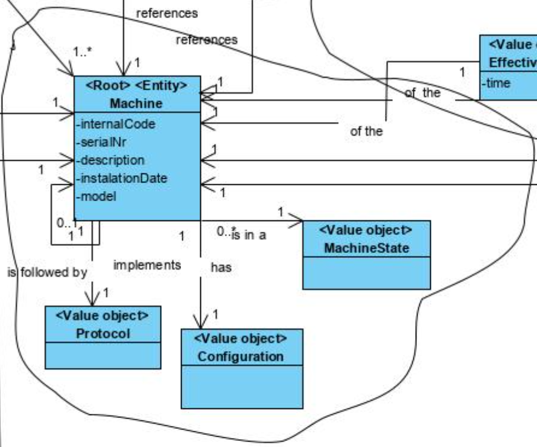
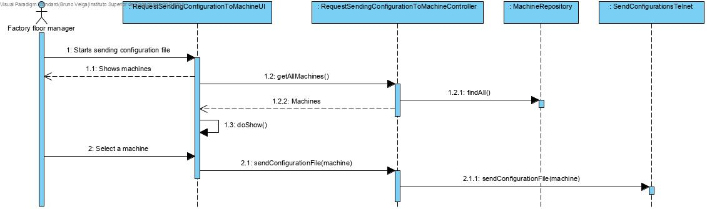
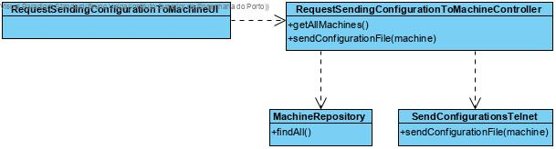

# Add Raw Material Category
=======================================

# 1. Requirements 

As a factory floor manager 
I want to send a configuration to a specific machine 
So that it can start working under those configurations 

# 2. Analysis

# 3. Design

## 3.1. Functionality realisation

## 3.2. Class diagram

## 3.3. Design patterns applied

**Pure Fabrication** - used in the creation of the class "RequestSendingConfigurationToMachineUI", since no other rule can be applied to create it.

**Controller** - the class "RequestSendingMachineConfigurationController" controls the user case.

**Simple responsibility** - "SendConfigurationTelnet" is the only one responsible for communicating with scm.

**Repository** - There is a class ("MachineRepository") responsible for operations related to the database.

**Command:** In the presentation classes of this UC is used classes that implement actions and are responsible for executing the UI related to a certain menu option (RequestSendingConfigurationToMachineAction executes RequestSendingConfigurationToMachineUI).

## 3.4. Tests 
**Scenario 1:**

1. Start the backoffice application
2. Login as factory floor manager
3. Select option machine management and then send configuration to machine
4. Select one machine from the list presented
5. Select one configuration from the list presented
6. The backoffice application will communicate with the SCM application through telnet sending the configuration and the machine chosen, then the SCM will send that configuration to the right machine through the socket that connects the SCM with that machine.

# 4. Implementation

### 4.1. Application

    public class RequestSendingConfigurationToMachineController implements Controller {
    private final AuthorizationService authz = AuthzRegistry.authorizationService();
    private final MachineRepository repository = PersistenceContext.repositories().machine();
    
    public Iterable<Machine> getAllMachines() {
        authz.ensureAuthenticatedUserHasAnyOf(BaseRoles.POWER_USER, BaseRoles.FACTORY_FLOOR_MANAGER);
        return repository.findAll();
    }
    
    public void sendConfigurationFile(Machine machine, ConfigurationFile configFile) throws IOException {
        authz.ensureAuthenticatedUserHasAnyOf(BaseRoles.POWER_USER, BaseRoles.FACTORY_FLOOR_MANAGER);
        new SendConfigurationsTelnet().sendConfigurationFile(machine, configFile);
    }
    }

    public class SendConfigurationsTelnet {
    public void sendConfigurationFile(Machine machine,ConfigurationFile configFile) throws IOException {
        try (Socket soc = new Socket("localhost", 23)) {
            String message;
            DataInputStream din = new DataInputStream(soc.getInputStream());
            DataOutputStream dout = new DataOutputStream(soc.getOutputStream());
            BufferedReader br = new BufferedReader(new InputStreamReader(System.in));
            message = String.format("%s;%s", machine.identity(),Arrays.toString(configFile.getFile()));
            dout.writeUTF(message);
        }
    }
    }
### 4.2. Presentation

    public class RequestSendingConfigurationToMachineUI extends AbstractUI {
    private final RequestSendingConfigurationToMachineController theController = new RequestSendingConfigurationToMachineController();
    
    protected Controller controller() {
        return this.theController;
    }
    
    @Override
    protected boolean doShow() {
        final Iterable<Machine> machines = this.theController.getAllMachines();
    
        final SelectWidget<Machine> selector = new SelectWidget<>("Machines:", machines,
                new MachinePrinter());
        System.out.println("Please make sure SCM is on before proceeding.");
        Console.readLine("(Press Enter to continue)");
        selector.show();
        final Machine theMachine=selector.selectedElement();
        if(theMachine==null) return false;
        final Iterable<ConfigurationFile> configFiles = theMachine.configList();
        if(!configFiles.iterator().hasNext()){
            System.out.println("This machine has no configuration files");
            return false;
        }
        final SelectWidget<ConfigurationFile> selectorc = new SelectWidget<>("Configuration files:", configFiles,
                new ConfigFilesPrinter());
        selectorc.show();
        final ConfigurationFile theConfigFile= selectorc.selectedElement();
        if(theConfigFile==null) return false;
        try {
            theController.sendConfigurationFile(theMachine, theConfigFile);
        } catch (IOException e) {
            e.printStackTrace();
        }
        return false;
    }
    
    @Override
    public String headline() {
        return "Request sending a configuration to machine";
    }
    }

# 5. Integration/Demonstration

      private Menu buildMainMenu() {
            final Menu mainMenu = new Menu();
    
            final Menu myUserMenu = new MyUserMenu();
            mainMenu.addSubMenu(MY_USER_OPTION, myUserMenu);
    
            if (!Application.settings().isMenuLayoutHorizontal()) {
                mainMenu.addItem(MenuItem.separator(SEPARATOR_LABEL));
            }
    
            if (authz.isAuthenticatedUserAuthorizedTo(BaseRoles.POWER_USER, BaseRoles.ADMIN)) {
                final Menu usersMenu = buildUsersMenu();
                mainMenu.addSubMenu(USERS_OPTION, usersMenu);
                final Menu settingsMenu = buildAdminSettingsMenu();
                mainMenu.addSubMenu(SETTINGS_OPTION, settingsMenu);
            }
    
            if (authz.isAuthenticatedUserAuthorizedTo(BaseRoles.POWER_USER, BaseRoles.PRODUCTION_MANAGER)) {
                final Menu rawMaterialMenu = buildRawMaterialCategoryMenu();
                mainMenu.addSubMenu(RAW_MATERIAL_OPTION, rawMaterialMenu);
                final Menu productsMenu = buildProductMenu();
                mainMenu.addSubMenu(PRODUCT_OPTION, productsMenu);
                final Menu productionOrdersMenu = buildProductionOrdersMenu();
                mainMenu.addSubMenu(PRODUCTION_ORDER_OPTION, productionOrdersMenu);
                final Menu messagesMenu = buildMessagesMenu();
                mainMenu.addSubMenu(MESSAGES_OPTION, messagesMenu);
                mainMenu.addItem(EXPORT,"Export information",new ExportInformationAction());
            }
    
            if (authz.isAuthenticatedUserAuthorizedTo(BaseRoles.POWER_USER, BaseRoles.FACTORY_FLOOR_MANAGER)) {
                final Menu depositMenu = buildDepositMenu();
                mainMenu.addSubMenu(DEPOSIT_OPTION, depositMenu);
                final Menu machineMenu = buildMachineMenu();
                mainMenu.addSubMenu(MACHINE_OPTION, machineMenu);
                final Menu pLineMenu = buildProductionLineMenu();
                mainMenu.addSubMenu(PRODUCTION_LINE_OPTION, pLineMenu);
            }
    
            if (!Application.settings().isMenuLayoutHorizontal()) {
                mainMenu.addItem(MenuItem.separator(SEPARATOR_LABEL));
            }
    
            mainMenu.addItem(EXIT_OPTION, "Exit", new ExitWithMessageAction());
    
            return mainMenu;
        }
        
     private Menu buildMachineMenu() {
            final Menu menu = new Menu("Machine >");
        menu.addItem(SPECIFY_MACHINE_OPTION, "Specify Machine", new SpecifyMachineAction());
        menu.addItem(ATTACH_CONFIGURATION_FILE_TO_MACHINE, "Attach configuration file to machine", new AttachConfigurationFileToMachineAction());
        menu.addItem(CONFIG_MACHINE,"Send configuration to a machine",new RequestSendingConfigurationToMachineAction());
        menu.addItem(EXIT_OPTION, RETURN_LABEL, Actions.SUCCESS);
        
        return menu;
    }
# 6. Observations

The user case was implemented without any issues.