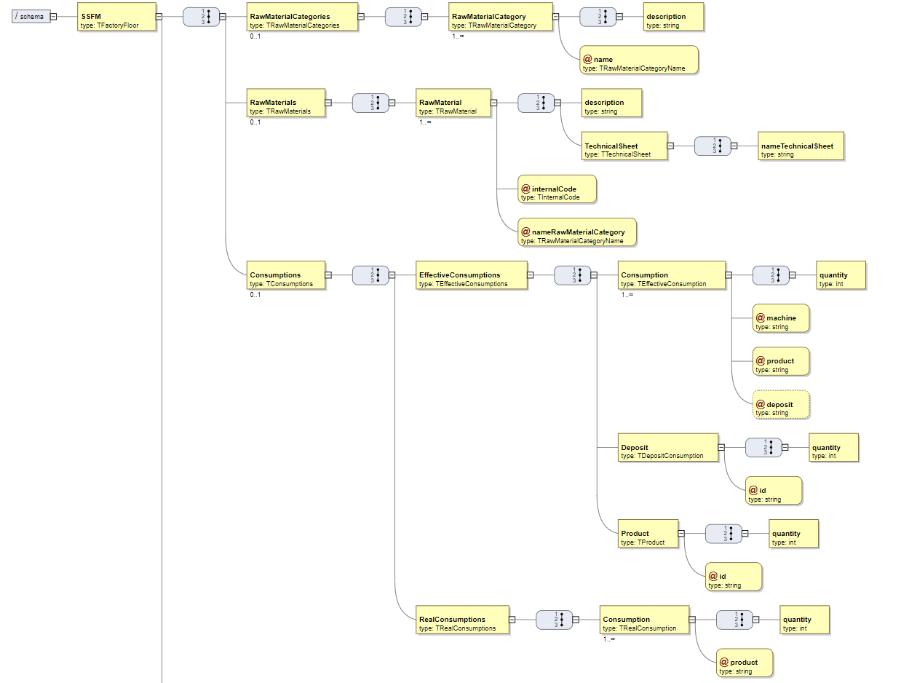

# Specify XSD document(ram material categories, raw materials, real and effective consumption)
=======================================

# 1. Requirements 

As Project Manager, I want the team to specify a XSD document that, later, can be used to validate XML content that is generated by the system.
The XSD should evaluate all information related to factory floor (e.g. products, raw materials, machines, production lines, categories, production orders, production sheets, lots, actual and efective intake, waste, deviations, production times, among others).

Acceptance criteria: 

Some information may be obtain by aggregates(intake)

# 2. Analysis

# 3. Design

## 3.4. Tests

XMLDocument used for test: 

	<?xml version="1.0" encoding="UTF-8"?>
	<!--
	To change this license header, choose License Headers in Project Properties.
	To change this template file, choose Tools | Templates
	and open the template in the editor.
	-->
	
	<SSFM
	    xmlns:xsi='http://www.w3.org/2001/XMLSchema-instance'
	    xsi:noNamespaceSchemaLocation='1180712.xsd'>
	    <RawMaterialCategories>
			<RawMaterialCategory name="cat1">
				<description>Wood</description>
			</RawMaterialCategory>
			<RawMaterialCategory name="cat2">
				<description>Metal</description>
			</RawMaterialCategory>
		</RawMaterialCategories>
	<RawMaterials>
		<RawMaterial internalCode="rm1" nameRawMaterialCategory="cat1">
			<description>softwood</description>
			<TechnicalSheet>
				<nameTechnicalSheet>softwood.pdf</nameTechnicalSheet>
			</TechnicalSheet>
		</RawMaterial>
		<RawMaterial internalCode="rm2" nameRawMaterialCategory="cat1">
			<description>softwood</description>
			<TechnicalSheet>
				<nameTechnicalSheet>softwood.pdf</nameTechnicalSheet>
			</TechnicalSheet>
		</RawMaterial>
		<RawMaterial internalCode="rm3" nameRawMaterialCategory="cat2">
			<description>iron</description>
			<TechnicalSheet>
				<nameTechnicalSheet>iron.pdf</nameTechnicalSheet>
			</TechnicalSheet>
		</RawMaterial>
		<RawMaterial internalCode="rm4" nameRawMaterialCategory="cat2">
			<description>steel</description>
			<TechnicalSheet>
				<nameTechnicalSheet>steel.pdf</nameTechnicalSheet>
			</TechnicalSheet>
		</RawMaterial>
	</RawMaterials>
	
	<Consumptions>
		<EffectiveConsumptions>
			<Consumption machine="m1" deposit="d1" product="rm1">
				<quantity>20</quantity>
			</Consumption>
			<Consumption machine="m2" deposit="d2" product="rm2">
				<quantity>20</quantity>
			</Consumption>
			<Deposit id="d1">
				<quantity>20</quantity>
			</Deposit>
			<Product id="rm1">
				<quantity>40</quantity>
			</Product>
		</EffectiveConsumptions>
		<RealConsumptions>
			<Consumption product="rm1">
				<quantity>40</quantity>
			</Consumption>
			<Consumption product="rm2">
				<quantity>60</quantity>
			</Consumption>
		</RealConsumptions>
	</Consumptions>
	</SSFM>

Global XML document used for testing:

# 4. Implementation

    <?xml version="1.0" encoding="UTF-8"?>
    
    <xsd:schema xmlns:xsd="http://www.w3.org/2001/XMLSchema">
    	
        <xsd:element name="SSFM" type="TFactoryFloor">
            <xsd:key name="RawMaterialCategoryKey">
                <xsd:selector xpath="RawMaterialCategories/RawMaterialCategory"/>
                <xsd:field xpath="@name"/>
            </xsd:key>
            <xsd:key name="RawMaterialKey">
                <xsd:selector xpath="RawMaterials/RawMaterial"/>
                <xsd:field xpath="@internalCode"/>   
            </xsd:key>
            <xsd:keyref name="RawMaterialRefKey" refer="RawMaterialCategoryKey">
                <xsd:selector xpath="RawMaterials/RawMaterial"/>
                <xsd:field xpath="@nameRawMaterialCategory"/>   
            </xsd:keyref>
            <xsd:keyref name="ConsumptionRawMaterialRefKey" refer="RawMaterialKey">
                <xsd:selector xpath="Consumptions/Consumption"/>
                <xsd:field xpath="@product"/>   
            </xsd:keyref>
            <xsd:keyref name="RawMaterialGlobalRefKey" refer="RawMaterialKey">
                <xsd:selector xpath="Consumptions/EffectiveConsumptions/Product"/>
                <xsd:field xpath="@id"/>   
            </xsd:keyref>
    		<xsd:keyref name="RealConsumptionProductRefKey" refer="RawMaterialKey">
    			<xsd:selector xpath="Consumptions/RealConsumptions/Consumption"/>
                <xsd:field xpath="@product"/>   
            </xsd:keyref>
                    
            <!-- These elements are represented by other members of the group, so this part should be commented here to be able to test -->
            <!--<xsd:keyref name="ConsumptionDepositRefKey" refer="DepositKey">
                <xsd:selector xpath="Consumptions/EffectiveConsumptions/Consumption"/>
                <xsd:field xpath="@deposit"/>   
            </xsd:keyref>
    		<xsd:keyref name="MachineRefKey" refer="MachineKey">
                <xsd:selector xpath="Consumptions/EffectiveConsumptions/Consumption"/>
                <xsd:field xpath="@machine"/>   
            </xsd:keyref>
            <xsd:keyref name="ConsumptionProductRefKey" refer="ProductKey">
                <xsd:selector xpath="Consumptions/EffectiveConsumptions/Consumption"/>
                <xsd:field xpath="@product"/>   
            </xsd:keyref>
    		<xsd:keyref name="ProductRefKey" refer="ProductKey">
    			<xsd:selector xpath="Consumptions/EffectiveConsumptions/Product"/>
    			<xsd:field xpath="@id"/>
    		</xsd:keyref>
            <xsd:keyref name="DepositRefKey" refer="DepositKey">
                <xsd:selector xpath="Consumptions/EffectiveConsumptions/Deposit"/>
                <xsd:field xpath="@id"/>   
            </xsd:keyref>
    		<xsd:keyref name="RealConsumptionProductRefKey" refer="ProductKey">
    			<xsd:selector xpath="Consumptions/RealConsumptions/Consumption"/>
                <xsd:field xpath="@product"/>   
            </xsd:keyref>-->
        </xsd:element>
    
        <!-- General -->		
        <xsd:complexType name="TFactoryFloor">
            <xsd:sequence>
                <xsd:element name="RawMaterialCategories" type="TRawMaterialCategories" minOccurs="0"/>
                <xsd:element name="RawMaterials" type="TRawMaterials" minOccurs="0"/>
                <xsd:element name="Consumptions" type="TConsumptions" minOccurs="0"/>
            </xsd:sequence>
        </xsd:complexType>
    	
    	<xsd:simpleType name="TInternalCode">
    		<xsd:restriction base="xsd:string">
    			<xsd:maxLength value="15"/>
    		</xsd:restriction>
    	</xsd:simpleType>
    
        <!-- Raw Material Categories -->
        <xsd:complexType name="TRawMaterialCategories">
            <xsd:sequence>
                <xsd:element name="RawMaterialCategory" type="TRawMaterialCategory" maxOccurs="unbounded"/>
            </xsd:sequence>
        </xsd:complexType>
    
        <xsd:complexType name="TRawMaterialCategory">
            <xsd:sequence>
                <xsd:element name="description" type="xsd:string"/>
            </xsd:sequence>
            <xsd:attribute name="name" type="TRawMaterialCategoryName" use="required"/>
        </xsd:complexType>
    
        <xsd:simpleType name="TRawMaterialCategoryName">
            <xsd:restriction base="xsd:string">
                <xsd:maxLength value="10"/>
            </xsd:restriction>
        </xsd:simpleType>
    
        <!-- Raw Materials -->
         <xsd:complexType name="TRawMaterials">
            <xsd:sequence>
                <xsd:element name="RawMaterial" type="TRawMaterial" maxOccurs="unbounded"/>
            </xsd:sequence>
        </xsd:complexType>
    
        <xsd:complexType name="TRawMaterial">
            <xsd:sequence>
                <xsd:element name="description" type="xsd:string"/>
    			<xsd:element name="TechnicalSheet" type="TTechnicalSheet"/>
            </xsd:sequence>
            <xsd:attribute name="internalCode" type="TInternalCode" use="required"/>
            <xsd:attribute name="nameRawMaterialCategory" type="TRawMaterialCategoryName" use="required"/>
        </xsd:complexType>
    	
    	<xsd:complexType name="TTechnicalSheet">
    		<xsd:sequence>
    			<xsd:element name="nameTechnicalSheet" type="xsd:string"/> 
    		</xsd:sequence>
    	</xsd:complexType>
    	
        <!-- Comsumption -->
        <xsd:complexType name="TConsumptions">
            <xsd:sequence>
    			<xsd:element name="EffectiveConsumptions" type="TEffectiveConsumptions"/>
    			<xsd:element name="RealConsumptions" type="TRealConsumptions"/>
            </xsd:sequence>
        </xsd:complexType>
    	
    	<xsd:complexType name="TEffectiveConsumptions">
    		<xsd:sequence>
    			<xsd:element name="Consumption" type="TEffectiveConsumption" maxOccurs="unbounded"/>
                <xsd:element name="Deposit" type="TDepositConsumption"/>
                <xsd:element name="Product" type="TProduct"/>
    		</xsd:sequence>
    	</xsd:complexType>
        
        <xsd:complexType name="TEffectiveConsumption">
            <xsd:sequence>
                <xsd:element name="quantity" type="xsd:int"/>
            </xsd:sequence>
            <xsd:attribute name="machine" type="xsd:string" use="required"/>
            <xsd:attribute name="product" type="xsd:string" use="required"/>
            <xsd:attribute name="deposit" type="xsd:string" use="optional"/>
        </xsd:complexType>
        
        <xsd:complexType name="TDepositConsumption">
            <xsd:sequence>
                <xsd:element name="quantity" type="xsd:int"/>
            </xsd:sequence>
            <xsd:attribute name="id" type="xsd:string" use="required"/>
        </xsd:complexType>
        
        <xsd:complexType name="TProduct">
            <xsd:sequence>
                <xsd:element name="quantity" type="xsd:int"/>
            </xsd:sequence>
            <xsd:attribute name="id" type="xsd:string" use="required"/>
        </xsd:complexType>
    	
    	<xsd:complexType name="TRealConsumptions">
    		<xsd:sequence>
    			<xsd:element name="Consumption" type="TRealConsumption" maxOccurs="unbounded"/>
    		</xsd:sequence>
    	</xsd:complexType>
    	
    	<xsd:complexType name="TRealConsumption">
    		<xsd:sequence>
    			<xsd:element name="quantity" type="xsd:int"/>
    		</xsd:sequence>
    		<xsd:attribute name="product" type="xsd:string" use="required"/> 
    	</xsd:complexType>
       
    </xsd:schema>

# 5. Integration/Demonstration

The implementation already contains the integration, although the lines are commented.

# 6. Observations

The user case was implemented without any issues.

