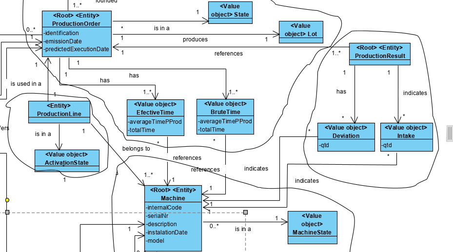
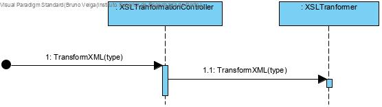
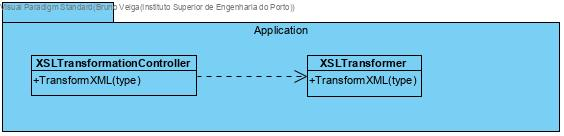

# XSLT Transformation
=======================================

# 1. Requirements 

As a production manager
I want to transform the xml files previously exported 
So that they are availble to be consulted

Acceptance criteria:

 - XSLT must be used

# 2. Analysis

# 3. Design

## 3.1. Functionality realisation

The decisions related to the content of which transformed file are detailed in the xml report done by the team.

## 3.2. Class diagram

## 3.4. Tests

XMLDocument used for test: 

	<?xml version="1.0" encoding="UTF-8"?>
	<!--
	To change this license header, choose License Headers in Project Properties.
	To change this template file, choose Tools | Templates
	and open the template in the editor.
	-->
	
	<SSFM
	    xmlns:xsi='http://www.w3.org/2001/XMLSchema-instance'
	    xsi:noNamespaceSchemaLocation='1180712.xsd'>
	    <RawMaterialCategories>
			<RawMaterialCategory name="cat1">
				<description>Wood</description>
			</RawMaterialCategory>
			<RawMaterialCategory name="cat2">
				<description>Metal</description>
			</RawMaterialCategory>
		</RawMaterialCategories>
	<RawMaterials>
		<RawMaterial internalCode="rm1" nameRawMaterialCategory="cat1">
			<description>softwood</description>
			<TechnicalSheet>
				<nameTechnicalSheet>softwood.pdf</nameTechnicalSheet>
			</TechnicalSheet>
		</RawMaterial>
		<RawMaterial internalCode="rm2" nameRawMaterialCategory="cat1">
			<description>softwood</description>
			<TechnicalSheet>
				<nameTechnicalSheet>softwood.pdf</nameTechnicalSheet>
			</TechnicalSheet>
		</RawMaterial>
		<RawMaterial internalCode="rm3" nameRawMaterialCategory="cat2">
			<description>iron</description>
			<TechnicalSheet>
				<nameTechnicalSheet>iron.pdf</nameTechnicalSheet>
			</TechnicalSheet>
		</RawMaterial>
		<RawMaterial internalCode="rm4" nameRawMaterialCategory="cat2">
			<description>steel</description>
			<TechnicalSheet>
				<nameTechnicalSheet>steel.pdf</nameTechnicalSheet>
			</TechnicalSheet>
		</RawMaterial>
	</RawMaterials>
	
	<Consumptions>
		<EffectiveConsumptions>
			<Consumption machine="m1" deposit="d1" product="rm1">
				<quantity>20</quantity>
			</Consumption>
			<Consumption machine="m2" deposit="d2" product="rm2">
				<quantity>20</quantity>
			</Consumption>
			<Deposit id="d1">
				<quantity>20</quantity>
			</Deposit>
			<Product id="rm1">
				<quantity>40</quantity>
			</Product>
		</EffectiveConsumptions>
		<RealConsumptions>
			<Consumption product="rm1">
				<quantity>40</quantity>
			</Consumption>
			<Consumption product="rm2">
				<quantity>60</quantity>
			</Consumption>
		</RealConsumptions>
	</Consumptions>
	</SSFM>

**Scenario 1**

1. Start backoffice application and login as production manager
2. Select option export information 
3. Enter a valid final to export to and then select all information to be exported
4. Then select the option to transform the XML file to one of the possibilities or all
5. The output files will then be available

# 4. Implementation

## 4.1. Application

    public class XSLTransformationController {
    public void tranformXML(String source,String type) throws TransformerException {
        new XSLTranformer().transformXML(source,type);
    }
    }

    public class XSLTranformer {
    public void transformXML(String source, String type) throws TransformerConfigurationException, TransformerException {
        for (int i = 1; i < 4; i++) {
            if (!((type.equals("Text") && i > 2) || (type.equals("XML") && i >1 ))) {
                String file = String.format(".\\xml\\XMLto%s\\XMLto%s%d.xsl", type, type, i);
                String output = String.format(".\\xml\\output%d.%s",i, type);
                System.setProperty("javax.xml.transform.TransformerFactory", "net.sf.saxon.TransformerFactoryImpl");
                TransformerFactory factory = TransformerFactory.newInstance();
                Source xslt = new StreamSource(new File(file));
                Transformer transformer = factory.newTransformer(xslt);
                Source text = new StreamSource(new File(".\\xml\\"+source));
                transformer.transform(text, new StreamResult(new File(output)));
            }
        }
    }
## 4.2. HTML

### 4.2.1. HTML 1

    <?xml version="1.0" encoding="UTF-8"?>
    
    <xsl:stylesheet xmlns:xsl="http://www.w3.org/1999/XSL/Transform" xmlns:xhtml="http://www.w3.org/1999/xhtml" version="2.0">
    <xsl:output method="xhtml" omit-xml-declaration="yes" indent="yes" />
    <xsl:template match="/SSFM">
        <html>
            <head>
                <title>Factory floor</title>
            </head>
            <body>
                <h1>Factory Floor</h1>
                <xsl:apply-templates select="RawMaterialCategories" />
                <xsl:apply-templates select="RawMaterials" />
                <xsl:apply-templates select="Products" />
                <xsl:apply-templates select="Deposits" />
                <xsl:apply-templates select="ProductionSheets" />
                <xsl:apply-templates select="Lots" />
                <xsl:apply-templates select="ProductionOrders" />
                <xsl:apply-templates select="ProductionLines" />
                <xsl:apply-templates select="Consumptions" />
                <xsl:apply-templates select="Machines" />
                <xsl:apply-templates select="Wastes" />
                <xsl:apply-templates select="EffectiveTimes" />
                <xsl:apply-templates select="BruteTimes" />
            </body>
        </html>
    </xsl:template>
    
    <!-- Raw Materials Categories-->
    <xsl:template match="RawMaterialCategories">
        <table border="1">
            <h2>Raw Material Categories</h2>
            <tr>
                <th>Name</th>
                <th>Description</th>
            </tr>
            <xsl:apply-templates select="RawMaterialCategory">
                <xsl:sort select="@name" data-type="text" order="ascending" />
            </xsl:apply-templates>
        </table>
    </xsl:template>
    
    <xsl:template match="RawMaterialCategory">
        <tr>
            <td>
                <xsl:value-of select="@name" />
            </td>
            <td>
                <xsl:value-of select="description" />
            </td>
        </tr>
    </xsl:template>
    
    <!-- Raw Materials -->
    <xsl:template match="RawMaterials">
        <table border="1">
            <h2>Raw Materials</h2>
            <tr>
                <th>Internal Code</th>
                <th>Category</th>
                <th>Description</th>
                <th>Technical Sheet</th>
            </tr>
            <xsl:apply-templates select="RawMaterial">
                <xsl:sort select="@interalCode" data-type="text" order="ascending" />
            </xsl:apply-templates>
        </table>
    </xsl:template>
    
    <xsl:template match="RawMaterial">
        <tr>
            <td>
                <xsl:value-of select="@internalCode" />
            </td>
            <td>
                <xsl:value-of select="@nameRawMaterialCategory" />
            </td>
            <td>
                <xsl:value-of select="description" />
            </td>
            <td>
                <xsl:value-of select="TechnicalSheet/nameTechnicalSheet" />
            </td>
        </tr>
    </xsl:template>
    
    <!-- Products -->
    <xsl:template match="Products">
        <table border="1">
            <h2>Products</h2>
            <tr>
                <th>Fabrication Code</th>
                <th>Comercial Code</th>
                <th>Brief Description</th>
                <th>Complete Description</th>
                <th>Product Category</th>
                <th>Unity</th>
                <th>Production Sheet</th>
            </tr>
            <xsl:apply-templates select="Product" />
        </table>
    </xsl:template>
    
    <xsl:template match="Product">
        <tr>
            <td>
                <xsl:value-of select="@fabricationCode" />
            </td>
            <td>
                <xsl:value-of select="comercialCode" />
            </td>
            <td>
                <xsl:value-of select="briefDescription" />
            </td>
            <td>
                <xsl:value-of select="completeDescription" />
            </td>
            <td>
                <xsl:value-of select="productCategory" />
            </td>
            <td>
                <xsl:value-of select="unity" />
            </td>
            <td>
                <xsl:value-of select="productionSheet" />
            </td>
        </tr>
    </xsl:template>
    
    <!-- Deposits -->
    <xsl:template match="Deposits">
        <table border="1">
            <h2>Deposits</h2>
            <tr>
                <th>Internal Code</th>
                <th>Description</th>
                <th>Raw Materials</th>
                <th>Quantities</th>
                <th>Products</th>
                <th>Quantities</th>
            </tr>
            <xsl:apply-templates select="Deposit" />
        </table>
    </xsl:template>
    
    <xsl:template match="Deposit">
        <tr>
            <td>
                <xsl:value-of select="@internalCode" />
            </td>
            <td>
                <xsl:value-of select="Description" />
            </td>
            <td>
                <xsl:for-each select="RawMaterials/RawMaterial">
                     
                        <xsl:value-of select="@ID" />
                     
                </xsl:for-each>
            </td>
            <td>
                <xsl:for-each select="RawMaterials/RawMaterial">
                     
                        <xsl:value-of select="@Quantity" />
                     
                </xsl:for-each>
            </td>
            <td>
                <xsl:for-each select="Products/Product">
                     
                        <xsl:value-of select="@ID" />
                     
                </xsl:for-each>
            </td>
            <td>
                <xsl:for-each select="Products/Product">
                     
                        <xsl:value-of select="@Quantity" />
                     
                </xsl:for-each>
            </td>
        </tr>
    </xsl:template>
    
    <!-- Production Sheets> -->
    <xsl:template match="ProductionSheets">
        <table border="1">
            <h2>Production Sheets</h2>
            <tr>
                <th>Production Sheet ID</th>
                <th>Products</th>
                <th>Quantity</th>
                <th>Raw Materials</th>
                <th>Quantity</th>
            </tr>
            <xsl:apply-templates select="ProductionSheet" />
        </table>
    </xsl:template>
    
    <xsl:template match="ProductionSheet">
        <tr>
            <th>
                <xsl:value-of select="@ID" />
            </th>
            <xsl:apply-templates select="ProductionSheetLineProduct" />
            <xsl:apply-templates select="ProductionSheetLineRawMaterial" />
        </tr>
    </xsl:template>
    
    <xsl:template match="ProductionSheetLineProduct">
        <td>
            <xsl:for-each select="Product">
                 
                    <xsl:value-of select="@ID" />
                 
            </xsl:for-each>
        </td>
        <td>
            <xsl:for-each select="Product">
                 
                    <xsl:value-of select="@Quantity" />
                 
            </xsl:for-each>
        </td>
    </xsl:template>
    
    <xsl:template match="ProductionSheetLineRawMaterial">
        <td>
            <xsl:for-each select="RawMaterial">
                 
                    <xsl:value-of select="@ID" />
                 
            </xsl:for-each>
        </td>
        <td>
            <xsl:for-each select="RawMaterial">
                 
                    <xsl:value-of select="@Quantity" />
                 
            </xsl:for-each>
        </td>
    </xsl:template>
    
    <!-- Lots -->
    <xsl:template match="Lots">
        <table border="1">
            <h2>Lots</h2>
            <tr>
                <th>Internal Code</th>
            </tr>
            <xsl:apply-templates select="Lot" />
        </table>
    </xsl:template>
    
    <xsl:template match="Lot">
        <tr>
            <td>
                <xsl:value-of select="@internalCode" />
            </td>
        </tr>
    </xsl:template>
    
    <!-- Production Orders -->
    <xsl:template match="ProductionOrders">
        <table border="1">
            <h2>Production Orders</h2>
            <tr>
                <th>Internal Code</th>
                <th>Description</th>
                <th>State</th>
                <th>Lot</th>
                <th>Request</th>
                <th>Emission Date</th>
                <th>Predicted Execution Date</th>
                <th>Production Sheet ID</th>
                <th>Quantity To Produce</th>
            </tr>
            <xsl:apply-templates select="ProductionOrder" />
        </table>
    </xsl:template>
    
    <xsl:template match="ProductionOrder">
        <tr>
            <td>
                <xsl:value-of select="@internalCode" />
            </td>
            <td>
                <xsl:value-of select="Description" />
            </td>
            <td>
                <xsl:value-of select="State" />
            </td>
            <td>
                <xsl:value-of select="Lot/@ID" />
            </td>
            <td>
                <xsl:value-of select="Request/@ID" />
            </td>
            <td>
                <xsl:value-of select="EmissionDate" />
            </td>
            <td>
                <xsl:value-of select="PredictedExecutionDate" />
            </td>
            <td>
                <xsl:value-of select="ProductionSheet/@ID" />
            </td>
            <td>
                <xsl:value-of select="QuantityToProduce" />
            </td>
        </tr>
    </xsl:template>
    
    <!-- Production Lines -->
    <xsl:template match="ProductionLines">
        <table border="1">
            <h2>Production Lines</h2>
            <tr>
                <th>Internal Code</th>
                <th>Description</th>
                <th>Machines</th>
            </tr>
            <xsl:apply-templates select="ProductionLine" />
        </table>
    </xsl:template>
    
    <xsl:template match="ProductionLine">
        <tr>
            <td>
                <xsl:value-of select="@internalCode" />
            </td>
            <td>
                <xsl:value-of select="Description" />
            </td>
            <td>
                <xsl:for-each select="Machines/Machine">
                     
                        <xsl:value-of select="@ID" />
                     
                </xsl:for-each>
            </td>
        </tr>
    </xsl:template>
    
    <!-- Consumptions-->
    <xsl:template match="Consumptions">
        <h2>Consumptions</h2>
        <xsl:apply-templates select="EffectiveConsumptions" />
        <xsl:apply-templates select="RealConsumptions" />
    </xsl:template>
    
    <!-- Effective Consumptions -->
    <xsl:template match="EffectiveConsumptions">
        <table border="1">
            <h2>Effective Consumptions</h2>
            <tr>
                <th>Machine</th>
                <th>Deposit</th>
                <th>Raw Material</th>
                <th>Quantity</th>
            </tr>
            <xsl:apply-templates select="Consumption" />
        </table>
    </xsl:template>
    
    <xsl:template match="Consumption">
        <tr>
            <td>
                <xsl:value-of select="@machine" />
            </td>
            <td>
                <xsl:value-of select="@deposit" />
            </td>
            <td>
                <xsl:value-of select="@rawMaterial" />
                <xsl:value-of select="@product" />
            </td>
            <td>
                <xsl:value-of select="quantity" />
            </td>
        </tr>
    </xsl:template>
    
    <!-- RealConsumptions -->
    <xsl:template match="RealConsumptions">
        <h2>Real Consumptions</h2>
        <xsl:call-template name="DepositConsumption" />
        <xsl:call-template name="RawMaterialConsumption" />
        <xsl:call-template name="ProductConsumption" />
    </xsl:template>
    
    <xsl:template name="RawMaterialConsumption">
        <h3>Raw Material Consumptions</h3>
        <Table border="1">
            <tr>
                <th>Raw Material</th>
                <th>Quantity</th>
            </tr>
            <xsl:apply-templates select="RawMaterial" />
        </Table>
    </xsl:template>
    
    <xsl:template match="//RealConsumptions/RawMaterial">
        <tr>
            <td>
                <xsl:value-of select="@id" />
            </td>
            <td>
                <xsl:value-of select="quantity" />
            </td>
        </tr>
    </xsl:template>
    
    <xsl:template name="ProductConsumption">
        <h3>Product Consumptions</h3>
        <Table border="1">
            <tr>
                <th>Product</th>
                <th>Quantity</th>
            </tr>
            <xsl:apply-templates select="Product" />
        </Table>
    </xsl:template>
    
    <xsl:template match="//RealConsumptions/Product">
        <tr>
            <td>
                <xsl:value-of select="@id" />
            </td>
            <td>
                <xsl:value-of select="quantity" />
            </td>
        </tr>
    </xsl:template>
    
    <xsl:template name="DepositConsumption">
        <table border="1">
            <h3>Deposit Consumptions</h3>
            <tr>
                <th>Deposit</th>
                <th>Quantity</th>
            </tr>
            <xsl:for-each select="Deposit">
                <tr>
                    <td>
                        <xsl:value-of select="@id" />
                    </td>
                    <td>
                        <xsl:value-of select="quantity" />
                    </td>
                </tr>
            </xsl:for-each>
        </table>
    </xsl:template>
    
    <xsl:template match="Machines">
        <h3>Machines</h3>
        <table border="1">
            <tr>
                <th>Internal Code</th>
                <th>State</th>
                <th>Serial Number</th>
                <th>Description</th>
                <th>Installation Date</th>
                <th>Brand</th>
                <th>Model</th>
                <th>Protocol</th>
                <th>Followed by Machine</th>
            </tr>
            <xsl:apply-templates select="Machine" />
        </table>
    
        <h3>Configuration Files</h3>
        <table border="1">
            <tr>
                <th>Machine</th>
                <th>Description</th>
            </tr>
            <xsl:apply-templates select="Machine/ConfigurationFiles/ConfigurationFile" />
        </table>
    </xsl:template>
    
    <xsl:template match="Machine">
        <tr>
            <td>
                <xsl:value-of select="@InternalCode" />
            </td>
            <td>
                <xsl:value-of select="@State" />
            </td>
            <td>
                <xsl:value-of select="SerialNumber" />
            </td>
            <td>
                <xsl:value-of select="Description" />
            </td>
            <td>
                <xsl:value-of select="InstallationDate" />
            </td>
            <td>
                <xsl:value-of select="Brand" />
            </td>
            <td>
                <xsl:value-of select="Model" />
            </td>
            <td>
                <xsl:value-of select="Protocol/@ID" />
            </td>
            <td>
                <xsl:value-of select="Machine/@InternalCode" />
            </td>
        </tr>
    </xsl:template>
    <xsl:template match="Machine/ConfigurationFiles/ConfigurationFile">
        <tr>
            <td>
                <xsl:value-of select="../../@InternalCode" />
            </td>
            <td>
                <xsl:value-of select="." />
            </td>
        </tr>
    </xsl:template>
    
    <xsl:template match="Wastes">
        <h3>Wastes</h3>
        <table border="1">
            <tr>
                <th>Production Order</th>
                <th>Machine</th>
                <th>Item</th>
                <th>Quantity</th>
                <th>Deposit</th>
            </tr>
            <xsl:apply-templates select="Waste" />
        </table>
    </xsl:template>
    
    <xsl:template match="Waste">
        <tr>
            <td>
                <xsl:value-of select="./ProductionOrder/@ID" />
            </td>
            <td>
                <xsl:value-of select="./Machine/@InternalCode" />
            </td>
            <td>
                <xsl:if test="./Product">
                    <xsl:value-of select="./Product/@ID" />
                </xsl:if>
                <xsl:if test="./RawMaterial">
                    <xsl:value-of select="./RawMaterial/@ID" />
                </xsl:if>
            </td>
            <td>
                <xsl:value-of select="@quantity" />
            </td>
            <td>
                <xsl:value-of select="./Deposit/@ID" />
            </td>
        </tr>
    </xsl:template>
    
    <xsl:template match="EffectiveTimes">
        <h3>Effective Times</h3>
        <table border="1">
            <tr>
                <th>Production Order</th>
                <th>Machine</th>
                <th>Minutes</th>
                <th>Seconds</th>
            </tr>
            <xsl:apply-templates select="EffectiveTime" />
        </table>
    </xsl:template>
    
    <xsl:template match="EffectiveTime">
        <tr>
            <td>
                <xsl:value-of select="./ProductionOrder/@ID" />
            </td>
            <td>
                <xsl:value-of select="./Machine/@InternalCode" />
            </td>
            <td>
                <xsl:value-of select="./@Minutes" />
            </td>
            <td>
                <xsl:value-of select="./@Seconds" />
            </td>
        </tr>
    </xsl:template>
    
    <xsl:template match="BruteTimes">
        <h3>Brute Times</h3>
        <table border="1">
            <tr>
                <th>Production Order</th>
                <th>Machine</th>
                <th>Minutes</th>
                <th>Seconds</th>
            </tr>
            <xsl:apply-templates select="BruteTime" />
        </table>
    </xsl:template>
    
    <xsl:template match="BruteTime">
        <tr>
            <td>
                <xsl:value-of select="./ProductionOrder/@ID" />
            </td>
            <td>
                <xsl:value-of select="./Machine/@InternalCode" />
            </td>
            <td>
                <xsl:value-of select="./@Minutes" />
            </td>
            <td>
                <xsl:value-of select="./@Seconds" />
            </td>
        </tr>
    </xsl:template>
    </xsl:stylesheet>

### 4.2.2. HTML 2

     <?xml version="1.0" encoding="UTF-8"?>
    
    <!--
        Document   : XMLtoXHTML2.xsl
        Created on : 6 de Junho de 2020, 14:34
        Author     : Utilizador
        Description:
            Purpose of transformation follows.
    -->
    
    <xsl:stylesheet xmlns:xsl="http://www.w3.org/1999/XSL/Transform" xmlns:xhtml="http://www.w3.org/1999/xhtml" version="2.0">
        <xsl:output method="xhtml" omit-xml-declaration="yes" indent="yes" />
    <!-- TODO customize transformation rules 
         syntax recommendation http://www.w3.org/TR/xslt 
    -->
    <xsl:template match="/SSFM">
        <html>
            <head>
                <title>Factory floor</title>
            </head>
            <body>
                <h1>Factory floor</h1>
                <xsl:apply-templates select="RawMaterialCategories" />
                <xsl:apply-templates select="RawMaterials" />
                <xsl:apply-templates select="Products" />
                <xsl:apply-templates select="Deposits" />
                <xsl:apply-templates select="ProductionSheets" />
                <xsl:apply-templates select="Lots" />
                <xsl:apply-templates select="ProductionOrders" />
                <xsl:apply-templates select="ProductionLines" />
                <xsl:apply-templates select="Consumptions" />
                <xsl:apply-templates select="Machines" />
                <xsl:apply-templates select="Wastes" />
                <xsl:apply-templates select="EffectiveTimes" />
                <xsl:apply-templates select="BruteTimes" />
            </body>
        </html>
    </xsl:template>
    
    <!-- Raw Materials Categories-->
    <xsl:template match="RawMaterialCategories">
        <h2>Raw Material Categories</h2>
        <xsl:apply-templates select="RawMaterialCategory">
            <xsl:sort select="@name" data-type="text" order="ascending" />
        </xsl:apply-templates>
    </xsl:template>
    
    <xsl:template match="RawMaterialCategory">
        

            Name:
            <xsl:value-of select="@name" />
             
            Description:
            <xsl:value-of select="description" />
             
        

    </xsl:template>
    
    <!-- Raw Materials -->
    <xsl:template match="RawMaterials">
        <h2>Raw Materials</h2>
        <xsl:apply-templates select="RawMaterial">
            <xsl:sort select="@interalCode" data-type="text" order="ascending" />
        </xsl:apply-templates>
    </xsl:template>
    
    <xsl:template match="RawMaterial">
        

            Internal Code:
            <xsl:value-of select="@internalCode" />
             
            Category:
            <xsl:value-of select="@nameRawMaterialCategory" />
             
            Description:
            <xsl:value-of select="description" />
             
            Technical Sheet:
            <xsl:value-of select="TechnicalSheet/nameTechnicalSheet" />
             
        

    </xsl:template>
    
    <!-- Products -->
    <xsl:template match="Products">
        <h2>Products</h2>
        <xsl:apply-templates select="Product">
            <xsl:sort select="@fabricationCode" data-type="text" order="ascending" />
        </xsl:apply-templates>
    </xsl:template>
    
    <xsl:template match="Product">
        

            FabricationCode:
            <xsl:value-of select="@fabricationCode" />
             
            ComercialCode:
            <xsl:value-of select="comercialCode" />
             
            Brief Description:
            <xsl:value-of select="briefDescription" />
             
            Complete Description:
            <xsl:value-of select="completeDescription" />
             
            Product Category:
            <xsl:value-of select="productCategory" />
             
            Unity:
            <xsl:value-of select="unity" />
             
            Production Sheet:
            <xsl:value-of select="productionSheet" />
             
        

    </xsl:template>
    
    <!-- Deposits -->
    <xsl:template match="Deposits">
        <h2>Deposits</h2>
        <xsl:apply-templates select="Deposit" />
    </xsl:template>
    
    <xsl:template match="Deposit">
        

            Internal Code:
            <xsl:value-of select="@internalCode" />
             
            Description:
            <xsl:value-of select="Description" />
             
            Raw Materials:
             
            <xsl:for-each select="RawMaterials/RawMaterial">
                <xsl:text>&#x3000;</xsl:text>
                -
                <xsl:value-of select="@ID" />
                (
                <xsl:value-of select="@Quantity" />
                )
                 
            </xsl:for-each>
            Products:
             
            <xsl:for-each select="Products/Product">
                <xsl:text>&#x3000;</xsl:text>
                -
                <xsl:value-of select="@ID" />
                (
                <xsl:value-of select="@Quantity" />
                )
                 
            </xsl:for-each>
        

    </xsl:template>
    
    <!-- Production Sheets> -->
    <xsl:template match="ProductionSheets">
        <h2>Production Sheets</h2>
        <xsl:apply-templates select="ProductionSheet">
            <xsl:sort select="@fabricationCode" data-type="text" order="ascending" />
        </xsl:apply-templates>
    </xsl:template>
    
    <xsl:template match="ProductionSheet">
        Production Sheet ID:
        <xsl:value-of select="@ID" />
         
        Products:
         
        <xsl:apply-templates select="ProductionSheetLineProduct" />
        RawMaterials:
         
        <xsl:apply-templates select="ProductionSheetLineRawMaterial" />
         
    </xsl:template>
    
    <xsl:template match="ProductionSheetLineProduct">
        <xsl:for-each select="Product">
            ID:
            <xsl:value-of select="@ID" />
             
            Quantity:
            <xsl:value-of select="@Quantity" />
             
        </xsl:for-each>
    </xsl:template>
    
    <xsl:template match="ProductionSheetLineRawMaterial">
        <xsl:for-each select="RawMaterial">
            ID:
            <xsl:value-of select="@ID" />
             
            Quantity:
            <xsl:value-of select="@Quantity" />
             
        </xsl:for-each>
    </xsl:template>
    
    <!-- Lots -->
    <xsl:template match="Lots">
        <h2>Lots</h2>
        <xsl:apply-templates select="Lot" />
    </xsl:template>
    
    <xsl:template match="Lot">
        

            Internal Code:
            <xsl:value-of select="@internalCode" />
             
        

    </xsl:template>
    
    <!-- Production Orders -->
    <xsl:template match="ProductionOrders">
        <h2>Production Orders</h2>
        <xsl:apply-templates select="ProductionOrder" />
    </xsl:template>
    
    <xsl:template match="ProductionOrder">
        

            Internal Code:
            <xsl:value-of select="@internalCode" />
             
            Description:
            <xsl:value-of select="Description" />
             
            State:
            <xsl:value-of select="State" />
             
            Lot:
            <xsl:value-of select="Lot/@ID" />
             
            Request:
            <xsl:value-of select="Request/@ID" />
             
            Emission Date:
            <xsl:value-of select="EmissionDate" />
             
            Predicted Execution Date:
            <xsl:value-of select="PredictedExecutionDate" />
             
            Production Sheet:
            <xsl:value-of select="ProductionSheet/@ID" />
             
            Quantity To Produce:
            <xsl:value-of select="QuantityToProduce" />
             
        

    </xsl:template>
    
    <!-- Production Lines -->
    <xsl:template match="ProductionLines">
        <h2>Production Lines</h2>
        <xsl:apply-templates select="ProductionLine" />
    </xsl:template>
    
    <xsl:template match="ProductionLine">
        

            Internal Code:
            <xsl:value-of select="@internalCode" />
             
            Description:
            <xsl:value-of select="Description" />
             
            Machines
             
            <xsl:for-each select="Machines/Machine">
                <xsl:text>&#x3000;</xsl:text>
                -
                <xsl:value-of select="@ID" />
                 
            </xsl:for-each>
        

    </xsl:template>
    
    <!-- Consumptions-->
    <xsl:template match="Consumptions">
        <h2>Consumptions</h2>
        <xsl:apply-templates select="EffectiveConsumptions" />
        <xsl:apply-templates select="RealConsumptions" />
    </xsl:template>
    
    <!-- Effective Consumptions -->
    <xsl:template match="EffectiveConsumptions">
        <h2>Effective Consumptions</h2>
        <xsl:apply-templates select="Consumption" />
    </xsl:template>
    
    <xsl:template match="Consumption">
        

            Machine:
            <xsl:value-of select="@machine" />
             
            <xsl:if test="@deposit">
                Deposit:
                <xsl:value-of select="@deposit" />
                 
            </xsl:if>
            Raw Material:
            <xsl:value-of select="@rawMaterial" />
            <xsl:value-of select="@product" />
             
            Quantity:
            <xsl:value-of select="quantity" />
             
        

    
    </xsl:template>
    
    <!-- RealConsumptions -->
    <xsl:template match="RealConsumptions">
        <h2>Real Consumptions</h2>
        <xsl:call-template name="DepositConsumption" />
        <xsl:call-template name="RawMaterialConsumption" />
        <xsl:call-template name="ProductConsumption" />
    </xsl:template>
    
    <xsl:template name="RawMaterialConsumption">
        <h3>Raw Material Consumptions</h3>
        <xsl:apply-templates select="RawMaterial" />
    </xsl:template>
    
    <xsl:template match="//RealConsumptions/RawMaterial">
        

            Raw Material:
            <xsl:value-of select="@id" />
             
            Quantity:
            <xsl:value-of select="quantity" />
             
        

    </xsl:template>
    
    <xsl:template name="ProductConsumption">
        <h3>Product Consumptions</h3>
        <xsl:apply-templates select="Product" />
    </xsl:template>
    
    <xsl:template match="//RealConsumptions/Product">
        

            Product:
            <xsl:value-of select="@id" />
             
            Quantity:
            <xsl:value-of select="quantity" />
             
        

    </xsl:template>
    
    <xsl:template name="DepositConsumption">
    
        <h3>Deposit Consumptions</h3>
    
        <xsl:for-each select="Deposit">
            

                Deposit:
                <xsl:value-of select="@id" />
                 
                Quantity:
                <xsl:value-of select="quantity" />
                 
            

        </xsl:for-each>
    
    </xsl:template>
    
    <xsl:template match="Machines">
        <h3>Machines</h3>
        <xsl:apply-templates select="Machine" />
        <h3>Configuration Files</h3>
        <xsl:apply-templates select="Machine/ConfigurationFiles/ConfigurationFile" />
    </xsl:template>
    
    <xsl:template match="Machine">
        

            Internal Code:
            <xsl:value-of select="@InternalCode" />
             
            State:
            <xsl:value-of select="@State" />
             
            Serial Number:
            <xsl:value-of select="SerialNumber" />
             
            Description:
            <xsl:value-of select="Description" />
             
            Installation Date:
            <xsl:value-of select="InstallationDate" />
             
            Brand:
            <xsl:value-of select="Brand" />
             
            Model:
            <xsl:value-of select="Model" />
             
            <xsl:apply-templates select="Protocol" />
            <xsl:call-template name="MachineID" />
        

    </xsl:template>
    
    <xsl:template match="Protocol">
        Protocol:
        <xsl:value-of select="@ID" />
         
    </xsl:template>
    
    <xsl:template name="MachineID">
        <xsl:if test="Machine">
            Machine:
            <xsl:value-of select="Machine/@InternalCode" />
             
        </xsl:if>
    </xsl:template>
    
    <xsl:template match="Machine/ConfigurationFiles/ConfigurationFile">
        

            Machine:
            <xsl:value-of select="../../@InternalCode" />
             
            Descrition:
            <xsl:value-of select="." />
             
        

    </xsl:template>
    
    <xsl:template match="Wastes">
        <h3>Wastes</h3>
        <xsl:apply-templates select="Waste" />
    </xsl:template>
    
    <xsl:template match="Waste">
        

            Production Order:
            <xsl:value-of select="ProductionOrder/@ID" />
             
            Machine:
            <xsl:value-of select="Machine/@InternalCode" />
             
            Quatity:
            <xsl:value-of select="@quantity" />
             
            <xsl:if test="Product">
                Product:
                <xsl:value-of select="Product/@ID" />
                 
            </xsl:if>
            <xsl:if test="RawMaterial">
                Raw Material:
                <xsl:value-of select="RawMaterial/@ID" />
                 
            </xsl:if>
            Deposit:
            <xsl:value-of select="Deposit/@ID" />
             
        

    </xsl:template>
    
    <xsl:template match="EffectiveTimes">
        <h3>Effective Times</h3>
        <xsl:apply-templates select="EffectiveTime" />
    </xsl:template>
    
    <xsl:template match="EffectiveTime">
        

            Production Order:
            <xsl:value-of select="ProductionOrder/@ID" />
             
            Machine:
            <xsl:value-of select="Machine/@InternalCode" />
             
            Minutes:
            <xsl:value-of select="@Minutes" />
             
            Seconds:
            <xsl:value-of select="@Seconds" />
             
        

    </xsl:template>
    
    <xsl:template match="BruteTimes">
        <h3>Brute Times</h3>
        <xsl:apply-templates select="BruteTime" />
    </xsl:template>
    
    <xsl:template match="BruteTime">
        

            Production Order:
            <xsl:value-of select="ProductionOrder/@ID" />
             
            Machine:
            <xsl:value-of select="Machine/@InternalCode" />
             
            Minutes:
            <xsl:value-of select="@Minutes" />
             
            Seconds:
            <xsl:value-of select="@Seconds" />
             
        

    </xsl:template>
    </xsl:stylesheet>

### 4.2.3. HTML 3

    <?xml version="1.0" encoding="UTF-8"?>
    
    <!--
        Document   : XMLtoXHTML2.xsl
        Created on : 6 de Junho de 2020, 14:34
        Author     : Utilizador
        Description:
            Purpose of transformation follows.
    -->
    
    <xsl:stylesheet xmlns:xsl="http://www.w3.org/1999/XSL/Transform" xmlns:xhtml="http://www.w3.org/1999/xhtml" version="2.0">
        <xsl:output method="xhtml" omit-xml-declaration="yes" indent="yes" />
    <!-- TODO customize transformation rules 
         syntax recommendation http://www.w3.org/TR/xslt 
    -->
    <xsl:template match="/SSFM">
        <html>
            <head>
                <title>Factory floor</title>
            </head>
            <body>
                <h1>Factory floor</h1>
                <h2>Items</h2>
                <table border="1">
                    <tr>
                        <th>Type of information</th>
                        <th>Quantity</th>
                    </tr>
                    <xsl:apply-templates select="RawMaterialCategories" />
                    <xsl:apply-templates select="RawMaterials" />
                    <xsl:apply-templates select="Products" />
                    <xsl:apply-templates select="Deposits" />
                    <xsl:apply-templates select="ProductionSheets" />
                    <xsl:apply-templates select="Lots" />
                    <xsl:apply-templates select="ProductionOrders" />
                    <xsl:apply-templates select="ProductionLines" />
                </table>
                <h2>Stock changes</h2>
                <xsl:apply-templates select="Consumptions" />
                <h2>Production Orders' Results</h2>
                <xsl:call-template name="Results" />
            </body>
        </html>
    </xsl:template>
    
    <!-- Raw Materials Categories-->
    <xsl:template match="RawMaterialCategories">
        <tr>
            <td>Raw Material Categories</td>
            <td>
                <xsl:value-of select="count(RawMaterialCategory)" />
            </td>
        </tr>
    </xsl:template>
    
    <!-- Raw Materials -->
    <xsl:template match="RawMaterials">
        <tr>
            <td>Raw Materials</td>
            <td>
                <xsl:value-of select="count(RawMaterial)" />
            </td>
        </tr>
    </xsl:template>
    
    <!-- Products -->
    <xsl:template match="Products">
        <tr>
            <td>Products</td>
            <td>
                <xsl:value-of select="count(Product)" />
            </td>
        </tr>
    </xsl:template>
    
    <!-- Deposits -->
    <xsl:template match="Deposits">
        <tr>
            <td>Deposits</td>
            <td>
                <xsl:value-of select="count(Deposit)" />
            </td>
        </tr>
    </xsl:template>
    
    <!-- Production Sheets -->
    <xsl:template match="ProductionSheets">
        <tr>
            <td>Production Sheets</td>
            <td>
                <xsl:value-of select="count(ProductionSheet)" />
            </td>
        </tr>
    </xsl:template>
    
    <!-- Lots -->
    <xsl:template match="Lots">
        <tr>
            <td>Lots</td>
            <td>
                <xsl:value-of select="count(Lot)" />
            </td>
        </tr>
    </xsl:template>
    
    <!-- Production Orders -->
    <xsl:template match="ProductionOrders">
        <tr>
            <td>Production Orders</td>
            <td>
                <xsl:value-of select="count(ProductionOrder)" />
            </td>
        </tr>
    </xsl:template>
    
    <!-- Production Lines -->
    <xsl:template match="ProductionLines">
        <tr>
            <td>Production Lines</td>
            <td>
                <xsl:value-of select="count(ProductionLine)" />
            </td>
        </tr>
    </xsl:template>
    
    <!-- Consumptions -->
    <xsl:template match="Consumptions">
        <xsl:apply-templates select="EffectiveConsumptions" />
    </xsl:template>
    
    <xsl:template match="EffectiveConsumptions">
        <a>
            Total consumption:
            <xsl:value-of select="sum(Consumption/quantity)" />
             
            Average Consumption:
            <xsl:value-of select="avg(Consumption/quantity)" />
            <h3>Smallest Consumption</h3>
            <xsl:variable name="min">
                <xsl:value-of select="min(Consumption/quantity)" />
            </xsl:variable>
            <xsl:variable name="material">
                <xsl:value-of select="(Consumption/@rawMaterial[$min=(../quantity)])[1]" />
            </xsl:variable>
            <xsl:variable name="materialMax">
                <xsl:value-of select="(Consumption/@rawMaterial[$min=(../quantity)])[1]" />
            </xsl:variable>
            <ul>
                <li>
                    Quantity:
                    <xsl:value-of select="min(Consumption/quantity)" />
                </li>
                <li>
                    Machine:
                    <xsl:value-of select="(Consumption/@machine[$min=(../quantity)])[1]" />
                </li>
                <li>
                    <xsl:if test="Consumption/@deposit">
                        Deposit:
                        <xsl:value-of select="(Consumption/@deposit[$min=(../quantity)])[1]" />
                    </xsl:if>
                </li>
                <li>
                    Raw material:
                    <xsl:choose>
                        <xsl:when test="$material!=''">
                            <xsl:value-of select="$material" />
                        </xsl:when>
                        <xsl:when test="$material=''">
                            <xsl:value-of select="(Consumption/@product[$min=(../quantity)])[1]" />
                        </xsl:when>
                    </xsl:choose>
                </li>
            </ul>
            <h3>Biggest Consumption</h3>
            <xsl:variable name="max">
                <xsl:value-of select="min(Consumption/quantity)" />
            </xsl:variable>
            <ul>
                <li>
                    Quantity:
                    <xsl:value-of select="max(Consumption/quantity)" />
                </li>
                <li>
                    Machine:
                    <xsl:value-of select="(Consumption/@machine[$max=(../quantity)])[1]" />
                </li>
                <li>
                    <xsl:if test="Consumption/@deposit">
                        Deposit:
                        <xsl:value-of select="(Consumption/@deposit[$max=(../quantity)])[1]" />
                    </xsl:if>
                </li>
                <li>
                    Raw material:
                    <xsl:choose>
                        <xsl:when test="$material!=''">
                            <xsl:value-of select="$material" />
                        </xsl:when>
                        <xsl:when test="$material=''">
                            <xsl:value-of select="(Consumption/@product[$max=(../quantity)])[1]" />
                        </xsl:when>
                    </xsl:choose>
                </li>
            </ul>
        </a>
    </xsl:template>
    
    <xsl:template name="Results">
        <xsl:for-each select="//ProductionOrders/ProductionOrder">
            <xsl:variable name="orderID">
                <xsl:value-of select="./@internalCode" />
            </xsl:variable>
    
            <xsl:if test="//EffectiveTime/ProductionOrder/@ID=$orderID">
                <xsl:variable name="maxEffectiveMinutes">
                    <xsl:value-of select="max(//EffectiveTime[ProductionOrder/@ID=$orderID]/@Minutes)" />
                </xsl:variable>
                <xsl:variable name="maxEffectiveSeconds">
                    <xsl:value-of select="max(//EffectiveTime[ProductionOrder/@ID=$orderID and @Minutes=$maxEffectiveMinutes]/@Seconds)" />
                </xsl:variable>
                <xsl:variable name="minEffectiveMinutes">
                    <xsl:value-of select="min(//EffectiveTime[ProductionOrder/@ID=$orderID]/@Minutes)" />
                </xsl:variable>
                <xsl:variable name="minEffectiveSeconds">
                    <xsl:value-of select="min(//EffectiveTime[ProductionOrder/@ID=$orderID and @Minutes=$minEffectiveMinutes]/@Seconds)" />
                </xsl:variable>
                <xsl:variable name="sumEffectiveTimesMinutes">
                    <xsl:value-of select="sum(//EffectiveTime[ProductionOrder/@ID=$orderID]/@Minutes)" />
                </xsl:variable>
                <xsl:variable name="sumEffectiveTimesSeconds">
                    <xsl:value-of select="sum(//EffectiveTime[ProductionOrder/@ID=$orderID]/@Seconds)" />
                </xsl:variable>
                <xsl:variable name="sumBruteTimesMinutes">
                    <xsl:value-of select="sum(//BruteTime[ProductionOrder/@ID=$orderID]/@Minutes)" />
                </xsl:variable>
                <xsl:variable name="sumBruteTimesSeconds">
                    <xsl:value-of select="sum(//BruteTime[ProductionOrder/@ID=$orderID]/@Seconds)" />
                </xsl:variable>
                <h3>
                    Production Order:
                    <strong>
                        <xsl:value-of select="@internalCode" />
                    </strong>
                </h3>
                <ul>
                    <li>
                        Machine with the highest effective time:
                        <xsl:value-of select="//EffectiveTime/Machine[../ProductionOrder/@ID=$orderID and ../@Minutes=$maxEffectiveMinutes and ../@Seconds=$maxEffectiveSeconds]/@InternalCode" />
                    </li>
                    <li>
                        Machine with the lowest effective time:
                        <xsl:value-of select="//EffectiveTime/Machine[../ProductionOrder/@ID=$orderID and ../@Minutes=$minEffectiveMinutes and ../@Seconds=$minEffectiveSeconds]/@InternalCode" />
                    </li>
                    <li>
                        Total DownTime:
                        <xsl:value-of select="abs($sumBruteTimesMinutes - $sumEffectiveTimesMinutes)" />
                        :
                        <xsl:value-of select="abs($sumBruteTimesSeconds - $sumEffectiveTimesSeconds)" />
                    </li>
                </ul>
            </xsl:if>
    
        </xsl:for-each>
    </xsl:template>
    </xsl:stylesheet>

## 4.3. Json

### 4.3.1. Json 1

    <?xml version="1.0" encoding="UTF-8"?>
    
    <!--
        Document   : XMLtoJson.xsl
        Created on : 4 de Junho de 2020, 16:48
        Author     : Utilizador
        Description:
            Purpose of transformation follows.
    -->
    
    <xsl:stylesheet xmlns:xsl="http://www.w3.org/1999/XSL/Transform" version="2.0">
        <xsl:output method="text"/>
    <!-- TODO customize transformation rules 
         syntax recommendation http://www.w3.org/TR/xslt 
    -->
    <xsl:template match="/SSFM">
        {
            "SSFM" : {
                <xsl:apply-templates select="RawMaterialCategories"/>
                <xsl:apply-templates select="RawMaterials"/>
                <xsl:apply-templates select="Products"/>
                <xsl:apply-templates select="Deposits"/>
                <xsl:apply-templates select="ProductionSheets"/>
                <xsl:apply-templates select="Lots"/>
                <xsl:apply-templates select="ProductionOrders"/>
                <xsl:apply-templates select="ProductionLines"/>
                <xsl:apply-templates select="Machines"/>
                <xsl:call-template name="ConfigurationFiles"/>
            }
        }
    </xsl:template>
    
    <!-- Raw Material Categories -->
    <xsl:template match="RawMaterialCategories">
        "Raw Material Categories" : { "RawMaterialCategory" :[ 
        <xsl:apply-templates  select="RawMaterialCategory"/>
        ]},
    </xsl:template>
       
    <xsl:template match="RawMaterialCategory">
        {
        "name" : "<xsl:value-of select="@name"/>",
        "description" : "<xsl:value-of select="description"/>"
        }<xsl:if test="following-sibling::*">,</xsl:if>
    </xsl:template>
    
    <!-- Raw Materials -->
    <xsl:template match="RawMaterials">
        "Raw Materials" : { "RawMaterial" :[ 
        <xsl:apply-templates  select="RawMaterial"/>
        ]}<xsl:if test="following-sibling::*">,</xsl:if>
    </xsl:template>
       
    <xsl:template match="RawMaterial">
        {
        "internalCode" : "<xsl:value-of select="@internalCode"/>",
        "nameRawMaterial" : "<xsl:value-of select="@nameRawMaterialCategory"/>",
        "description" : "<xsl:value-of select="description"/>",
        "TechnicalSheet" : {
         
        "nameTechnicalSheet" : "<xsl:value-of select="TechnicalSheet/nameTechnicalSheet"/>"
        }
        }<xsl:if test="following-sibling::*">,</xsl:if>
    </xsl:template>
    
    <!-- Products -->
    <xsl:template match="Products">
        "Products" : { "Product" :[
        <xsl:apply-templates select="Product"/>
        ]}
        <xsl:if test="following-sibling::*">,</xsl:if>
    </xsl:template>
    
    <xsl:template match="Product">
        {
        "fabricationCode" : "<xsl:value-of select="@fabricationCode"/>",
        "comercialCode" : "<xsl:value-of select="comercialCode"/>",
        "briefDescription" : "<xsl:value-of select="briefDescription"/>",
        "completeDescription" : "<xsl:value-of select="completeDescription"/>",
        "productCategory" : "<xsl:value-of select="productCategory"/>",
        "unity" : "<xsl:value-of select="unity"/>",
        "productionSheet" : "<xsl:value-of select="productionSheet"/>"}
        <xsl:if test="following-sibling::*">,</xsl:if>
    </xsl:template>
    
    <!-- Deposits -->
    <xsl:template match="Deposits">
        "Deposits" : { "Deposit" :[
        <xsl:apply-templates select="Deposit"/>
        ]}<xsl:if test="following-sibling::*">,</xsl:if>
    </xsl:template>
    
    <xsl:template match="Deposit">
        {
        "internalCode" : "<xsl:value-of select="@internalCode"/>",
        "Description" : "<xsl:value-of select="Description"/>",
        <xsl:for-each select="RawMaterials/RawMaterial">
            "rawMaterialID<xsl:value-of select="position()"/>" : "<xsl:value-of select="@ID"/>",
            "RMQuantity<xsl:value-of select="position()"/>" : "<xsl:value-of select="@Quantity"/>"
            <xsl:if test="../following-sibling::*">,</xsl:if>
        </xsl:for-each>
        <xsl:for-each select="Products/Product">
            "productID<xsl:value-of select="position()"/>" : "<xsl:value-of select="@ID"/>",
            "PQuantity<xsl:value-of select="position()"/>" : "<xsl:value-of select="@Quantity"/>"
            <xsl:if test="following-sibling::*">,</xsl:if>
        </xsl:for-each>}
        <xsl:if test="following-sibling::*">,</xsl:if>
    </xsl:template>
    
    <!-- Production Sheets -->
    <xsl:template match="ProductionSheets">
        "Production Sheets" : { "Production Sheet" :[
        <xsl:apply-templates select="ProductionSheet"/>
        ]}
        <xsl:if test="following-sibling::*">,</xsl:if>
    </xsl:template>
    
    <xsl:template match="ProductionSheet">
        {
        "productionSheetID" : "<xsl:value-of select="@ID"/>",
        <xsl:apply-templates select="ProductionSheetLineProduct"/>
        <xsl:apply-templates select="ProductionSheetLineRawMaterial"/>}
        <xsl:if test="following-sibling::*">,</xsl:if>
    </xsl:template>
    
    <xsl:template match="ProductionSheetLineProduct">
        <xsl:for-each select="Product">
            "productID<xsl:value-of select="position()"/>" : "<xsl:value-of select="@ID"/>",
            "PQuantity<xsl:value-of select="position()"/>" : "<xsl:value-of select="@Quantity"/>",
        </xsl:for-each>
    </xsl:template>
    
    <xsl:template match="ProductionSheetLineRawMaterial">
        <xsl:for-each select="RawMaterial">
            "rawMaterialID<xsl:value-of select="position()"/>" : "<xsl:value-of select="@ID"/>",
            "RQuantity<xsl:value-of select="position()"/>" : "<xsl:value-of select="@Quantity"/>"
            <xsl:if test="following-sibling::*">,</xsl:if>
        </xsl:for-each>
    </xsl:template>
    
    <!-- Lots -->
    <xsl:template match="Lots">
        "Lots" : { "Lot" :[
        <xsl:apply-templates select="Lot"/>
        ]}
        <xsl:if test="following-sibling::*">,</xsl:if>
    </xsl:template>
    
    <xsl:template match="Lot">
        {
        "lotID" : "<xsl:value-of select="@internalCode"/>"}
        <xsl:if test="following-sibling::*">,</xsl:if>
    </xsl:template>
    
    <!-- Production Orders -->
    <xsl:template match="ProductionOrders">
        "Production Orders" : { "Production Order" :[
        <xsl:apply-templates select="ProductionOrder"/>
        ]}
        <xsl:if test="following-sibling::*">,</xsl:if>
    </xsl:template>
    
    <xsl:template match="ProductionOrder">
        {
        "internalCode" : "<xsl:value-of select="@internalCode"/>",
        "description" : "<xsl:value-of select="Description"/>",
        "state" : "<xsl:value-of select="State"/>",
        "lot" : "<xsl:value-of select="Lot/@ID"/>",
        "request" : "<xsl:value-of select="Request/@ID"/>",
        "emissionDate" : "<xsl:value-of select="EmissionDate"/>",
        "predictedExecutionDate" : "<xsl:value-of select="PredictedExecutionDate"/>",
        "productionSheet" : "<xsl:value-of select="ProductionSheet/@ID"/>",
        "quantityToProduce" : "<xsl:value-of select="QuantityToProduce"/>"}
        <xsl:if test="following-sibling::*">,</xsl:if>
    </xsl:template>
    
    <!-- Production Lines -->
    <xsl:template match="ProductionLines">
        "Production Lines" : { "Production Line" :[
        <xsl:apply-templates select="ProductionLine"/>
        ]}
        <xsl:if test="following-sibling::*">,</xsl:if>
    </xsl:template>
    
    <xsl:template match="ProductionLine">
        {
        "internalCode" : "<xsl:value-of select="@internalCode"/>",
        "description" : "<xsl:value-of select="Description"/>",
        <xsl:for-each select="Machines/Machine">
            "machineID<xsl:value-of select="position()"/>" : "<xsl:value-of select="@ID"/>"
            <xsl:if test="following-sibling::*">,</xsl:if>
        </xsl:for-each>
        }
        <xsl:if test="following-sibling::*">,</xsl:if>
    </xsl:template>
    
    <!-- Machines -->
    <xsl:template match="Machines">
        "Machines" :[<xsl:apply-templates select="Machine" />
        ]<xsl:if test="following-sibling::*">,</xsl:if>
    </xsl:template>
    
    <xsl:template match="Machine">
            {
                "InternalCode" : "<xsl:value-of select="@InternalCode" />",
                "State" : "<xsl:value-of select="@State" />",
                "SerialNumber" : "<xsl:value-of select="SerialNumber" />",
                "Description" : "<xsl:value-of select="Description" />",
                "InstallationDate" : "<xsl:value-of select="InstallationDate" />",
                "Brand" : "<xsl:value-of select="Brand" />",
                "Model" : "<xsl:value-of select="Model" />",
                "Protocol" : "<xsl:value-of select="Protocol/@ID" />",
                "Machine" : "<xsl:value-of select="Machine/@InternalCode" />"
            }<xsl:if test="following-sibling::*">,</xsl:if>
    </xsl:template>
    
    <!-- Configuration Files -->
    
    <xsl:template name="ConfigurationFiles">
        "ConfigurationFiles" :[<xsl:call-template name="ConfigurationFilePerMachine" />
        ]<xsl:if test="following-sibling::*">,</xsl:if>
    </xsl:template>
    
    <xsl:template name="ConfigurationFilePerMachine">
    
        <xsl:for-each select="Machines/Machine">
            <xsl:variable name="mach">
                <xsl:value-of select="@InternalCode" />
            </xsl:variable>
            {
                "Machine" : "<xsl:value-of select="$mach" />",
                "ConfigurationFiles" : [<xsl:for-each select="ConfigurationFiles/ConfigurationFile">
                        "<xsl:value-of select="." />"<xsl:if test="following-sibling::*">,</xsl:if>
                    </xsl:for-each>
                ]
            }<xsl:if test="following-sibling::*">,</xsl:if>
        </xsl:for-each><xsl:if test="following-sibling::*">,</xsl:if>
    
    </xsl:template>
    </xsl:stylesheet>

### 4.3.2. Json 2

    <?xml version="1.0" encoding="UTF-8"?>
    
    <!--
        Document   : XMLtoJson.xsl
        Created on : 4 de Junho de 2020, 16:48
        Author     : Utilizador
        Description:
            Purpose of transformation follows.
    -->
    
    <xsl:stylesheet xmlns:xsl="http://www.w3.org/1999/XSL/Transform" version="2.0">
        <xsl:output method="text"/>
    <!-- TODO customize transformation rules 
         syntax recommendation http://www.w3.org/TR/xslt 
    -->
    <xsl:template match="/SSFM">
        {
            "Stock Management" : {
                <xsl:apply-templates select="Consumptions"/>
            },
            
            <xsl:apply-templates select="Wastes"/>,
            <xsl:apply-templates select="EffectiveTimes"/>,
            <xsl:apply-templates select="BruteTimes"/>
        }
    </xsl:template>
    
    <!-- Raw Material Categories -->
    <xsl:template match="RawMaterialCategories">
        "Raw Material Categories" : { "RawMaterialCategory" :[ 
        <xsl:apply-templates  select="RawMaterialCategory"/>
        ]},
    </xsl:template>
       
    <xsl:template match="RawMaterialCategory">
        {
        "name" : "<xsl:value-of select="@name"/>",
        "description" : "<xsl:value-of select="description"/>"
        }<xsl:if test="following-sibling::*">,</xsl:if>
    </xsl:template>
    
    <!-- Raw Materials -->
    <xsl:template match="RawMaterials">
        "Raw Materials" : { "RawMaterial" :[ 
        <xsl:apply-templates  select="RawMaterial"/>
        ]}<xsl:if test="following-sibling::*">,</xsl:if>
    </xsl:template>
       
    <xsl:template match="RawMaterial">
        {
        "internalCode" : "<xsl:value-of select="@internalCode"/>",
        "nameRawMaterial" : "<xsl:value-of select="@nameRawMaterialCategory"/>",
        "description" : "<xsl:value-of select="description"/>",
        "TechnicalSheet" : {
         
        "nameTechnicalSheet" : "<xsl:value-of select="TechnicalSheet/nameTechnicalSheet"/>"
        }
        }<xsl:if test="following-sibling::*">,</xsl:if>
    </xsl:template>
    
    <!-- Products -->
    <xsl:template match="Products">
        "Products" : { "Product" :[
        <xsl:apply-templates select="Product"/>
        ]}
        <xsl:if test="following-sibling::*">,</xsl:if>
    </xsl:template>
    
    <xsl:template match="Product">
        {
        "fabricationCode" : "<xsl:value-of select="@fabricationCode"/>",
        "comercialCode" : "<xsl:value-of select="comercialCode"/>",
        "briefDescription" : "<xsl:value-of select="briefDescription"/>",
        "completeDescription" : "<xsl:value-of select="completeDescription"/>",
        "productCategory" : "<xsl:value-of select="productCategory"/>",
        "unity" : "<xsl:value-of select="unity"/>",
        "productionSheet" : "<xsl:value-of select="productionSheet"/>"}
        <xsl:if test="following-sibling::*">,</xsl:if>
    </xsl:template>
    
    <!-- Production Sheets -->
    <xsl:template match="ProductionSheets">
        "Production Sheets" : { "Production Sheet" :[
        <xsl:apply-templates select="ProductionSheet"/>
        ]}
        <xsl:if test="following-sibling::*">,</xsl:if>
    </xsl:template>
    
    <xsl:template match="ProductionSheet">
        {
        "productionSheetID" : "<xsl:value-of select="@ID"/>",
        <xsl:apply-templates select="ProductionSheetLineProduct"/>
        <xsl:apply-templates select="ProductionSheetLineRawMaterial"/>}
        <xsl:if test="following-sibling::*">,</xsl:if>
    </xsl:template>
    
    <xsl:template match="ProductionSheetLineProduct">
        <xsl:for-each select="Product">
            "productID<xsl:value-of select="position()"/>" : "<xsl:value-of select="@ID"/>",
            "PQuantity<xsl:value-of select="position()"/>" : "<xsl:value-of select="@Quantity"/>",
        </xsl:for-each>
    </xsl:template>
    
    <xsl:template match="ProductionSheetLineRawMaterial">
        <xsl:for-each select="RawMaterial">
            "rawMaterialID<xsl:value-of select="position()"/>" : "<xsl:value-of select="@ID"/>",
            "RQuantity<xsl:value-of select="position()"/>" : "<xsl:value-of select="@Quantity"/>"
            <xsl:if test="following-sibling::*">,</xsl:if>
        </xsl:for-each>
    </xsl:template>
    
    <!-- Consumptions -->
    <xsl:template match="Consumptions">
        "Consumptions" : {
        <xsl:apply-templates select="EffectiveConsumptions"/>
        <xsl:apply-templates select="RealConsumptions"/>
        }
    </xsl:template>
    
    <!-- Effective Consumptions -->
    <xsl:template match="EffectiveConsumptions">
        "EffectiveConsumptions" : { "Consumption" : [
        <xsl:apply-templates select="Consumption"/>
        ]}<xsl:if test="following-sibling::*">,</xsl:if>
    </xsl:template>
    
    <xsl:template match="//EffectiveConsumptions/Consumption">
        {
        "machine" : "<xsl:value-of select="@machine"/>",
        "deposit" : "<xsl:value-of select="@deposit"/>",
        "rawMaterial" : "<xsl:value-of select="@rawMaterial"/><xsl:value-of select="@product"/>",
        "quantity" : "<xsl:value-of select="quantity"/>"
        }<xsl:if test="following-sibling::*">,</xsl:if>
    </xsl:template>
    
    <!-- Real Consumptions -->
    <xsl:template match="RealConsumptions">
        "RealConsumptions<xsl:value-of select="position()"/>" : {
        <xsl:apply-templates select="Deposit"/>
        <xsl:apply-templates select="RawMaterial"/>
        <xsl:apply-templates select="Product"/>
        }<xsl:if test="following-sibling::*">,</xsl:if>
    </xsl:template>
    
    <xsl:template match="//RealConsumptions/Deposit">
        "Deposit<xsl:value-of select="position()"/>" : {
        "deposit" : "<xsl:value-of select="@id"/>",
        "quantity": "<xsl:value-of select="quantity"/>"
        }<xsl:if test="following-sibling::*">,</xsl:if>
    </xsl:template>
    
    <xsl:template match="//RealConsumptions/RawMaterial">
        "RawMaterial<xsl:value-of select="position()"/>" : {
        "rawMaterial" : "<xsl:value-of select="@id"/>",
        "quantity" : "<xsl:value-of select="quantity"/>"
        }<xsl:if test="following-sibling::*">,</xsl:if>
    </xsl:template>
    
    <xsl:template match="//RealConsumptions/Product">
        "Product<xsl:value-of select="position()"/>" : {
        "product" : "<xsl:value-of select="@id"/>",
        "quantity" : "<xsl:value-of select="quantity"/>"
        }<xsl:if test="following-sibling::*">,</xsl:if>
    </xsl:template>
    
    <!-- Wastes -->
    <xsl:template match="Wastes">
        "Wastes" :[<xsl:apply-templates select="Waste" />
        ]
    </xsl:template>
    
    <xsl:template match="Waste">
            {
                "ProductionOrder" : "<xsl:value-of select="ProductionOrder/@ID" />",
                "Machine" : "<xsl:value-of select="Machine/@InternalCode" />",
                <xsl:if test="Product">"Product" : "<xsl:value-of select="Product/@ID" />",</xsl:if>
                <xsl:if test="RawMaterial">"RawMaterial" : "<xsl:value-of select="RawMaterial/@ID" />",</xsl:if>
                "Quantity" : "<xsl:value-of select="@quantity" />",
                "Deposit" : "<xsl:value-of select="Deposit/@ID" />"
            }<xsl:if test="following-sibling::*">,</xsl:if>
    </xsl:template>
    
    <!-- EffecitveTimes -->
    <xsl:template match="EffectiveTimes">
        "EffectiveTimes" :[<xsl:apply-templates select="EffectiveTime" />
        ]
    </xsl:template>
    
    <xsl:template match="EffectiveTime">
            {
                "ProductionOrder" : "<xsl:value-of select="ProductionOrder/@ID" />",
                "Machine" : "<xsl:value-of select="Machine/@InternalCode" />",
                "Minutes" : "<xsl:value-of select="@Minutes" />",
                "Seconds" : "<xsl:value-of select="@Seconds" />"
            }<xsl:if test="following-sibling::*">,</xsl:if>
    </xsl:template>
    
    <!-- BruteTimes -->
    <xsl:template match="BruteTimes">
        "BruteTimes" :[<xsl:apply-templates select="BruteTime" />
        ]
    </xsl:template>
    
    <xsl:template match="BruteTime">
            {
                "ProductionOrder" : "<xsl:value-of select="ProductionOrder/@ID" />",
                "Machine" : "<xsl:value-of select="Machine/@InternalCode" />",
                "Minutes" : "<xsl:value-of select="@Minutes" />",
                "Seconds" : "<xsl:value-of select="@Seconds" />"
            }<xsl:if test="following-sibling::*">,</xsl:if>
    </xsl:template>
    </xsl:stylesheet>

### 4.3.3. Json 3

    <?xml version="1.0" encoding="UTF-8"?>
    
    <!--
        Document   : XMLtoJson.xsl
        Created on : 4 de Junho de 2020, 16:48
        Author     : Utilizador
        Description:
            Purpose of transformation follows.
    -->
    
    <xsl:stylesheet xmlns:xsl="http://www.w3.org/1999/XSL/Transform" version="2.0">
        <xsl:output method="text"/>
    <!-- TODO customize transformation rules 
         syntax recommendation http://www.w3.org/TR/xslt 
    -->
    <xsl:template match="/SSFM">
        {
        "SSFM" : {
        
        "Items" : {
        <xsl:apply-templates select="RawMaterialCategories"/>
        <xsl:apply-templates select="RawMaterials"/>
        <xsl:apply-templates select="Products"/>
        <xsl:apply-templates select="Deposits"/>
        <xsl:apply-templates select="Lots"/>
        <xsl:apply-templates select="ProductionOrders"/>
        <xsl:apply-templates select="ProductionLines"/>
        },
                "StockChanges" : {
                    <xsl:apply-templates select="Consumptions"/>
                },
                "Results" : {<xsl:call-template name="Results"/>
                }
            }
        }
    </xsl:template>
    
    <!-- Raw Material Categories -->
    <xsl:template match="RawMaterialCategories">
        "Raw Material Categories" : {
        "value" : <xsl:value-of select="count(RawMaterialCategory)"/>
        }<xsl:if test="following-sibling::*">,</xsl:if>
    </xsl:template>
    
    <!-- Raw Materials -->
    <xsl:template match="RawMaterials">
        "Raw Materials" : {
        "value" : <xsl:value-of select="count(RawMaterial)"/>
        }<xsl:if test="following-sibling::*">,</xsl:if>
    </xsl:template>
    
    <!-- Products -->
    <xsl:template match="Products">
        "Products" : {
        "value" : <xsl:value-of select="count(Product)"/>
        }<xsl:if test="following-sibling::*">,</xsl:if>
    </xsl:template>
    
    <!-- Deposits -->
    <xsl:template match="Deposits">
        "Deposits" : {
        "value" : <xsl:value-of select="count(Deposit)"/>
        }<xsl:if test="following-sibling::*">,</xsl:if>
    </xsl:template>
    
    <!-- Lots -->
    <xsl:template match="Lots">
        "Lots" : {
        "value" : <xsl:value-of select="count(Lot)"/>
        }<xsl:if test="following-sibling::*">,</xsl:if>
    </xsl:template>
    
    <!-- Production Orders -->
    <xsl:template match="ProductionOrders">
        "Production Orders" : {
        "value" : <xsl:value-of select="count(ProductionOrder)"/>
        }<xsl:if test="following-sibling::*">,</xsl:if>
    </xsl:template>
    
    <!-- Production Lines -->
    <xsl:template match="ProductionLines">
        "Production Lines" : {
        "value" : <xsl:value-of select="count(ProductionLine)"/>
        }
    </xsl:template>
    
    <!-- Consumptions -->
    <xsl:template match="Consumptions">
        "Consumptions" : {
        <xsl:apply-templates select="EffectiveConsumptions"/>
        }
    </xsl:template>
    
    <!-- Effective Consumptions -->
    <xsl:template match="EffectiveConsumptions">
        <xsl:variable name="min">
            <xsl:value-of select="min(Consumption/quantity)"/>
        </xsl:variable>
        <xsl:variable name="max">
            <xsl:value-of select="min(Consumption/quantity)"/>
        </xsl:variable>
        <xsl:variable name="material">
            <xsl:value-of select="(Consumption/@rawMaterial[$min=(../quantity)])[1]"/>
        </xsl:variable>
        <xsl:variable name="materialMax">
            <xsl:value-of select="(Consumption/@rawMaterial[$min=(../quantity)])[1]"/>
        </xsl:variable>
        "EffectiveConsumptions" : { 
        "Total consumption" : "<xsl:value-of select="sum(Consumption/quantity)"/>",
        "Average Consumption" : "<xsl:value-of select="avg(Consumption/quantity)"/>",
        "SmallestConsumption" : {
        "Quantity" : "<xsl:value-of select="min(Consumption/quantity)"/>",
        "Machine" :  "<xsl:value-of select="(Consumption/@machine[$min=(../quantity)])[1]"/>",
        <xsl:if test="Consumption/@deposit">
            "Deposit" : "<xsl:value-of select="(Consumption/@deposit[$min=(../quantity)])[1]"/>",
        </xsl:if>
        "Raw material" :
        <xsl:choose>
            <xsl:when test="$material!=''">
                "<xsl:value-of select="$material"/>"
            </xsl:when>
            <xsl:when test="$material=''">
                "<xsl:value-of select="(Consumption/@product[$min=(../quantity)])[1]"/>"
            </xsl:when>
        </xsl:choose>
        },
        "BiggestConsumption" : {
        "Quantity" : "<xsl:value-of select="max(Consumption/quantity)"/>",
        "Machine" :  "<xsl:value-of select="(Consumption/@machine[$max=(../quantity)])[1]"/>",
        <xsl:if test="Consumption/@deposit">
            "Deposit" : "<xsl:value-of select="(Consumption/@deposit[$max=(../quantity)])[1]"/>",
        </xsl:if>
        "Raw material" :
        <xsl:choose>
            <xsl:when test="$material!=''">
                "<xsl:value-of select="$material"/>"
            </xsl:when>
            <xsl:when test="$material=''">
                "<xsl:value-of select="(Consumption/@product[$max=(../quantity)])[1]"/>"
            </xsl:when>
        </xsl:choose>
        }
        }
    </xsl:template>
    
    <xsl:template name="Results">
        <xsl:for-each select="//ProductionOrders/ProductionOrder">
            <xsl:variable name="orderID">
                <xsl:value-of select="./@internalCode" />
            </xsl:variable>
    
            <xsl:if test="//EffectiveTime/ProductionOrder/@ID=$orderID">
                <xsl:variable name="maxEffectiveMinutes">
                    <xsl:value-of select="max(//EffectiveTime[ProductionOrder/@ID=$orderID]/@Minutes)" />
                </xsl:variable>
                <xsl:variable name="maxEffectiveSeconds">
                    <xsl:value-of select="max(//EffectiveTime[ProductionOrder/@ID=$orderID and @Minutes=$maxEffectiveMinutes]/@Seconds)" />
                </xsl:variable>
                <xsl:variable name="minEffectiveMinutes">
                    <xsl:value-of select="min(//EffectiveTime[ProductionOrder/@ID=$orderID]/@Minutes)" />
                </xsl:variable>
                <xsl:variable name="minEffectiveSeconds">
                    <xsl:value-of select="min(//EffectiveTime[ProductionOrder/@ID=$orderID and @Minutes=$minEffectiveMinutes]/@Seconds)" />
                </xsl:variable>
                <xsl:variable name="sumEffectiveTimesMinutes">
                    <xsl:value-of select="sum(//EffectiveTime[ProductionOrder/@ID=$orderID]/@Minutes)" />
                </xsl:variable>
                <xsl:variable name="sumEffectiveTimesSeconds">
                    <xsl:value-of select="sum(//EffectiveTime[ProductionOrder/@ID=$orderID]/@Seconds)" />
                </xsl:variable>
                <xsl:variable name="sumBruteTimesMinutes">
                    <xsl:value-of select="sum(//BruteTime[ProductionOrder/@ID=$orderID]/@Minutes)" />
                </xsl:variable>
                <xsl:variable name="sumBruteTimesSeconds">
                    <xsl:value-of select="sum(//BruteTime[ProductionOrder/@ID=$orderID]/@Seconds)" />
                </xsl:variable>
                    "Production Order [<xsl:value-of select="@internalCode" />]" : {
                        "Machine with the highest effective time" : "<xsl:value-of select="//EffectiveTime/Machine[../ProductionOrder/@ID=$orderID and ../@Minutes=$maxEffectiveMinutes and ../@Seconds=$maxEffectiveSeconds]/@InternalCode" />",
                        "Machine with the lowest effective time" : "<xsl:value-of select="//EffectiveTime/Machine[../ProductionOrder/@ID=$orderID and ../@Minutes=$minEffectiveMinutes and ../@Seconds=$minEffectiveSeconds]/@InternalCode" />",
                        "Total DownTime" : "<xsl:value-of select="abs($sumBruteTimesMinutes - $sumEffectiveTimesMinutes)" />:<xsl:value-of select="abs($sumBruteTimesSeconds - $sumEffectiveTimesSeconds)" />"
                    }<xsl:if test="following-sibling::*">,</xsl:if>
            </xsl:if>
    
        </xsl:for-each>
    </xsl:template>
    </xsl:stylesheet>
## 4.4. Text

### 4.4.1. Text 1

    <?xml version="1.0" encoding="UTF-8"?>
    
    <!--
        Document   : XMLtoText.xsl
        Created on : 5 de Junho de 2020, 11:20
        Author     : Utilizador
        Description:
            Purpose of transformation follows.
    -->
    
    <xsl:stylesheet xmlns:xsl="http://www.w3.org/1999/XSL/Transform" version="1.0">
        <xsl:output method="text"/>
    <!-- TODO customize transformation rules 
         syntax recommendation http://www.w3.org/TR/xslt 
    -->
    <xsl:template match="/SSFM">
        SSFM
        <xsl:apply-templates select="RawMaterialCategories"/>
        <xsl:apply-templates select="RawMaterials"/>
        <xsl:apply-templates select="Products"/>
        <xsl:apply-templates select="Deposits"/>
        <xsl:apply-templates select="ProductionSheets"/>
        <xsl:apply-templates select="Lots"/>
        <xsl:apply-templates select="ProductionOrders"/>
        <xsl:apply-templates select="ProductionLines"/>
        <xsl:apply-templates select="Consumptions"/>
        <xsl:apply-templates select="Machines" />
        <xsl:apply-templates select="Wastes" />
        <xsl:apply-templates select="EffectiveTimes" />
        <xsl:apply-templates select="BruteTimes" />
    </xsl:template>
    
    <!-- Raw Material Categories -->
    <xsl:template match="RawMaterialCategories">
      Raw Material Categories:<xsl:apply-templates  select="RawMaterialCategory"/>
    </xsl:template>
       
    <xsl:template match="RawMaterialCategory">
        
        Name: <xsl:value-of select="@name"/>
        Description: <xsl:value-of select="description"/>
    </xsl:template>
    
    <!-- Raw Materials -->
    <xsl:template match="RawMaterials">
    Raw Materials: <xsl:apply-templates  select="RawMaterial"/>
    </xsl:template>
       
    <xsl:template match="RawMaterial">
    
        Internal Code: <xsl:value-of select="@internalCode"/>
        Category: <xsl:value-of select="@nameRawMaterialCategory"/>
        Description: <xsl:value-of select="description"/>
        Technical Sheet: <xsl:value-of select="TechnicalSheet/nameTechnicalSheet"/>
    </xsl:template>
    
    <!-- Products -->
    <xsl:template match="Products">
    
      Products: <xsl:apply-templates select="Product"/>
    </xsl:template>
    
    <xsl:template match="Product">
    
        Fabrication Code: <xsl:value-of select="@fabricationCode"/>
        Comercial Code: <xsl:value-of select="comercialCode"/>
        Brief Description: <xsl:value-of select="briefDescription"/>
        Complete Description: <xsl:value-of select="completeDescription"/>
        Product Category: <xsl:value-of select="productCategory"/>
        Unity: <xsl:value-of select="unity"/>
        Production Sheet: <xsl:value-of select="productionSheet"/>
    </xsl:template>
    
    <!-- Deposits -->
    <xsl:template match="Deposits">
      Deposits: <xsl:apply-templates select="Deposit"/>
    </xsl:template>
    
    <xsl:template match="Deposit">
    
        Internal Code: <xsl:value-of select="@internalCode"/>
        Description: <xsl:value-of select="Description"/>
            Raw Materials:<xsl:for-each select="RawMaterials/RawMaterial">
                - <xsl:value-of select="@ID"/> (<xsl:value-of select="@Quantity"/>)</xsl:for-each>
            Products:<xsl:for-each select="Products/Product">
                - <xsl:value-of select="@ID"/> (<xsl:value-of select="@Quantity"/>)</xsl:for-each>
    </xsl:template>
    
    <!-- Production Sheets -->
    <xsl:template match="Productionsheets">
       Products: <xsl:apply-templates select="ProductionSheet"/>
    </xsl:template>
    
    <xsl:template match="ProductionSheet">
    
        Production Sheet ID: <xsl:value-of select="@ID"/>
        <xsl:apply-templates select="ProductionSheetLineProduct"/>
        <xsl:apply-templates select="ProductionSheetLineRawMaterial"/>
    </xsl:template>
    
    <xsl:template match="ProductionSheetLineProduct">
        <xsl:for-each select="Product">
            Product ID: <xsl:value-of select="@ID"/>
            Quantity: <xsl:value-of select="@Quantity"/>
        </xsl:for-each>
    </xsl:template>
    
    <xsl:template match="ProductionSheetLineRawMaterial">
        <xsl:for-each select="RawMaterial">
            Raw Material: <xsl:value-of select="@ID"/>
            Quantity: <xsl:value-of select="@Quantity"/>
        </xsl:for-each>
    </xsl:template>
    
    <!-- Lots -->
    <xsl:template match="Lots">
        Lots: <xsl:apply-templates select="Lot"/>
    </xsl:template>
    
    <xsl:template match="Lot">
    
        Internal Code: <xsl:value-of select="@internalCode"/>
    </xsl:template>
    
    <!-- Production Orders -->
    <xsl:template match="ProductionOrders">
    Production Orders: <xsl:apply-templates select="ProductionOrder"/>
    </xsl:template>
    
    <xsl:template match="ProductionOrder">
    
        Internal Code: <xsl:value-of select="@internalCode"/>
        Description: <xsl:value-of select="Description"/>
        State: <xsl:value-of select="State"/>
        Lot: <xsl:value-of select="Lot/@ID"/>
        Request: <xsl:value-of select="Request/@ID"/>
        Emission Date: <xsl:value-of select="EmissionDate"/>
        Predicted Execution Date: <xsl:value-of select="PredictedExecutionDate"/>
        Production Sheet: <xsl:value-of select="ProductionSheet/@ID"/>
        Quantity To Produce: <xsl:value-of select="QuantityToProduce"/>
    </xsl:template>
    
    <!-- Production Lines -->
    <xsl:template match="ProductionLines">
     Production Lines: <xsl:apply-templates select="ProductionLine"/>
    </xsl:template>
    
    <xsl:template match="ProductionLine">
    
        Internal Code: <xsl:value-of select="@internalCode"/>
        Description: <xsl:value-of select="Description"/>
            Machines:<xsl:for-each select="Machines/Machine">
                - <xsl:value-of select="@ID"/>
        </xsl:for-each>
    </xsl:template>
    
    <!-- Consumptions -->
    <xsl:template match="Consumptions">
     Consumptions:
        <xsl:apply-templates select="EffectiveConsumptions"/>
        <xsl:apply-templates select="RealConsumptions"/>
    </xsl:template>
    
    <!-- Effective Consumptions -->
    <xsl:template match="EffectiveConsumptions">
        Effective Consumptions:<xsl:apply-templates select="Consumption"/>
    </xsl:template>
    
    <xsl:template match="//EffectiveConsumptions/Consumption">
        
        Machine: <xsl:value-of select="@machine"/>
        Deposit: <xsl:value-of select="@deposit"/>
        RawMaterial: <xsl:value-of select="@rawMaterial"/>
        <xsl:value-of select="@product"/>
        Quantity: <xsl:value-of select="quantity"/>
    </xsl:template>
    
    <!-- Real Consumptions -->
    <xsl:template match="RealConsumptions">
        
        RealConsumptions:<xsl:apply-templates select="Deposit"/>
        <xsl:apply-templates select="RawMaterial"/>
        <xsl:apply-templates select="Product"/>
    </xsl:template>
    
    <xsl:template match="//RealConsumptions/Deposit">
        
        Deposit :<xsl:value-of select="@id"/>
        Quantity: <xsl:value-of select="quantity"/>
    </xsl:template>
    
    <xsl:template match="//RealConsumptions/RawMaterial">
        
        RawMaterial: <xsl:value-of select="@id"/>"
        Quantity: <xsl:value-of select="quantity"/>"
    </xsl:template>
    
    <xsl:template match="//RealConsumptions/Product">
        
        Product: <xsl:value-of select="@id"/>"
        Quantity: <xsl:value-of select="quantity"/>"
    </xsl:template>
    
    <xsl:template match="Machines">
    
        Machines: <xsl:apply-templates select="Machine" />
    
        Configuration Files: <xsl:apply-templates select="Machine/ConfigurationFiles/ConfigurationFile" />
    </xsl:template>
    
    <xsl:template match="Machine">
    
            Internal Code: <xsl:value-of select="@InternalCode" />
            State: <xsl:value-of select="@State" />
            Serial Number: <xsl:value-of select="SerialNumber" />
            Description: <xsl:value-of select="Description" />
            Installation Date: <xsl:value-of select="InstallationDate" />
            Brand: <xsl:value-of select="Brand" />
            Model: <xsl:value-of select="Model" />
            <xsl:if test="Protocol">
            Protocol: <xsl:value-of select="Protocol/@ID" />
            </xsl:if>
            <xsl:if test="Machine">
            Followed by Machine: <xsl:value-of select="Machine/@InternalCode" />
            </xsl:if>
    
    </xsl:template>      
    <xsl:template match="Machine/ConfigurationFiles/ConfigurationFile">
    
            Machine: <xsl:value-of select="../../@InternalCode" />
            Description: <xsl:value-of select="." />
    </xsl:template>
    
    <xsl:template match="Wastes">
    
        Wastes:<xsl:apply-templates select="Waste" />
    </xsl:template>
    
    <xsl:template match="Waste">
    
            Production Order: <xsl:value-of select="./ProductionOrder/@ID" />
            Machine: <xsl:value-of select="./Machine/@InternalCode" />
            <xsl:if test="./Product">
            Product: <xsl:value-of select="./Product/@ID" /></xsl:if>
            <xsl:if test="./RawMaterial">
            Raw Material: <xsl:value-of select="./RawMaterial/@ID" /></xsl:if>
            Quantity: <xsl:value-of select="@quantity" />
            Deposit: <xsl:value-of select="./Deposit/@ID" />
    </xsl:template>
    
    <xsl:template match="EffectiveTimes">
    
        Effective Times: <xsl:apply-templates select="EffectiveTime" />
    </xsl:template>
    
    <xsl:template match="EffectiveTime">
    
            Production Order: <xsl:value-of select="./ProductionOrder/@ID" />
            Machine: <xsl:value-of select="./Machine/@InternalCode" />
            Minutes: <xsl:value-of select="./@Minutes" />
            Seconds: <xsl:value-of select="./@Seconds" />
    </xsl:template>
    
    <xsl:template match="BruteTimes">
    
        Brute Times: <xsl:apply-templates select="BruteTime" />
    </xsl:template>
    
    <xsl:template match="BruteTime">
    
            Production Order: <xsl:value-of select="./ProductionOrder/@ID" />
            Machine: <xsl:value-of select="./Machine/@InternalCode" />
            Minutes: <xsl:value-of select="./@Minutes" />
            Seconds: <xsl:value-of select="./@Seconds" />
    </xsl:template>
    </xsl:stylesheet>

### 4.4.2. Text 2

    <?xml version="1.0" encoding="UTF-8"?>
    
    <!--
        Document   : XMLtoXHTML2.xsl
        Created on : 6 de Junho de 2020, 14:34
        Author     : Utilizador
        Description:
            Purpose of transformation follows.
    -->
    
    <xsl:stylesheet xmlns:xsl="http://www.w3.org/1999/XSL/Transform" version="2.0">
        <xsl:output method="text"/>
    <!-- TODO customize transformation rules 
         syntax recommendation http://www.w3.org/TR/xslt 
    -->
    <xsl:template match="/SSFM">
        Factory floor:
        
        Items:
                   
        <xsl:apply-templates select="RawMaterialCategories"/>
        <xsl:apply-templates select="RawMaterials"/>
        <xsl:apply-templates select="Products"/>
        <xsl:apply-templates select="Deposits"/>
        <xsl:apply-templates select="Lots"/>
        <xsl:apply-templates select="ProductionOrders"/>
        <xsl:apply-templates select="ProductionLines"/>
        <xsl:apply-templates select="ProductionSheets"/>
    
        Stock changes:
        
        <xsl:apply-templates select="Consumptions"/>
    
        Results:
        <xsl:call-template name="Results"/>
    </xsl:template>
    
    <!-- Raw Materials Categories-->
    <xsl:template match="RawMaterialCategories">
        Raw Material Categories: <xsl:value-of select="count(RawMaterialCategory)"/>
    </xsl:template>
       
    <!-- Raw Materials -->
    <xsl:template match="RawMaterials">
        Raw Materials: <xsl:value-of select="count(RawMaterial)"/>
    </xsl:template>
    
    <!-- Products -->
    <xsl:template match="Products">
        Products: <xsl:value-of select="count(Product)"/>
    </xsl:template>
    
    <!-- Deposits -->
    <xsl:template match="Deposits">
        Deposits: <xsl:value-of select="count(Deposit)"/>
    </xsl:template>
    
    <!-- Lots -->
    <xsl:template match="Lots">
        Lots: <xsl:value-of select="count(Lot)"/>
    </xsl:template>
    
    <!-- Production Orders -->
    <xsl:template match="ProductionOrders">
        Production Orders: <xsl:value-of select="count(ProductionOrder)"/>
    </xsl:template>
    
    <!-- Production Lines -->
    <xsl:template match="ProductionLines">
        Production Lines: <xsl:value-of select="count(ProductionLine)"/>
    </xsl:template>
    
    <!-- Production Sheets -->
    <xsl:template match="ProductionSheets">
        Production Sheets: <xsl:value-of select="count(ProductionSheet)"/>
    </xsl:template>
    
    <!-- Consumptions -->
    <xsl:template match="Consumptions">
        <xsl:apply-templates select="EffectiveConsumptions"/>
    </xsl:template>
    
    <xsl:template match="EffectiveConsumptions">
        Total consumption: <xsl:value-of select="sum(Consumption/quantity)"/>
        Average Consumption: <xsl:value-of select="avg(Consumption/quantity)"/>
        
        Smallest Consumption:
        <xsl:variable name="min">
            <xsl:value-of select="min(Consumption/quantity)"/>
        </xsl:variable>
        <xsl:variable name="material">
            <xsl:value-of select="(Consumption/@rawMaterial[$min=(../quantity)])[1]"/>
        </xsl:variable>
        <xsl:variable name="materialMax">
            <xsl:value-of select="(Consumption/@rawMaterial[$min=(../quantity)])[1]"/>
        </xsl:variable>
        Quantity: <xsl:value-of select="min(Consumption/quantity)"/>
        Machine:  <xsl:value-of select="(Consumption/@machine[$min=(../quantity)])[1]"/>
        <xsl:if test="Consumption/@deposit">
        Deposit: <xsl:value-of select="(Consumption/@deposit[$min=(../quantity)])[1]"/>
        </xsl:if>
        Raw material:
        <xsl:choose>
            <xsl:when test="$material!=''">
                <xsl:value-of select="$material"/>
            </xsl:when>
            <xsl:when test="$material=''">
                <xsl:value-of select="(Consumption/@product[$min=(../quantity)])[1]"/>
            </xsl:when>
        </xsl:choose>
        
        Biggest Consumption:
        <xsl:variable name="max">
            <xsl:value-of select="min(Consumption/quantity)"/>
        </xsl:variable>
        Quantity: <xsl:value-of select="max(Consumption/quantity)"/>
        Machine:  <xsl:value-of select="(Consumption/@machine[$max=(../quantity)])[1]"/>
        <xsl:if test="Consumption/@deposit">
        Deposit: <xsl:value-of select="(Consumption/@deposit[$max=(../quantity)])[1]"/>
        </xsl:if>
        Raw material:
        <xsl:choose>
            <xsl:when test="$material!=''">
                <xsl:value-of select="$material"/>
            </xsl:when>
            <xsl:when test="$material=''">
                <xsl:value-of select="(Consumption/@product[$max=(../quantity)])[1]"/>
            </xsl:when>
        </xsl:choose>
    </xsl:template>
    
    <xsl:template name="Results">
        <xsl:for-each select="//ProductionOrders/ProductionOrder">
            <xsl:variable name="orderID">
                <xsl:value-of select="./@internalCode" />
            </xsl:variable>
    
            <xsl:if test="//EffectiveTime/ProductionOrder/@ID=$orderID">
                <xsl:variable name="maxEffectiveMinutes">
                    <xsl:value-of select="max(//EffectiveTime[ProductionOrder/@ID=$orderID]/@Minutes)" />
                </xsl:variable>
                <xsl:variable name="maxEffectiveSeconds">
                    <xsl:value-of select="max(//EffectiveTime[ProductionOrder/@ID=$orderID and @Minutes=$maxEffectiveMinutes]/@Seconds)" />
                </xsl:variable>
                <xsl:variable name="minEffectiveMinutes">
                    <xsl:value-of select="min(//EffectiveTime[ProductionOrder/@ID=$orderID]/@Minutes)" />
                </xsl:variable>
                <xsl:variable name="minEffectiveSeconds">
                    <xsl:value-of select="min(//EffectiveTime[ProductionOrder/@ID=$orderID and @Minutes=$minEffectiveMinutes]/@Seconds)" />
                </xsl:variable>
                <xsl:variable name="sumEffectiveTimesMinutes">
                    <xsl:value-of select="sum(//EffectiveTime[ProductionOrder/@ID=$orderID]/@Minutes)" />
                </xsl:variable>
                <xsl:variable name="sumEffectiveTimesSeconds">
                    <xsl:value-of select="sum(//EffectiveTime[ProductionOrder/@ID=$orderID]/@Seconds)" />
                </xsl:variable>
                <xsl:variable name="sumBruteTimesMinutes">
                    <xsl:value-of select="sum(//BruteTime[ProductionOrder/@ID=$orderID]/@Minutes)" />
                </xsl:variable>
                <xsl:variable name="sumBruteTimesSeconds">
                    <xsl:value-of select="sum(//BruteTime[ProductionOrder/@ID=$orderID]/@Seconds)" />
                </xsl:variable>
                
                Production Order: <xsl:value-of select="@internalCode" />
                
                Machine with the highest effective time: <xsl:value-of select="//EffectiveTime/Machine[../ProductionOrder/@ID=$orderID and ../@Minutes=$maxEffectiveMinutes and ../@Seconds=$maxEffectiveSeconds]/@InternalCode" />
                Machine with the lowest effective time: <xsl:value-of select="//EffectiveTime/Machine[../ProductionOrder/@ID=$orderID and ../@Minutes=$minEffectiveMinutes and ../@Seconds=$minEffectiveSeconds]/@InternalCode" />
                Total DownTime: <xsl:value-of select="abs($sumBruteTimesMinutes - $sumEffectiveTimesMinutes)" />:<xsl:value-of select="abs($sumBruteTimesSeconds - $sumEffectiveTimesSeconds)" />
            </xsl:if>
    
        </xsl:for-each>
    </xsl:template>
    </xsl:stylesheet>
## 4.5 XML

    <?xml version="1.0" encoding="UTF-8"?>
    
    <!--
        Document   : XMLtoXML.xsl
        Created on : 5 de Junho de 2020, 17:55
        Author     : Utilizador
        Description:
            Purpose of transformation follows.
    -->
    
    <xsl:stylesheet xmlns:xsl="http://www.w3.org/1999/XSL/Transform" version="2.0">
    <xsl:output method="xml"/>
        <!-- TODO customize transformation rules 
             syntax recommendation http://www.w3.org/TR/xslt 
        -->
        <xsl:template match="/SSFM">
            <SSFM>
                <xsl:apply-templates select="RawMaterialCategories"/>
                <xsl:apply-templates select="RawMaterials"/>
                <xsl:apply-templates select="Products"/>
                <xsl:apply-templates select="Deposits"/>
                <xsl:apply-templates select="ProductionSheets"/>
                <xsl:apply-templates select="Lots"/>
                <xsl:apply-templates select="ProductionOrders"/>
                <xsl:apply-templates select="ProductionLines"/>
                <xsl:apply-templates select="Consumptions"/>
                <xsl:apply-templates select="Machines"/>
            </SSFM>
        </xsl:template>
        
    <!-- Raw Material Categories -->
    <xsl:template match="RawMaterialCategories">
        <RawMaterialCategories>
            <xsl:attribute name="quantity">
                <xsl:value-of select="count(RawMaterialCategory)"/>
            </xsl:attribute> 
            <xsl:apply-templates select="RawMaterialCategory"/>
        </RawMaterialCategories>
    </xsl:template>
    
    <xsl:template match="RawMaterialCategory">
        <RawMaterialCategory>
            <xsl:attribute name="id">
                <xsl:value-of select="@name"/>
            </xsl:attribute>
            <xsl:attribute name="description">
                <xsl:value-of select="description"/>
            </xsl:attribute>
        </RawMaterialCategory>
    </xsl:template>
    
    <!-- Raw Materials -->
    <xsl:template match="RawMaterials">
        <RawMaterials>
            <xsl:attribute name="quantity">
                <xsl:value-of select="count(RawMaterial)"/>
            </xsl:attribute>
            <xsl:apply-templates select="RawMaterial"/>
        </RawMaterials>
    </xsl:template>
    
    <xsl:template match="RawMaterial">
        <RawMaterial>
            <xsl:attribute name="id">
                <xsl:value-of select="@internalCode"/>
            </xsl:attribute>
            <xsl:attribute name="category">
                <xsl:value-of select="@nameRawMaterialCategory"/>
            </xsl:attribute>
            <xsl:attribute name="description">
                <xsl:value-of select="description"/>
            </xsl:attribute>
            <xsl:element name="TechnicalSheet">
                <xsl:value-of select="TechnicalSheet/nameTechnicalSheet"/>
            </xsl:element>
        </RawMaterial>
    </xsl:template>
    
    <!-- Products -->
    <xsl:template match="Products">
        <Products>
            <xsl:attribute name="Quantity">
                <xsl:value-of select="count(Product)"/>
            </xsl:attribute>
            <xsl:apply-templates select="Product"/>
        </Products>
    </xsl:template>
    
    <xsl:template match="Product">
        <Products>
            <xsl:attribute name="fabricationCode">
                <xsl:value-of select="@fabricationCode"/>
            </xsl:attribute>
            <xsl:attribute name="comercialCode">
                <xsl:value-of select="comercialCode"/>
            </xsl:attribute>
            <xsl:attribute name="unity">
                <xsl:value-of select="unity"/>
            </xsl:attribute>
            <xsl:attribute name="productCategory">
                <xsl:value-of select="productCategory"/>
            </xsl:attribute>
            <xsl:element name="briefDescription">
                <xsl:value-of select="briefDescription"/>
            </xsl:element>
            <xsl:element name="completeDescription">
                <xsl:value-of select="completeDescription"/>
            </xsl:element>
            <xsl:element name="productionSheet">
                <xsl:value-of select="productionSheet"/>
            </xsl:element>
        </Products>
    </xsl:template>
    
    <!-- Deposits -->
    <xsl:template match="Deposits">
        <Deposits>
            <xsl:attribute name="quantity">
                <xsl:value-of select="count(Deposit)"/>
            </xsl:attribute>
            <xsl:apply-templates select="Deposit"/>
        </Deposits>
    </xsl:template>
    
    <xsl:template match="Deposit">
        <Deposit>
            <xsl:attribute name="ID">
                <xsl:value-of select="@internalCode"/>
            </xsl:attribute>
            <xsl:element name="Description">
                <xsl:value-of select="Description"/>
            </xsl:element>
            <xsl:element name="Objects">
                <xsl:value-of select="sum(RawMaterials/RawMaterial/@Quantity)+sum(Products/Product/@Quantity)"/>
            </xsl:element>
        </Deposit>
    </xsl:template>
    
    <!-- Lots -->
    <xsl:template match="Lots">
        <Lots>
            <xsl:attribute name="quantity">
                <xsl:value-of select="count(Lot)"/>
            </xsl:attribute>
            <xsl:apply-templates select="Lot"/>
        </Lots>
    </xsl:template>
    
    <xsl:template match="Lot">
        <Lot>
            <xsl:attribute name="ID">
                <xsl:value-of select="@internalCode"/>
            </xsl:attribute>
        </Lot>
    </xsl:template>
    
    <!-- Production Orders -->
    <xsl:template match="ProductionOrders">
        <ProductionOrders>
            <xsl:attribute name="quantity">
                <xsl:value-of select="count(ProductionOrder)"/>
            </xsl:attribute>
            <xsl:apply-templates select="ProductionOrder"/>
        </ProductionOrders>
    </xsl:template>
    
    <xsl:template match="ProductionOrder">
        <ProductionOrder>
            <xsl:attribute name="ID">
                <xsl:value-of select="@internalCode"/>
            </xsl:attribute>
            <xsl:element name="Description">
                <xsl:value-of select="Description"/>
            </xsl:element>
            <xsl:element name="State">
                <xsl:value-of select="State"/>
            </xsl:element>
            <Lot>
                <xsl:attribute name="ID">
                    <xsl:value-of select="@ID"/>
                </xsl:attribute>
            </Lot>
            <ProductionSheet>
                <xsl:attribute name="ID">
                    <xsl:value-of select="@ID"/>
                </xsl:attribute>
            </ProductionSheet>
            <xsl:element name="QuantityToProduce">
                <xsl:value-of select="QuantityToProduce"/>
            </xsl:element>
        </ProductionOrder>
    </xsl:template>
    
    <!-- Production Lines -->
    <xsl:template match="ProductionLines">
        <ProductionLines>
            <xsl:attribute name="quantity">
                <xsl:value-of select="count(ProductionLine)"/>
            </xsl:attribute>
            <xsl:apply-templates select="ProductionLine"/>
        </ProductionLines>
    </xsl:template>
    
    <xsl:template match="ProductionLine">
        <ProductionLine>
            <xsl:attribute name="ID">
                <xsl:value-of select="@internalCode"/>
            </xsl:attribute>
            <xsl:element name="Description">
                <xsl:value-of select="Description"/>
            </xsl:element>
            <Machines>
                <xsl:attribute name="Machines">
                    <xsl:value-of select="count(Machines/Machine)"/>
                </xsl:attribute>
            </Machines>
        </ProductionLine>
    </xsl:template>
    
    <!-- Production Sheets -->
    <xsl:template match="ProductionSheets">
        <ProductionSheets>
            <xsl:attribute name="Quantity">
                <xsl:value-of select="count(ProductionSheet)"/>
            </xsl:attribute>
            <xsl:apply-templates select="Product"/>
        </ProductionSheets>
    </xsl:template>
    
    <xsl:template match="ProductionSheet">
        <ProductionSheet>
            <xsl:attribute name="ID">
                <xsl:value-of select="@ID"/>
            </xsl:attribute>
            <Products>
                <xsl:attribute name="Quantity">
                    <xsl:value-of select="count(Product)"/>
                </xsl:attribute>
                <xsl:apply-templates select="ProductionSheetLineProduct"/>
            </Products>
            <RawMaterials>
                <xsl:attribute name="Quantity">
                    <xsl:value-of select="count(RawMaterial)"/>
                </xsl:attribute>
            </RawMaterials>
        </ProductionSheet>
    </xsl:template>
    
    <xsl:template match="ProductionSheetLineProduct">
        <xsl:for-each select="Product">
            <xsl:value-of select="@ID"/>
            <xsl:value-of select="@Quantity"/>
        </xsl:for-each>
    </xsl:template>
    
    <xsl:template match="ProductionSheetLineRawMaterial">
        <xsl:for-each select="RawMaterial">
            <xsl:value-of select="@ID"/>
            <xsl:value-of select="@Quantity"/>
        </xsl:for-each>
    </xsl:template>
    
    <!-- Consumptions -->
    <xsl:template match="Consumptions">
        <Consumptions>
            <xsl:apply-templates select="EffectiveConsumptions"/> 
            <xsl:apply-templates select="RealConsumptions"/>
        </Consumptions>
    </xsl:template>
    
    <xsl:template match="EffectiveConsumptions">
        <EffectiveConsumptions> 
            <xsl:attribute name="totalConsumtpion">
                <xsl:value-of select="sum(Consumption/quantity)"/>
            </xsl:attribute>
            <xsl:attribute name="averageConsumption">
                <xsl:value-of select="avg(Consumption/quantity)"/>
            </xsl:attribute>
            <xsl:element name="SmallestConsumption">
                <xsl:variable name="min">
                    <xsl:value-of select="min(Consumption/quantity)"/>
                </xsl:variable>
                <xsl:attribute name="value"> 
                    <xsl:value-of select="min(Consumption/quantity)"/>
                </xsl:attribute>
                <xsl:attribute name="machine">
                    <xsl:value-of select="(Consumption/@machine[$min=(../quantity)])[1]"/>
                </xsl:attribute>
                <xsl:attribute name="deposit">
                    <xsl:value-of select="(Consumption/@deposit[$min=(../quantity)])[1]"/>
                </xsl:attribute>
                <xsl:variable name="material">
                    <xsl:value-of select="(Consumption/@rawMaterial[$min=(../quantity)])[1]"/>
                </xsl:variable>
                <xsl:attribute name="rawMaterial"> 
                    <xsl:choose>
                        <xsl:when test="$material!=''">
                            <xsl:value-of select="$material"/>
                        </xsl:when>
                        <xsl:when test="$material=''">
                            <xsl:value-of select="(Consumption/@product[$min=(../quantity)])[1]"/>
                        </xsl:when>
                    </xsl:choose>
                </xsl:attribute>
            </xsl:element>
            <xsl:element name="BiggestConsumptions">
                <xsl:variable name="max">
                    <xsl:value-of select="max(Consumption/quantity)"/>
                </xsl:variable>
                <xsl:attribute name="value"> 
                    <xsl:value-of select="max(Consumption/quantity)"/>
                </xsl:attribute>
                <xsl:attribute name="machine"> 
                    <xsl:value-of select="(Consumption[1]/@machine[$max=(../quantity)])[1]"/>
                </xsl:attribute>
                <xsl:attribute name="deposit"> 
                    <xsl:value-of select="(Consumption/@deposit[$max=(../quantity)])[1]"/>
                </xsl:attribute>
                <xsl:variable name="materialMax">
                    <xsl:value-of select="(Consumption/@rawMaterial[$max=(../quantity)])[1]"/>
                </xsl:variable>
                <xsl:attribute name="rawMaterial"> 
                    <xsl:choose>
                        <xsl:when test="$materialMax!=''">
                            <xsl:value-of select="(Consumption/@rawMaterial[$max=(../quantity)])[1]"/>
                        </xsl:when>
                        <xsl:when test="$materialMax=''">
                            <xsl:value-of select="(Consumption/@product[$max=(../quantity)])[1]"/>
                        </xsl:when>
                    </xsl:choose>
                </xsl:attribute>
            </xsl:element>           
        </EffectiveConsumptions>
    </xsl:template>
    
    <!-- Real Consumptions -->
    <xsl:template match="RealConsumptions">
        <RealConsumptions>
            <xsl:apply-templates select="Deposit"/>
            <xsl:apply-templates select="Product"/>
            <xsl:apply-templates select="RawMaterial"/>
        </RealConsumptions>
    </xsl:template>
    
    <xsl:template match="//RealConsumptions/RawMaterial">
        <Product>
            <xsl:attribute name="rawMaterial">
                <xsl:value-of select="@id"/>
            </xsl:attribute>
            <xsl:attribute name="quantity">
                <xsl:value-of select="quantity"/>
            </xsl:attribute>
        </Product>
    </xsl:template>
    
    <xsl:template match="//RealConsumptions/Product">
        <Product>
            <xsl:attribute name="product">
                <xsl:value-of select="@id"/>
            </xsl:attribute>
            <xsl:attribute name="quantity">
                <xsl:value-of select="quantity"/>
            </xsl:attribute>
        </Product>
    </xsl:template>
    
    <xsl:template match="//RealConsumptions/Deposit">
        <Deposit>
            <xsl:attribute name="deposit">
                <xsl:value-of select="@id"/>   
            </xsl:attribute>
            <xsl:attribute name="quantity">
                <xsl:value-of select="quantity"/>   
            </xsl:attribute>
        </Deposit>
    </xsl:template>
    
    <xsl:template match="Machines">
        <Machines>
            <xsl:apply-templates select="Machine" />
        </Machines>
    </xsl:template>
    
    <xsl:template match="Machine">
        
        <Machine>
            <xsl:attribute name="InternalCode">
                <xsl:value-of select="@InternalCode"/>
            </xsl:attribute>
            <xsl:attribute name="State">
                <xsl:value-of select="@State"/>
            </xsl:attribute>
            <SerialNumber><xsl:value-of select="SerialNumber" /></SerialNumber>
            <Description><xsl:value-of select="Description" /></Description>
            <InstallationDate><xsl:value-of select="InstallationDate" /></InstallationDate>
            <Brand><xsl:value-of select="Brand" /></Brand>
            <Model><xsl:value-of select="Model" /></Model>
            <xsl:if test="Protocol">
            <Protocol><xsl:value-of select="Protocol/@ID" /></Protocol>
            </xsl:if>
            <xsl:if test="Protocol">
            <Machine><xsl:value-of select="Machine/@InternalCode" /></Machine>
            </xsl:if>
            <ConfigurationFiles>
                <xsl:for-each select="ConfigurationFiles/ConfigurationFile">
                <ConfigurationFile><xsl:attribute name="file"><xsl:value-of select="@File"/></xsl:attribute><xsl:value-of select="." /></ConfigurationFile>
                </xsl:for-each>
            </ConfigurationFiles>
        </Machine>
    
    </xsl:template>
    </xsl:stylesheet>

# 5. Integration/Demonstration

    public class ExportInformationtUI extends AbstractUI {
    private static final String YES = "Yes";
    private static final String NO = "No";
    private static final String XHTML = "HTML";
    private static final String JSON = "Json";
    private static final String TEXT = "Text";
    private static final String XML = "XML";
    private static final String ALL = "All";
    
    private final ExportInformationController theController = new ExportInformationController();
    private final XSLTransformationController transformationController = new XSLTransformationController();
    
    protected Controller controller() {
        return this.theController;
    }
    
    @Override
    protected boolean doShow() {
        final List<String> options = new ArrayList<>();
        options.add(YES);
        options.add(NO);
        final SelectWidget<String> selector = new SelectWidget<>("Options:", options,
                new OptionsPrinter());
        String fileName = Console.readLine("File name: ");
        String format = findFormat(fileName); //Format is entered automatically
        try {
            theController.exportInformation(format, fileName);
        } catch (IOException ex) {
            System.out.println("Wrong fileName");
            return false;
        } catch (Exception e) {
            System.out.println("Wrong format");
            return false;
        }
        System.out.println("Do you wish to export all information");
        selector.show();
        String answer = selector.selectedElement();
        if (answer == null) {
            return false;
        }
        if (answeredYes(answer)) {
            exportAll();
        } else {
            int choice;
            final List<String> options2 = new ArrayList<>();
            options2.add("Raw Material Categories");
            options2.add("Raw Materials");
            options2.add("Products");
            options2.add("Deposits");
            options2.add("Machines");
            options2.add("Production sheets");
            options2.add("Lots");
            options2.add("Production orders");
            options2.add("Production lines");
            options2.add("Effective and real consumption");
            options2.add("Wastes");
            options2.add("Machine Effective Times");
            options2.add("Machine Brute Times");
            boolean[] flags = new boolean[13];
            final SelectWidget<String> selector2 = new SelectWidget<>("Options:", options2,
                    new OptionsPrinter());
            do {
                selector2.show();
                choice = selector2.selectedOption();
                switch (choice) {
                    case 1:
                        if (flags[0]) {
                            System.out.println("Raw Material Categories have already been exported.");
                            break;
                        }
                        theController.exportRawMaterialCategories();
                        flags[0] = true;
                        System.out.println("Raw Material categories exported.\n");
                        break;
                    case 2:
                        if (flags[1]) {
                            System.out.println("Raw Materials have already been exported.");
                            break;
                        } else if (!flags[0]) {
                            System.out.println("Raw Material categories must be exported first.\n");
                            break;
                        }
                        theController.exportRawMaterials();
                        flags[1] = true;
                        System.out.println("Raw Materials exported.\n");
                        break;
                    case 3:
                        if (flags[2]) {
                            System.out.println("Products have already been exported.");
                            break;
                        }
                        theController.exportProducts();
                        flags[2] = true;
                        System.out.println("Products exported.\n");
                        break;
                    case 4:
                        if (flags[3]) {
                            System.out.println("Deposits have already been exported.");
                            break;
                        } else if (!flags[1] || !flags[2]) {
                            System.out.println("Raw Materials and Products must be exported first.\n");
                            break;
                        }
                        theController.exportDeposits();
                        flags[3] = true;
                        System.out.println("Deposits exported.\n");
                        break;
                    case 5:
                        if (flags[4]) {
                            System.out.println("Machines have already been exported.");
                            break;
                        }
                        theController.exportMachines();
                        flags[4] = true;
                        System.out.println("Machines exported.\n");
                        break;
                    case 6:
                        if (flags[5]) {
                            System.out.println("Production sheets have already been exported.");
                            break;
                        } else if (!flags[1] || !flags[2]) {
                            System.out.println("Raw Materials and Products must be exported first.\n");
                            break;
                        }
                        theController.exportProductionSheets();
                        flags[5] = true;
                        System.out.println("Production sheets exported.\n");
                        break;
                    case 7:
                        if (flags[6]) {
                            System.out.println("Lots have already been exported.");
                            break;
                        }
                        theController.exportLots();
                        flags[6] = true;
                        System.out.println("Lots exported.\n");
                        break;
                    case 8:
                        if (flags[7]) {
                            System.out.println("Production orders have already been exported.");
                            break;
                        } else if (!flags[6] || !flags[5]) {
                            System.out.println("Lots and Production sheets must be exported first.\n");
                            break;
                        }
                        theController.exportProductionOrders();
                        flags[7] = true;
                        System.out.println("Production orders exported.\n");
                        break;
                    case 9:
                        if (flags[8]) {
                            System.out.println("Production lines have already been exported.");
                            break;
                        } else if (!flags[4]) {
                            System.out.println("Machines must be exported first.\n");
                            break;
                        }
                        theController.exportProductionLines();
                        flags[8] = true;
                        System.out.println("Production lines exported.\n");
                        break;
                    case 10:
                        if (flags[9]) {
                            System.out.println("Consumptions have already been exported.");
                            break;
                        } else if (!flags[1] || !flags[2] || !flags[3] || !flags[5] || !flags[7]) {
                            System.out.println("Raw materials, products, machines and deposits and production order must be exported first.\n");
                            break;
                        }
                        theController.exportIntake();
                        break;
                    case 11:
                        if (flags[10]) {
                            System.out.println("Wastes have already been exported.");
                            break;
                        } else if (!flags[1] || !flags[2] || !flags[4] || !flags[5] || !flags[7]) {
                            System.out.println("Raw materials, products, machines, deposits and production order must be exported first.\n");
                            break;
                        }
                        theController.exportWaste();
                        flags[10] = true;
                        System.out.println("Wastes exported.\n");
                        break;
                    case 12:
                        if (flags[11]) {
                            System.out.println("Effective Time have already been exported.");
                            break;
                        } else if (!flags[4] || !flags[7]) {
                            System.out.println("Machines and production order must be exported first.\n");
                            break;
                        }
                        theController.exportEffectiveTimes();
                        flags[11] = true;
                        System.out.println("Effective Time exported.\n");
                        break;
                    case 13:
                        if (flags[12]) {
                            System.out.println("Brute Time have already been exported.");
                            break;
                        } else if (!flags[4] || !flags[7]) {
                            System.out.println("Machines and production order must be exported first.\n");
                            break;
                        }
                        theController.exportBruteTime();
                        flags[12] = true;
                        System.out.println("Brute Time exported.\n");
                        break;
                    default:
                        break;
                }
            } while (choice != 0);
        }
        theController.exportEndFile();
        if (theController.validateFile(fileName)) {
            System.out.println("Information has been exported. XML file has no errors and is valid.");
        } else {
            System.out.println("Information has been exported. XML file has at least one error and is invalid.");
        }
        System.out.println("Do you wish to transform the xml file?");
        selector.show();
        answer = selector.selectedElement();
        if (answer == null) {
            return false;
        }
        List<String> formats = new ArrayList<>();
        formats.add(XHTML);
        formats.add(JSON);
        formats.add(TEXT);
        formats.add(XML);
        formats.add(ALL);
        if (answer.equals(YES)) {
            final SelectWidget<String> selector3 = new SelectWidget<>("Formats: ", formats, new OptionsPrinter());
            selector3.show();
            answer = selector3.selectedElement();
            if (answer == null) {
                return false;
            }
            if (answer.equals(ALL)) {
                try {
                    transformationController.tranformXML(fileName, XHTML);
                    transformationController.tranformXML(fileName, JSON);
                    transformationController.tranformXML(fileName, TEXT);
                    transformationController.tranformXML(fileName, XML);
                } catch (TransformerException ex) {
                    System.out.println("File couldn't be transformed");
                } catch (Exception e) {
                    System.out.println("File couldn't be transformed");
                }
                System.out.println("File transformed\n");
            } else {
                try {
                    transformationController.tranformXML(fileName, answer);
                    System.out.println("File transformed\n");
                } catch (TransformerException ex) {
                    System.out.println("File couldn't be transformed");
                } catch (Exception e) {
                    System.out.println("File couldn't be transformed");
                }
            }
        }
        return false;
    }
    
    private boolean answeredYes(String answer) {
        return answer.equals(YES);
    }
    
    private void exportAll() {
        theController.exportRawMaterialCategories();
        theController.exportRawMaterials();
        theController.exportProducts();
        theController.exportDeposits();
        theController.exportProductionSheets();
        theController.exportLots();
        theController.exportProductionOrders();
        theController.exportProductionLines();
        theController.exportIntake();
        theController.exportWaste();
        theController.exportMachines();
        theController.exportEffectiveTimes();
        theController.exportBruteTime();
    }
    
    @Override
    public String headline() {
        return "Export Information";
    }
    
    private String findFormat(String filename) {
        for (int i = filename.length() - 1; i > 0; i--) {
            if (filename.charAt(i) == '.') {
                return filename.substring(i);
            }
        }
        return null;
    }
    }

# 6. Observations

The user case was implemented without any issues.

