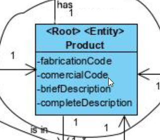
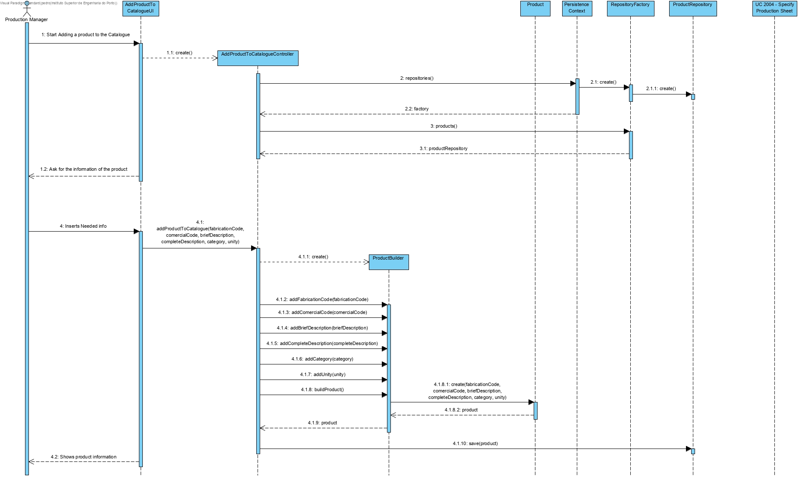
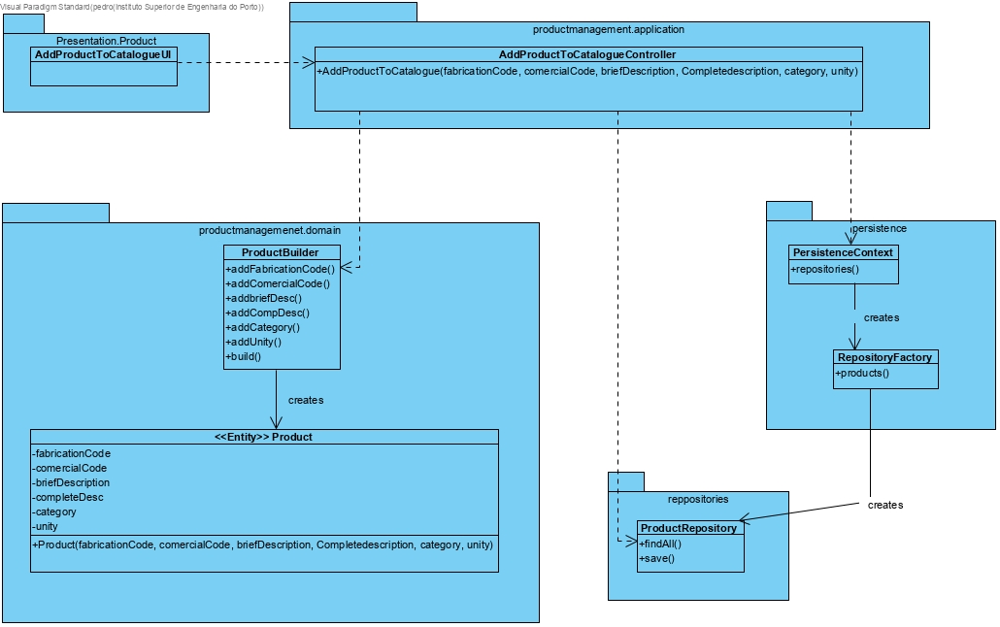

Add Product to Catalogue
=======================================

# 1. Requirements 

As Production Manager, I want to add new products, so that there can be products to produce and use as raw Materials.

**Client details:**

# 2. Analysis

The domain model was not altered.

# 3. Design

## 3.1. Functionality realisation

## 3.2. Class diagram

## 3.3. Design patterns applied

**Pure Fabrication** - used in the creation of the class "AddProductToCatalogueUI", since no other rule can be applied to create it.

**Controller** - the class "AddProductToCatalogueController" controls the use case.

**Simple responsibility** - Every class has only one responsibility, the controller class only controls the user case, the "Product" class is only responsible for operations related to Deposits and the repository class is only responsible for communicating with the database, and bring information to memory.

## 3.4. Tests

**Test 1:** Verifies that a Product instance can be created with it's respective fields.

	@Test
	    public void ensureProductCreaetionWorks(){
	        Product p = new Product(FABRICATION_CODE,COMERCIAL_CODE,BRIEF_DESCRIPTION,COMPLETE_DESCRIPTION,CATEGORY,UNITY);
	        System.out.println(p);
	        assertTrue(true);
	    }

**Test 2:** Verifies that a Product instance can't be created with an empty complete description.

	@Test(expected = IllegalArgumentException.class)
	    public void ensureCompleteDescriptionIsNotEmpty(){
	        new Product(FABRICATION_CODE, COMERCIAL_CODE, BRIEF_DESCRIPTION, "", CATEGORY, UNITY);
	    }

**Test 3:** Verifies that a Product instance can't be created with an empty brief description.

	@Test(expected = IllegalArgumentException.class)
	    public void ensureBriefDescriptionIsNotEmpty(){
	        new Product(FABRICATION_CODE, COMERCIAL_CODE, "", COMPLETE_DESCRIPTION, CATEGORY, UNITY);
	    }

**Test 4:** Verifies that a Deposit instance can't be created with an empty unity

	@Test(expected = IllegalArgumentException.class)
	    public void ensureUnityIsNotEmpty(){
	        new Product(FABRICATION_CODE, COMERCIAL_CODE, BRIEF_DESCRIPTION, COMPLETE_DESCRIPTION, CATEGORY, "");
	    }

**Scenario 1** 

1. Run backoffice

2. Login with production manager account

3. Select Products

4. Select Add Product

5. Write as a Fabrication Code "P123"

6. Write as a Comercial Code "C323"

7. Write as a Brief Description "Parafuso"

8. Write as a Complete Description "Parafuso Estrela"

9. Write as a Unity "UN"

10. Write as a Category "Ferro"

11. Product Added

12. Select Products

13. Select List Products And verify the product has been added

    **Scenario 2**

1. Run backoffice
2. Login with production manager account
3. Select Products
4. Select Add Product
5. Write as a Fabrication Code "P123321332133213"
6. Verify  that is not possible to enter a code with more than 15 characters
7. Repeat 3, 4 and 5
8. Write as a Fabrication Code "P123"
9. Write as a Comercial Code "C323"
10. Write as a Brief Description "Parafuso"
11. Write as a Complete Description "Parafuso Estrela"
12. Write as a Unity "UN"
13. Write as a Category "Ferro"
14. Product Added
15. Select Products
16. Select List Products And verify the product has been added

# 4. Implementation

## 4.1. Controller  

    package eapli.base.productmanagement.application;
    
    public class AddProductToCatalogueController implements Controller {
    
        private final AuthorizationService authz = AuthzRegistry.authorizationService();
        private final ProductRepository repository = PersistenceContext.repositories().products();

​    
​        /**
​         * Controller that controls the steps to add a product to the catalogue
​         * @param fabricationCode
​         * @param comercialCode
​         * @param briefDescription
​         * @param completeDescription
​         * @param category
​         * @param unity
​         * @return
​         */
​        public Product addProductToCatalogue(String fabricationCode, String comercialCode,
​                                             String briefDescription, String completeDescription,
​                                             String category, String unity){
​    
            authz.ensureAuthenticatedUserHasAnyOf(BaseRoles.POWER_USER, BaseRoles.PRODUCTION_MANAGER);
            final ProductBuilder productbuilder = new ProductBuilder();
    
            productbuilder.withoutProductionSheet(Designation.valueOf(fabricationCode),
                                                  comercialCode, briefDescription, completeDescription,
                                                  category, unity);
    
            return this.repository.save(productbuilder.build());
        }
    
    }

​    

## 4.2. Domain

    package eapli.base.productmanagement.domain;
    
    @Entity
    public class Product implements AggregateRoot<Designation>, Item {
    
        /**
         * Fabrication fabricationCode of the Product
         */
        @EmbeddedId
        private Designation fabricationCode;
        /**
         * Comercial fabricationCode of the Product
         */
        private String comercialCode;
        /**
         * Brief description of the Product
         */
        private String briefDescription;
        /**
         * Complete description of the Product
         */
        private String completeDescription;
        /**
         * productCategory Of the Product
         */
        private String productCategory;
        /**
         * Unity of the Product
         */
        private String unity;
    
        /**
         * Constructs a product
         * @param fabricationCode
         * @param comercialCode
         * @param briefDescription
         * @param completeDescription
         * @param unity
         * @param productCategory
         */
        public Product(final Designation fabricationCode, final String comercialCode, final String briefDescription, final String completeDescription, final String unity, final String productCategory){
            addfabricationCode(fabricationCode);
            addcomercialCode(comercialCode);
            addBriefDescription(briefDescription);
            addCompleteDescription(completeDescription);
            addproductCategory(productCategory);
            addUnity(unity);
        }
    
        protected Product() {
            // ORM
        }
    
        /**
         * Verifies and if the fabrication code is within the requirements adds it
         * @param fabricationCode
         */
        private void addfabricationCode(Designation fabricationCode){
            if(fabricationCodeMeetsBusinessRequirements(fabricationCode)){
                this.fabricationCode = fabricationCode;
            } else {
                throw new IllegalArgumentException("Invalid Fabrication fabricationCode");
            }
        }
    
        /**
         * Verifies and if the comercial code is within the requirements adds it
         * @param comercialCode
         */
        private void addcomercialCode(String comercialCode){
            if(comercialCodeMeetsBusinessRequirements(comercialCode)){
                this.comercialCode = comercialCode;
            } else {
                throw new IllegalArgumentException("Invalid Comercial fabricationCode");
            }
        }
    
        /**
         * Verifies and if the brief description is within the requirements adds it
         * @param briefDescription
         */
        private void addBriefDescription(String briefDescription){
            if(briefDescriptionMeetsBusinessRequirements(briefDescription)){
                this.briefDescription = briefDescription;
            } else {
                throw new IllegalArgumentException("Invalid Brief Description");
            }
        }
    
        /**
         * Verifies and if the complete description is within the requirements adds it
         * @param completeDescription
         */
        private void addCompleteDescription(String completeDescription){
            if(completeDescriptionMeetsBusinessRequirements(completeDescription)){
                this.completeDescription = completeDescription;
            } else {
                throw new IllegalArgumentException("Invalid Complete Description");
            }
        }
    
        /**
         * Verifies and if the category is within the requirements adds it
         * @param productCategory
         */
        private void addproductCategory(String productCategory){
            if(productCategoryMeetsBusinessRequirements(productCategory)){
                this.productCategory = productCategory;
            } else {
                throw new IllegalArgumentException("Invalid productCategory");
            }
        }
    
        /**
         * Verifies and if the unity is within the requirements adds it
         * @param unity
         */
        private void addUnity(String unity){
            if(unityMeetsBusinessRequirements(unity)){
                this.unity = unity;
            } else {
                throw new IllegalArgumentException("Invalid unity");
            }
        }
    
        /**
         * Verifies if the product category meets the business requirements
         * @param productCategory
         * @return
         */
        private static boolean productCategoryMeetsBusinessRequirements(final String productCategory){
            return !StringPredicates.isNullOrEmpty(productCategory);
        }
    
        /**
         * Verifies if the unity meets the business requirements
         * @param unity
         * @return
         */
        private static boolean unityMeetsBusinessRequirements(final String unity){
            return !StringPredicates.isNullOrEmpty(unity);
        }
    
        /**
         * Verifies if the fabrication code meets the business requirements
         * @param fabricationCode
         * @return
         */
        private static boolean fabricationCodeMeetsBusinessRequirements(final Designation fabricationCode){
            Preconditions.nonNull(fabricationCode);
            return fabricationCode.toString().length() <= 15;
        }
    
        /**
         * Verifies if the comercial code meets the business requirements
         * @param comercialCode
         * @return
         */
        private static boolean comercialCodeMeetsBusinessRequirements(final String comercialCode){
            return comercialCode.length() <= 15 && !StringPredicates.isNullOrEmpty(comercialCode);
        }
    
        /**
         * verifies if the complete description meets the bussiness requirements
         * @param completeDescription
         * @return
         */
        private static boolean completeDescriptionMeetsBusinessRequirements(final String completeDescription){
            return !StringPredicates.isNullOrEmpty(completeDescription);
        }
    
        /**
         * Verifies if the brief description meets the business requirements
         * @param briefDescription
         * @return
         */
        private static boolean briefDescriptionMeetsBusinessRequirements(final String briefDescription){
            return !StringPredicates.isNullOrEmpty(briefDescription);
        }
    
        /**
         * Verifies if two instances of an object
         * is exactly the same
         *
         * @param other object to be compared
         * @return true if everything is the same
         */
        @Override
        public boolean sameAs(Object other) {
            final Product product = (Product) other;
            return this.equals(product)
                    && this.fabricationCode.equals(product.fabricationCode)
                    && this.comercialCode.equals(product.comercialCode)
                    && this.briefDescription.equals(product.briefDescription)
                    && this.completeDescription.equals(product.completeDescription);
        }
    
        /**
         * Returns the identity of a Product
         *
         * @return identity of the object
         */
        @Override
        public Designation identity() {
            return this.fabricationCode;
        }
    
        /**
         * Returns the description of the Product
         * @return
         */
        public String description() {
            return this.briefDescription;
        }
    
        /**
         * Verifies if two objects have the same ID
         *
         * @param o Object to be compared
         * @return true if the objects have the same ID
         */
        @Override
        public boolean equals(Object o) {
            return DomainEntities.areEqual(this, o);
        }
    
        /**
         * Hashes the Product object
         *
         * @return hash of this object
         */
        @Override
        public int hashCode() {
            return DomainEntities.hashCode(this);
        }
    
        /**
         * Description of a Product
         *
         * @return Product Description
         */
        @Override
        public String toString() {
            return "eapli.base.product.domain.ProductionSheet[ id=" + fabricationCode + " ]";
        }
    }

# 6. Observations
