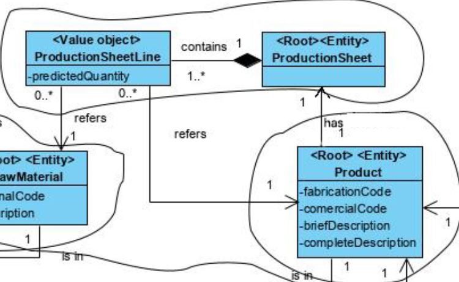
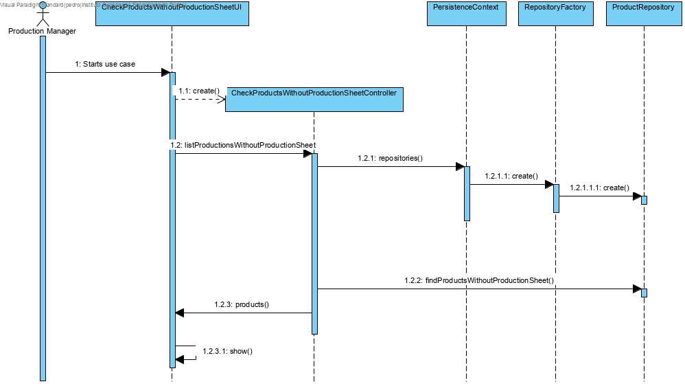

# Check Products Without Production Sheet

# 1. Requirements 

As Production Manager, I want to check which products do not have a production sheet specified, so that I can know which ones need attention.

# 2. Analysis



Was added a reference from production sheet line to product and product has A production sheet now

# 3. Design

## 3.1. Functionality realisation



## 3.2. Class diagram


## 3.3. Design patterns applied

**Pure Fabrication** - used in the creation of the class "CheckProductsWithoutProductionSheetUI", since no other rule can be applied to create it.

**Controller** - the class "CheckProductsWithoutProductionSheetController" controls the use case.

**Factory** - "RepositoryFactory" is responsible for creating all the repository classes.

## 3.4. Tests


​    
**Test 1**: verifies that is possible to create a production sheet
```
@Test
public void ensureCreation(){
    productionSheetLines.add(PRODUCTION_SHEET_LINE);
    new ProductionSheet(PRODUCTION_SHEET_ID, productionSheetLines);
    assertTrue(true);
}
```
**Test 2**: verifies that is not possible to create a production sheet without id
```
@Test(expected = IllegalArgumentException.class)
public void ensureProductionSheetIDCantBeEmpty(){
    productionSheetLines.add(PRODUCTION_SHEET_LINE);
    new ProductionSheet(Designation.valueOf(""), productionSheetLines);
}
```
**Test 3**: verifies that is not possible to create a production sheet with a null id
```
@Test(expected = IllegalArgumentException.class)
public void ensureProductionSheetIDCantBeNull(){
    productionSheetLines.add(PRODUCTION_SHEET_LINE);
    new ProductionSheet(null, productionSheetLines);
}
```
**Scenario 1** 
1. Run bootstrap
2. Run backoffice
3. Login with production manager account
4. Select Products
5. Select Check Products Without Production Sheet and verify the products listed
6. Select Products
7. Select Specify Production Sheet 
8. Follow steps from the Scenario 1 of Specify Production Sheet file 
9. Select Products
10. Select Check Products Without Production Sheet and verify the product which the production sheet was specified for is not listed, meaning that it has a production sheet now


# 4. Implementation

## 4.1. Controller  

    public class CheckProductsWithoutProductionSheetController implements Controller {
    
        private final ProductRepository products = PersistenceContext.repositories().products();
    
        public Iterable<Product> listProductsWithoutProductionSheet(){
            return products.findProductsWithoutProductionSheet();
        }
    
    }   

## 4.2. JPA Repository

    public class JpaProductRepository extends BasepaRepositoryBase<Product, Designation, Designation> implements ProductRepository {
        public JpaProductRepository() {
            super("internalCode");
        }
    
        @Override
        public Iterable<Product> findProductsWithoutProductionSheet() {
            final TypedQuery<Product> query = entityManager().createQuery(
                    "SELECT p FROM Product p where p.productionSheet is null", Product.class
            );
            return query.getResultList();
        }
    }


# 5. Integration/Demonstration
## 5.1 In-Memory Repository
    public class InMemoryProductRepository extends InMemoryDomainRepository<Designation, Product> implements ProductRepository {
    
        static{
            InMemoryInitializer.init();
        }
    
        public Iterable<Product> findProductsWithoutProductionSheet(){
            return match(e -> e.hasProductionSheet());
        }
    
    }
## 5.1 JPA Repository 


    
     public class JpaProductRepository extends BasepaRepositoryBase<Product, Designation, Designation> implements ProductRepository {
        public JpaProductRepository() {
            super("fabricationCode");
       }
        @Override
    public Iterable<Product> findProductsWithoutProductionSheet() {
        final TypedQuery<Product> query = entityManager().createQuery(
                "SELECT p FROM Product p where p.productionSheet is null", Product.class
        );
        return query.getResultList();
    }
}


# 6. Observations


