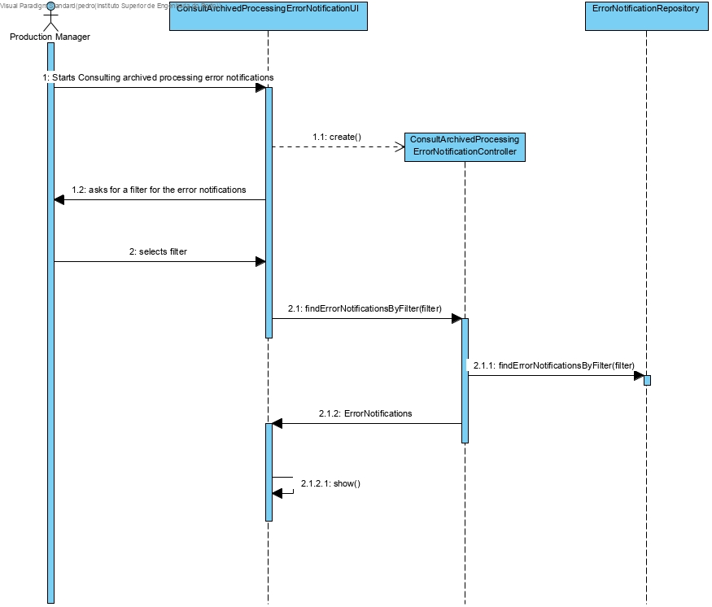
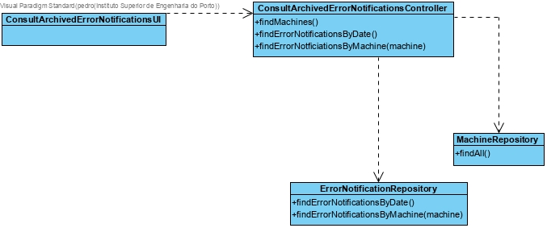

# List Products

# 1. Requirements 

As Production Manager, I want to list the consult error notifications to know of problems happening 

# 2. Analysis


The domain model was not altered.

# 3. Design

## 3.1. Functionality realisation



## 3.2. Class diagram



## 3.3. Design patterns applied

**Pure Fabrication** - used in the creation of the class "ConsultArchivedProcessedErrorNotificationsUI", since no other rule can be applied to create it.

**Controller** - the class "ConsultArchivedProcessedErrorNotificationsController" controls the use case.

**Factory** - "RepositoryFactory" is responsible for creating all the repository classes.

## 3.4. Tests

**Scenario 1**

1. Run bootstrap
2. Run backoffice
3. Login with production manager account
4. Select Messages
5. Select Consult Archived Processed Error Notifications 
6. Select a Filter
7. Check the messages 

# 4. Implementation

## 4.1. Controller  
``` java
public class ConsultArchivedProcessedErrorNotificationsController {

    private ErrorNotificationRepository repository = PersistenceContext.repositories().errornotification();
    private MachineRepository machineRepository = PersistenceContext.repositories().machine();

    public Iterable<Machine> findMachines(){
        return machineRepository.findAll();
    }

    public Iterable<ErrorNotification> listErrorNotificationsByMachine(Machine machine){
        return repository.findByMachine(machine);
    }

    public Iterable<ErrorNotification> listErrorNotificationsByTime(){
        return repository.findByTime();
    }

}
```

## 4.2 Repository

``` java
public class JpaErrorNotificationRepository extends BasepaRepositoryBase<ErrorNotification,Long,Long> implements ErrorNotificationRepository {
    
public JpaErrorNotificationRepository() {
        super("id");
    }
    
    public Iterable<ErrorNotification> findByTime(){
        final TypedQuery<ErrorNotification> query = entityManager().createQuery(
                "Select e From ErrorNotification e where e.errorNotificationState.stateError = :state order by e.dateTime", ErrorNotification.class);
        query.setParameter("state", StateEnum.ARCHIVED);
        return query.getResultList();
    }
    
    public Iterable<ErrorNotification> findByMachine(Machine machine){
        final TypedQuery<ErrorNotification> query = entityManager().createQuery(
                "Select e from ErrorNotification e where e.machine = :machine and e.errorNotificationState.stateError = :state",ErrorNotification.class);
        query.setParameter("state", StateEnum.ARCHIVED);
        query.setParameter("machine",machine);
        return query.getResultList();
    }

}
```


# 6. Observations


```

```