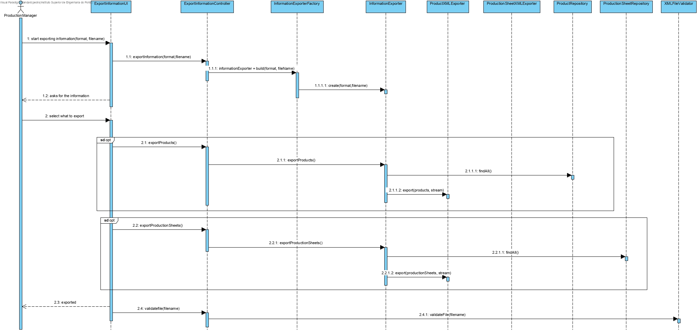

# Export Information to XML

# 1. Requirements 

As SCM 
I want to currently import existing messages in text files that are present in the input directory
So that they are available for processing

Acceptance criteria:
 - Java application using threads
 - After being imported the files should be moved to a new directory of processed files
 - Both directories should be defined by configuration

# 2. Design

## 2.1. Functionality realisation




## Scenario 1:

- After starting the backoffice application, choose the option export information to xml and select the option export all and enter the path
- The application will then proceed to export messages to the file, and finally validate the file with the XSD created

# 4. Implementation

## 4.1. Production Sheets

```java
public class ProductionSheetXMLExporter {
    public void export(final Iterable<ProductionSheet> productionSheets, final PrintWriter stream) {
        stream.println("<ProductionSheets>");
        for(ProductionSheet ps: productionSheets) {
            stream.printf("<ProductionSheet>%n");
                stream.printf("<ProductionSheetID ID=\"%s\"/>%n",ps.identity());
                for(ProductionSheetLineProduct psp : ps.getBOMItems()) {
                    stream.printf("<ProductionSheetLineProduct>%n");
                        stream.printf("<Product ID=\"%s\" Quantity=\"%s\"/>%n", psp.getProduct().identity(), psp.getQuantity());
                    stream.printf("</ProductionSheetLineProduct>%n");
                }
                for(ProductionSheetLineRawMaterial psr : ps.getBOMMaterials()) {
                    stream.printf("<ProductionSheetLineRawMaterial>%n");
                        stream.printf("<RawMaterial ID=\"%s\" Quantity=\"%s\"/>%n", psr.getMaterial().identity(), psr.getQuantity());
                    stream.printf("</ProductionSheetLineRawMaterial>%n");
                }
            stream.printf("</ProductionSheet>%n");
        }
        stream.println("</ProductionSheets>");
    }
}
```


## 4.2. Products

```java
public class ProductXMLExporter {
    public void export(final Iterable<Product> products, final PrintWriter stream) {
        stream.println("<Products>");
        for(Product p: products) {
            stream.printf("<Product fabricationCode=\"%s\">%n", p.identity());
                stream.printf("<comercialCode>%s</comercialCode>%n",p.comercialCode());
                stream.printf("<briefDescription>%s</briefDescription>%n",p.description());
                stream.printf("<completeDescription>%s</completeDescription>%n",p.completeDescription());
                stream.printf("<productCategory>%s</productCategory>%n",p.productCategory());
                stream.printf("<unity>%s</unity>%n",p.unity());
                stream.printf("<productionSheet>%s</productionSheet>%n",p.productionSheet());
            stream.printf("</Product>%n");
        }
        stream.println("</Products>");
    }
}

```
## 4.3. Presentation

```java
public class ExportInformationtUI extends AbstractUI {
private static final String YES = "Yes";
private static final String NO = "No";
private static final String RETURN = "Return";

private final ExportInformationController theController = new ExportInformationController();

protected Controller controller() {
    return this.theController;
}

@Override
protected boolean doShow() {
    final List<String> options = new ArrayList<>();
    options.add(YES);
    options.add(NO);
    final SelectWidget<String> selector = new SelectWidget<>("Options:", options,
            new OptionsPrinter());
    String fileName = Console.readLine("File name: ");
    String format = findFormat(fileName); //Format is entered automatically
    try {
        theController.exportInformation(format, fileName);
    } catch (IOException ex) {
        System.out.println("Wrong fileName");
        return false;
    } catch (Exception e) {
        System.out.println("Wrong format");
        return false;
    }
    System.out.println("Do you wish to export all information");
    selector.show();
    String answer = selector.selectedElement();
    if (answer == null) {
        return false;
    }
    if (answeredYes(answer)) {
        exportAll();
    } else {
        int choice;
        final List<String> options2 = new ArrayList<>();
        options2.add("Raw Material Categories");
        options2.add("Raw Materials");
        options2.add("Products");
        options2.add("Deposits");
        options2.add("Machines");
        options2.add("Production sheets");
        options2.add("Lots");
        options2.add("Production orders");
        options2.add("Production lines");
        options2.add("Effective and real consumption");
        boolean[] flags = new boolean[10];
        final SelectWidget<String> selector2 = new SelectWidget<>("Options:", options2,
                new OptionsPrinter());
        do {
            selector2.show();
            choice = selector2.selectedOption();
            switch (choice) {
                case 1:
                    if (flags[0]) {
                        System.out.println("Raw Material Categories have already been exported.");
                        break;
                    }
                    theController.exportRawMaterialCategories();
                    flags[0] = true;
                    System.out.println("Raw Material categories exported.\n");
                    break;
                case 2:
                    if (flags[1]) {
                        System.out.println("Raw Materials have already been exported.");
                        break;
                    } else if (!flags[0]) {
                        System.out.println("Raw Material categories must be exported first.\n");
                        break;
                    }
                    theController.exportRawMaterials();
                    flags[1] = true;
                    System.out.println("Raw Materials exported.\n");
                    break;
                case 3:
                    if (flags[2]) {
                        System.out.println("Products have already been exported.");
                        break;
                    }
                    theController.exportProducts();
                    flags[2]=true;            Uncomment when finished
                    System.out.println("Products exported.\n");
                    break;
                case 4:
                    if (flags[3]) {
                        System.out.println("Deposits have already been exported.");
                        break;
                    } else if (!flags[1] || !flags[2]) {
                        System.out.println("Raw Materials and Products must be exported first.\n");
                        break;
                    }
                    theController.exportDeposits();
                    flags[3] = true;
                    System.out.println("Deposits exported.\n");
                    break;
                case 5:
                    if (flags[4]) {
                        System.out.println("Machines have already been exported.");
                        break;
                    }
                    theController.exportMachines();
                    //flags[4]=true;            Uncomment when finished
                    System.out.println("Machines exported.\n");
                    break;
                case 6:
                    if (flags[5]) {
                        System.out.println("Production sheets have already been exported.");
                        break;
                    } else if (!flags[1] || !flags[2]) {
                        System.out.println("Raw Materials and Products must be exported first.\n");
                        break;
                    }
                    theController.exportProductionSheets();
                    flags[5]=true;            Uncomment when finished
                    System.out.println("Production sheets exported.\n");
                    break;
                case 7:
                    if (flags[6]) {
                        System.out.println("Lots have already been exported.");
                        break;
                    }
                    theController.exportLots();
                    flags[6] = true;
                    System.out.println("Lots exported.\n");
                    break;
                case 8:
                    if (flags[7]) {
                        System.out.println("Production orders have already been exported.");
                        break;
                    } else if (!flags[6] || !flags[5]) {
                        System.out.println("Lots and Production sheets must be exported first.\n");
                        break;
                    }
                    theController.exportProductionOrders();
                    flags[7] = true;
                    System.out.println("Production orders exported.\n");
                    break;
                case 9:
                    if (flags[8]) {
                        System.out.println("Production lines have already been exported.");
                        break;
                    } else if (!flags[4]) {
                        System.out.println("Machines must be exported first.\n");
                        break;
                    }
                    theController.exportProductionLines();
                    flags[8] = true;
                    System.out.println("Production lines exported.\n");
                    break;
                case 10:
                    if (flags[9]) {
                        System.out.println("Consumptions have already been exported.");
                        break;
                    }else if(!flags[1] || !flags[2] || flags[3] || flags[5]) {
                        System.out.println("Raw materials, products, machines and deposits must be exported first.\n");
                    }
                    theController.exportIntake();
                    break;
                default:
                    break;
            }
        } while (choice != 0);
    }
    theController.exportEndFile();
    if (theController.validateFile(fileName)) {
        System.out.println("Valid file");
    } else {
        System.out.println("Invalid file");
    }
    return false;
}

private boolean answeredYes(String answer) {
    return answer.equals(YES);
}

private void exportAll() {
    theController.exportRawMaterialCategories();
    theController.exportRawMaterials();
    theController.exportProducts();
    theController.exportDeposits();
    theController.exportMachines();
    theController.exportProductionSheets();
    theController.exportProductionOrders();
    theController.exportLots();
    theController.exportProductionLines();
    theController.exportIntake();
}

@Override
public String headline() {
    return "Export Information";
}

private String findFormat(String filename) {
    for (int i = filename.length() - 1; i > 0; i--) {
        if (filename.charAt(i) == '.') {
            return filename.substring(i);
        }
    }
    return null;
}
```

# 5. Integration/Demonstration

```java
public interface InformationExporter {
void exportRawMaterialCategories();

void exportRawMaterials();

void exportProducts();

void exportDeposits();

void exportMachines();

void exportProductionSheets();

void exportProductionOrders();

void exportLots();

void exportProductionLines();

void exportIntake();

void defineFilePrinter(String fileName) throws IOException;

void exportEndFile();
}
```


```java
public class InformationExporterFactory {
private static final AppSettings SETTINGS = Application.settings();

public InformationExporter build(String format) {
    String formatTemp=format.substring(format.length()-3).toLowerCase();
    InformationExporter exporter=null;
    try {
        exporter = (InformationExporter) Class.forName(SETTINGS.getProperty(formatTemp)).newInstance();
    } catch (ClassNotFoundException | InstantiationException | IllegalAccessException | NullPointerException ex) {
        Logger.getLogger(ImportMessagesFactory.class.getName()).log(Level.SEVERE, null, ex);
    }
    return exporter;
}
}
```
# 6. Observations

