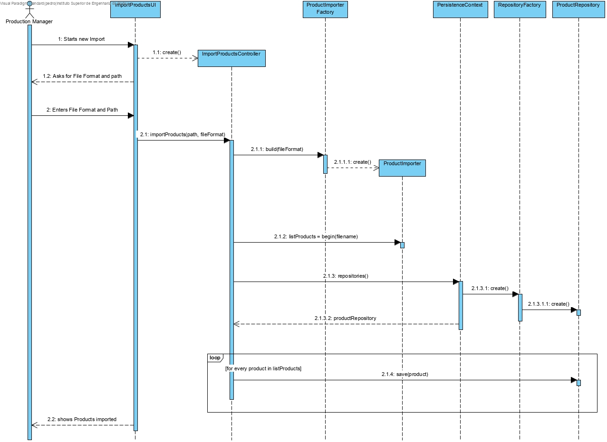
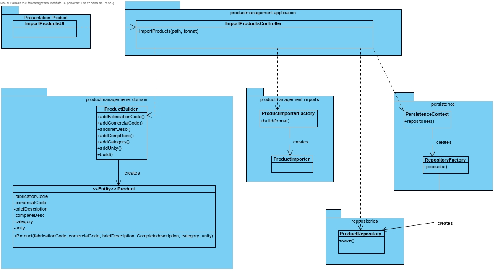

Import Products
=======================================

# 1. Requirements 

As Production Manager, I want to import new products, so that there can be products to produce and use as raw Materials.

# 2. Analysis

The domain model was not altered.

# 3. Design

## 3.1. Functionality realisation

## 3.2. Class diagram

## 3.3. Design patterns applied

**Pure Fabrication** - used in the creation of the class "ImportProductsUI", since no other rule can be applied to create it.

**Controller** - the class "ImportProductsController" controls the use case.

**Factory** - The class "ProductImporterFactory" creates "new ProductImporter" according to the FileFormat of the file that we are going to import.

**Simple responsibility** - Every class has only one responsibility, the controller class only controls the user case, the "Product" class is only responsible for operations related to Products and the repository class is only responsible for communicating with the database, and bring information to memory. "ProductImporter" imports the data from a file 

## 3.4. Tests

**Test 1:** Verifies that a Product instance can be created with it's respective fields.

	@Test
	    public void ensureProductCreaetionWorks(){
	        Product p = new Product(FABRICATION_CODE,COMERCIAL_CODE,BRIEF_DESCRIPTION,COMPLETE_DESCRIPTION,CATEGORY,UNITY);
	        System.out.println(p);
	        assertTrue(true);
	    }

**Test 2:** Verifies that a Product instance can't be created with an empty complete description.

	@Test(expected = IllegalArgumentException.class)
	    public void ensureCompleteDescriptionIsNotEmpty(){
	        new Product(FABRICATION_CODE, COMERCIAL_CODE, BRIEF_DESCRIPTION, "", CATEGORY, UNITY);
	    }

**Test 3:** Verifies that a Product instance can't be created with an empty brief description.

	@Test(expected = IllegalArgumentException.class)
	    public void ensureBriefDescriptionIsNotEmpty(){
	        new Product(FABRICATION_CODE, COMERCIAL_CODE, "", COMPLETE_DESCRIPTION, CATEGORY, UNITY);
	    }

**Test 4:** Verifies that a Deposit instance can't be created with an empty unity

	@Test(expected = IllegalArgumentException.class)
	    public void ensureUnityIsNotEmpty(){
	        new Product(FABRICATION_CODE, COMERCIAL_CODE, BRIEF_DESCRIPTION, COMPLETE_DESCRIPTION, CATEGORY, "");
	    }

**Scenario 1**

1. Run backoffice
2. Login with production manager account
3.  Select Products
4. Select Import Products
5. Enter a file path ""./files/Produtos.csv"
6. Write as Format "CSV"
7. Select Products
8. Select List Products And verify the products added

**Scenario 2**

1. Run backoffice
2. Login with production manager account
3.  Select Products
4. Select Import Products
5. Enter a file path ""./files/erro.csv"
6. Verify that one products was not added due to a missing column
7. Write as Format "CSV"
8. Select Products
9. Select List Products And verify the products added

# 4. Implementation

## 4.1. Controller  

    public class ImportProductsUI extends AbstractUI {
    
        private final ImportProductsController theController = new ImportProductsController();
    
        protected Controller controller(){
            return this.theController;
        }
    
        @Override
        protected boolean doShow() {
    
            final String path = Console.readLine("Enter the path of the File to import");
            final String fileFormat = Console.readLine("Enter the File Format");
    
            try {
                final Integer nProducts = this.theController.importProducts(path, FileFormat.CSV);
                System.out.println(nProducts +" products imported successfully!");
            } catch (IOException e) {
                System.out.println("File Format is not supported");
            } catch (Exception e) {
                System.out.println("Error importing");
            }
            return false;
        }
    
        @Override
        public String headline() {
            return "Import Products via File";
        }
    }

## 4.2. Factory

    package eapli.base.productmanagement.imports;
    
    public final class ProductImporterFactory {
    /**
     *	Creates an instance of the respective product importer
     */
    public ProductImporter build(FileFormat format){
        switch(format){
            case CSV:
                return new CSVProductImporter();
        }
        throw new IllegalStateException("Unknown Format");
    }
    }

## 4.3 CSVImporter
    public class CSVProductImporter implements ProductImporter {
    
        @Override
        public List<Product> begin(String filename) throws IOException {
            List<Product> impProducts = new LinkedList<>();
            try{
                BufferedReader br = new BufferedReader(new FileReader(filename));
    
                br.readLine();
                int currentLine = 1 ;
                String line = br.readLine();
                while (line != null){
                    String[] values = line.split(";");
                    if(values.length != 6){
                        throw new Exception(String.format("Error parsing the file at line %d", currentLine));
                    }
    
                    final ProductBuilder productbuilder = new ProductBuilder();
                    productbuilder.withoutProductionSheet(Designation.valueOf(values[0]),
                            values[1], values[2], values[3], values[4], values[5]);
                    impProducts.add(productbuilder.build());
                    line = br.readLine();
                    currentLine++;
                }
            } catch (FileNotFoundException fex){
                System.err.println(String.format("File %s not found!\n",filename));
            } catch(IOException ioe) {
                System.err.println(String.format("Error opening File!\n", filename));
            } catch(Exception e) {
                System.err.println(String.format("%s\n", e.getMessage()));
            }
    
            return impProducts;
        }
    }

## 4.5. Commits

