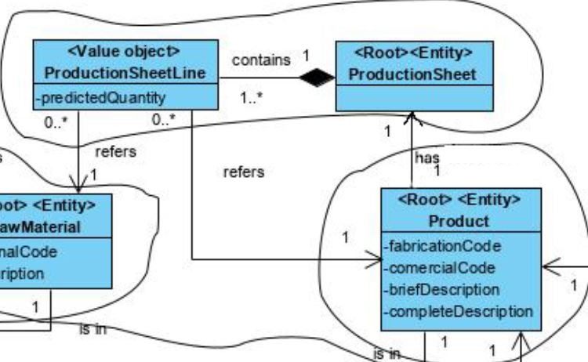
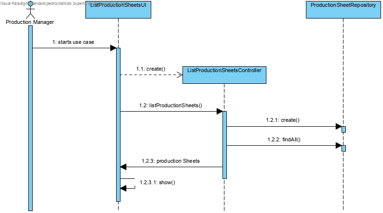
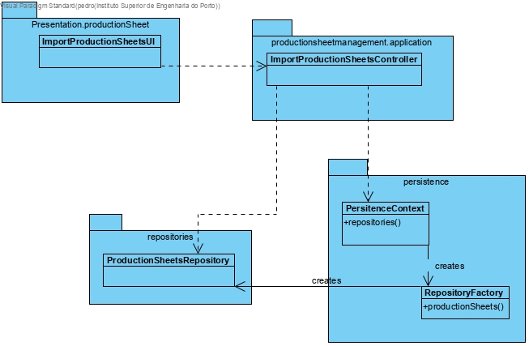

# [3-1-2009] - List Production Sheets

# 1. Requirements 

As Production Manager, I want to list the production sheets so that I can know a product's production sheet

# 2. Analysis



The domain model was not altered.

# 3. Design

## 3.1. Functionality realisation



## 3.2. Class diagram



## 3.3. Design patterns applied

**Pure Fabrication** - used in the creation of the class "ListProductionSheetsUI", since no other rule can be applied to create it.

**Controller** - the class "ListProductsController" controls the use case.

**Factory** - "RepositoryFactory" is responsible for creating all the repository classes.

## 3.4. Tests

**Scenario 1**

1. Run bootstrap
2. Run backoffice
3. Login with production manager account
4. Select Products
5. Select List Production Sheets and verify the production sheets

# 4. Implementation

## 4.1. Controller  

```java
package eapli.base.productionsheetmanagement.application;

import eapli.base.productionsheetmanagement.domain.ProductionSheet;

public class ListProductionSheetsController {

    final ListProductionSheetsService svc= new ListProductionSheetsService();

    /**
     * All production orders
     * @return all production orders
     */
    public Iterable<ProductionSheet> productionSheets(){
        return this.svc.allProductionSheets();
    }
}

```

## 4.2 Service

```java
package eapli.base.productionsheetmanagement.application;

import eapli.base.infrastructure.persistence.PersistenceContext;
import eapli.base.productionsheetmanagement.domain.ProductionSheet;
import eapli.base.productionsheetmanagement.repositories.ProductionSheetRepository;
import eapli.base.usermanagement.domain.BaseRoles;
import eapli.framework.infrastructure.authz.application.AuthorizationService;
import eapli.framework.infrastructure.authz.application.AuthzRegistry;

public class ListProductionSheetsService {

    private final AuthorizationService authz= AuthzRegistry.authorizationService();
    private final ProductionSheetRepository repo= PersistenceContext.repositories().productionSheets();

    /**
     * All Deposits
     *
     * @return all deposits
     */
    public Iterable<ProductionSheet> allProductionSheets() {
        authz.ensureAuthenticatedUserHasAnyOf(BaseRoles.POWER_USER,BaseRoles.FACTORY_FLOOR_MANAGER,BaseRoles.PRODUCTION_MANAGER);
        return this.repo.findAll();
    }
}
```

# 6. Observations


