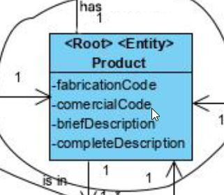
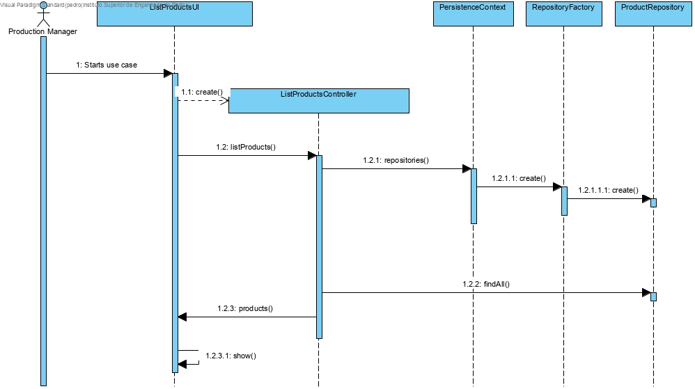
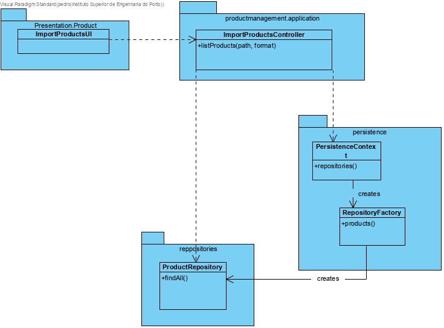

# List Products

# 1. Requirements 

As Production Manager, I want to list the products so that I can know which products are in the catalogue

# 2. Analysis

The domain model was not altered.

# 3. Design

## 3.1. Functionality realisation

## 3.2. Class diagram

## 3.3. Design patterns applied

**Pure Fabrication** - used in the creation of the class "ListProductsUI", since no other rule can be applied to create it.

**Controller** - the class "ListProductsController" controls the use case.

**Factory** - "RepositoryFactory" is responsible for creating all the repository classes.

## 3.4. Tests

**Scenario 1**

1. Run bootstrap
2. Run backoffice
3. Login with production manager account
4. Select Products
5. Select List Products and verify the products added

# 4. Implementation

## 4.1. Controller  

    public class ListProductsController implements Controller {
    
        private final ProductRepository productRepository = PersistenceContext.repositories().products();
    
        public Iterable<Product> getProducts(){
            return productRepository.findAll();
        }
    }

# 6. Observations

