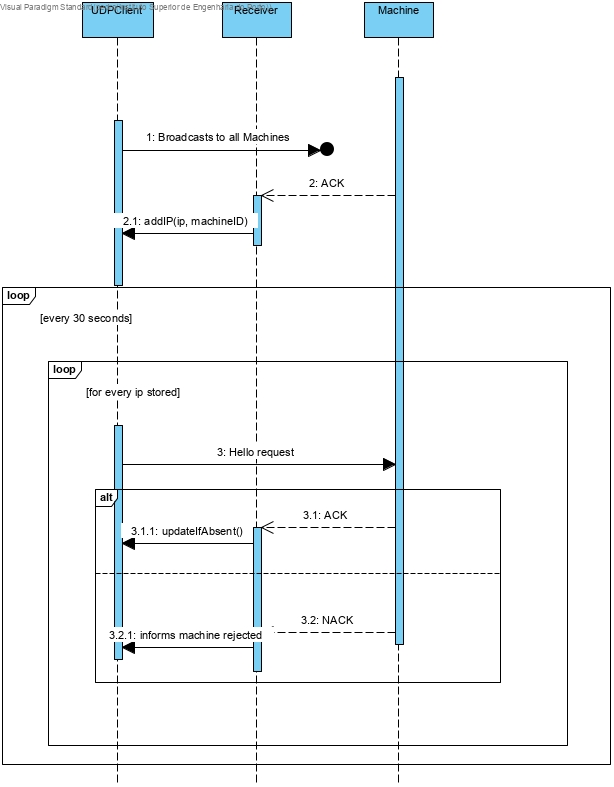
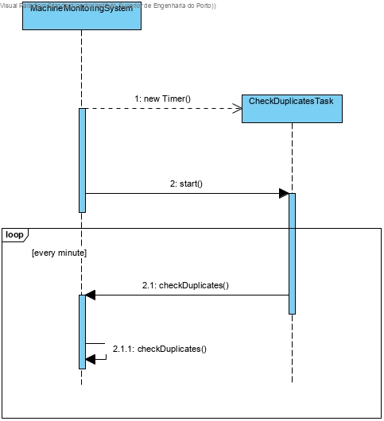

# Send Reset Request

# 1. Requirements 

As A SMM, I want to send a RESET request to a given machine

# 2. Analysis


The domain model was not altered.

# 3. Design

## 3.1. Machine Monitoring System



## 3.3 Reset Request


## 3.4 Timer Task



## 3.3. Tests

**Scenario 1**

2. Run Central System (run-scm.bat)
2. Run Machine Simulator (make all in bash)
3. Enter 1001 as Machine Id
4. Enter 0 as the time it takes to send a message
5. Enter 1001 as the machine type
6. Run Machine Monitoring System (run-smm.bat)
7. Verify that a HELLO request is received in the machine simulator (Code = 0)
8. Verify that a Message is sent in the machine simulator (Code = 150/151)
9. Verify that a Message is received in the Machine Monitoring System (Code = 150/151)
10. Verify that IPs have been added to the list

**Scenario 2**

1. Run Central System (run-scm.bat)
2. Run Machine Simulator (make all in bash)
3. Enter 1001 as Machine Id
4. Enter 0 as the time it takes to send a message
5. Enter 1001 as the machine type
6. Run Machine Simulator in another virtual machine / ssh session (make all in bash)
7. Enter 1000 as Machine Id
8. Enter 0 as the time it takes to send a message
9. Enter 1000 as the machine type
10. Run Machine Monitoring System (run-smm.bat)
11. Verify that a HELLO request is received in the machine simulator (Code = 0)
12. Verify that a Message is sent in the machine simulator (Code = 150/151)
13. Verify that a Message is received in the Machine Monitoring System (Code = 150/151)
14. Verify that IPs have been added to the list
15. Wait a few moments and verify that there is a clash. Two IPs are sharing the same machine code

**Scenario 3**

1. Run Central System (run-scm.bat)
2. Run Machine Simulator (make all in bash)
3. Enter 1001 as Machine Id
4. Enter 0 as the time it takes to send a message
5. Enter 1001 as the machine type
6. Run Machine Monitoring System (run-smm.bat)
7. Verify that a HELLO request is received in the machine simulator (Code = 0)
8. Verify that a Message is sent in the machine simulator (Code = 150/151)
9. Verify that a Message is received in the Machine Monitoring System (Code = 150/151)
10. Verify that IPs have been added to the list
11. Press "r" in the Machine Monitoring System console
12. Enter one of the IPs that appear below "Active Machines:"
13. Verify that Machine Simulator receives a RESET request (code = 3)
14. Verify that Machine Simulator sends a ACK request to Machine Monitoring System (code = 150)

# 4. Implementation

## 4.1. Machine Monitoring System  

```java
public class MachineMonitoringSystem implements Runnable{

    private static Map<InetAddress, List<Integer>> machineIP = new HashMap<>();
    static DatagramSocket sock;

    public void run() {
        byte[] data = new byte[300];
        DatagramPacket udpPacket;

        try {
            sock = new DatagramSocket();
        } catch(IOException ex){
            System.out.println("Failed to open local port");
            System.exit(1);
        }

        System.out.println("UDP Client Running. Listening for Machine Requests. Press CTRL + C to exit\n\n\n");
        InetAddress broadcastAddr = null;
        try {
            broadcastAddr = InetAddress.getByName(Settings.BROADCAST);
        } catch (UnknownHostException e) {
            System.out.println("Host Address not found");
        }

        try {
            sock.setSoTimeout(Settings.TIMEOUT);
            sock.setBroadcast(true);
        } catch (SocketException e) {
            System.out.println("Error Preparing Socket");
        }


        try {
            data = prepareMessage(MessageType.HELLO, (short) Settings.NO_ID);
        } catch (IOException e) {
            System.out.println("Error Creating message");
        }

        udpPacket = new DatagramPacket(data, data.length, broadcastAddr, Settings.SERVICE_PORT);
        System.out.println("Sending HELLO message to broadcast address to find all machines\n\n");
        try {
            sock.send(udpPacket);
        } catch (IOException e) {
            System.out.println("Error Sending HELLO request");
        }

        Thread udpReceiver = new Thread(new MachineMonitoringSystemThread(sock));
        udpReceiver.start();

        new Timer().scheduleAtFixedRate(new DuplicatesTask(),0, 1000 * 60 );

        while(true) {
            System.out.println("Active machines:");
            printIPs();
            udpPacket.setData(data);
            udpPacket.setLength(data.length);

            System.out.println("Sending HELLO request to every machine being monitored");
            try {
                sendToAll(sock, udpPacket);
            } catch (Exception e) {
                System.out.println("Error sending request");
            }
            try {
                Thread.sleep(Settings.TIMEOUT);
            } catch (InterruptedException e) {
                System.out.println("Thread couldnt sleep. There are monsters nearby");
            }
        }
    }

    /**
     * writes the necessary data in the data byte to be sent to the machines as an hello
     * request
     * @param msgType
     * @param id
     * @return
     * @throws IOException
     */
    private static byte[] prepareMessage(MessageType msgType, short id) throws IOException {
        ByteArrayOutputStream os = new ByteArrayOutputStream(20);
        DataOutputStream message = new DataOutputStream(os);
        byte[] msg;

        message.writeByte((byte) Settings.PROTOCOL_VERSION);            //versao
        message.writeByte((byte) msgType.getMsgCode().shortValue());    //codigo
        message.writeShort(id);                                         //id
        message.writeByte(0);
        message.writeByte(0);

        message.flush();

        msg = os.toByteArray();
        return msg;
    }

    /**
     * adds an ip, as well as the machine code and state of the machine
     * @param ip
     * @param machineCode
     */
    public static synchronized void addIP(InetAddress ip, List<Integer> machineCode){
        machineIP.putIfAbsent(ip, machineCode);
    }

    /**
     * updates the state of the machine
     * @param ip
     */
    public static synchronized void updateState(InetAddress ip){
        List<Integer> tmp = machineIP.get(ip);
        tmp.remove(1);
        tmp.add(0);
        machineIP.replace(ip,tmp);
    }

    /**
     * sends a packet to every machine being monitored
     * @param s
     * @param p
     * @throws Exception
     */
    public static synchronized void sendToAll(DatagramSocket s, DatagramPacket p) throws Exception {
        for(InetAddress ip: machineIP.keySet()){
            p.setAddress(ip);
            s.send(p);
        }
    }

    public static synchronized void sendRESET(String machineIP) throws IOException {
        byte[] resetMSG;
        InetAddress address = InetAddress.getByName(machineIP);
        resetMSG = prepareMessage(MessageType.RESET, (short) Settings.NO_ID);
        DatagramPacket resetPacket = new DatagramPacket(resetMSG, resetMSG.length, address, Settings.SERVICE_PORT);
        sock.send(resetPacket);
    }

    /**
     * Prints all machine ips, and the id and state of the machine associated to that ID
     */
    public static synchronized void printIPs() {
        for(Map.Entry<InetAddress, List<Integer>> entry: machineIP.entrySet()) {
            System.out.println("Machine IP: " + entry.getKey());
            System.out.println("Machine ID: " + entry.getValue().get(0));
            System.out.println("Machine State: " + entry.getValue().get(1));
        }
        System.out.println("");
    }

    public static void checkDuplicates(){
        System.out.println("Verifying for duplicate machine IDs");
        for(Map.Entry<InetAddress, List<Integer>> entry : machineIP.entrySet()){
            for(Map.Entry<InetAddress, List<Integer>> entry2 : machineIP.entrySet()){
                if(entry.getValue().get(0) == entry2.getValue().get(0)){
                    System.out.printf("Alert with Machine %s and machine %s \nThey are sharing the same Machine Code! %d\n", entry.getKey(), entry.getKey(), entry.getValue().get(0));
                }
            }
        }
        System.out.println("Verification Done.");
    }
}
```

## 5.2 Receiver Thread

``` java
class MachineMonitoringSystemThread implements Runnable{

    private DatagramSocket sock;
    private static int code;
    private static int id;

    public MachineMonitoringSystemThread(DatagramSocket sock) {
        this.sock = sock;
    }

    /**
     * this method loops to receive the messages from the machines. when a message is
     * received it's content is validated and according to that content
     * the machine list is updated
     */
    @Override
    public void run() {
        byte[] data = new byte[300];
        DatagramPacket p;
        InetAddress currMachine;

        p = new DatagramPacket(data, data.length);

        while(true){
            boolean error = false;
            p.setLength(data.length);
            try{
                sock.receive(p);
            } catch(SocketTimeoutException stx){
                System.out.println("No Reply from Machine");
                error = true;
            } catch(IOException ex){
                return;
            }
            if(!error){
                currMachine = p.getAddress();

                System.out.println("\nReceived Message from: " + currMachine.getHostAddress());
                System.out.println("Processing message...");
                try {
                    parseMessage(p.getData());
                } catch (IOException e) {
                    e.printStackTrace();
                }
                checkState(currMachine);
            }
        }

    }

    /**
     * this method verifies if the machine accepted or rejected the request sent
     * @param address
     */
    private static void checkState(InetAddress address){
        if(code == MessageType.HELLO.getMsgCode()){
            List<Integer> temp = new ArrayList<>();
            temp.add(id);
            temp.add(1);
            System.out.println("\nThe request was accepted.\nUpdating monitored machines..");
            MachineMonitoringSystem.addIP(address, temp);
        } if(code == MessageType.NACK.getMsgCode()){
            System.out.println("The request was rejected");
        }
    }

    /**
     * processes the message received by extracting the bytes refering to the code
     * of the message and the id of the machine
     * @param msg
     * @throws IOException
     */
    private static void parseMessage(byte[] msg) throws IOException {

        ByteArrayInputStream is = new ByteArrayInputStream(msg);
        DataInputStream message = new DataInputStream(is);

        message.readByte();
        code = message.readUnsignedByte();
        id = message.readUnsignedShort();

        message.close();
        System.out.println("\nMessage Processed successfully!");
        System.out.println("Message Code: " + code + "\nMachine ID: " + id);
    }
}
```
## 5.3 Timer Task
``` java
class DuplicatesTask extends TimerTask {

    @Override
    public void run() {
        MachineMonitoringSystem.checkDuplicates();
    }


```

# 6. Observations


