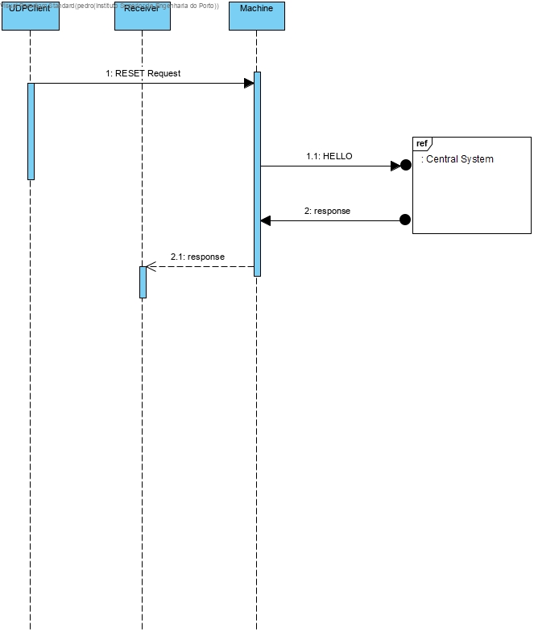

# Send Reset Request

# 1. Requirements 

As Production Manager, I want to check the machines states

# 2. Analysis


The domain model was not altered.

# 3. Design

## 3.1 Reset Request



## 3.2 Tests

**Scenario 1**

1. Run Central System (run-scm.bat)
2. Run Machine Simulator (make all in bash)
3. Enter 1001 as Machine Id
4. Enter 0 as the time it takes to send a message
5. Enter 1001 as the machine type
6. Run Machine Monitoring System (run-smm.bat)
7. Verify that a HELLO request is received in the machine simulator (Code = 0)
8. Verify that a Message is sent in the machine simulator (Code = 150/151)
9. Verify that a Message is received in the Machine Monitoring System (Code = 150/151)
10. Verify that IPs have been added to the list
11. Press "r" in the Machine Monitoring System console
12. Enter one of the IPs that appear below "Active Machines:"
13. Verify that Machine Simulator receives a RESET request (code = 3)
14. Verify that Machine Simulator sends a ACK request to Machine Monitoring System (code = 150)

For more info check Machine Monitoring System.

# 4. Implementation

## 4.1. Machine Monitoring System  

```java
public static synchronized void sendRESET(String machineIP){
        byte[] resetMSG;
        InetAddress address = null;
        try {
            address = InetAddress.getByName(machineIP);
            resetMSG = prepareMessage(MessageType.RESET, Settings.NO_ID);
            DatagramPacket resetPacket = new DatagramPacket(resetMSG, resetMSG.length, address, Settings.SERVICE_PORT);
            sendPacket(resetPacket);
        } catch (UnknownHostException e) {
            System.out.println("Couldn't find the address");
            e.printStackTrace();
        }
    }
```
