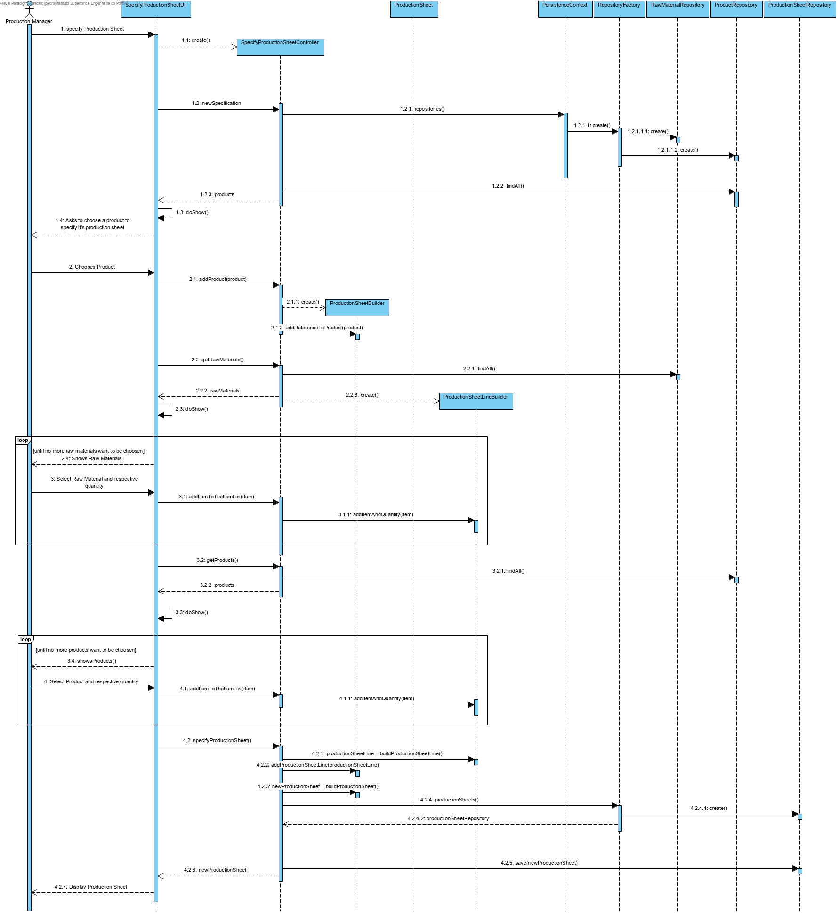
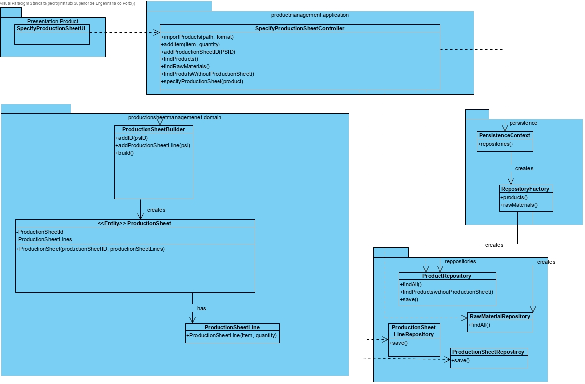

# Specify Production Sheet

# 1. Requirements 

As Production Manager, I want to specify a production sheet, so that there is information on how to produce a given product

# 2. Analysis


The domain model was not altered.

# 3. Design

## 3.1. Functionality realisation



## 3.2. Class diagram



## 3.3. Design patterns applied

**Pure Fabrication** - used in the creation of the class "SpecifyProductionSheetUI", since no other rule can be applied to create it.

**Controller** - the class "SpecifyProductionSheetController" controls the use case.

**Builder** - The classes "ProductionSheetBuilder" and "ProductionSheetLineBuilder" create new Instances of the classes "ProductionSheet" and "ProductionSheetLine" since we are building these over the course of time.

**Single responsibility** - Every class has only one responsibility, the controller class only controls the user case, the "ProductionSheet" class is only responsible for operations related to ProductSheets, the "ProductionSheetLine" class is only responsible for operations related to ProductSheetLines and the repository class is only responsible for communicating with the database, and bring information to memory.

## 3.4. Tests

**Test 1:** Verifies that a ProductSheet instance can be created with it's respective fields.

	@Test
	    public void ensureCreation(){
	        new ProductionSheet(PRODUCTION_SHEET_ID, PRODUCT, PRODUCTION_SHEET_LINE);
	        assertTrue(true);
	    }

**Test 2:** Verifies that a Product instance can't be created with an empty id.

	 @Test(expected = IllegalArgumentException.class)
	    public void ensureProductionSheetIDCantBeEmpty(){
	        new ProductionSheet(Designation.valueOf(""), PRODUCT, PRODUCTION_SHEET_LINE);
	    }

**Test 3:** Verifies that a Product instance can't be created with a null id.

		@Test(expected = IllegalArgumentException.class)
	    public void ensureProductionSheetIDCantBeNull(){
	        new ProductionSheet(null, PRODUCT, PRODUCTION_SHEET_LINE);
	    }

**Scenario 1**

1. Run backoffice
2. Login with production manager account
3. Select Products
4. Select Specify a Production Sheet
5. Write as a Production Sheet ID "PS123"
6. Select Raw Material 4 - Polyamide
7. Write "3" as a Quantity
8. Press 1 to add more
9. Verify that Raw Material 4 is not listed as it has already been selected
10. Select Raw Material 3 - Plastic Bottle
11. Write "4" as a Quantity
12. Press 0 to move on
13. Select Product 1 - rato
14. Write "3" as a Quantity
15. Press 1 to add more
16. Select Product 2 - maçaneta
17. Write "4" as a Quantity
18. Press 0 to move on
19. Select Product 1 - Rato as the product that the production sheet will be for
20. Success
21. Select Products
22. Select Check Products Without Production Sheet
23. Verify that product Rato is not listed as it now has a production sheet

# 4. Implementation

## 4.1. Controller  

    package eapli.base.productionsheetmanagement.application;
    
    public class SpecifyProductionSheetController implements Controller {
    
        private final AuthorizationService authz = AuthzRegistry.authorizationService();
        private final RawMaterialRepository rawMaterialRepository = PersistenceContext.repositories().rawMaterial();
        private final ProductRepository productRepository = PersistenceContext.repositories().products();
        private final ProductionSheetRepository productionSheetRepository = PersistenceContext.repositories().productionSheets();
        private final ProductionSheetBuilder productionSheetBuilder = new ProductionSheetBuilder();
        private final ProductionSheetLineBuilder productionSheetLineBuilder = new ProductionSheetLineBuilder();
    
        /**M
         * Makes sure the User is authenticated
         */
        public void newSpecification(){
            authz.ensureAuthenticatedUserHasAnyOf(BaseRoles.POWER_USER, BaseRoles.PRODUCTION_MANAGER);
        }
    
        /**
         * Returns the list of Raw Materials
         * @return
         */
        public Iterable<RawMaterial> getRawMaterials(){
            return rawMaterialRepository.findAll();
        }
    
        /**
         * Retunrs the list of Products
         * @return
         */
        public Iterable<Product> getProducts(){
            return productRepository.findAll();
        }
    
        /**
         * Adds the production Sheet ID to the Production Sheet Builder
         * @param productionSheetID
         */
        public void addProductionSheetID(String productionSheetID){
            productionSheetBuilder.addProductionSheetID(productionSheetID);
        }
    
        /**
         * Adds the Product Reference to the Production Sheet Builder
         * @param product
         */
        public void addReferenceToProduct(Product product){
            productionSheetBuilder.addProduct(product);
        }
    
        /**
         * adds a Selected Item to the list 
         * @param item
         * @param quantity
         */
        public void addItemToTheList(Item item, Integer quantity){
            productionSheetLineBuilder.addItemAndQuantity(item, quantity);
        }
    
        /**
         * Creates the given objects and saves them in the repository
         */
        public void specifyProductionSheet(){
            ProductionSheetLine psl = productionSheetLineBuilder.build();
            productionSheetBuilder.addProductionSheetLine(psl);
            ProductionSheet ps = productionSheetBuilder.build();
            productionSheetRepository.save(ps);
        }
    
    }

## 4.3 Builder
    public class ProductionSheetBuilder {
    
        private String productionSheetID;
        private Product product;
        private ProductionSheetLine productionSheetLine;
    	
    	/**
         * Adds the reference to the Product
         * @param product
         */
        public void addProduct(Product product){
                this.product = product;
        }
    
        /**
         * Adds the reference to the Production sheet Line
         * @param productionSheetLine
         */
        public void addProductionSheetLine(ProductionSheetLine productionSheetLine){
            this.productionSheetLine = productionSheetLine;
        }
    
        /**
         * Adds the production Sheet Id entered by the user
         * @param productionSheetID
         */
        public void addProductionSheetID(String productionSheetID) {
            this.productionSheetID = productionSheetID;
        }
    
        /**
         * Builds the Object
         * @return
         */
        public ProductionSheet build(){
            return new ProductionSheet(Designation.valueOf(productionSheetID), product, productionSheetLine);
        }
    }

​    

```
public class ProductionSheetLineBuilder {

    private Map<Item, Integer> listItems = new HashMap<>();
    
    /**
     * Adds an item to the list and it's respective quantity
     * @param item
     * @param quantity
     */
    public void addItemAndQuantity(Item item, Integer quantity){
        this.listItems.put(item, quantity);
    }

    /**
     * Builds the Object
     * @return
     */
    public ProductionSheetLine build(){
        return new ProductionSheetLine(this.listItems);
    }
}
```


# 6. Observations
