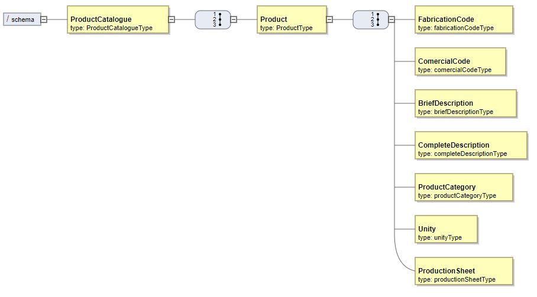
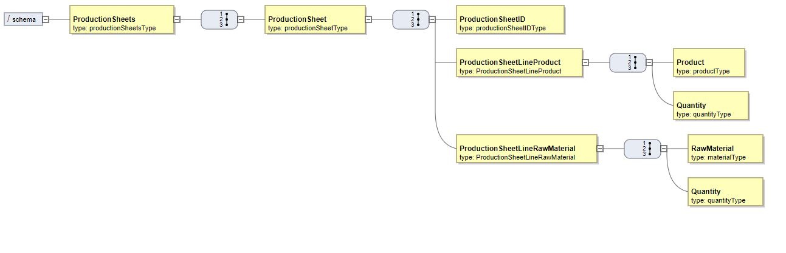

# [0-1010] Specify a XSD Document(Production Sheets and Products)

# 1. Requirements

As **Project Manager**, I want the team to specify XSD documents that, later, can be used to validate XML content that is generated by the system.
These XSD should validate all information related to the Products and Production Sheets

This use case is related to all other XSD and XML use cases.

# 2. Analysis

There's nothing to be changed in the domain. All the information regarding the Machine Aggregate is all represented.

# 3. Design

## 3.1. XML Diagram for Products



## 3.2. XML Diagram for Production Sheets



# 4. Implementation
## 4.1. Products

```xml
<xsd:schema xmlns:xsd="http://www.w3.org/2001/XMLSchema">

    <xsd:element name="ProductCatalogue" type="ProductCatalogueType"/>

    <xsd:complexType name="ProductCatalogueType">
        <xsd:sequence>
            <xsd:element name="Product" type="ProductType"/>
        </xsd:sequence>
    </xsd:complexType>
	
	<xsd:simpleType name="fabricationCodeType">
        <xsd:restriction base="xsd:string">
            <xsd:length value="15"/>
        </xsd:restriction>
    </xsd:simpleType>

    <xsd:simpleType name="comercialCodeType">
        <xsd:restriction base="xsd:string">
            <xsd:length value="15"/>
        </xsd:restriction>
    </xsd:simpleType>

    <xsd:simpleType name="briefDescriptionType">
        <xsd:restriction base="xsd:string"/>
    </xsd:simpleType>

    <xsd:simpleType name="completeDescriptionType">
        <xsd:restriction base="xsd:string"/>
    </xsd:simpleType>

    <xsd:simpleType name="productCategoryType">
        <xsd:restriction base="xsd:string"/>
    </xsd:simpleType>

    <xsd:simpleType name="unityType">
        <xsd:restriction base="xsd:string">
            <xsd:enumeration value="KG"/>
            <xsd:enumeration value="UN"/>
            <xsd:enumeration value="G"/>
        </xsd:restriction>
    </xsd:simpleType>

    <xsd:simpleType name="productionSheetType">
        <xsd:restriction base="xsd:string">
            <xsd:length value="15"/>
        </xsd:restriction>
    </xsd:simpleType>

    <xsd:complexType name="ProductType">
        <xsd:sequence>
            <xsd:element name="FabricationCode" type="fabricationCodeType"/>
            <xsd:element name="ComercialCode" type="comercialCodeType"/>
            <xsd:element name="BriefDescription" type="briefDescriptionType"/>
            <xsd:element name="CompleteDescription" type="completeDescriptionType"/>
            <xsd:element name="ProductCategory" type="productCategoryType"/>
            <xsd:element name="Unity" type="unityType"/>
            <xsd:element name="ProductionSheet" type="productionSheetType"/>
        </xsd:sequence>
    </xsd:complexType>

</xsd:schema>
```

## 4.2. Production Sheets

```xml
<xsd:schema xmlns:xsd="http://www.w3.org/2001/XMLSchema">

    <xsd:element name="ProductionSheets" type="productionSheetsType"/>

    <xsd:complexType name="productionSheetsType">
        <xsd:sequence>
            <xsd:element name="ProductionSheet" type="productionSheetType"/>
        </xsd:sequence>
    </xsd:complexType>

    <xsd:complexType name="ProductionSheetLineProduct">
        <xsd:sequence>
            <xsd:element name="Product" type="productType"/>
            <xsd:element name="Quantity" type="quantityType"/>
        </xsd:sequence>
    </xsd:complexType>

    <xsd:complexType name="ProductionSheetLineRawMaterial">
        <xsd:sequence>
            <xsd:element name="RawMaterial" type="materialType"/>
            <xsd:element name="Quantity" type="quantityType"/>
        </xsd:sequence>
    </xsd:complexType>


    <xsd:simpleType name="productType">
        <xsd:restriction base="xsd:string">
            <xsd:length value="15"/>
        </xsd:restriction>
    </xsd:simpleType>

    <xsd:simpleType name="materialType">
        <xsd:restriction base="xsd:string">
            <xsd:length value="15"/>
        </xsd:restriction>
    </xsd:simpleType>

    <xsd:simpleType name="quantityType">
        <xsd:restriction base="xsd:integer"/>
    </xsd:simpleType>

    <xsd:simpleType name="productionSheetIDType">
        <xsd:restriction base="xsd:string">
            <xsd:length value="15"/>
        </xsd:restriction>
    </xsd:simpleType>

    <xsd:complexType name="productionSheetType">
        <xsd:sequence>
            <xsd:element name="ProductionSheetID" type="productionSheetIDType"/>
            <xsd:element name="ProductionSheetLineProduct" type="ProductionSheetLineProduct"/>
            <xsd:element name="ProductionSheetLineRawMaterial" type="ProductionSheetLineRawMaterial"/>
        </xsd:sequence>
    </xsd:complexType>


</xsd:schema>
```

# 6. Observations

None.