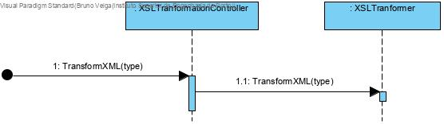
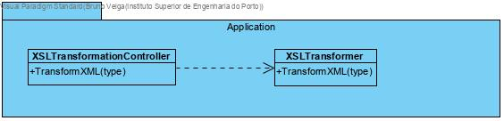

# XSLT Transformation
# 1. Requirements 

As a production manager
I want to transform the xml files previously exported 
So that they are available to be consulted

Acceptance criteria:

 - XSLT must be used

# 2. Analysis


# 3. Design

## 3.1. Functionality realisation



HTML 

Tables will be created for every domain class.

Json

Every object will be a domain class.

Texto

Present the information by domain class using titles for every theme, and showing it in text blocks

## 3.2. Class diagram



## 3.4. Tests

XMLDocument used for test: 

```xml
<?xml version="1.0" encoding="UTF-8"?>
<SSFM
    xmlns:xsi='http://www.w3.org/2001/XMLSchema-instance'
    xsi:noNamespaceSchemaLocation='1180712.xsd'>
    <Products>
        <Product fabricationCode="1000">
            <comercialCode>1000</comercialCode>
            <briefDescription>rato</briefDescription>
            <completeDescription>Produto muito bem bom para fazer coisas</completeDescription>
            <productCategory>informatica</productCategory>
            <unity>U1</unity>
            <productionSheet>ps1112</productionSheet>
        </Product>
        <Product fabricationCode="1001">
            <comercialCode>1001</comercialCode>
            <briefDescription>macaneta</briefDescription>
            <completeDescription>Produto mais bem bom para fazer coisas</completeDescription>
            <productCategory>carpintaria</productCategory>
            <unity>U2</unity>
            <productionSheet>ps1113</productionSheet>
        </Product>
        <Product fabricationCode="1002">
            <comercialCode>1002</comercialCode>
            <briefDescription>Conversor RCA/AV</briefDescription>
            <completeDescription>Conversor RCA/AV para HDMI 1080p (novo)</completeDescription>
            <productCategory>informatica</productCategory>
            <unity>U2</unity>
            <productionSheet>ps1114</productionSheet>
        </Product>
        <Product fabricationCode="1003">
            <comercialCode>1003</comercialCode>
            <briefDescription>liquidificador</briefDescription>
            <completeDescription>marca Moulinex / modelo Deposite</completeDescription>
            <productCategory>cozinha</productCategory>
            <unity>U2</unity>
            <productionSheet>ps1111</productionSheet>
        </Product>
        <Product fabricationCode="1004">
            <comercialCode>1004</comercialCode>
            <briefDescription>Punhal decorativo</briefDescription>
            <completeDescription>Punhal decorativo todo trabalhador</completeDescription>
            <productCategory>fantasias</productCategory>
            <unity>U1</unity>
            <productionSheet></productionSheet>
        </Product>
    </Products> 
    
    <ProductionSheets>
        <ProductionSheet ID="ps1111">
            <ProductionSheetLineProduct>
                <Product ID="1000" Quantity="2"/>
            </ProductionSheetLineProduct>
            <ProductionSheetLineProduct>
                <Product ID="1001" Quantity="2"/>
            </ProductionSheetLineProduct>
            <ProductionSheetLineRawMaterial>
                <RawMaterial ID="raw_material_1" Quantity="3"/>
            </ProductionSheetLineRawMaterial>
            <ProductionSheetLineRawMaterial>
                <RawMaterial ID="raw_material_2" Quantity="3"/>
            </ProductionSheetLineRawMaterial>
        </ProductionSheet>
        <ProductionSheet ID="ps1112">
            <ProductionSheetLineProduct>
                <Product ID="1002" Quantity="2"/>
            </ProductionSheetLineProduct>
            <ProductionSheetLineProduct>
                <Product ID="1003" Quantity="2"/>
            </ProductionSheetLineProduct>
            <ProductionSheetLineRawMaterial>
                <RawMaterial ID="raw_material_1" Quantity="3"/>
            </ProductionSheetLineRawMaterial>
        </ProductionSheet>
        <ProductionSheet ID="ps1113">
            <ProductionSheetLineProduct>
                <Product ID="1000" Quantity="2"/>
            </ProductionSheetLineProduct>
            <ProductionSheetLineProduct>
                <Product ID="1002" Quantity="2"/>
            </ProductionSheetLineProduct>
            <ProductionSheetLineRawMaterial>
                <RawMaterial ID="raw_material_1" Quantity="3"/>
            </ProductionSheetLineRawMaterial>
            <ProductionSheetLineRawMaterial>
                <RawMaterial ID="raw_material_2" Quantity="3"/>
            </ProductionSheetLineRawMaterial>
            <ProductionSheetLineRawMaterial>
                <RawMaterial ID="raw_material_6" Quantity="3"/>
            </ProductionSheetLineRawMaterial>
        </ProductionSheet>
        <ProductionSheet ID="ps1114">
            <ProductionSheetLineRawMaterial>
                <RawMaterial ID="raw_material_5" Quantity="3"/>
            </ProductionSheetLineRawMaterial>
        </ProductionSheet>
    </ProductionSheets>
</SSFM>
```

