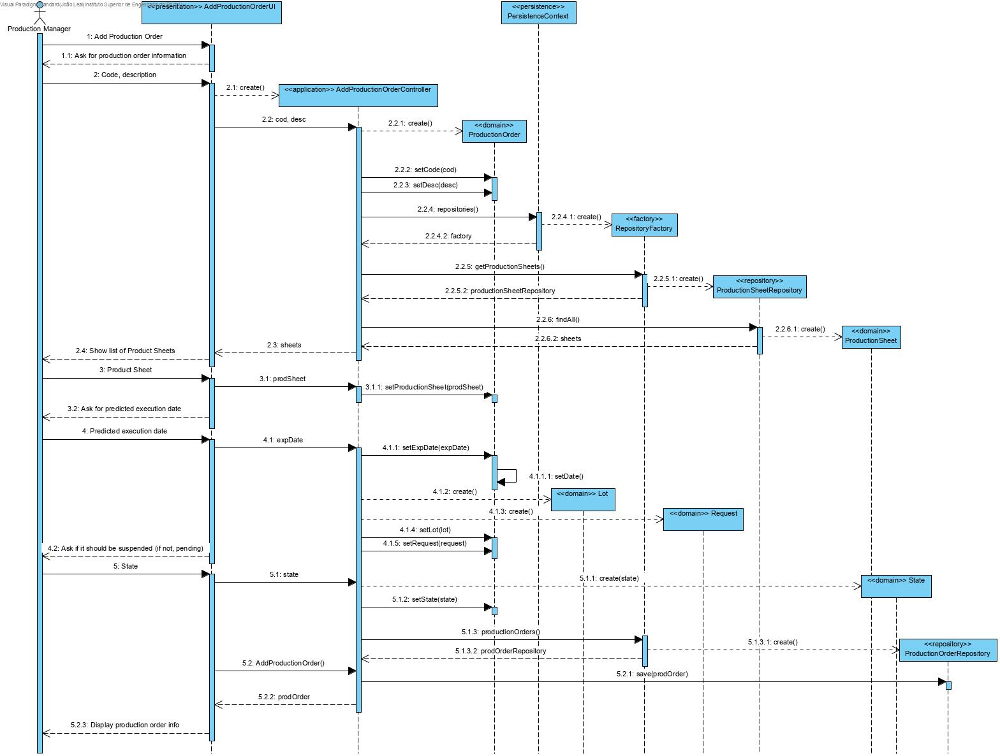
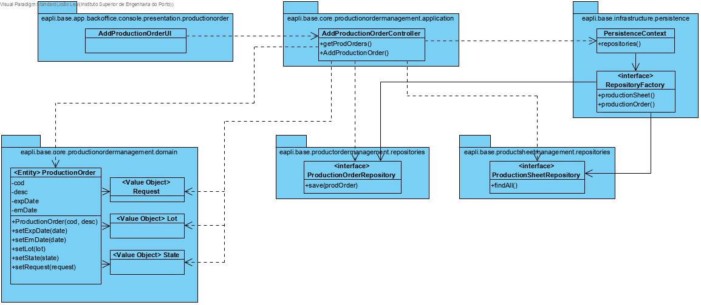

Add Production Order
=======================================

# 1. Requirements 

As Production Manager I want to introduce a new production order to have something to produce

**Client details:**

# 2. Analysis


The domain model was not altered.

# 3. Design

## 3.1. Functionality realisation



## 3.2. Class diagram



## 3.3. Design patterns applied

**Pure Fabrication** - used in the creation of the class "SpecifyNewProductionOrderUI", since no other rule can be applied to create it.

**Controller** - the class "SpecifyNewProductionOrderController" controls the user case.

**Simple responsibility** - Every class has only one responsibility, the controller class only controls the user case, the "Production Order" class is only responsible for operations related to Production Order and the repository class is only responsible for communicating with the database, and bring information to memory.

**Repository** - There are classes ("ProductionOrderRepository" and "ProductionSheetRepository") responsible for operations with the database related to the domain classes correspondent. 

## 3.4. Tests


**Test 1:** Verifies that a Production Order instance can be created with an internal code and description.

```java
@Test
public void ensureProductionOrderWithCodeDesc() {
    new ProductionOrder(CODE, DESC);
    assertTrue(true);
}
```

**Test 2:** Verifies that a Production Order instance can't be created without a code.
```java
@Test(expected = IllegalArgumentException.class)
public void ensureMustHaveCode() {
    new ProductionOrder(null, DESC);
}
```
**Test 3:** Verifies that a Production Order instance can't be created without a description.
```java
@Test(expected = IllegalArgumentException.class)
public void ensureMustHaveDesc() {
    new ProductionOrder(CODE, null);
}
```
**Test 4:** Verifies that a Production Order instance can't be created with an empty description
```java
@Test(expected = IllegalArgumentException.class)
public void ensureDescMustNotBeEmpty() {
    new ProductionOrder(CODE, "");
}
```
# 4. Implementation

## 4.1. Controller  
```java
public class SpecifyNewProductionOrderController implements Controller {

    private final AuthorizationService authz = AuthzRegistry.authorizationService();
    private final ListProductionSheetsController pcs= new ListProductionSheetsController();
    private final ProductionOrderRepository por = PersistenceContext.repositories().productionOrder();

    public Iterable<ProductionSheet> getProductionSheets() {
        return this.pcs.productionSheets();
    }

    public ProductionOrder addProductionOrderToCatalogue(Designation code, String desc, boolean suspended, Designation lot, Designation request, String execDate, int quantity, ProductionSheet prodSheet) {
        authz.ensureAuthenticatedUserHasAnyOf(BaseRoles.POWER_USER, BaseRoles.PRODUCTION_MANAGER);
        final ProductionOrderBuilder pob = new ProductionOrderBuilder();
        String state;
        if (suspended) state="Suspended";
        else state="Pending";
        SimpleDateFormat sdf=new SimpleDateFormat("dd-MM-yyyy");
        pob.gatherVariablesWithSheet(code, desc, state, lot, request, sdf.format(Calendar.getInstance().getTime()), execDate, quantity, prodSheet);
        return this.por.save(pob.build());
    }
}
```
​    

## 4.2. Domain
```java
@Entity
public class ProductionOrder implements AggregateRoot<Designation>, Serializable {

    private static final long serialVersionUID = 1L;
    @Version
    private long version;

    //Primary key
    @EmbeddedId
    @Column(name="internalCode")
    private Designation internalCode;

    //Description
    @Column(name="description")
    private String desc;

    //Value objects
    @Column(name="state")
    private State state;
    @Column(name="lot")
    private Lot lot;
    @Column(name="request")
    private Request request;
    @Column(name="emissionDate")
    private EmissionDate emissionDate;
    @Column(name="predictedExecDate")
    private PredictedExecutionDate predictedExecutionDate;
    @Column(name="quantity")
    private int quantityToProduce;
    @Enumerated(EnumType.STRING)
    private ProcessingState processingState;

    //Production Sheets
    @ManyToOne
    private ProductionSheet prodSheet;

    public ProductionOrder(final Designation internalCode, final String desc) {
        Preconditions.noneNull(internalCode, desc);
        this.internalCode=internalCode;
        setDesc(desc);
        processingState = ProcessingState.UNPROCESSED;
    }

    protected ProductionOrder() {

    }

    /**
     * Checks if description is null or empty
     * @param description
     * @return True if it's not null or empty
     */
    private static boolean descriptionMeetsMinimumRequirements(final String description) {
        return !StringPredicates.isNullOrEmpty(description);
    }

    /**
     * Sets state (either suspended or pending)
     * @param suspended - boolean
     */
    public void setState(boolean suspended) {
        this.state = new State(suspended);
    }

    /**
     * Sets state (any state)
     * @param state - String
     */
    public void setState(String state) {
        this.state = new State(state);
    }

    /**
     * Sets lot
     * @param lot - Lot
     */
    public void setLot(Lot lot) {
        this.lot = lot;
    }

    /**
     * Sets request
     * @param request - Request
     */
    public void setRequest(Request request) {
        this.request = request;
    }

    /**
     * Sets emissionDate (current date)
     */
    public void setEmissionDate() {
        this.emissionDate = new EmissionDate();
    }

    /**
     * Sets emissionDate (specified date)
     * @param date - Calendar
     */
    public void setEmissionDate(Calendar date) {
        this.emissionDate = new EmissionDate(date);
    }

    /**
     * Sets predictedExecutionDate
     * @param date - Date
     */
    public void setPredictedExecutionDate(Calendar date) {
        this.predictedExecutionDate = new PredictedExecutionDate(date);
    }

    /**
     * Sets Production Sheet
     * @param prodSheet
     */
    public void setProductionSheet(ProductionSheet prodSheet) {
        this.prodSheet=prodSheet;
    }

    /**
     * Set processingState as PROCESSED
     */
    public void processed(){
        this.processingState = ProcessingState.PROCESSED;
    }

    /**
     * Gets processingState
     * @return
     */
    public ProcessingState processingState(){
        return processingState;
    }
    
    /**
     * Validates and sets description
     * @param desc
     */
    public void setDesc(final String desc) {
        if (descriptionMeetsMinimumRequirements(desc)) this.desc = desc;
        else throw new IllegalArgumentException("Invalid description");
    }

    /**
     * Sets quantityToProduce
     * @param quantity - int
     */
    public void setQuantityToProduce(int quantity) {
        this.quantityToProduce=quantity;
    }

    /**
     * Gets internal code
     * @return Designation internal code
     */
    public Designation getInternalCode() {
        return internalCode;
    }

    /**
     * Gets description
     * @return String desc
     */
    public String getDesc() {
        return desc;
    }

    /**
     * Gets state
     * @return State state
     */
    public State getState() {
        return state;
    }

    /**
     * Gets lot
     * @return Lot lot
     */
    public Lot getLot() {
        return lot;
    }

    /**
     * Gets request
     * @return Request request
     */
    public Request getRequest() {
        return request;
    }

    /**
     * Gets emission date
     * @return EmissionDate emissionDate
     */
    public EmissionDate getEmissionDate() {
        return emissionDate;
    }

    /**
     * Gets predicted execution date
     * @return PredictedExecutionDate predictedExecutionDate
     */
    public PredictedExecutionDate getPredictedExecutionDate() {
        return predictedExecutionDate;
    }

    /**
     * Gets production sheet
     * @return ProduyctionSheet productionSheet
     */
    public ProductionSheet getProductionSheet() {
        return prodSheet;
    }

    /**
     * Gets quantity to produce
     * @return int quantityToProduce
     */
    public int getQuantityToProduce() {
        return quantityToProduce;
    }

    /**
     * Decrements quantity to produce
     * @return int quantityToProduce
     */
    public int decrementQuantity() {
        return --quantityToProduce;
    }

    /**
     * Checks if its state is pending or suspended
     * @return true if either suspended or pending, false otherwise
     */
    public boolean isPendingOrSuspended() {
        return state.isSuspended() || state.isPending();
    }

    /**
     * Checks if it has Lot with lotCode
     * @param lotCode - Designation
     * @return true if it does, false otherwise
     */
    public boolean hasLot(Designation lotCode) {
        return this.lot.hasLot(lotCode);
    }

    /**
     * Checks if it has Request with requestCode
     * @param requestCode - Designation
     * @return true if it does, false otherwise
     */
    public boolean hasRequest(Designation requestCode) {
        return this.request.hasRequest(requestCode);
    }

    /**
     * Checks if it has State with state
     * @param state - String
     * @return true if it does, false otherwise
     */
    public boolean hasState(String state) {
        return this.state.equals(state);
    }

    /**
     * Checks if two objects are the same
     * @param other: the other object
     * @return True if they're the same object, false otherwise
     */
    @Override
    public boolean sameAs(Object other) {
        final ProductionOrder pOrder=(ProductionOrder) other;
        return this.equals(pOrder) && this.desc.equals(pOrder.desc);
    }

    /**
     * Returns the identity of this object
     * @return the deposit's code
     */
    @Override
    public Designation identity() {
        return this.internalCode;
    }

    /**
     * HashCode
     * @return hashCode
     */
    @Override
    public int hashCode() {
        return DomainEntities.hashCode(this);
    }

    /**
     * Checks if two objects have the same ID
     * @param o: other object
     * @return True if they have the same ID
     */
    @Override
    public boolean equals(final Object o) {
        return DomainEntities.areEqual(this, o);
    }

    /**
     * Normal toString
     * @return String
     */
    @Override
    public String toString() {
        return "Production Order " + internalCode.toString() +"\n   - Description: " + desc +"\n   - State: "+ state.toString();
    }

    /**
     * Complete toString for consult
     * @return String
     */
    public String toStringComplete() {
        return "ID: " + internalCode.toString() + "\n   - Lot: " + lot.toString() + "\n   - Request: " + request.toString() + "\n   - Emission date: " + emissionDate.toString()
                + "\n   - Predicted execution date: " + predictedExecutionDate.toString() + "\n   - Production Sheet ID: " + prodSheet.identity().toString() + "\n     - Quantity to be produced: " + quantityToProduce;
    }

}
```

## 4.3. Repository
```java
public interface ProductionOrderRepository extends DomainRepository<Designation, ProductionOrder>  {

    Iterable<ProductionOrder> getPendingOrSuspended();
    ProductionOrder getProductionOrderByLot(Designation lotCode);
    Iterable<ProductionOrder> getProductionOrdersByRequest(Designation requestCode);
    Iterable<ProductionOrder> getProductionOrdersWithState(String state);
    Iterable<ProductionOrder> getUnprocessedProductionOrders();
}
```
    

# 5. Integration/Demonstration

This functionality had to be integrated for persistence in memory and Jpa
```java
public interface RepositoryFactory {
    /**
    * repository will be created in auto transaction mode
    *
    * @return
    */
    ProductionOrderRepository productionOrder();
}

package eapli.base.persistence.impl.inmemory;
    
public class InMemoryProductionOrderRepository extends InMemoryDomainRepository<Designation, ProductionOrder> implements ProductionOrderRepository {

    static {
        InMemoryInitializer.init();
    }

    public Iterable<ProductionOrder> getPendingOrSuspended(){
        return match(ProductionOrder::isPendingOrSuspended);
    }

    @Override
    public ProductionOrder getProductionOrderByLot(Designation lotCode) {
        return matchOne(e->e.hasLot(lotCode)).get();
    }

    @Override
    public Iterable<ProductionOrder> getProductionOrdersByRequest(Designation requestCode) { return match(e->e.hasRequest(requestCode)); }

    @Override
    public Iterable<ProductionOrder> getProductionOrdersWithState(String state) {
        return match(p->p.hasState(state));
    }

    @Override
    public Iterable<ProductionOrder> getUnprocessedProductionOrders() {
        return match(e -> e.processingState().equals(ProcessingState.UNPROCESSED));
    }
}
    

@Override
public ProductionOrderRepository productionOrder() { return new InMemoryProductionOrderRepository(); }

________________________________________________________
    
package eapli.base.persistence.impl.jpa;
    
public class JpaProductionOrderRepository extends BasepaRepositoryBase<ProductionOrder, Designation,Designation> implements ProductionOrderRepository {
    
    public JpaProductionOrderRepository() {
        super("internalCode");
    }

    @Override
    public Iterable<ProductionOrder> getPendingOrSuspended(){
        final TypedQuery<ProductionOrder> query = entityManager().createQuery(
                "SELECT p FROM ProductionOrder p where p.state = 'Suspended' OR p.state = 'Pending'", ProductionOrder.class
        );
        return query.getResultList();
    }

    @Override
    public ProductionOrder getProductionOrderByLot(Designation lotCode) {
        final TypedQuery<ProductionOrder> query = entityManager().createQuery(
                "SELECT p FROM ProductionOrder p where p.lot.lotCode=:p",ProductionOrder.class
        );
        query.setParameter("p", lotCode);
        return query.getSingleResult();
    }

    @Override
    public Iterable<ProductionOrder> getProductionOrdersByRequest(Designation requestCode) {
        final TypedQuery<ProductionOrder> query = entityManager().createQuery(
                "SELECT p FROM ProductionOrder p where p.request.requestCode=:s",ProductionOrder.class
        );
        query.setParameter("s", requestCode);
        return query.getResultList();
    }

    @Override
    public Iterable<ProductionOrder> getProductionOrdersWithState(String state) {
        final TypedQuery<ProductionOrder> query = entityManager().createQuery(
                "SELECT p FROM ProductionOrder p where p.state.state=:s",ProductionOrder.class
        );
        query.setParameter("s", state);
        return query.getResultList();
    }

    @Override
    public Iterable<ProductionOrder> getUnprocessedProductionOrders() {
        final Map<String, Object> params = new HashMap<>();

        params.put("state", ProcessingState.UNPROCESSED);
        
        return match("e.processingState = :state", params);
    }
}
    
@Override
public ProductionOrderRepository productionOrder() {
    return new JpaProductionOrderRepository();
}
```
# 6. Observations

This functionality was implemented without any issues.
