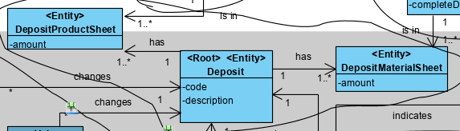
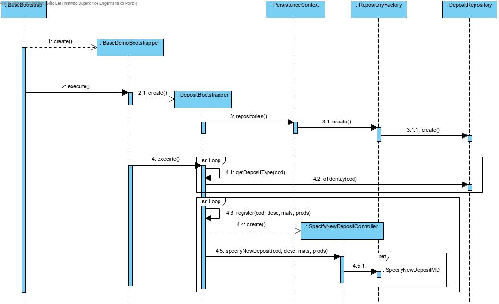
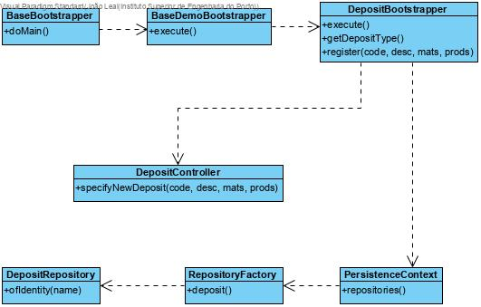

Deposit Initialization (Bootstrap)
=======================================

# 1. Requirements 

As Project Manager, I want to proceed with the initialization of some deposits (bootstraps), so that there can already be functioning deposits.

Basically, there is a need to add deposits, so that it can be used to store raw materials and products.

**Client details:**

# 2. Analysis

The domain model was altered. There are two new classes (DepositMaterialSheet and DepositProductSheet).

# 3. Design

## 3.1. Functionality realisation

## 3.2. Class diagram

## 3.3. Design patterns applied

This use case uses the controller of use case "Specify New Deposit", so the design patterns applied there will also be applied here.

Additionally, the "tell, don't ask" principle is also applied here. Each and every class tells the ones they create to execute the processes needed to initialize the deposits.

## 3.4. Tests

Some smoke tests to test basic functions work:

    public class DepositCRUDSmokeTester {

        private static final Logger LOGGER = LogManager.getLogger(DepositCRUDSmokeTester.class);
        private final DepositRepository repo = PersistenceContext.repositories().deposit();

        public void testDeposit() {
            
            //save
            repo.save(new Deposit(Designation.valueOf("first"),"first desc"));
            repo.save(new Deposit(Designation.valueOf("second"),"second desc"));
            LOGGER.info("»»» created deposits");

            //findAll
            final Iterable<Deposit> l= repo.findAll();
            Invariants.nonNull(l);
            Invariants.nonNull(l.iterator());
            Invariants.ensure(l.iterator().hasNext());
            LOGGER.info("»»» find all deposits");

            //count
            final long n = repo.count();
            LOGGER.info("»»» # deposits = {}", n);

            //ofIdentity
            final Deposit rm1=repo.ofIdentity(Designation.valueOf("first")).orElseThrow(IllegalStateException::new);
            final Deposit rm2=repo.ofIdentity(Designation.valueOf("second")).orElseThrow(IllegalStateException::new);
            LOGGER.info("»»» found deposits of identity");

            // containsOfIdentity
            final boolean hasId = repo.containsOfIdentity(rm1.identity());
            Invariants.ensure(hasId);
            LOGGER.info("»»» contains deposit of identity");

            // contains
            final boolean has = repo.contains(rm1);
            Invariants.ensure(has);
            LOGGER.info("»»» contains deposit");

            // delete
            repo.delete(rm1);
            LOGGER.info("»»» delete deposit");

            // deleteOfIdentity
            repo.deleteOfIdentity(rm2.identity());
            LOGGER.info("»»» delete deposit of identity");

            // size
            final long n2 = repo.size();
            Invariants.ensure(n2 == n - 2);
            LOGGER.info("»»» # deposits = {}", n2);
        }
    }

# 4. Implementation

## 4.1. Bootstrapper

    public class DepositBootstrapper implements Action {

        private static final Logger LOGGER = LogManager.getLogger(DepositBootstrapper.class);

        private final RawMaterialRepository materialRepository = PersistenceContext.repositories().rawMaterial();
        private final ProductRepository productRepository = PersistenceContext.repositories().products();

        private RawMaterial getMaterial(final String name) {
            return materialRepository.ofIdentity(Designation.valueOf(name)).orElseThrow(IllegalStateException::new);
        }

        private Product getProduct(final String name) {
            return productRepository.ofIdentity(Designation.valueOf(name)).orElseThrow(IllegalStateException::new);
        }

        @Override
        public boolean execute() {

            final RawMaterial softWood = getMaterial(TestDataConstants.RAW_MATERIAL_1);
            final RawMaterial hardWood = getMaterial(TestDataConstants.RAW_MATERIAL_2);
            final RawMaterial iron = getMaterial(TestDataConstants.RAW_MATERIAL_6);
            final RawMaterial steel = getMaterial(TestDataConstants.RAW_MATERIAL_5);

            final Product rato = getProduct(TestDataConstants.PRODUCT_1);
            final Product macaneta = getProduct(TestDataConstants.PRODUCT_2);

            register(TestDataConstants.DEPOSIT_1, "Deposit 1", softWood, null);
            register(TestDataConstants.DEPOSIT_2, "Deposit 2", hardWood, null);
            register(TestDataConstants.DEPOSIT_3, "Deposit 3", iron, null);
            register(TestDataConstants.DEPOSIT_4, "Deposit 4", null, rato);
            register(TestDataConstants.DEPOSIT_5, "Deposit 5", steel, macaneta);

            return true;
        }
        
        private void register(final String code, final String desc, RawMaterial material, Product product) {
            final SpecifyNewDepositController controller = new SpecifyNewDepositController();
            try {
                controller.specifyNewDeposit(code, desc);
                if (material!=null) controller.addDepositMaterialSheet(material);
                if (product!=null) controller.addDepositProductSheet(product);
                controller.save();
            } catch (final IntegrityViolationException | ConcurrencyException e) {
                // ignoring exception. assuming it is just a primary key violation
                // due to the tentative of inserting a duplicated user
                LOGGER.warn("Assuming {} already exists (activate trace log for details)", desc);
                LOGGER.trace("Assuming existing record", e);
            }
        }
    }

    
## 4.2. Commits

Commit 1: #14: [2-3-1009] - Deposit initialization (bootstrap) #comment FiDesign and partial implementation

Commit 2: #14: [2-3-1009] - Deposit initialization (bootstrap) #comment Added Smoke Tests

Commit 3: #14: [2-3-1009] - Deposit initialization (bootstrap) #comment Corrected some issues

# 5. Integration/Demonstration

A instance of "DepositBootstrapper" was created and executed in class "BaseDemoBootstrapper".

    public class BaseDemoBootstrapper implements Action {

        private static final String POWERUSER_A1 = "poweruserA1";
        private static final String POWERUSER = "poweruser";

        private final AuthorizationService authz = AuthzRegistry.authorizationService();
        private final AuthenticationService authenticationService = AuthzRegistry.authenticationService();

        @Override
        public boolean execute() {
            // declare bootstrap actions
            final Action[] actions = { new BackofficeUsersBootstrapper(),
                new ClientUserBootstrapper(), new RawMaterialCategoryBootstrapper(), 
                new RawMaterialBootstrapper(), new ProductBootstrapper(), new DepositBootstrapper(),
                new MachineBootstrapper(), new ProductionLineBootstrapper()
                };

            authenticateForBootstrapping();

            // execute all bootstrapping
            boolean ret = true;
            for (final Action boot : actions) {
                System.out.println("Bootstrapping " + nameOfEntity(boot) + "...");
                ret &= boot.execute();
            }
            return ret;
        }
    }

# 6. Observations

This functionality was implemented without any issues.
