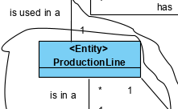
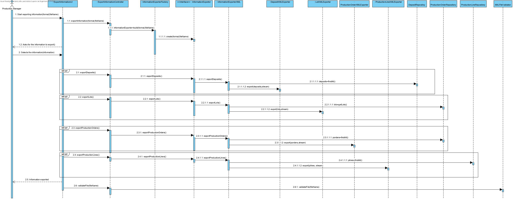
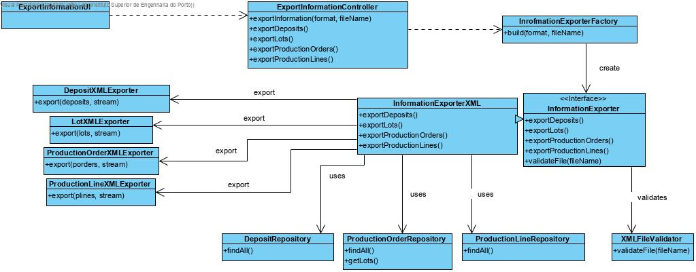

Import Messages SCM
=======================================

# 1. Requirements 

As SCM 
I want to export existing deposits, production lines, lots and production orders in the database to an XML document, so that they are available for inspection.

# 2. Analysis





# 3. Design

## 3.1. Functionality realisation



## 3.2. Class diagram



## 3.3. Design patterns applied

**Controller** - the class "XMLExporterController" controls the user case.

**Strategy** - A strategy is used for exporting diverse types of files. For now, there is only need to export to XML but by applying a strategy the application is open for more importing user cases but closed to changes.

**Repository** - There are repository classes to access deposits, production lines, lots and production orders.

**Factory** - There is a factory "InformationExporterFactory" responsible for creating the right exporter class depending on the format to be exported

**Single responsibility** Every class has specific responsibilities. Each exporter class will only have the responsibility of exporting one of the domain classes they represent.

## 3.4. Tests 
## Scenario 1:

- After starting the backoffice application, choose the option "export information to xml", enter the path of the file and select the option "export all".
- The application will then proceed to export all existing objects to the file, and finally validate the file with the XSD created

# 4. Implementation

## 4.1 Deposits
```java
public class DepositXMLExporter {
    public void export(final Iterable<Deposit> deposits, final PrintWriter stream) {
        stream.println("    <Deposits>");
        for(Deposit d: deposits) {
            stream.printf("        <Deposit internalCode=\"%s\">%n",d.getCode());
            stream.printf("            <Description>%s</Description>%n",d.getDescription());
            if (!d.getMaterialSheets().isEmpty()) {
                stream.printf("            <RawMaterials>%n");
                for (DepositMaterialSheet dms : d.getMaterialSheets()) {
                    stream.printf("                <RawMaterial ID=\"%s\" Quantity=\"%d\"/>%n", dms.getMaterial().internalCode(), dms.getAmount());
                }
                stream.printf("            </RawMaterials>%n");
            }
            if (!d.getProductSheets().isEmpty()) {
                stream.printf("            <Products>%n");
                for (DepositProductSheet dms : d.getProductSheets()) {
                    stream.printf("                <Product ID=\"%s\" Quantity=\"%d\"/>%n", dms.getProduct().identity(), dms.getAmount());
                }
                stream.printf("            </Products>%n");
            }
            stream.printf("        </Deposit>%n");
        }
        stream.println("    </Deposits>");
    }
}
```
## 4.2 Lots
```java
public class LotXMLExporter {
    public void export(final Iterable<Lot> lots, final PrintWriter stream) {
        if (!lots.iterator().hasNext()) return;
        stream.println("    <Lots>");
        for(Lot l : lots) {
            stream.printf("        <Lot internalCode=\"%s\"/>%n", l.toString());
        }
        stream.println("    </Lots>");
    }
}
```
## 4.3 Production Orders
```java
public class ProductionOrderXMLExporter {
    public void export(final Iterable<ProductionOrder> productionOrders, final PrintWriter stream) {
        if (!productionOrders.iterator().hasNext()) return;
        stream.println("    <ProductionOrders>");
        for(ProductionOrder po: productionOrders) {
            stream.printf("        <ProductionOrder internalCode=\"%s\">%n",po.getInternalCode());
            stream.printf("            <Description>%s</Description>%n",po.getDesc());
            stream.printf("            <State>%s</State>%n",po.getState().getState());
            stream.printf("            <Lot ID=\"%s\"/>%n",po.getLot());
            SimpleDateFormat sdf =new SimpleDateFormat("yyyy-MM-dd");
            stream.printf("            <EmissionDate>%s</EmissionDate>%n",sdf.format(po.getEmissionDate().getDate().getTime()));
            stream.printf("            <PredictedExecutionDate>%s</PredictedExecutionDate>%n",sdf.format(po.getPredictedExecutionDate().getDate().getTime()));
            stream.printf("            <ProductionSheet ID=\"%s\"/>%n",po.getProductionSheet().identity());
            stream.printf("            <Deposit/>%n");
            stream.printf("            <QuantityToProduce>%d</QuantityToProduce>%n",po.getQuantityToProduce());
            stream.printf("        </ProductionOrder>%n");
        }
        stream.println("    </ProductionOrders>");
    }
}
```
## 4.4 Production Lines
```java
public class ProductionLineXMLExporter {
    public void export(final Iterable<ProductionLine> productionLines, final PrintWriter stream) {
        stream.println("    <ProductionLines>");
        for(ProductionLine pl : productionLines) {
            stream.printf("        <ProductionLine internalCode=\"%s\">%n", pl.identity());
            stream.printf("            <Description>%s</Description>%n", pl.getDesc());
            if (!pl.getMachines().isEmpty()) {
                stream.printf("            <Machines>%n");
                for (Machine m : pl.getMachines()) {
                    stream.printf("                <Machine ID=\"%s\"/>%n", m.identity());
                }
                stream.printf("            </Machines>%n");
            }
            stream.printf("        </ProductionLine>%n");
        }
        stream.println("    </ProductionLines>");
    }
}
```
# 6. Observations

No issues observed.

