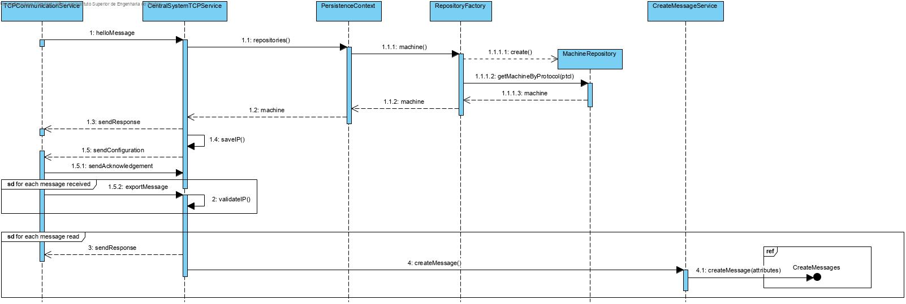
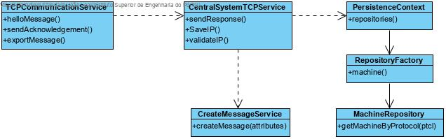

Central System Communications with Industrial Machine
====================================

# 1. Requirements 

As project manager
I want to develop a communication via TCP with a machine
So that the app can send messages to the machine

# 2. Analysis

There was no need to apply changes to the domain model.

# 3. Design

## 3.1. Functionality realisation



## 3.2. Class diagram



## 3.3. Design patterns applied

**Single responsible principle: ** Operations related to communication via TCP are all done with the class "TcpSrvMachine".

## 3.4. Tests

**Scenario 1:**

- Start the machine simulator application, enter as protocol ID "1001", as time "4" and as type "1001"
- The SCM application will automatically validate the machine protocol ID and start importing messages from the simulator, sending them to the MessageFactory of the Central System. In the end, the machine turns off.

# 4. Implementation
```java
public class TcpSrvMachine implements Runnable {

    static ServerSocket sock;
    static boolean on;
    static ErrorLoggerToFile logger;
    static Map<String, String> knownIPs;

    static {
        try {
            logger = new ErrorLoggerToFile("TCPSRV.txt");
        } catch (IOException e) {
            e.printStackTrace();
        }
    }

    public TcpSrvMachine(Map<String, String> knownIPs) {
        TcpSrvMachine.knownIPs=knownIPs;
    }

    public void run() {
        Socket cliSock;
        on = true;
        try {
            try {
                sock = new ServerSocket(9999);
            } catch (IOException ex) {
                logger.errorLog("Failed to open server socket");
                return;
            }
            System.out.println("SCM Server on.\nListening for TCP requests (IPv6/IPv4). Use CTRL+C to terminate the server");
            while (on) {
                cliSock = sock.accept();
                new Thread(new TcpSrvMachineThread(cliSock, knownIPs)).start();
            }
        } catch (IOException e) {
            logger.errorLog("Error in TCP server");
        }
    }
}

class TcpSrvMachineThread implements Runnable {

    private Socket s;
    private DataOutputStream sOut;
    private DataInputStream sIn;
    final MachineRepository repositoryMachine = PersistenceContext.repositories().machine();
    static ErrorLoggerToFile logger;
    Map<String, String> knownIPs;

    static {
        try {
            logger = new ErrorLoggerToFile("TCPSRVTHREAD.txt");
        } catch (IOException e) {
            e.printStackTrace();
        }
    }

    public TcpSrvMachineThread(Socket cli_s, Map<String, String> knownIPs) { s=cli_s; this.knownIPs=knownIPs; }
    public void run() {

        MessageLoggerToFile msgLogger;

        try {
            msgLogger = new MessageLoggerToFile("MESSAGELOG.txt");
        } catch (IOException e) {
            e.printStackTrace();
            return;
        }

        InetAddress clientIP;
        clientIP = s.getInetAddress();
        boolean validated = true;
        try {
            System.out.println("New client connection from " + clientIP.getHostAddress() + ", port number " + s.getPort());
            sOut = new DataOutputStream(s.getOutputStream());
            sIn = new DataInputStream(s.getInputStream());

            int id = parseHelloMessage();
            System.out.println("\nReceived hello message. Validating machine...");

            Machine machine;
            String machId="";
            try {
                machine = repositoryMachine.getMachine(new Protocol(id));
                machId = machine.identity().toString();
                System.out.println("Machine ID: " + machId);
            } catch (PersistenceException pe) {
                validated = false;
            }

            if (validated) System.out.print("Machine validated. Sending response...");
            else {
                logger.errorLog("Invalid machine.");
                System.out.print("Sending response..."); }
            sendResponse(validated);
            System.out.println(" Sent response.");
            if (!validated) {
                closeSocket(clientIP);
                return;
            }

            if (!knownIPs.containsKey(machId) || !knownIPs.get(machId).equals(clientIP.getHostAddress())) {
                knownIPs.put(machId, clientIP.getHostAddress());
                System.out.println("New entry in known IPs (ID: " + id + " IPv4: " + knownIPs.get(machId) + ")");
            }

            System.out.print("Sending configuration...");
            sendConfiguration(id);
            System.out.println(" Sent configuration.");

            System.out.print("Waiting for acknowledgement...");
            int length=awaitAcknowledgement();
            if (length<=0) {
                logger.errorLog("Error in acknowledgement.");
                closeSocket(clientIP);
                return;
            }

            System.out.println("Receiving messages...");
            ArrayList<String> messages=receiveMessages(clientIP);
            int counter=0;
            if (messages.isEmpty()) { System.out.println(); logger.errorLog("\nError receiving message."); }
            else {
                System.out.println("Received all messages from "+ machId +".");
                msgLogger.writeId(machId);
                for (String message : messages) {
                    msgLogger.messageLog(message);
                }
                msgLogger.closeFileReader();
            }
            CreateMessageService cms = new CreateMessageService();
            for (String message : messages) {
                if (createMessage(message, cms)) counter++;
            }
            System.out.println(counter+" valid messages were detected and parsed.");
            closeSocket(clientIP);
        } catch(IOException ex) {
            logger.errorLog("IOException in TCP server");
            try {
                closeSocket(clientIP);
            } catch (IOException ignored) {
            }
        } catch (Exception e) {
            e.printStackTrace();
            logger.errorLog("Exception in TCP server");
            try {
                closeSocket(clientIP);
            } catch (IOException ignored) {
            }
        }
    }

    private int parseHelloMessage() throws IOException {
        byte msg;
        int id, i;
        for (i = 0; i < 2; i++) {
            msg = sIn.readByte();
            if (msg != (byte) 0) {
                return -1;
            }
        }
        id = sIn.read();
        id += 256 * sIn.read();
        for (i = 0; i < 2; i++) {
            msg = sIn.readByte();
            if (msg != (byte) 0) {
                return -1;
            }
        }
        return id;
    }

    private void sendResponse(boolean validated) throws IOException {
        sOut.writeByte((byte) 1);
        if (validated) {
            sOut.writeByte((byte) 150);
        } else {
            sOut.writeByte((byte) 151);
        }
    }

    private void sendConfiguration(int id) throws IOException {
        sOut.writeByte((byte) 1);
        sOut.writeByte((byte) 2);
        sOut.writeShort(id);
    }

    private int awaitAcknowledgement() throws IOException {
        byte msg;
        int length;
        msg = sIn.readByte();
        if (msg != (byte) 0) {
            return -1;
        }
        msg = sIn.readByte();
        if (msg == (byte) 150) {
            System.out.println(" ACK received.");
            msg = sIn.readByte();
            if (msg != (byte) 0) {
                return -1;
            }
            msg = sIn.readByte();
            msg += sIn.readByte();
            length = msg;
            //sIn.skipBytes((byte)52);
        } else {
            System.out.println(" NACK received.");
            return -1;
        }
        return length;
    }

    private ArrayList<String> receiveMessages(InetAddress clientIP) throws IOException {
        byte msg;
        ArrayList<String> messages = new ArrayList<>();
        StringBuilder message = new StringBuilder();
        String mode = "";
        byte skip = (byte) -2;
        do {
            sIn.skipBytes((byte) 93 - skip);
            skip = (byte) 0;
            for (int i = 0; i < 6; i++) {
                msg = sIn.readByte();
            }
            for (int i=0;i<100;i++) {
                msg=sIn.readByte();
                if (msg==(byte) 10 || msg==(byte) 3 || msg==(byte) 0) break;
                skip++;
                message.append((char) msg);
            }
            String idToCheck=message.toString().split(";")[0];
            String ip=knownIPs.get(idToCheck);
            if (ip==null || !ip.equals(clientIP.getHostAddress())) {
                logger.errorLog("IP address doesn't match ID.");
                sendResponse(false);
            } else {
                sendResponse(true);
            }
            if (message.length() > 0) {
                mode = message.toString().split(";")[1];
                messages.add(message.toString());
            }
            message = new StringBuilder();
        } while (mode.compareTo("S9") != 0);
        return messages;
    }

    private void closeSocket(InetAddress clientIP) throws IOException {
        s.close();
        System.out.println("Client " + clientIP.getHostAddress() + ", port number: " + s.getPort() + " disconnected\n");
    }

    private boolean createMessage(String message, CreateMessageService cms) {
        List<String> attributes;
        String[] attributeSplit = message.split(";");
        String format = attributeSplit[1];
        attributes = Arrays.asList(attributeSplit);
        try {
            cms.createMessage(format, attributes);
            return true;
        } catch (IllegalStateException ex) {
            new CreateErrorNotificationController().createErrorNotification(StringUtils.join(attributes, ';'), ex.getMessage(), attributes.get(1).trim());
        } catch (ArrayIndexOutOfBoundsException ex2) {
            System.out.println("Wrong format");
        } catch (NoResultException ex3) {
            new CreateErrorNotificationController().createErrorNotification(StringUtils.join(attributes, ';'), "Lot doesn't exist", attributes.get(1).trim());
        } catch (DateTimeParseException | IllegalArgumentException ex4) {
            new CreateErrorNotificationController().createErrorNotification(StringUtils.join(attributes, ';'), "Wrong date hour", attributes.get(1).trim());
        } catch (Exception ex5) {
            new CreateErrorNotificationController().createErrorNotification(StringUtils.join(attributes, ';'), "Wrong format", attributes.get(1).trim());
        }
        return false;
    }
}
```

# 5. Observations

No issues observed.

