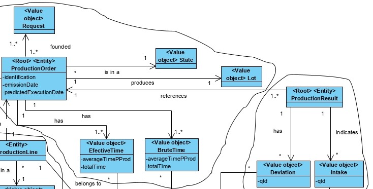
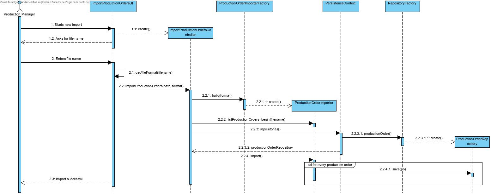
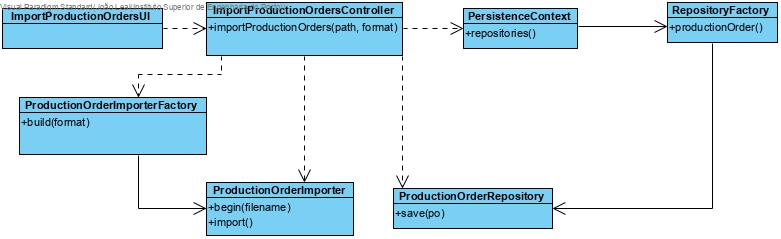

Import Production Orders Via CSV File
=======================================

# 1. Requirements 

As Production Manager, I want to import new production orders, so that there can be production orders available

# 2. Analysis



The domain model was not altered.

# 3. Design

## 3.1. Functionality realisation



## 3.2. Class diagram



## 3.3. Design patterns applied

**Pure Fabrication** - used in the creation of the class "ImportProductionOrdersUI", since no other rule can be applied to create it.

**Controller** - the class "ImportProductionOrdersController" controls the use case.

**Factory** - The class "ProductionOrderImporterFactory" creates "new ProductionOrderImporter" according to the FileFormat of the file that we are going to import.

**Simple responsibility** - Every class has only one responsibility, the controller class only controls the user case, the "ProductionOrder" class is only responsible for operations related to Production Orders and the repository class is only responsible for communicating with the database, and bring information to memory. "ProductionOrderImporter" imports the data from a file 

## 3.4. Tests

**Test 1:** Verifies that a Production Order instance can be created with an internal code and description.

```java
@Test
public void ensureProductionOrderWithCodeDesc() {
    new ProductionOrder(CODE, DESC);
    assertTrue(true);
}
```

**Test 2:** Verifies that a Production Order instance can't be created without a code.
```java
@Test(expected = IllegalArgumentException.class)
public void ensureMustHaveCode() {
    new ProductionOrder(null, DESC);
}
```
**Test 3:** Verifies that a Production Order instance can't be created without a description.
```java
@Test(expected = IllegalArgumentException.class)
public void ensureMustHaveDesc() {
    new ProductionOrder(CODE, null);
}
```
**Test 4:** Verifies that a Production Order instance can't be created with an empty description
```java
@Test(expected = IllegalArgumentException.class)
public void ensureDescMustNotBeEmpty() {
    new ProductionOrder(CODE, "");
}
```
**Scenario 1**

1. Run backoffice
2. Login with production manager account
3. Select Production Orders
4. Select Import Production Orders
5. Enter a file name "productionorders.csv"
6. Select Production Orders
7. Select List Production Orders ad verify the production orders added

# 4. Implementation

## 4.1. Controller
```java
public class ImportProductionOrdersController implements Controller {

    private final AuthorizationService authz = AuthzRegistry.authorizationService();
    private final ProductionOrderImporterFactory factory = new ProductionOrderImporterFactory();
    private final ProductionOrderRepository productionOrderRepository = PersistenceContext.repositories().productionOrder();

    public int importProductionOrders(String filename, String format) throws IOException {

        authz.ensureAuthenticatedUserHasAnyOf(BaseRoles.POWER_USER, BaseRoles.PRODUCTION_MANAGER);

        final ProductionOrderImporter importer = factory.build(format);

        final List<ProductionOrder> productionOrders = importer.begin("files/"+filename);
        int cont = 0;
        for(ProductionOrder p: productionOrders){
            productionOrderRepository.save(p);
            cont++;
        }
        return cont;
    }
}
```
## 4.2. Factory
```java
public final class ProductionOrderImporterFactory {

    /**
     *	Creates an instance of the respective production order importer
     */
    public ProductionOrderImporter build (String format){
        if (FileFormat.CSV.getValue().equals(format)) {
            return new CSVProductionOrderImporter();
        }
        throw new IllegalStateException("Unknown Format");
    }

}
```
## 4.3 CSVImporter
```java
public class CSVProductionOrderImporter implements ProductionOrderImporter {

    @Override
    public List<ProductionOrder> begin(String filename) throws IOException {
        List<ProductionOrder> impProducts = new LinkedList<>();
        try{
            BufferedReader br = new BufferedReader(new FileReader(filename));

            br.readLine();
            int currentLine = 1 ;
            String line = br.readLine();
            while (line != null){
                String[] values = line.split(";");
                if(values.length != 9){
                    throw new Exception(String.format("Error parsing the file at line %d", currentLine));
                }

                final ProductionOrderBuilder productionOrderBuilder = new ProductionOrderBuilder();
                productionOrderBuilder.gatherVariablesWithoutSheet(Designation.valueOf(values[0]), values[1], values[2], Designation.valueOf(values[3]),
                                                        Designation.valueOf(values[4]), values[5], values[6], Integer.parseInt(values[7]), Designation.valueOf(values[8]));
                impProducts.add(productionOrderBuilder.build());
                line = br.readLine();
                currentLine++;
            }
        } catch (FileNotFoundException fex){
            System.err.println(String.format("File %s not found!\n",filename));
        } catch(IOException ioe) {
            System.err.println(String.format("Error opening File!\n", filename));
        } catch(Exception e) {
            System.err.println(String.format("%s\n", e.getMessage()));
        }

        return impProducts;
    }
}
```

# 5. Observations 

No issues were observed.