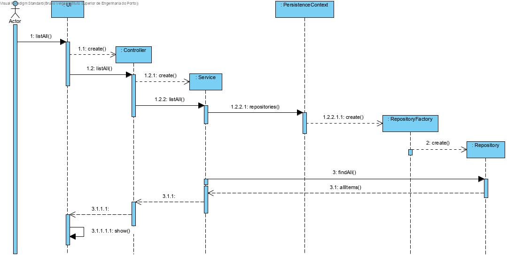
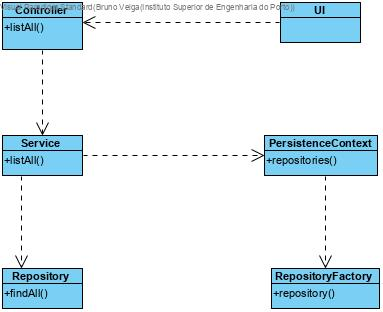

# List user cases

# 1. Requirements 

This document is a general guideline for list user cases.

For now, it is applied in "List Deposits" and "List Production Lines".

# 2. Analysis

The domain model does not need to be altered since this user cases only lists concepts that are already in the database and well defined.

# 3. Design

## 3.1. Functionality realisation

## 3.2. Class diagram

## 3.3. Design patterns applied

**Pure Fabrication** - used in the creation of the class "UI", since no other rule can be applied to create it.

**Controller** - the class "Controller" controls the user case.

**Repository** - There is a class, "Repository" responsible for operations with the database related to the domain classes correspondent, created by the repository factory.

**Factory:** "RepositoryFactory" is responsible for creating all the repository classes.

**Service:** A service is used to reutilize code. 

## 3.4. Tests

### 3.4.1 List Deposits

**Scenario 1**:

- Make sure the bootstrap has been run.

- Start backoffice app

- Login with poweruser account or factory floor manager account (poweruser, poweruserA1 | factory_floor_manager, Password1)

- Select Deposits option

- Select list deposits option

- The app should show 5 deposits that were added by the bootstrap

  warning: If other user cases are run first like "Specify New Deposit" there will be more deposits listed.

### 3.4.2. List Production Lines

**Scenario 1:**

- Make sure the bootstrap has been run.

- Start backoffice app

- Login with poweruser account factory floor manager account (poweruser, poweruserA1 | factory_floor_manager, Password1)

- Select production lines option

- Select list deposits option

- The app should show 4 production lines that were added by the bootstrap

  warning: If other user cases are run first like "SpecifyNewProductionLine" there will be more production lines listed.

# 4. Implementation

## 4.1. List Deposits

UI: ListDepositsUI

Controller: ListDepositsController

Service: ListDepositsService

Repository: DepositRepository

### 4.1.1. Controller

    public class ListDepositController {

        final ListDepositService svc= new ListDepositService();

        /**
        * All deposits
        * @return all deposits
        */
        public Iterable<Deposit> allDeposits(){
            return this.svc.allDeposits();
        }
    }

### 4.1.2. Service

    public class ListDepositService {

        private final AuthorizationService authz= AuthzRegistry.authorizationService();
        private final DepositRepository repo= PersistenceContext.repositories().deposit();

        /**
        * All deposits
        *
        * @return all deposits
        */
        public Iterable<Deposit> allDeposits() {
            authz.ensureAuthenticatedUserHasAnyOf(BaseRoles.POWER_USER,BaseRoles.FACTORY_FLOOR_MANAGER);
            return this.repo.findAll();
        }
    }

## 4.2. List Production Lines

UI: ListProductionLinesUI

Controller: ListProductionLinesController

Service: ListProductionLinesService

Repository: ProductionLineRepository

### 4.2.1. Controller    

    public class ListProductionLineController {

        final ListProductionLineService svc= new ListProductionLineService();

        /**
        * All production lines
        * @return all production lines
        */
        public Iterable<ProductionLine> allProductionLines(){
            return this.svc.allProductionLines();
        }
    }

### 4.2.2. Service

    public class ListProductionLineService {

        private final AuthorizationService authz= AuthzRegistry.authorizationService();
        private final ProductionLineRepository repo= PersistenceContext.repositories().productionLine();

        /**
        * All production lines
        *
        * @return all production lines
        */
        public Iterable<ProductionLine> allProductionLines() {
            authz.ensureAuthenticatedUserHasAnyOf(BaseRoles.POWER_USER,BaseRoles.FACTORY_FLOOR_MANAGER);
            return this.repo.findAll();
        }
    }

## 4.5. Commits

Commit 1: #20 #22: list user cases added

Commit 2: #20: [2-3-3003] - List Deposits #comment Implemented

Commit 3: #22: [2-2-3002] - List Production Lines #comment implemented

# 5. Integration/Demonstration

There is no need for integration with other functionalities because this type of user cases are simply recovering information from the database and present it.

# 6. Observations

This user case was well developed without any issues.

