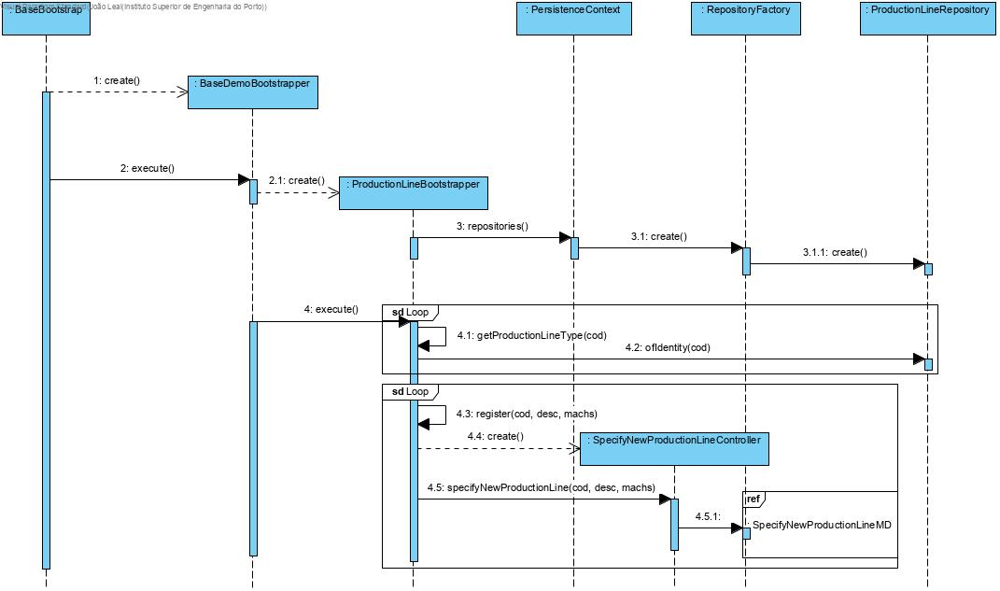
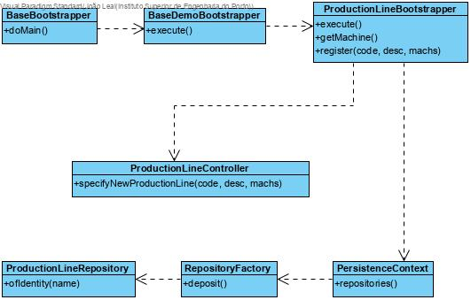

Production Line Initialization (Bootstrap)
=======================================

# 1. Requirements 

As Project Manager, I want to proceed with the initialization of some Production Lines (bootstraps), so that there can already be functioning Production Lines.

Basically, there is a need to add Production Lines, so that it can be used to store raw materials and products.

**Client details:**

# 2. Analysis

The domain model was altered. There are two new classes (Production LineMaterialSheet and DepositProductSheet).

# 3. Design

## 3.1. Functionality realisation

## 3.2. Class diagram

## 3.3. Design patterns applied

This use case uses the controller of use case "Specify New Production Line", so the design patterns applied there will also be applied here.

Additionally, the "tell, don't ask" principle is also applied here. Each and every class tells the ones they create to execute the processes needed to initialize Production Lines.

## 3.4. Tests

Some smoke tests to test basic functions work:

    public void testProductionLines() {

        //save
        repo.save(new ProductionLine(Designation.valueOf("first"),"first desc"));
        repo.save(new ProductionLine(Designation.valueOf("second"),"second desc"));
        LOGGER.info("»»» created production lines");

        //findAll
        final Iterable<ProductionLine> l= repo.findAll();
        Invariants.nonNull(l);
        Invariants.nonNull(l.iterator());
        Invariants.ensure(l.iterator().hasNext());
        LOGGER.info("»»» find all production lines");

        //count
        final long n = repo.count();
        LOGGER.info("»»» # production lines = {}", n);

        //ofIdentity
        final ProductionLine rm1=repo.ofIdentity(Designation.valueOf("first")).orElseThrow(IllegalStateException::new);
        final ProductionLine rm2=repo.ofIdentity(Designation.valueOf("second")).orElseThrow(IllegalStateException::new);
        LOGGER.info("»»» found production lines of identity");

        // containsOfIdentity
        final boolean hasId = repo.containsOfIdentity(rm1.identity());
        Invariants.ensure(hasId);
        LOGGER.info("»»» contains production line of identity");

        // contains
        final boolean has = repo.contains(rm1);
        Invariants.ensure(has);
        LOGGER.info("»»» contains production line");

        // delete
        repo.delete(rm1);
        LOGGER.info("»»» delete production line");

        // deleteOfIdentity
        repo.deleteOfIdentity(rm2.identity());
        LOGGER.info("»»» delete production line of identity");

        // size
        final long n2 = repo.size();
        Invariants.ensure(n2 == n - 2);
        LOGGER.info("»»» # production lines = {}", n2);
    }

# 4. Implementation

## 4.1. Bootstrapper

    public class ProductionLineBootstrapper implements Action {
        private static final Logger LOGGER = LogManager.getLogger(DepositBootstrapper.class);

        private final MachineRepository machineRepository = PersistenceContext.repositories().machine();

        private Machine getMachine(final InternalCode name) {
            return machineRepository.ofIdentity(name).orElseThrow(IllegalStateException::new);
        }

        @Override
        public boolean execute() {

            final Machine mach1 = getMachine(TestDataConstants.MACHINE_1);
            final Machine mach2 = getMachine(TestDataConstants.MACHINE_2);
            final Machine mach3 = getMachine(TestDataConstants.MACHINE_3);
            final Machine mach4 = getMachine(TestDataConstants.MACHINE_4);

            ArrayList<Machine> machArray = new ArrayList<>();

            machArray.add(mach1);
            machArray.add(mach2);
            register(TestDataConstants.PLINE_1, "Production Line 1", machArray);
            machArray.clear();

            machArray.add(mach3);
            machArray.add(mach4);
            register(TestDataConstants.PLINE_2, "Production Line 2", machArray);
            machArray.clear();

            register(TestDataConstants.PLINE_3, "Production Line 3", null);
            register(TestDataConstants.PLINE_4, "Production Line 4", null);
            register(TestDataConstants.PLINE_5, "Production Line 5", null);

            return true;
        }

        private void register(final String code, final String desc, ArrayList<Machine> machines) {
            final SpecifyNewProductionLineController controller = new SpecifyNewProductionLineController();
            try {
                controller.specifyNewProductionLine(Designation.valueOf(code), desc);
                if (machines!=null) {
                    for (Machine mach : machines) {
                        controller.addMachine(mach);
                    }
                }
                controller.save();
            } catch (final IntegrityViolationException | ConcurrencyException e) {
                // ignoring exception. assuming it is just a primary key violation
                // due to the tentative of inserting a duplicated user
                LOGGER.warn("Assuming {} already exists (activate trace log for details)", desc);
                LOGGER.trace("Assuming existing record", e);
            }
        }
    }

    
## 4.2. Commits

Commit 1: #2: [2-2-1008] - Line production intialization (bootstrap) #comment Implemented

# 5. Integration/Demonstration

A instance of "ProductionLineBootstrapper" was created and executed in class "BaseDemoBootstrapper".

    public class BaseDemoBootstrapper implements Action {

        private static final String POWERUSER_A1 = "poweruserA1";
        private static final String POWERUSER = "poweruser";

        private final AuthorizationService authz = AuthzRegistry.authorizationService();
        private final AuthenticationService authenticationService = AuthzRegistry.authenticationService();

        @Override
        public boolean execute() {
            // declare bootstrap actions
            final Action[] actions = { new BackofficeUsersBootstrapper(),
                new ClientUserBootstrapper(), new RawMaterialCategoryBootstrapper(), 
                new RawMaterialBootstrapper(), new ProductBootstrapper(), new DepositBootstrapper(),
                new MachineBootstrapper(), new ProductionLineBootstrapper()
                };

            authenticateForBootstrapping();

            // execute all bootstrapping
            boolean ret = true;
            for (final Action boot : actions) {
                System.out.println("Bootstrapping " + nameOfEntity(boot) + "...");
                ret &= boot.execute();
            }
            return ret;
        }
    }

# 6. Observations

This functionality was implemented without any issues.
