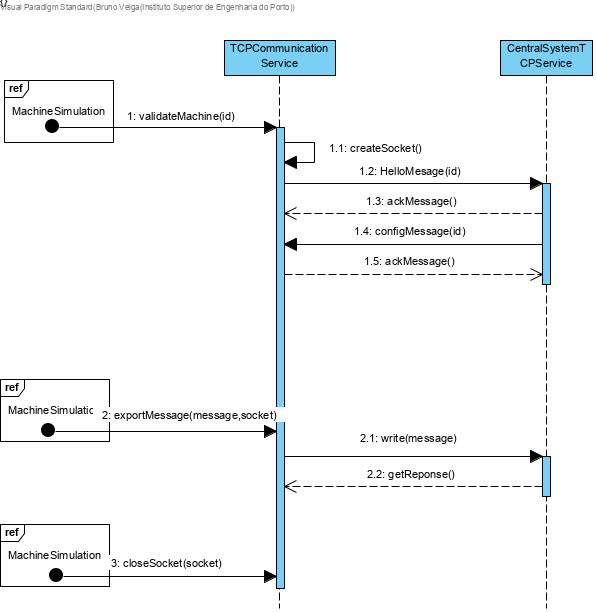

# Central System Communications with Machines

# 1. Requirements 

As a project manager
I want to protect the communications between SCM and the machines
So that it is security when sending messages

Acceptance criteria:

- Apply SSL/TLS with authentication by using public keys certificates

# 2. Analysis

There was no need to apply changes to the domain model.

# 3. Design

## 3.1. Functionality realisation



## 3.2. Class diagram


## 3.3. Design patterns applied

**Single responsible principle: ** Operations related to communication via TCP are all done with the class "TCPCommunicationService".

## 3.4. Tests

An simple app to test TCP communication
```java
import java.io.*;

import javax.net.ssl.*;
import javax.security.cert.X509Certificate;

public class CheckServerTLS {
    static private SSLSocket sock;

    public static void main(String args[]) throws Exception {

        SSLSocketFactory sf = (SSLSocketFactory) SSLSocketFactory.getDefault();

        try {
            sock = (SSLSocket) sf.createSocket("10.8.208.198",9999);
            for (String s : sf.getSupportedCipherSuites()) {
                System.out.println(s);
            }
        }
        catch(IOException ex) {
            System.out.println("Failed to connect to: " + "10.8.208.198" + ":" + 9999);
            System.out.println("Application aborted.");
            System.exit(1);
        }

        System.out.println("Connected to server: " + "10.8.208.198" + ":" + 9999);

        try {
            sock.startHandshake();
            SSLSession ssl = sock.getSession();
            System.out.println("------------------------------------------------------");
            System.out.println("SSL/TLS version: " + ssl.getProtocol() +
                    "         Cypher suite: " + ssl.getCipherSuite());

            X509Certificate[] chain=ssl.getPeerCertificateChain();
            System.out.println("------------------------------------------------------");
            System.out.println("Certificate subject: " + chain[0].getSubjectDN());
            System.out.println("------------------------------------------------------");
            System.out.println("Certificate issuer: " + chain[0].getIssuerDN());
            System.out.println("------------------------------------------------------");
            System.out.println("Not before: " + chain[0].getNotBefore());
            System.out.println("------------------------------------------------------");
            System.out.println("Not after:  " + chain[0].getNotAfter());
            System.out.println("------------------------------------------------------");


        }
        catch (SSLException tlsE) {
            System.out.println("SSL/TLS handshake has failed:\r\n" + tlsE.getCause() );
            try { sock.close(); } catch(IOException ex2) { System.out.println("Error closing socket."); }
            System.exit(1);
        }
        try { sock.close(); } catch(IOException ex2) { System.out.println("Error closing socket."); }

    } // MAIN METHOD
} // CLASS
```
	

**Scenario 1:**

- Start the application, enter as ID "1", as time "4" and as type "T3"
- The machine simulator will automatically validate the machine id and start importing messages from files sending them to the Central System. In the end all machines turn off.

# 4. Implementation

# 5. Integration/Demonstration

# 6. Observations


