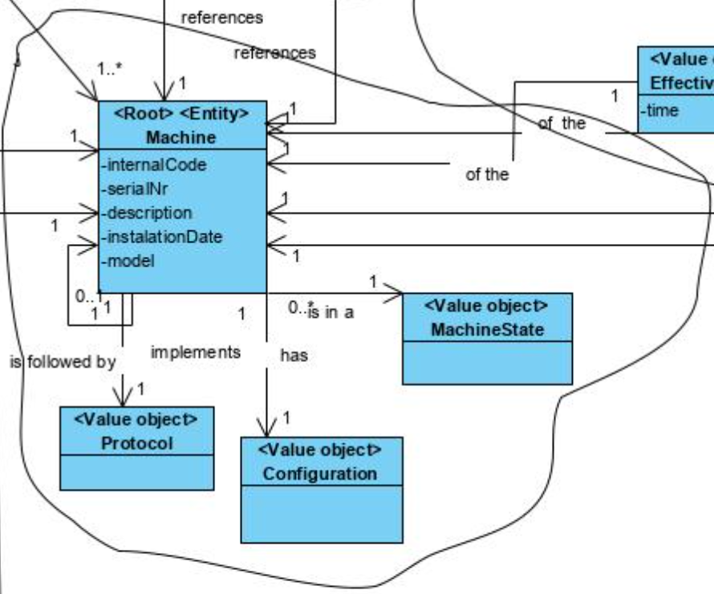
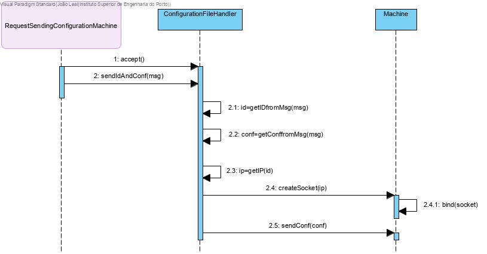
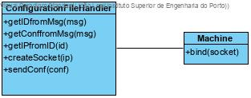

# Send Configuration Files To Machine

# 1. Requirements 

As a factory floor manager
I want to send a configuration to a specific machine
So that it can start working under those configurations

# 2. Analysis



# 3. Design

## 3.1. Functionality realisation




## 3.2. Class diagram



## 3.3. Design patterns applied

**Controller** - the class "RequestSendingMachineConfigurationController" controls the user case.

**Simple responsibility** - "ConfigurationFileHandler" is the only one responsible for communicating with scm.

## 3.4. Tests 
**Scenario 1:**

1. Start the backoffice application
2. Login as factory floor manager
3. Select option machine management and then send configuration to machine
4. Select one machine from the list presented
5. If the machine has a configuration, it will be sent and the machine will start operating under it.

# 4. Implementation
```java
package eapli.base.app.scm.console.TelNetCommunication;

import eapli.base.app.scm.console.BaseSCM;

import java.io.DataInputStream;
import java.io.DataOutputStream;
import java.io.IOException;
import java.net.ServerSocket;
import java.net.Socket;

public class ConfigurationFileHandler implements Runnable {

    ServerSocket Soc;

    public ConfigurationFileHandler() {

    }

    @Override
    public void run() {
        try {
            try {
                Soc = new ServerSocket(23);
            } catch (IOException e) {
                System.out.println("Failed to open TelNet socket");
                e.printStackTrace();
                return;
            }
            System.out.println("TelNet Server on.\nListening for TelNet requests.");
            while (true) {
                Socket CSoc = Soc.accept();
                new AcceptTelnetClient(CSoc);
            }
        } catch (Exception e) {
            System.out.println("Exception in TelNet server");
            e.printStackTrace();
        }
    }
}

class AcceptTelnetClient extends Thread {
    Socket ClientSocket;

    AcceptTelnetClient(Socket CSoc) {
        ClientSocket=CSoc;
        start();
    }

    public void run() {
        try {
            System.out.println("New TelNet connection from Backoffice.");
            DataInputStream din=new DataInputStream(ClientSocket.getInputStream());

            String in=din.readUTF();

            String[] line=in.split(";");
            String id=line[0];
            byte[] conf=line[1].getBytes();

            String ip=BaseSCM.getKnownIPs().get(id);
            if (ip==null) {
                System.out.println("Machine does not have an associated IP address. Canceling.");
                return;
            }
            System.out.println("Sending configuration file to machine "+id+"...");
            try {
                Socket sock = new Socket(ip, 9999);
                sendConfiguration(Integer.parseInt(id), conf, sock);
                sock.close();
            } catch (IOException io) {
                System.out.println("Error opening socket");
                io.printStackTrace();
                return;
            }
            System.out.println("Sent configuration file, closing TelNet connection.");
            ClientSocket.close();
        }
        catch(Exception ex)
        {
            ex.printStackTrace();
        }
    }

    private void sendConfiguration(int id, byte[] conf, Socket s) throws IOException {
        DataOutputStream sOut = new DataOutputStream(s.getOutputStream());
        byte[] byteArray=new byte[6];
        byteArray[0]=1; byteArray[1]=2;
        byteArray[2]= (byte) (id%256);
        byteArray[3]= (byte) (id/256);
        byteArray[4]= (byte) (conf.length%256);
        byteArray[5]= (byte) (conf.length/256);
        sOut.write(byteArray);
        if (awaitAcknowledgement(s) >= 0) {
            System.out.println("ACK received, sending configuration...");
            sOut.write(conf);
        }
    }

    private int awaitAcknowledgement(Socket s) throws IOException {
        DataInputStream sIn = new DataInputStream(s.getInputStream());
        byte msg;
        int length;
        msg = sIn.readByte();
        if (msg != (byte) 0) {
            return -1;
        }
        msg = sIn.readByte();
        if (msg == (byte) 150) {
            msg = sIn.readByte();
            if (msg != (byte) 0) {
                return -1;
            }
            msg = sIn.readByte();
            msg += sIn.readByte();
            length = msg;
        } else {
            sIn.skipBytes(4);
            return -1;
        }
        return length;
    }
}
```
# 5. Observations
No issues were observed.