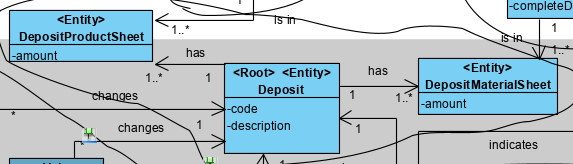
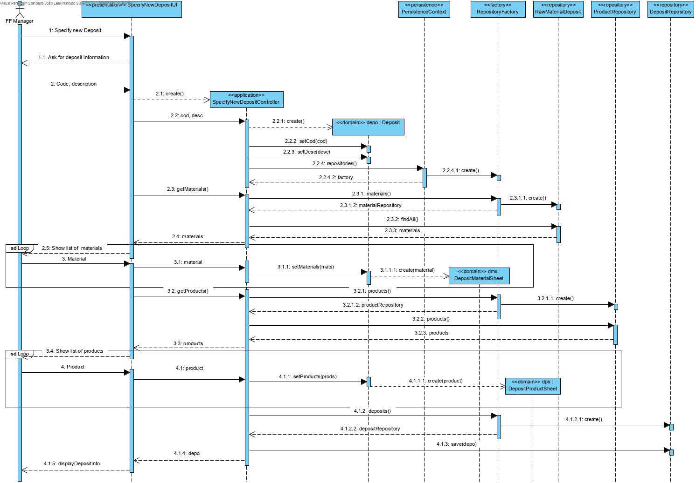
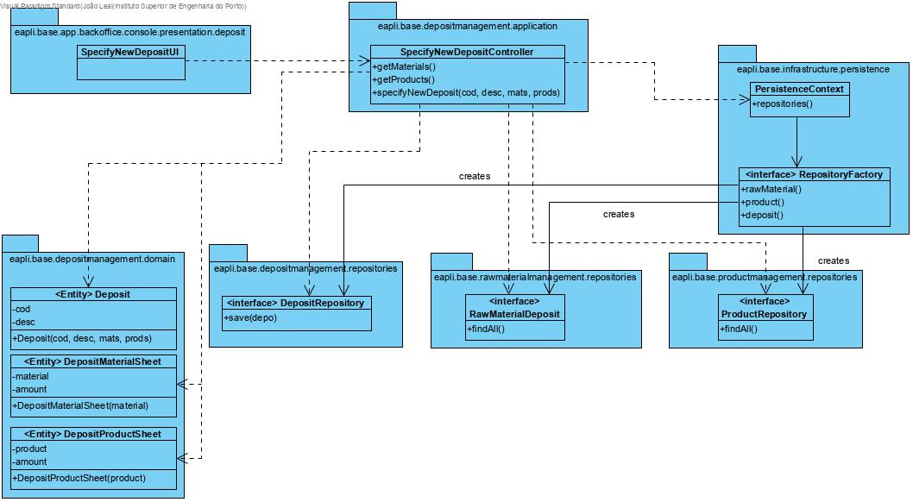

Specify New Deposit
=======================================

# 1. Requirements 

As Factory Floor Manager, I want to specify new deposits, so that there can be new functioning deposits to use.

Basically, there is a need to add deposits, so that it can be used to store raw materials and products.

**Client details:**

# 2. Analysis

The domain model was altered. There are two new classes (DepositMaterialSheet and DepositProductSheet).

# 3. Design

## 3.1. Functionality realisation

## 3.2. Class diagram

## 3.3. Design patterns applied

**Pure Fabrication** - used in the creation of the class "SpecifyNewDepositUI", since no other rule can be applied to create it.

**Controller** - the class "SpecifyNewDepositController" controls the user case.

**Simple responsibility** - Every class has only one responsibility, the controller class only controls the user case, the "Deposit" class is only responsible for operations related to Deposits and the repository class is only responsible for communicating with the database, and bring information to memory.

**Repository** - There are classes ("DepositRepository", "RawMaterialRepository" and "ProductRepository") responsible for operations with the database related to the domain classes correspondent. 

## 3.4. Tests

**Test 1:** Verifies that a Deposit instance can be created with an internal code and description.

	@Test
    public void ensureDepositWithCodeDesc() {
        new Deposit(CODE, DESC);
        assertTrue(true);
    }

**Test 2:** Verifies that a Deposit instance can't be created without a code.

	@Test(expected = IllegalArgumentException.class)
    public void ensureMustHaveCode() {
        new Deposit(null, DESC);
    }

**Test 3:** Verifies that a Deposit instance can't be created without a description.

	@Test(expected = IllegalArgumentException.class)
    public void ensureMustHaveDesc() {
        new Deposit(CODE, null);
    }

**Test 4:** Verifies that a Deposit instance can't be created with an empty description

	@Test(expected = IllegalArgumentException.class)
    public void ensureDescMustNotBeEmpty() {
        new Deposit(CODE, "");
    }

# 4. Implementation

## 4.1. Controller  

    public class SpecifyNewDepositController implements Controller {

        private final AuthorizationService authz = AuthzRegistry.authorizationService();
        private final DepositRepository repository = PersistenceContext.repositories().deposit();
        private final ListRawMaterialService rmcs= new ListRawMaterialService();
        private final ListProductsController pcs= new ListProductsController();
        DepositMaterialSheet matSheet=null;
        DepositProductSheet prodSheet=null;
        private Deposit depo;
        /**
        * Controller to specify a new deposit
        *
        * @param code: identification code
        * @param desc: description
        * @return new deposit
        */
        public void specifyNewDeposit(String code, String desc) {
            authz.ensureAuthenticatedUserHasAnyOf(BaseRoles.POWER_USER, BaseRoles.FACTORY_FLOOR_MANAGER);
            depo= new Deposit(Designation.valueOf(code), desc);
        }

        public Iterable<RawMaterial> getMaterials() {
            return this.rmcs.allRawMaterials();
        }

        public Iterable<Product> getProducts() {
            return this.pcs.getProducts();
        }

        public boolean addDepositMaterialSheet(RawMaterial mat) {
            matSheet=new DepositMaterialSheet(mat);
            return depo.addMaterial(matSheet);
        }

        public boolean addDepositProductSheet(Product prod) {
            prodSheet=new DepositProductSheet(prod);
            return depo.addProduct(prodSheet);
        }

        public Deposit save() {
            if (matSheet!=null) {
                DepositMaterialSheetRepository matSheetRepository = PersistenceContext.repositories().depositMaterialSheet();
                matSheetRepository.save(matSheet);
            }
            if (prodSheet!=null) {
                DepositProductSheetRepository productSheetRepository = PersistenceContext.repositories().depositProductSheet();
            }
            this.repository.save(depo);
            return depo;
        }
    }
​    

## 4.2. Domain

    @Entity
    public class Deposit implements AggregateRoot<Designation> Serializable {

        private static final long serialVersionUID = 1L;
        @Version
        private Long version;

        //Primary key
        @Id
        private Designation internalCode;

        //Description
        private String desc;

        @OneToMany(cascade = CascadeType.MERGE)
        private List<DepositMaterialSheet> mats = new ArrayList<>();

        @OneToMany(cascade = CascadeType.MERGE)
        private List<DepositProductSheet> prods = new ArrayList<>();

        /**
        * Deposit contructor
        * @param code: identification code
        * @param desc: description
        */
        public Deposit(final Designation code, final String desc) {
            Preconditions.noneNull(code, desc);
            this.internalCode=code;
            setDesc(desc);
        }

        protected Deposit() {
            //for ORM only
        }

        /**
        * Validates and sets description
        * @param desc
        */
        public void setDesc(final String desc) {
            if (descriptionMeetsMinimumRequirements(desc)) this.desc = desc;
            else throw new IllegalArgumentException("Invalid description");
        }

        public Designation getCode() {
            return this.internalCode;
        }

        /**
        * Adds a Raw Material to the list
        * @param matSheet
        * @return
        */
        public boolean addMaterial(final DepositMaterialSheet matSheet) {
            for (DepositMaterialSheet mat : mats) {
                if (mat.getMaterial().equals(matSheet.getMaterial())) {
                    return false;
                }
            }
            return mats.add(matSheet);
        }

        /**
        * Adds a Product to the list
        * @param prodSheet
        * @return
        */
        public boolean addProduct(final DepositProductSheet prodSheet) {
            for (DepositProductSheet prod : prods) {
                if (prod.getProduct().equals(prodSheet.getProduct())) {
                    return false;
                }
            }
            return prods.add(prodSheet);
        }

        /**
        * Checks if description is null or empty
        * @param description
        * @return True if it's not null or empty
        */
        private static boolean descriptionMeetsMinimumRequirements(final String description) {
            return !StringPredicates.isNullOrEmpty(description);
        }

        /**
        * Checks if two objects are the same
        * @param other: the other object
        * @return True if they're the same object, false otherwise
        */
        @Override
        public boolean sameAs(Object other) {
            final Deposit deposit=(Deposit) other;
            return this.equals(deposit) && this.desc.equals(deposit.desc);
        }

        /**
        * Returns the identity of this object
        * @return the deposit's code
        */
        @Override
        public Designation identity() {
            return this.internalCode;
        }

        /**
        * HashCode
        * @return hashCode
        */
        @Override
        public int hashCode() {
            return DomainEntities.hashCode(this);
        }

        /**
        * Checks if two objects have the same ID
        * @param o: other object
        * @return True if they have the same ID
        */
        @Override
        public boolean equals(final Object o) {
            return DomainEntities.areEqual(this, o);
        }

        /**
        * toString()
        * @return Object's package and ID
        */
        @Override
        public String toString() {
            StringBuilder out= new StringBuilder("Deposit ID=" + internalCode);
            if (!mats.isEmpty()) {
                out.append("\nMaterials:\n");
                for (DepositMaterialSheet mat : mats) {
                    out.append("    -").append(mat.getMaterial().description()).append("\n    Amount: ").append(mat.getAmount()).append("\n");
                }
            }
            if (!prods.isEmpty()) {
                out.append("\nProducts:\n");
                for (DepositProductSheet prod : prods) {
                    out.append("    -").append(prod.getProduct().description()).append("\n    Amount: ").append(prod.getAmount()).append("\n");
                }
            }
            return out.toString();
        }
    }

## 4.3. Repository

    public interface DepositRepository extends DomainRepository<Designation, Deposit> {

    }
## 4.4. Services
    public Iterable<Deposit> allDeposits() {
        authz.ensureAuthenticatedUserHasAnyOf(BaseRoles.POWER_USER,BaseRoles.FACTORY_FLOOR_MANAGER);
        return this.repo.findAll();
    }
    
## 4.5. Commits
Commit 1: #15: [3-2-3003] - Specify new deposit #comment Design and basic classes

Commit 2: #15: [3-2-3003] - Sprecify new deposit #comment Use case implemented and tested

Commit 3: #15: [2-3-3003] - Specify new deposit #comment Corrected persistence issues

Commit 4: #15: [3-2-3003] - Specify new deposit #comment Added RawMaterial association

Commit 5: #15: [3-2-3003] - Specify new deposit #comment Added Product association

# 5. Integration/Demonstration

This functionality had to be integrated for persistence in memory and Jpa

    public interface RepositoryFactory {
    	/**
        * repository will be created in auto transaction mode
        *
        * @return
        */
        DepositRepository deposit();
    }

    package eapli.base.persistence.impl.inmemory;
    
    public class InMemoryDepositRepository extends InMemoryDomainRepository<Designation, Deposit> implements DepositRepository {

        static {
            InMemoryInitializer.init();
        }
    }
    
    package eapli.base.persistence.impl.inmemory;
    
    public class InMemoryRepositoryFactory implements RepositoryFactory {
    	@Override
        public DepositRepository deposit() {
            return new InMemoryDepositRepository();
        }
    }
    
    package eapli.base.persistence.impl.jpa;
    
    public class JpaDepositRepository extends BasepaRepositoryBase<Deposit,Designation,Designation> implements DepositRepository {
        
        public JpaDepositRepository() {
            super("internalCode");
        }
        
    }
    
    package eapli.base.persistence.impl.jpa;
    
    public class JpaRepositoryFactory implements RepositoryFactory {
    	@Override
        public DepositRepository deposit() {
            return new JpaDepositRepository();
        }
    }

# 6. Observations

This functionality was implemented without any issues.
