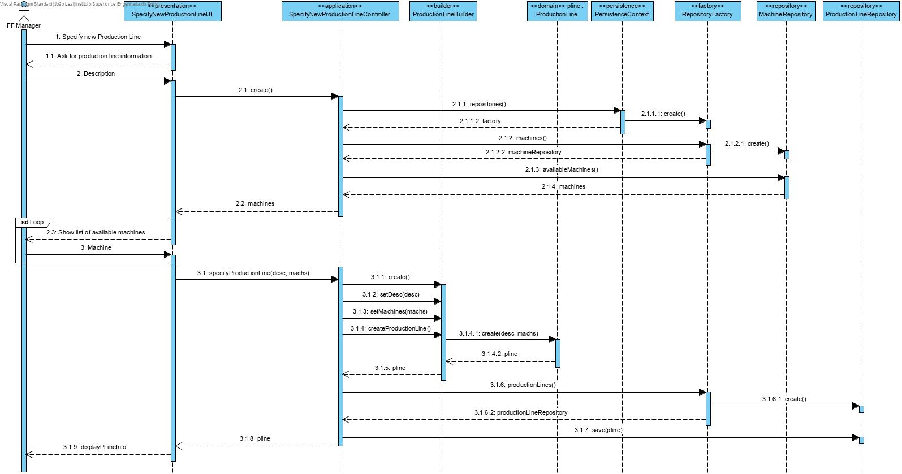

Specify New Production Line
=======================================

# 1. Requirements 

As Factory Floor Manager, I want to specify new Production Lines, so that there can be new functioning Production Lines to use.

Basically, there is a need to add Production Lines, so that it can be used to store raw materials and products.

**Client details:**

# 2. Analysis

The domain model was not altered.

# 3. Design

## 3.1. Functionality realisation

## 3.2. Class diagram

## 3.3. Design patterns applied

**Pure Fabrication** - used in the creation of the class "SpecifyNewProductionLineUI", since no other rule can be applied to create it.

**Controller** - the class "SpecifyNewProductionLineController" controls the user case.

**Simple responsibility** - Every class has only one responsibility, the controller class only controls the user case, the "Production Line" class is only responsible for operations related to Production Lines and the repository class is only responsible for communicating with the database, and bring information to memory.

**Repository** - There are classes ("ProductionLineRepository" and "MachineRepository") responsible for operations with the database related to the domain classes correspondent. 

## 3.4. Tests

**Test 1:** Verifies that a Production Line instance can be created with an internal code and description.

	@Test
    public void ensureProductionLineWithCodeDesc() {
        new ProductionLine(CODE, DESC);
        assertTrue(true);
    }

**Test 2:** Verifies that a Production Line instance can't be created without a code.

	@Test(expected = IllegalArgumentException.class)
    public void ensureMustHaveCode() {
        new ProductionLine(null, DESC);
    }

**Test 3:** Verifies that a Production Line instance can't be created without a description.

	@Test(expected = IllegalArgumentException.class)
    public void ensureMustHaveDesc() {
        new ProductionLine(CODE, null);
    }

**Test 4:** Verifies that a Production Line instance can't be created with an empty description

	@Test(expected = IllegalArgumentException.class)
    public void ensureDescMustNotBeEmpty() {
        new ProductionLine(CODE, "");
    }

# 4. Implementation

## 4.1. Controller  

    public class SpecifyNewProductionLineController implements Controller {

        private final AuthorizationService authz = AuthzRegistry.authorizationService();
        private final ProductionLineRepository pLineRepository = PersistenceContext.repositories().productionLine();
        private final ListMachinesService listMachines = new ListMachinesService();
        private ProductionLine pLine;

        public void specifyNewProductionLine(final Designation code, final String desc) {
            authz.ensureAuthenticatedUserHasAnyOf(BaseRoles.POWER_USER, BaseRoles.FACTORY_FLOOR_MANAGER);
            pLine = new ProductionLine(code, desc);
        }

        public Iterable<Machine> getMachines() {
            return listMachines.allMachines();
        }

        public boolean addMachine(Machine machine) {
            return pLine.addMachine(machine);
        }

        public ProductionLine save() {
            return this.pLineRepository.save(pLine);
        }
    }
​    

## 4.2. Domain

    @Entity
    public class ProductionLine implements AggregateRoot<Designation>, Serializable {

        private static final long serialVersionUID = 19L;
        @Version
        private Long version;

        //Primary key
        @Id
        private Designation internalCode;

        //Description
        private String desc;

        @OneToMany
        private List<Machine> machines=new LinkedList<>();

        public ProductionLine(final Designation code, final String desc) {
            Preconditions.noneNull(code, desc);
            this.internalCode=code;
            setDesc(desc);
        }

        protected ProductionLine() {

        }

        /**
        * Validates and sets description
        * @param desc
        */
        public void setDesc(final String desc) {
            if (descriptionMeetsMinimumRequirements(desc)) this.desc = desc;
            else throw new IllegalArgumentException("Invalid description");
        }

        /**
        * Checks if description is null or empty
        * @param description
        * @return True if it's not null or empty
        */
        private static boolean descriptionMeetsMinimumRequirements(final String description) {
            return !StringPredicates.isNullOrEmpty(description);
        }

        public boolean addMachine(final Machine machine) {
            if (!checkMachines(machine)) return false;
            return machines.add(machine);
        }

        public void addMachine(final Machine machine, int place) {
            if (checkMachines(machine))
            machines.add(place, machine);
        }

        private boolean checkMachines(final Machine machine) {
            for (Machine mach : machines) {
                if (mach.equals(machine)) {
                    return false;
                }
            }
            return true;
        }

        public Machine removeMachine(int place) {
            return machines.remove(place);
        }

        public boolean removeMachine(Machine machine) {
            return machines.remove(machine);
        }

        public boolean removeMachine(InternalCode code) {
            for (Machine machine : machines) {
                if (machine.compareTo(code)==0) return machines.remove(machine);
            }
            return false;
        }

        /**
        * Checks if two objects are the same
        * @param other: the other object
        * @return True if they're the same object, false otherwise
        */
        @Override
        public boolean sameAs(Object other) {
            final ProductionLine pl=(ProductionLine) other;
            return this.equals(pl) && this.desc.equals(pl.desc);
        }

        /**
        * Returns the identity of this object
        * @return the ProductionLine's code
        */
        @Override
        public Designation identity() {
            return this.internalCode;
        }

        /**
        * HashCode
        * @return hashCode
        */
        @Override
        public int hashCode() {
            return DomainEntities.hashCode(this);
        }

        /**
        * Checks if two objects have the same ID
        * @param o: other object
        * @return True if they have the same ID
        */
        @Override
        public boolean equals(final Object o) {
            return DomainEntities.areEqual(this, o);
        }

        @Override
        public String toString() {
            StringBuilder out= new StringBuilder("Production Line ID=" + internalCode+ "\n");
            for (Machine mach : machines) {
                out.append("    ").append(mach.toString()).append("\n");
            }
            return out.toString();
        }
    }

## 4.3. Repository

    public interface ProductionLineRepository extends DomainRepository<Designation, ProductionLine> {

    }
## 4.4. Services
    public Iterable<ProductionLine> allProductionLines() {
        authz.ensureAuthenticatedUserHasAnyOf(BaseRoles.POWER_USER,BaseRoles.FACTORY_FLOOR_MANAGER);
        return this.repo.findAll();
    }
    
## 4.5. Commits
Commit 1: #11: [2-2-3002] - Specify new Production Line #comment Implemented

# 5. Integration/Demonstration

This functionality had to be integrated for persistence in memory and Jpa

    public interface RepositoryFactory {
    	/**
        * repository will be created in auto transaction mode
        *
        * @return
        */
        ProductionLineRepository productionLine();
    }

    package eapli.base.persistence.impl.inmemory;
    
    public class InMemoryProductionLineRepository extends InMemoryDomainRepository<Designation, ProductionLine> implements ProductionLineRepository {

        static {
            InMemoryInitializer.init();
        }
    }
    
    package eapli.base.persistence.impl.inmemory;
    
    public class InMemoryRepositoryFactory implements RepositoryFactory {
    	@Override
        public ProductionLineRepository ProductionLine() {
            return new InMemoryProductionLineRepository();
        }
    }
    
    package eapli.base.persistence.impl.jpa;
    
    public class JpaProductionLineRepository extends BasepaRepositoryBase<ProductionLine,Designation,Designation> implements ProductionLineRepository {
        
        public JpaProductionLineRepository() {
            super("internalCode");
        }
        
    }
    
    package eapli.base.persistence.impl.jpa;
    
    public class JpaRepositoryFactory implements RepositoryFactory {
    	@Override
        public ProductionLineRepository ProductionLine() {
            return new JpaProductionLineRepository();
        }
    }

# 6. Observations

This functionality was implemented without any issues.
