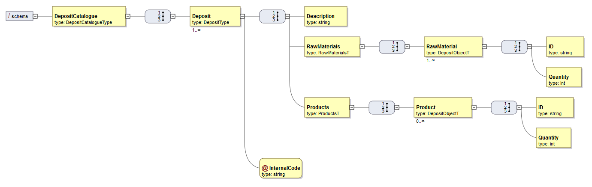
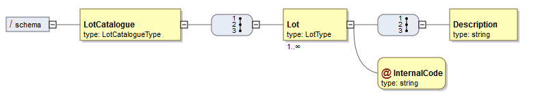
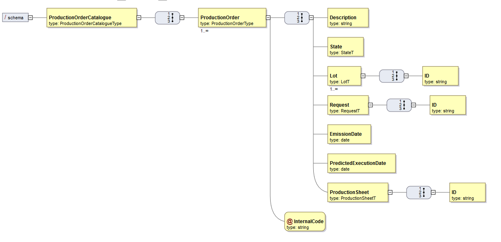
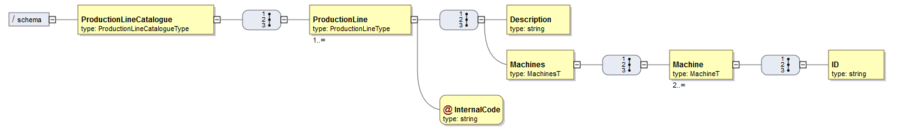

# [0-1010] Specify a XSD Document(Deposits, Lots, Production Orders and Production Lines)

# 1. Requirements

As **Project Manager**, I want the team to specify XSD documents that, later, can be used to validate XML content that is generated by the system.
These XSD should validate all information related to the Deposits, Lots, Production Orders and Production Lines

This use case is related to all other XSD and XML use cases.

# 2. Analysis

There's nothing to be changed in the domain. All the information regarding the Machine Aggregate is all represented.

# 3. Design

## 3.1. XML Diagram for Deposits



## 3.2. XML Diagram for Lots



## 3.3. XML Diagram for Production Orders



## 3.4. XML Diagram for Production Lines



# 4. Implementation
## 4.1. Deposits

```xml
<?xml version="1.0" encoding="utf-8" ?>
<xsd:schema xmlns:xsd="http://www.w3.org/2001/XMLSchema">

	<xsd:element name="DepositCatalogue" type="TDeposits"/>

	<xsd:complexType name="TDeposits">
		<xsd:sequence>
			<xsd:element name="Deposit" type="TDeposit" maxOccurs="unbounded"/>
		</xsd:sequence>
	</xsd:complexType>

	<xsd:complexType name="TDeposit">
		<xsd:sequence>
			<xsd:element name="Description" type="xsd:string"/>
			<xsd:element name="RawMaterials" type="TDepositRawMaterials"/>
			<xsd:element name="Products" type="TDepositsProducts"/>
		</xsd:sequence>
		<xsd:attribute name="internalCode" type="TInternalCode" use="required"/>
	</xsd:complexType>

	<xsd:complexType name="TDepositRawMaterials">
		<xsd:sequence>
			<xsd:element name="RawMaterial" type="DepositObjectT" minOccurs="0" maxOccurs="unbounded"/>
		</xsd:sequence>
	</xsd:complexType>

	<xsd:complexType name="TDepositsProducts">
		<xsd:sequence>
			<xsd:element name="Product" type="DepositObjectT" minOccurs="0" maxOccurs="unbounded"/>
		</xsd:sequence>
	</xsd:complexType>

	<xsd:complexType name="DepositObjectT">
		<xsd:attribute name="ID" type="TInternalCode"/>
		<xsd:attribute name="Quantity" type="xsd:integer"/>
	</xsd:complexType>

	<xsd:simpleType name="TInternalCode">
		<xsd:restriction base="xsd:string">
			<xsd:maxLength value="15"/>
		</xsd:restriction>
	</xsd:simpleType>

</xsd:schema>
```

## 4.2. Lots

```xml
<?xml version="1.0" encoding="utf-8" ?>
<xsd:schema xmlns:xsd="http://www.w3.org/2001/XMLSchema">

	<xsd:element name="LotCatalogue" type="TLots"/>

	<xsd:complexType name="TLots">
		<xsd:sequence>
			<xsd:element name="Lot" type="TLot" maxOccurs="unbounded"/>
		</xsd:sequence>
	</xsd:complexType>

	<xsd:complexType name="TLot">
		<xsd:attribute name="internalCode" type="TInternalCode" use="required"/>
	</xsd:complexType>

	<xsd:simpleType name="TInternalCode">
		<xsd:restriction base="xsd:string">
			<xsd:maxLength value="15"/>
		</xsd:restriction>
	</xsd:simpleType>

</xsd:schema>
```

## 4.3. Production Orders

```xml
<?xml version="1.0" encoding="UTF-8" ?>
<xsd:schema xmlns:xsd="http://www.w3.org/2001/XMLSchema">

	<xsd:element name="ProductionOrderCatalogue" type="TProductionOrders"/>

	<xsd:complexType name="TProductionOrders">
		<xsd:sequence>
			<xsd:element name="ProductionOrder" type="ProductionOrderType" maxOccurs="unbounded"/>
		</xsd:sequence>
	</xsd:complexType>

	<xsd:complexType name="ProductionOrderType">
		<xsd:sequence>
			<xsd:element name="Description" type="xsd:string"/>
			<xsd:element name="State" type="StateT"/>
			<xsd:element name="Lot" type="LotT" maxOccurs="unbounded"/>
			<xsd:element name="Request" type="RequestT"/>
			<xsd:element name="EmissionDate" type="xsd:date"/>
			<xsd:element name="PredictedExecutionDate" type="xsd:date"/>
			<xsd:element name="ProductionSheet" type="ProductionSheetT"/>
			<xsd:element name="QuantityToProduce" type="TQuantityToProduce"/>
		</xsd:sequence>
		<xsd:attribute name="internalCode" type="TInternalCode" use="required"/>
	</xsd:complexType>

	<xsd:simpleType name="StateT">
		<xsd:restriction base="xsd:string">
			<xsd:enumeration value="Suspended"/>
			<xsd:enumeration value="Pending"/>
			<xsd:enumeration value="Executing"/>
			<xsd:enumeration value="Execution halted temporarily"/>
			<xsd:enumeration value="Finished"/>
		</xsd:restriction>
	</xsd:simpleType>

	<xsd:complexType name="LotT">
		<xsd:attribute name="ID" type="TInternalCode"/>
	</xsd:complexType>

	<xsd:complexType name="RequestT">
		<xsd:attribute name="ID" type="TInternalCode"/>
	</xsd:complexType>

	<xsd:complexType name="ProductionSheetT">
		<xsd:attribute name="ID" type="TInternalCode"/>
	</xsd:complexType>

	<xsd:simpleType name="TQuantityToProduce">
		<xsd:restriction base="xsd:int">
			<xsd:minExclusive value="0"/>
		</xsd:restriction>
	</xsd:simpleType>

	<xsd:simpleType name="TInternalCode">
		<xsd:restriction base="xsd:string">
			<xsd:maxLength value="15"/>
		</xsd:restriction>
	</xsd:simpleType>

</xsd:schema>
```

## 4.4. Production Lines

```xml
<?xml version="1.0" encoding="utf-8" ?>
<xsd:schema xmlns:xsd="http://www.w3.org/2001/XMLSchema">

	<xsd:element name="ProductionLineCatalogue" type="TProductionLines"/>

	<xsd:complexType name="TProductionLines">
		<xsd:sequence>
			<xsd:element name="ProductionLine" type="TProductionLine" maxOccurs="unbounded"/>
		</xsd:sequence>
	</xsd:complexType>

	<xsd:complexType name="TProductionLine">
		<xsd:sequence>
			<xsd:element name="Description" type="xsd:string"/>
			<xsd:element name="Machines" type="MachinesT"/>
		</xsd:sequence>
		<xsd:attribute name="internalCode" type="TInternalCode" use="required"/>
	</xsd:complexType>

	<xsd:complexType name="MachinesT">
		<xsd:sequence>
			<xsd:element name="Machine" type="MachineT" minOccurs="2" maxOccurs="unbounded"/>
		</xsd:sequence>
	</xsd:complexType>

	<xsd:complexType name="MachineT">
		<xsd:attribute name="ID" type="TInternalCode"/>
	</xsd:complexType>

	<xsd:simpleType name="TInternalCode">
		<xsd:restriction base="xsd:string">
			<xsd:maxLength value="15"/>
		</xsd:restriction>
	</xsd:simpleType>

</xsd:schema>
```

# 6. Observations

None.