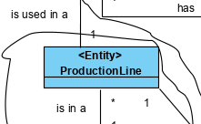

# XSLT Transformation

# 1. Requirements 

As a production manager
I want to transform the xml files previously exported 
So that they are availble to be consulted

Acceptance criteria:

 - XSLT must be used

# 2. Analysis





# 3. Design

## 3.1. Functionality realisation


HTML 

Tables will be created for every domain class.

JSON

Every object will be a domain class.

Text

Present the information by domain class using titles for every theme, and showing it in text blocks

## 3.2. Tests

XMLDocument used for test: 
```xml
<?xml version="1.0" encoding="UTF-8" ?>
<!--
To change this license header, choose License Headers in Project Properties.
To change this template file, choose Tools | Templates
and open the template in the editor.
-->


<SSFM xmlns:xsi="http://www.w3.org/2001/XMLSchema-instance" xsi:noNamespaceSchemaLocation="global.xsd">

    <RawMaterialCategories>
        <RawMaterialCategory name="cat1">
            <description>Wood</description>
        </RawMaterialCategory>
        <RawMaterialCategory name="cat2">
            <description>Metal</description>
        </RawMaterialCategory>
    </RawMaterialCategories>

    <RawMaterials>
        <RawMaterial internalCode="rm1" nameRawMaterialCategory="cat1">
            <description>softwood</description>
            <TechnicalSheet>
                <nameTechnicalSheet>softwood.pdf</nameTechnicalSheet>
            </TechnicalSheet>
        </RawMaterial>
        <RawMaterial internalCode="rm2" nameRawMaterialCategory="cat1">
            <description>softwood</description>
            <TechnicalSheet>
                <nameTechnicalSheet>softwood.pdf</nameTechnicalSheet>
            </TechnicalSheet>
        </RawMaterial>
        <RawMaterial internalCode="rm3" nameRawMaterialCategory="cat2">
            <description>iron</description>
            <TechnicalSheet>
                <nameTechnicalSheet>iron.pdf</nameTechnicalSheet>
            </TechnicalSheet>
        </RawMaterial>
        <RawMaterial internalCode="rm4" nameRawMaterialCategory="cat2">
            <description>steel</description>
            <TechnicalSheet>
                <nameTechnicalSheet>steel.pdf</nameTechnicalSheet>
            </TechnicalSheet>
        </RawMaterial>
    </RawMaterials>

    <Products>
        <Product fabricationCode="product1">
            <comercialCode>cc23321</comercialCode>
            <briefDescription>Iron Pickaxe</briefDescription>
            <completeDescription>Iron Pickaxe for Mining</completeDescription>
            <productCategory>Tools</productCategory>
            <unity>UN</unity>
            <productionSheet>ps3221</productionSheet>
        </Product>
        <Product fabricationCode="product4">
            <comercialCode>cc23321</comercialCode>
            <briefDescription>Iron Picaxe</briefDescription>
            <completeDescription>Iron Picaxe for Mining</completeDescription>
            <productCategory>Tools</productCategory>
            <unity>UN</unity>
            <productionSheet>ps3221</productionSheet>
        </Product>
        <Product fabricationCode="product2">
            <comercialCode>cc23321</comercialCode>
            <briefDescription>Iron Pickaxe</briefDescription>
            <completeDescription>Iron Pickaxe for Mining</completeDescription>
            <productCategory>Tools</productCategory>
            <unity>UN</unity>
            <productionSheet>ps3221</productionSheet>
        </Product>
        <Product fabricationCode="product3">
            <comercialCode>cc23111</comercialCode>
            <briefDescription>Coffee Maker</briefDescription>
            <completeDescription>Ideal For making coffee</completeDescription>
            <productCategory>Beverages</productCategory>
            <unity>UN</unity>
            <productionSheet>ps3222</productionSheet>
        </Product>
    </Products>

    <Deposits>
        <Deposit internalCode="d1">
            <Description>d1</Description>
            <Products>
                <Product ID="d" Quantity="2" />
            </Products>
        </Deposit>

        <Deposit internalCode="d2">
            <Description>d2</Description>
            <RawMaterials>
                <RawMaterial ID="rm2" Quantity="2" />
            </RawMaterials>
        </Deposit>

        <Deposit internalCode="d3">
            <Description>d3</Description>
            <RawMaterials>
                <RawMaterial ID="rm2" Quantity="1" />
            </RawMaterials>
            <Products>
                <Product ID="d" Quantity="5" />
            </Products>
        </Deposit>
    </Deposits>

    <ProductionSheets>
        <ProductionSheet ID="ps3221">
            <ProductionSheetLineProduct>
                <Product ID="product1" Quantity="3" />
            </ProductionSheetLineProduct>
            <ProductionSheetLineRawMaterial>
                <RawMaterial ID="rm2" Quantity="5" />
                <RawMaterial ID="rm4" Quantity="2" />
            </ProductionSheetLineRawMaterial>
        </ProductionSheet>
        <ProductionSheet ID="ps3222">
            <ProductionSheetLineProduct>
                <Product ID="product1" Quantity="3" />
            </ProductionSheetLineProduct>
            <ProductionSheetLineRawMaterial>
                <RawMaterial ID="rm1" Quantity="5" />
                <RawMaterial ID="rm3" Quantity="2" />
            </ProductionSheetLineRawMaterial>
        </ProductionSheet>
    </ProductionSheets>

    <Lots>
        <Lot internalCode="lot1" />
    </Lots>

    <ProductionOrders>
        <ProductionOrder internalCode="po1">
            <Description>po1</Description>
            <State>Suspended</State>
            <Lot ID="lot1" />
            <Request ID="req1" />
            <EmissionDate>2022-10-10</EmissionDate>
            <PredictedExecutionDate>2023-10-10</PredictedExecutionDate>
            <ProductionSheet ID="ps1" />
            <QuantityToProduce>1</QuantityToProduce>
        </ProductionOrder>
    </ProductionOrders>

    <ProductionLines>
        <ProductionLine internalCode="pl1">
            <Description>pl1</Description>
            <Machines>
                <Machine ID="m1" />
                <Machine ID="m2" />
            </Machines>
        </ProductionLine>
    </ProductionLines>

    <Consumptions>
        <EffectiveConsumptions>
            <Consumption machine="mach1" deposit="d1" rawMaterial="rm1">
                <quantity>20</quantity>
            </Consumption>
            <Consumption machine="mach1" deposit="d1" rawMaterial="rm2">
                <quantity>20</quantity>
            </Consumption>
            <Consumption machine="mach1" deposit="d2" product="product3">
                <quantity>10</quantity>
            </Consumption>
            <Consumption machine="mach1" deposit="d2" product="product2">
                <quantity>20</quantity>
            </Consumption>
            <Consumption machine="mach1" product="product4">
                <quantity>20</quantity>
            </Consumption>
        </EffectiveConsumptions>
        <RealConsumptions>
            <Deposit id="d1">
                <quantity>40</quantity>
            </Deposit>
            <Deposit id="d2">
                <quantity>30</quantity>
            </Deposit>
            <RawMaterial id="rm1">
                <quantity>20</quantity>
            </RawMaterial>
            <RawMaterial id="rm2">
                <quantity>20</quantity>
            </RawMaterial>
            <Product id="product3">
                <quantity>10</quantity>
            </Product>
            <Product id="product2">
                <quantity>20</quantity>
            </Product>
        </RealConsumptions>
    </Consumptions>

    <Wastes>
        <!--1 or more repetitions:-->
        <Waste quantity="3">
            <Machine InternalCode="mach1"/>
            <Deposit ID="d2"/>
            <!--Optional:-->
            <RawMaterial ID="rm2"/>
            <ProductionOrder ID="po1"/>
        </Waste>
        <Waste quantity="30">
            <Machine InternalCode="mach2"/>
            <Deposit ID="d2"/>
            <!--Optional:-->
            <Product ID="product1"/>
            <ProductionOrder ID="po1"/>
        </Waste>
    </Wastes>

    <Machines>
        <Machine InternalCode="mach1" State="Disable">
            <SerialNumber>A12031010230</SerialNumber>
            <Description>Máquina de engomar</Description>
            <InstallationDate>2008-11-15</InstallationDate>
            <Brand>Ford</Brand>
            <Model>103</Model>
            <!--Optional:-->
            <Protocol ID="100" />
            <ConfigurationFiles>
                <!--1 or more repetitions:-->
                <ConfigurationFile File="string.txt">config1</ConfigurationFile>
            </ConfigurationFiles>
        </Machine>
        <Machine InternalCode="mach2" State="Active">
            <SerialNumber>A12031010231</SerialNumber>
            <Description>Máquina de Parafusar</Description>
            <InstallationDate>2008-11-15</InstallationDate>
            <Brand>Ford</Brand>
            <Model>105</Model>
            <!--Optional:-->
            <Machine InternalCode="mach1" />
            <ConfigurationFiles>
                <!--1 or more repetitions:-->
                <ConfigurationFile File="config0.txt">config10</ConfigurationFile>
                <ConfigurationFile File="config.1txt">config11</ConfigurationFile>
                <ConfigurationFile File="config.t2xt">config12</ConfigurationFile>
            </ConfigurationFiles>
        </Machine>
    </Machines>

    <EffectiveTimes>
        <!--1 or more repetitions:-->
        <EffectiveTime Minutes="5" Seconds="3">
            <Machine InternalCode="mach1"></Machine>
            <ProductionOrder ID="po1"></ProductionOrder>
        </EffectiveTime>
        <EffectiveTime Minutes="10" Seconds="0">
            <Machine InternalCode="mach2"></Machine>
            <ProductionOrder ID="po1"></ProductionOrder>
        </EffectiveTime>
    </EffectiveTimes>

    <BruteTimes>
        <!--1 or more repetitions:-->
        <BruteTime Minutes="5" Seconds="3">
            <Machine InternalCode="mach1"></Machine>
            <ProductionOrder ID="po1"></ProductionOrder>
        </BruteTime>
        <BruteTime Minutes="15" Seconds="36">
            <Machine InternalCode="mach2"></Machine>
            <ProductionOrder ID="po1"></ProductionOrder>
        </BruteTime>
    </BruteTimes>
</SSFM>
```
# 4. Implementation

## 4.1 XMLtoText
```xls
	<!-- Deposits -->
	<xsl:template match="Deposits">


		Deposits: <xsl:apply-templates select="Deposit"/>
	</xsl:template>

	<xsl:template match="Deposit">

		Internal Code: <xsl:value-of select="@internalCode"/>
		Description: <xsl:value-of select="Description"/>
			Raw Materials:<xsl:for-each select="RawMaterials/RawMaterial">
				- <xsl:value-of select="@ID"/> (<xsl:value-of select="@Quantity"/>)</xsl:for-each>
			Products:<xsl:for-each select="Products/Product">
				- <xsl:value-of select="@ID"/> (<xsl:value-of select="@Quantity"/>)</xsl:for-each>
	</xsl:template>

    <!-- Lots -->
    <xsl:template match="Lots">


        Lots: <xsl:apply-templates select="Lot"/>
    </xsl:template>

    <xsl:template match="Lot">

        Internal Code: <xsl:value-of select="@internalCode"/>
    </xsl:template>

    <!-- Production Orders -->
    <xsl:template match="ProductionOrders">


        Production Orders: <xsl:apply-templates select="ProductionOrder"/>
    </xsl:template>

    <xsl:template match="ProductionOrder">

        Internal Code: <xsl:value-of select="@internalCode"/>
        Description: <xsl:value-of select="Description"/>
        State: <xsl:value-of select="State"/>
        Lot: <xsl:value-of select="Lot/@ID"/>
        Request: <xsl:value-of select="Request/@ID"/>
        Emission Date: <xsl:value-of select="EmissionDate"/>
        Predicted Execution Date: <xsl:value-of select="PredictedExecutionDate"/>
        Production Sheet: <xsl:value-of select="ProductionSheet/@ID"/>
        Quantity To Produce: <xsl:value-of select="QuantityToProduce"/>
    </xsl:template>

    <!-- Production Lines -->
    <xsl:template match="ProductionLines">


        Production Lines: <xsl:apply-templates select="ProductionLine"/>
    </xsl:template>

    <xsl:template match="ProductionLine">

        Internal Code: <xsl:value-of select="@internalCode"/>
        Description: <xsl:value-of select="Description"/>
            Machines:<xsl:for-each select="Machines/Machine">
                - <xsl:value-of select="@ID"/>
        </xsl:for-each>
    </xsl:template>
```

## 4.2 XMLtoJSON
```xls
    <!-- Deposits -->
    <xsl:template match="Deposits">
        "Deposits" : { "Deposit" :[
        <xsl:apply-templates select="Deposit"/>
        ]}<xsl:if test="following-sibling::*">,</xsl:if>
    </xsl:template>

    <xsl:template match="Deposit">
        {
        "internalCode" : "<xsl:value-of select="@internalCode"/>",
        "Description" : "<xsl:value-of select="Description"/>",
        <xsl:for-each select="RawMaterials/RawMaterial">
            "rawMaterialID<xsl:value-of select="position()"/>" : "<xsl:value-of select="@ID"/>",
            "RMQuantity<xsl:value-of select="position()"/>" : "<xsl:value-of select="@Quantity"/>"
            <xsl:if test="following-sibling::*">,</xsl:if>
        </xsl:for-each>
        <xsl:for-each select="Products/Product">
            "productID<xsl:value-of select="position()"/>" : "<xsl:value-of select="@ID"/>",
            "PQuantity<xsl:value-of select="position()"/>" : "<xsl:value-of select="@Quantity"/>"
            <xsl:if test="following-sibling::*">,</xsl:if>
        </xsl:for-each>}
        <xsl:if test="following-sibling::*">,</xsl:if>
    </xsl:template>

    <!-- Lots -->
    <xsl:template match="Lots">
        "Lots" : { "Lot" :[
        <xsl:apply-templates select="Lot"/>
        ]}
        <xsl:if test="following-sibling::*">,</xsl:if>
    </xsl:template>

    <xsl:template match="Lot">
        {
        "lotID" : "<xsl:value-of select="@internalCode"/>"}
        <xsl:if test="following-sibling::*">,</xsl:if>
    </xsl:template>

    <!-- Production Orders -->
    <xsl:template match="ProductionOrders">
        "Production Orders" : "Production Order" :[
        <xsl:apply-templates select="ProductionOrder"/>
        ]}
        <xsl:if test="following-sibling::*">,</xsl:if>
    </xsl:template>

    <xsl:template match="ProductionOrder">
        {
        "internalCode" : "<xsl:value-of select="@internalCode"/>",
        "description" : "<xsl:value-of select="Description"/>",
        "state" : "<xsl:value-of select="State"/>",
        "lot" : "<xsl:value-of select="Lot/@ID"/>",
        "request" : "<xsl:value-of select="Request/@ID"/>",
        "emissionDate" : "<xsl:value-of select="EmissionDate"/>",
        "predictedExecutionDate" : "<xsl:value-of select="PredictedExecutionDate"/>",
        "productionSheet" : "<xsl:value-of select="ProductionSheet/@ID"/>",
        "quantityToProduce" : "<xsl:value-of select="QuantityToProduce"/>"}
        <xsl:if test="following-sibling::*">,</xsl:if>
    </xsl:template>

    <!-- Production Lines -->
    <xsl:template match="ProductionLines">
        "Production Lines" : "Production Line" :[
        <xsl:apply-templates select="ProductionLine"/>
        ]}
        <xsl:if test="following-sibling::*">,</xsl:if>
    </xsl:template>

    <xsl:template match="ProductionLine">
        {
        "internalCode" : "<xsl:value-of select="@internalCode"/>",
        "description" : "<xsl:value-of select="Description"/>",
        <xsl:for-each select="Machines/Machine">
            "machineID<xsl:value-of select="position()"/>" : "<xsl:value-of select="@ID"/>"
            <xsl:if test="following-sibling::*">,</xsl:if>
        </xsl:for-each>
        <xsl:if test="following-sibling::*">,</xsl:if>
    </xsl:template>
```

## 4.3 XMLtoXHTML
```xls
    <!-- Deposits -->
    <xsl:template match="Deposits">
        <table border="1">
            <h2>Deposits</h2>
            <tr>
                <th>Internal Code</th>
                <th>Description</th>
                <th>Raw Materials</th>
                <th>Quantities</th>
                <th>Products</th>
                <th>Quantities</th>
            </tr>
            <xsl:apply-templates select="Deposit" />
        </table>
    </xsl:template>

    <xsl:template match="Deposit">
        <tr>
            <td>
                <xsl:value-of select="@internalCode" />
            </td>
            <td>
                <xsl:value-of select="Description" />
            </td>
            <td>
                <xsl:for-each select="RawMaterials/RawMaterial">
                    <br>
                        <xsl:value-of select="@ID" />
                    </br>
                </xsl:for-each>
            </td>
            <td>
                <xsl:for-each select="RawMaterials/RawMaterial">
                    <br>
                        <xsl:value-of select="@Quantity" />
                    </br>
                </xsl:for-each>
            </td>
            <td>
                <xsl:for-each select="Products/Product">
                    <br>
                        <xsl:value-of select="@ID" />
                    </br>
                </xsl:for-each>
            </td>
            <td>
                <xsl:for-each select="Products/Product">
                    <br>
                        <xsl:value-of select="@Quantity" />
                    </br>
                </xsl:for-each>
            </td>
        </tr>
    </xsl:template>

    <!-- Lots -->
    <xsl:template match="Lots">
        <table border="1">
            <h2>Lots</h2>
            <tr>
                <th>Internal Code</th>
            </tr>
            <xsl:apply-templates select="Lot" />
        </table>
    </xsl:template>

    <xsl:template match="Lot">
        <tr>
            <td>
                <xsl:value-of select="@internalCode" />
            </td>
        </tr>
    </xsl:template>

    <!-- Production Orders -->
    <xsl:template match="ProductionOrders">
        <table border="1">
            <h2>Production Orders</h2>
            <tr>
                <th>Internal Code</th>
                <th>Description</th>
                <th>State</th>
                <th>Lot</th>
                <th>Request</th>
                <th>Emission Date</th>
                <th>Predicted Execution Date</th>
                <th>Production Sheet ID</th>
                <th>Quantity To Produce</th>
            </tr>
            <xsl:apply-templates select="ProductionOrder" />
        </table>
    </xsl:template>

    <xsl:template match="ProductionOrder">
        <tr>
            <td>
                <xsl:value-of select="@internalCode" />
            </td>
            <td>
                <xsl:value-of select="Description" />
            </td>
            <td>
                <xsl:value-of select="State" />
            </td>
            <td>
                <xsl:value-of select="Lot/@ID" />
            </td>
            <td>
                <xsl:value-of select="Request/@ID" />
            </td>
            <td>
                <xsl:value-of select="EmissionDate" />
            </td>
            <td>
                <xsl:value-of select="PredictedExecutionDate" />
            </td>
            <td>
                <xsl:value-of select="ProductionSheet/@ID" />
            </td>
            <td>
                <xsl:value-of select="QuantityToProduce" />
            </td>
        </tr>
    </xsl:template>

    <!-- Production Lines -->
    <xsl:template match="ProductionLines">
        <table border="1">
            <h2>Production Lines</h2>
            <tr>
                <th>Internal Code</th>
                <th>Description</th>
                <th>Machines</th>
            </tr>
            <xsl:apply-templates select="ProductionLine" />
        </table>
    </xsl:template>

    <xsl:template match="ProductionLine">
        <tr>
            <td>
                <xsl:value-of select="@internalCode" />
            </td>
            <td>
                <xsl:value-of select="Description" />
            </td>
            <td>
                <xsl:for-each select="Machines/Machine">
                    <br>
                        <xsl:value-of select="@ID" />
                    </br>
                </xsl:for-each>
            </td>
        </tr>
    </xsl:template>
```

## 4.4 XMLtoXML
```xls
    <!-- Deposits -->
    <xsl:template match="Deposits">
        <Deposits>
            <xsl:attribute name="quantity">
                <xsl:value-of select="count(Deposit)"/>
            </xsl:attribute>
            <xsl:apply-templates select="Deposit"/>
        </Deposits>
    </xsl:template>

    <xsl:template match="Deposit">
        <Deposit>
            <xsl:attribute name="ID">
                <xsl:value-of select="@internalCode"/>
            </xsl:attribute>
            <xsl:element name="Description">
                <xsl:value-of select="Description"/>
            </xsl:element>
            <xsl:element name="Objects">
                <xsl:value-of select="sum(RawMaterials/RawMaterial/@Quantity)+sum(Products/Product/@Quantity)"/>
            </xsl:element>
        </Deposit>
    </xsl:template>

    <!-- Lots -->
    <xsl:template match="Lots">
        <Lots>
            <xsl:attribute name="quantity">
                <xsl:value-of select="count(Lot)"/>
            </xsl:attribute>
            <xsl:apply-templates select="Lot"/>
        </Lots>
    </xsl:template>

    <xsl:template match="Lot">
        <Lot>
            <xsl:attribute name="ID">
                <xsl:value-of select="@internalCode"/>
            </xsl:attribute>
        </Lot>
    </xsl:template>

    <!-- Production Orders -->
    <xsl:template match="ProductionOrders">
        <ProductionOrders>
            <xsl:attribute name="quantity">
                <xsl:value-of select="count(ProductionOrder)"/>
            </xsl:attribute>
            <xsl:apply-templates select="ProductionOrder"/>
        </ProductionOrders>
    </xsl:template>

    <xsl:template match="ProductionOrder">
        <ProductionOrder>
            <xsl:attribute name="ID">
                <xsl:value-of select="@internalCode"/>
            </xsl:attribute>
            <xsl:element name="Description">
                <xsl:value-of select="Description"/>
            </xsl:element>
            <xsl:element name="State">
                <xsl:value-of select="State"/>
            </xsl:element>
            <Lot>
                <xsl:attribute name="ID">
                    <xsl:value-of select="@ID"/>
                </xsl:attribute>
            </Lot>
            <ProductionSheet>
                <xsl:attribute name="ID">
                    <xsl:value-of select="@ID"/>
                </xsl:attribute>
            </ProductionSheet>
            <xsl:element name="QuantityToProduce">
                <xsl:value-of select="QuantityToProduce"/>
            </xsl:element>
        </ProductionOrder>
    </xsl:template>

    <!-- Production Lines -->
    <xsl:template match="ProductionLines">
        <ProductionLines>
            <xsl:attribute name="quantity">
                <xsl:value-of select="count(ProductionLine)"/>
            </xsl:attribute>
            <xsl:apply-templates select="ProductionLine"/>
        </ProductionLines>
    </xsl:template>

    <xsl:template match="ProductionLine">
        <ProductionLine>
            <xsl:attribute name="ID">
                <xsl:value-of select="@internalCode"/>
            </xsl:attribute>
            <xsl:element name="Description">
                <xsl:value-of select="Description"/>
            </xsl:element>
            <Machines>
                <xsl:attribute name="Machines">
                    <xsl:value-of select="count(Machines/Machine)"/>
                </xsl:attribute>
            </Machines>
        </ProductionLine>
    </xsl:template>
```
# 5. Observations

No issues were observed.
